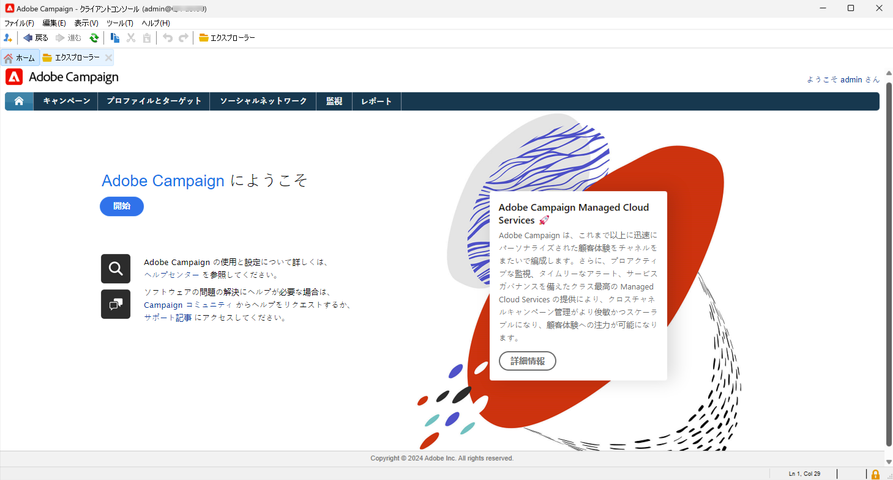

# 管理者と開発者向けの基本を学ぶ {#acs-gs-admin}

このページでは、Campaign v8 の主な管理機能とデータ管理機能の概要について説明します。Campaign Standard から Campaign v8 に移行する管理者とテクニカルマーケターを対象としています。

主な変更点は、Adobe Campaign アプリケーションサーバーと通信するネイティブアプリケーションであるクライアントコンソールの導入です。

Campaign クライアントコンソールは、すべての機能と設定を一元化します。Campaign web ユーザーインターフェイスと同期されるので、両方の環境で一貫性が確保されます。

{zoomable="yes"}

[Adobe Campaign v8 のクライアントコンソールユーザーインターフェイスの詳細を説明します &#x200B;](https://experienceleague.adobe.com/ja/docs/campaign/campaign-v8/new/campaign-ui#ui-access){target="_blank"}。

## Campaign v8 のアーキテクチャ {#acs-gs-admi-archi}

Campaign のアーキテクチャについて詳しくは、Campaign v8（コンソール）ドキュメントを参照してください。基本については、[&#x200B; このページ &#x200B;](https://experienceleague.adobe.com/ja/docs/campaign/campaign-v8/config/architecture/general-architecture){target="_blank"} を参照してください。

開始に役立つリンク：

* Adobe Campaignのコンポーネントとグローバルアーキテクチャについては、[&#x200B; このページ &#x200B;](https://experienceleague.adobe.com/ja/docs/campaign/campaign-v8/new/ac-components){target="_blank"} を参照してください。

* インスタンスの構築を開始する前に Campaign アーキテクチャについて理解するには、[Campaign アーキテクチャの基本を学ぶ &#x200B;](https://experienceleague.adobe.com/ja/docs/campaign/campaign-v8/config/architecture/architecture){target="_blank"} を参照してください。

<!--Two deployment models are available: **Campaign FDA deployment** (P1-P3) and **Campaign Enterprise (FFDA)** deployment (P4). As a customer transitioning from Campaign Standard, your deployment model is **Campaign FDA**.-->

* トランザクションメッセージ（Message Center）は、トリガーされたメッセージを管理する目的で設計された Campaign v8 モジュールです。これは、特定のアーキテクチャモデルに依存します。詳しくは、[&#x200B; この節 &#x200B;](https://experienceleague.adobe.com/ja/docs/campaign/campaign-v8/config/architecture/architecture#transac-msg-archi){target="_blank"} を参照してください。

## Campaign クライアントコンソール {#acs-gs-console}

### クライアントコンソールのインストール {#acs-gs-admin-console}

管理および設定タスクは、クライアントコンソールで実行されます。最初の手順は、環境を設定することです。

Campaign クライアントコンソールは、SOAP や HTTP などの標準のインターネットプロトコルを通じて Adobe Campaign アプリケーションサーバーと通信するネイティブアプリケーションです。Campaign クライアントコンソールは、すべての機能と設定を一元化しています。また、ローカルキャッシュに依存することで、必要な帯域幅は最小限に抑えられます。簡単にデプロイできるように設計された Campaign クライアントコンソールは、インターネットブラウザーからデプロイし、自動的に更新できます。発生するトラフィックは HTTP(S) のみであり、特別なネットワーク設定は不要です。

次のビデオでは、Adobe Campaign クライアントコンソールをダウンロードしてインストールし、インスタンスへの接続を管理する方法について説明します。

>[!VIDEO](https://video.tv.adobe.com/v/3449878?captions=jpn&quality=12&learn=on){transcript=true}

詳しくは、[&#x200B; クライアントコンソールを使用した Campaign への接続 &#x200B;](https://experienceleague.adobe.com/ja/docs/campaign/campaign-v8/new/connect){target="_blank"} を参照してください。

クライアントコンソールは、サポートされている環境にインストールする必要があります。詳しくは、[Campaign v8 （コンソール）互換性マトリックス &#x200B;](https://experienceleague.adobe.com/ja/docs/campaign/campaign-v8/releases/compatibility-matrix#ClientConsoleoperatingsystems){target="_blank"} を参照してください。

### クライアントコンソールインターフェイスの確認  {#acs-gs-ui}

このチュートリアルビデオでは、Adobe Campaign v8 ユーザーインターフェイスと、主な機能の操作方法について説明します。

>[!VIDEO](https://video.tv.adobe.com/v/3426439?captions=jpn&quality=12&learn=on){transcript=true}

詳しくは [&#x200B; クライアントコンソールの操作 &#x200B;](https://experienceleague.adobe.com/ja/docs/campaign/campaign-v8/new/campaign-ui){target="_blank"} を参照してください。

## 環境の管理 {#acs-gs-admin-env}

クライアントコンソールをインストールしたら、次のドキュメントの手順に従ってアプリケーションサーバーへの接続を作成します。[&#x200B; アプリケーションサーバーへの接続ドキュメント &#x200B;](https://experienceleague.adobe.com/ja/docs/campaign/campaign-v8/new/connect#create-your-connection){target="_blank"}。

セキュリティ対策は、社内のソフトウェア開発と運用プロセスおよびツールに深く根付いており、インシデントを適切な方法で防止、検出、対応することを目的に、部門の枠を超えたチームが厳しくフォローしています。詳しくは、[Campaign セキュリティのベストプラクティス &#x200B;](https://experienceleague.adobe.com/ja/docs/campaign/campaign-v8/privacy/security){target="_blank"} を参照してください。

### アクセス権と権限 {#acs-gs-admin-rights}

Adobe Campaign では、ユーザーに割り当てる権限を定義し管理できます。これらの権限は、オペレーターグループの権限、ネームド権限およびフォルダーに対する権限を組み合わせることで定義されます。

Campaign Standard ユーザーが Campaign v8 に移行する場合は、権限とアクセス権は同じままです。セキュリティグループは、アドビによって Campaign v8 オペレーターグループに移動され、組織単位ごとの権限は、フォルダー権限に移行されました。Campaign ユーザーは、Adobe ID を使用して Campaign v8 に接続し、Campaign Standard と同じログインとパスワードを使用できます。

Campaign[&#x200B; フォルダー &#x200B;](https://experienceleague.adobe.com/ja/docs/campaign/campaign-v8/config/configuration/folders-and-views){target="_blank"} は、クライアントコンソールのエクスプローラーツリー内のノードです。 タイプに基づいて、特定のタイプのデータが含まれます。プログラムは、Campaign v8 のフォルダーごとに具体化されます。フォルダーを作成し、その権限を管理してアクセスを制限できます。[詳細情報](https://experienceleague.adobe.com/ja/docs/campaign/campaign-v8/admin/permissions/folder-permissions){target="_blank"}。

詳しくは、[&#x200B; ユーザー権限ドキュメント &#x200B;](https://experienceleague.adobe.com/ja/docs/campaign/campaign-v8/admin/permissions/gs-permissions){target="_blank"} を参照してください。

### Campaign コントロールパネル {#acs-gs-admin-cp}

Campaign Standard の場合、コントロールパネルを使用して環境を管理できます。v8 の場合、コントロールパネルで追加の機能が提供されます。

Campaign コントロールパネルを使用すると、各インスタンスの設定を管理したり使用状況をトラッキングしたりできるので、Adobe Campaign の製品管理者としての作業を効率化できます。 直感的なインターフェイスにより、主要なアセットの使用状況を簡単に監視できるうえ、IP アドレスの許可リスト登録、SFTP ストレージの監視、鍵の管理などの管理タスクを実行できます。

詳しくは、[&#x200B; コントロールパネルのチュートリアル &#x200B;](https://experienceleague.adobe.com/ja/docs/control-panel-learn/tutorials/control-panel-overview){target="_blank"} と [&#x200B; コントロールパネルのドキュメント &#x200B;](https://experienceleague.adobe.com/docs/control-panel/using/control-panel-home.html?lang=ja){target="_blank"} を参照してください。

* **IP アドレスを追加** - Campaign コントロールパネルでは、IP アドレスの範囲を許可リストに登録することで、インスタンスへの新しい接続をセットアップできます。詳しくは、[IP 許可リストへの登録に関するドキュメント &#x200B;](https://experienceleague.adobe.com/ja/docs/control-panel/using/instances-settings/ip-allow-listing-instance-access){target="_blank"} 参照してください。

* **サブドメイン設定** - Adobe Campaign で使用するドメインのサブセクション（技術的には「DNS ゾーン」）を設定できます。
詳しくは、[&#x200B; サブドメインデリゲーションのドキュメント &#x200B;](https://experienceleague.adobe.com/ja/docs/control-panel/using/subdomains-and-certificates/subdomains-branding){target="_blank"} を参照してください。

* **SFTP サーバーを管理** - コントロールパネルでは、アクセス権のある Campaign インスタンスに接続しているすべての SFTP サーバーとやり取りできます。詳しくは、[SFTP 管理ドキュメント &#x200B;](https://experienceleague.adobe.com/ja/docs/control-panel/using/sftp-management/about-sftp-management){target="_blank"} を参照してください。

### 監査記録 {#acs-gs-admin-audit-trail}

Campaign Standard で既に使用可能な監査記録を Campaign v8 で使用すると、インスタンス内で行われた変更の完全な履歴にアクセスできます。

Adobe Campaign web ユーザーインターフェイスで、監査記録機能により、インスタンス内の重要なエンティティに対して行われたすべての変更（通常、インスタンスのスムーズな操作に大きな影響を与える変更）を完全に表示できます。詳しくは、[監査記録のドキュメント](../../v8/reporting/audit-trail.md)を参照してください。

### データパッケージ {#acs-gs-admin-audit-packages}

Campaign Standard で実現できることと同様に、管理者は構造化 XML ファイルを通じて、様々な Adobe Campaign インスタンス間でリソースを交換するパッケージを定義できます。これには設定パラメーターまたはデータを使用できます。

データパッケージを使用すると、プラットフォームのカスタム設定とデータをエクスポートおよびインポートできます。パッケージには、様々なタイプの設定やコンポーネントを含めることができ、フィルタリングされている場合とそうでない場合があります。Campaign v8 でのデータパッケージの使用方法については、[&#x200B; このドキュメント &#x200B;](https://experienceleague.adobe.com/ja/docs/campaign/campaign-v8/developer/packages){target="_blank"} を参照してください。

<!--
MISSING LINKS: 

- System options
- Data Encryption/Decryption-->

### ユーザーインターフェイスのパーソナライズ {#acs-gs-admin-ui}

クライアントコンソールのユーザーインターフェイスをカスタマイズするには、次のようないくつかのオプションがあります。

* **リストとデータ表示** - リスト、ユニット、データ表示などのユーザーインターフェイス設定を管理するためのガイドラインについては、このドキュメントを参照してください。[&#x200B; ユーザーインターフェイス設定ドキュメント &#x200B;](https://experienceleague.adobe.com/ja/docs/campaign/campaign-v8/config/configuration/ui-settings){target="_blank"}

* **フォルダー管理** - フォルダーは、コンポーネントとデータを整理できる Adobe Campaign のオブジェクトです。また、権限の管理にも使用されます。詳しくは、[フォルダーの操作](../../v8/get-started/work-with-folders.md)方法を参照してください。

* **カスタムフィールド** - カスタムフィールドは、Adobe Campaign コンソールを通じて標準スキーマに追加される追加属性です。これらのカスタムフィールドは、プロファイルやテストプロファイルの詳細など、様々な画面に表示されます。詳しくは、[カスタムフィールド設定のドキュメント](../../v8/administration/custom-fields.md)を参照してください。

## ブランディングの設定 {#acs-gs-admin-branding}

どの会社にも、視覚的要素と技術的な詳細の両方を定義するブランドガイドラインがあります。Adobe Campaign Standard の場合、Adobe Campaign v8 では、これらのガイドラインを一元的に管理できるので、メールのロゴからキャンペーンで使用する URL やドメインまで、すべての操作で一貫したブランドイメージを顧客に提供できます。技術管理者は、Adobe Campaign 内で複数のブランドを作成および管理できます。

詳しくは、[&#x200B; ブランディングドキュメント &#x200B;](https://experienceleague.adobe.com/ja/docs/experience-cloud/campaign/branding/branding-gs){target="_blank"} を参照してください

## データモデルの作成について {#acs-gs-admin-data-model-creation}

Campaign Standard と同様に、Adobe Campaign v8 には定義済みデータモデルが付属しています。Adobe Campaign は、相互にリンクされたテーブルを含んだクラウドデータベースに基づいています。詳しくは、[&#x200B; データモデルのドキュメント &#x200B;](https://experienceleague.adobe.com/ja/docs/campaign/campaign-v8/developer/datamodel){target="_blank"} を参照してください。

スキーマは、データベーステーブルに関連付けられた XML ドキュメントです。データ構造を定義し、表の SQL 定義を記述します。[&#x200B; スキーマ作成ドキュメント &#x200B;](https://experienceleague.adobe.com/ja/docs/campaign/campaign-v8/developer/shemas-forms/schemas){target="_blank"} を参照してください。

このビデオでは、Campaign v8 でスキーマを作成する方法と既存のスキーマを拡張する方法について説明します。

>[!VIDEO](https://video.tv.adobe.com/v/337939?quality=12&learn=on){transcript=true}

Campaign Standard で使用可能な機能と同様に、カスタムリソースを作成できます。Campaign v8 では、カスタムリソースはカスタムスキーマまたは拡張&#x200B;**スキーマ**&#x200B;です。

* スキーマの操作方法については、[&#x200B; このページ &#x200B;](https://experienceleague.adobe.com/ja/docs/campaign/campaign-v8/developer/shemas-forms/schemas){target="_blank"} を参照してください。

* 既存のスキーマを拡張する方法については、[&#x200B; このページ &#x200B;](https://experienceleague.adobe.com/ja/docs/campaign/campaign-v8/developer/shemas-forms/extend-schema){target="_blank"} を参照してください。

* 新しいスキーマを作成する方法については、[&#x200B; このページ &#x200B;](https://experienceleague.adobe.com/ja/docs/campaign/campaign-v8/developer/shemas-forms/create-schema){target="_blank"} を参照してください。

* スキーマを作成または拡張する場合は、関連する入力フォームを作成または変更して、それらの変更をエンドユーザーに表示する必要があります。入力フォームを使用すると、データスキーマに関連付けられたインスタンスを Adobe Campaign クライアントコンソールから編集できます。フォームは名前と名前空間で識別します。詳しくは、[&#x200B; 入力フォーム作成ドキュメント &#x200B;](https://experienceleague.adobe.com/ja/docs/campaign/campaign-v8/developer/shemas-forms/forms){target="_blank"} を参照してください。

## ワークフローとデータ管理 {#acs-gs-admin-data-management}

Adobe Campaign Standard と同様に、Adobe Campaign v8 に含まれているワークフローモジュールを使用すると、アプリケーションサーバーの様々なモジュールにわたり、すべての範囲のプロセスとタスクを調整できます。総合的なグラフィカル環境により、セグメント化、キャンペーン実行、ファイル処理、人間の関与などのプロセスをデザインできます。これらのプロセスは、ワークフローエンジンが実行し、追跡します。Campaign v8 でワークフローを開始する方法については、[&#x200B; このドキュメント &#x200B;](https://experienceleague.adobe.com/ja/docs/campaign/campaign-v8/data/workflows){target="_blank"} を参照してください。

他の役立つリソースへのリンクについて詳しくは、以下を参照してください。

* このビデオでは、ターゲティングディメンションと作業用テーブルの概要と、様々なデータソースをまたいだデータを Adobe Campaign で管理する仕組みについて説明します。

  >[!VIDEO](https://video.tv.adobe.com/v/3452592?captions=jpn&quality=12&learn=on){transcript=true}

* Campaign を使用すると、クラウドデータベースに連絡先を追加できます。ファイルを読み込んだり、複数の連絡先の更新をスケジュールして自動化したり、web でデータを収集したり、プロファイル情報を受信者テーブルに直接入力したりできます。詳しくは、[&#x200B; データのインポート（コンソール）ドキュメント &#x200B;](https://experienceleague.adobe.com/ja/docs/campaign/campaign-v8/data/import){target="_blank"} を参照してください。

* 様々なレポートを PDF または CSV 形式に簡単にエクスポートできるので、共有、操作、印刷ができるようになります。詳しくは、[データのエクスポートのドキュメント](../../v8/reporting/export-reports.md)を参照してください。

## REST API {#acs-gs-admin-apis}

Campaign REST API は、Adobe Campaign 向けの統合を実現し、Adobe Campaign と使用するテクノロジーのパネルを連携させて独自のエコシステムを構築することを目的としています。

Campaign Standard ユーザーが Campaign v8 に移行する場合は、REST API を使用できます。

詳しくは、[Rest API ドキュメント &#x200B;](https://experienceleague.adobe.com/ja/docs/experience-cloud/campaign/apis/get-started-apis){target="_blank"} を参照してください。

Campaign Standard から Campaign v8 に移行する際、REST API にはいくつかのレコメンデーションと制限が適用されます。これらは [&#x200B; このページ &#x200B;](https://experienceleague.adobe.com/ja/docs/experience-cloud/campaign/apis/limitations){target="_blank"} に一覧表示されます。 また、Campaign v8 に移行する際には、以下の可用性に関するメモに記載されている特定の制限も適用されます。

>[!AVAILABILITY]
>
>* PKEY の値は、既存の Campaign Standard インスタンスと移行された Campaign v8 インスタンスの間で変更されます。PKEY が外部データベースに保存されている場合は、PKEY を含む pkeys／hrefs リンクを提供する Adobe Campaign v8 のメイン API を呼び出すように実装を変更する必要があります。また、後続の API 呼び出しは、以前の API 呼び出しからの pkeys／hrefs を使用して動的に形成する必要があります。
>
>* Campaign v8 では、車両がプロファイルにリンクされている同じ本文で、firstName プロパティが `cusVehicle` に対して有効ではないというエラーが発生しますが、リンクのない属性のみを含むリクエスト本文は正常に機能します。`{ "vehicleNumber": "20009", "vehicleName": "Model E", "vehicleOwner":{   "firstName":"tester 11", "lastName":"Smith 11" } }&#x200B;`
>
>* タイムゾーンは、データ移行の一環として拡張スキーマに追加されるので、`profileAndServices/profile` REST API 呼び出しではなく、`profileAndServicesExt/profile` REST API 呼び出しの一部としてユーザーに表示されます。
>
>* `ccpaOptOut` は、データ移行の一環として拡張スキーマに追加されるので、`profileAndServices/profile` REST API 呼び出しではなく、`profileAndServicesExt/profile` REST API 呼び出しの一部としてのみユーザーに表示されます。
>

<!--
## Working with templates - TO REMOVE?

Workflow templates contain pre-configured settings and activities which can be reused for creating new workflows.
[Workflow template documentation](../../v8/workflows/create-workflow.md)

You can design your landing page content, and save it for future reuse. See the [landing page template documentation](../../v8/landing-pages/lp-templates.md).

Each event can trigger a personalized message. For this to happen, you need to create a message template to match each event type. Templates contain the necessary information for personalizing the transactional message. See the [Transactional messaging template documentation](https://experienceleague.adobe.com/ja/docs/campaign/campaign-v8/send/real-time/transactional-template)

Using a workflow template is a best practice if you need to regularly import files with the same structure. See the [Import template documentation](https://experienceleague.adobe.com/ja/docs/campaign/automation/workflows/use-cases/data-management/recurring-import-workflow){target="_blank"}
-->

## プライバシーと同意

Campaign Standardから Campaign v8 に移行する際は、プライバシー規制がデータ運用に与える影響を確認することが重要です。 お客様のビジネスや事業地域に応じて、お客様は、お客様が保持している彼らに関するデータにアクセスしたり、削除をリクエストしたりする法的権利を有する場合があります。

Campaign v8 では、すべてのプライバシーリクエストは、**Adobe Privacy Service** 統合を通じて管理される必要があります。 詳細については、[Campaign v8 （コンソール）ドキュメント](https://experienceleague.adobe.com/ja/docs/campaign/campaign-v8/privacy/privacy)を参照してください。

Campaign Standard環境は切り替え後、しばらくはアクティブなままであることに注意してください。 この間、両方のシステムでプライバシーリクエストが送信される場合があります。 コンプライアンスを確保しギャップを避けるために、Adobeのトランジションマネージャーと調整して、両方の環境にわたってリクエストを適切に処理します。

## 購読サービス {#acs-gs-admin-sub}

Campaign Standard と同様に、管理者は購読サービスを作成し、マーケターはメッセージをサブスクライバーに送信できます。主な概念と実装手順は、Campaign Standard と一致しています。役立つリンクとビデオを以下に示します。

購読とターゲットのサブスクライバーを設定および管理する方法について説明します。

>[!VIDEO](https://video.tv.adobe.com/v/3426552?captions=jpn&quality=12&learn=on){transcript=true}

* 詳しくは、購読サービスの [web ユーザーインターフェイスのドキュメント](../../v8/audience/manage-subscribers.md)を参照してください。

* クライアントコンソールで購読サービスを設定するためのドキュメントについては、[&#x200B; この節 &#x200B;](https://experienceleague.adobe.com/ja/docs/campaign/campaign-v8/audience/subscriptions){target="_blank"} も参照してください。

## メッセージと配信{#acs-gs-msg}

### 配信チャネルの設定 {#acs-gs-admin-channels}

Campaign Standard と同様に、Adobe Campaign v8 を使用すると、メール、SMS、プッシュ通知、ダイレクトメールなどのクロスチャネルキャンペーンを送信し、各種の専用レポートを使用してキャンペーンの有効性を評価できます。これらのメッセージは、デザインし、配信を介して送信します。また、受信者ごとにパーソナライズできます。コア機能には、ターゲティング、メッセージの定義とパーソナライゼーション、通信の実行、関連する運用可能なレポートなどがあります。主な機能のアクセスポイントは、配信ウィザードです。このアクセスポイントから、Adobe Campaign で提供される複数の機能を使用できます。

管理者は、チャネル設定を定義する必要があります。詳しくは、以下のリンクを参照してください。

* **メール** - メールの設定について詳しくは、[&#x200B; このページ &#x200B;](https://experienceleague.adobe.com/ja/docs/campaign/campaign-v8/send/emails/email-parameters){target="_blank"} を参照してください。
* **SMS** - SMS チャネルの設定方法については、[&#x200B; このドキュメント &#x200B;](https://experienceleague.adobe.com/ja/docs/campaign/campaign-v8/send/sms/sms){target="_blank"} を参照してください。
* **プッシュ通知** - プッシュ通知チャネルを設定する手順について詳しく説明します [&#x200B; この節 &#x200B;](https://experienceleague.adobe.com/ja/docs/campaign/campaign-v8/send/push/push-data-collection){target="_blank"}。
* **トランザクションメッセージ** - Campaign v8 で [&#x200B; トランザクションメッセージ &#x200B;](https://experienceleague.adobe.com/ja/docs/campaign/campaign-v8/send/real-time/transactional){target="_blank"} の設定手順について詳しくは、[&#x200B; この節 &#x200B;](https://experienceleague.adobe.com/ja/docs/campaign/campaign-v8/config/configuration/transactional-msg-settings) を参照してください

### 外部アカウント {#acs-gs-ext-accounts}

管理者は、Campaign の外部アカウントの設定と維持を担当します。Campaign Standard と同様に、外部アカウントは、テクニカルワークフローやキャンペーンワークフローなどの技術プロセスで使用されます。

Campaign v8 への移行プロセスにより、既存のCampaign Standard外部アカウントが管理されます。

詳しくは、[&#x200B; 外部アカウントドキュメント &#x200B;](../../v8/administration/external-account.md) を参照してください。

<!--
**Email**

MISSING LINKS :
- general email channel parameters 
- email routing accounts 
- email processing rules 
- email properties
-->

<!--
MISSING LINKS: 
- Setting external account 
- Adding vender details etc. -->

<!--
**Mobile app**
MISSING LINKS: 
- Configuring a mobile application using AEP SDKs 
- Sync Mobile app AEPSDK  
- Setting up your application in Adobe Campaign 
- Channel-specific application configuration
-->

### 動的コンテンツ {#acs-gs-dyn-content}

Campaign を使用して動的コンテンツを作成し、パーソナライズされたメッセージを送信します。パーソナライゼーション機能を組み合わせて、メッセージを改善し、カスタムなユーザーエクスペリエンスを実現することができます。

このビデオでは、Campaign v8 の管理者は、動的コンテンツブロックを定義し、動的コンテンツブロックを使用してメール配信のコンテンツをパーソナライズする方法を確認できます。

>[!VIDEO](https://video.tv.adobe.com/v/3449007?captions=jpn&quality=12&learn=on){transcript=true}

役立つリンク：

* [&#x200B; パーソナライゼーションの概要 &#x200B;](https://experienceleague.adobe.com/ja/docs/campaign/campaign-v8/send/personalize/personalize){target="_blank"}
* [&#x200B; パーソナライゼーションブロックの使用 &#x200B;](https://experienceleague.adobe.com/ja/docs/campaign/campaign-v8/send/personalize/personalization-blocks){target="_blank"}
* [&#x200B; 条件付きコンテンツの作成 &#x200B;](https://experienceleague.adobe.com/ja/docs/campaign/campaign-v8/send/personalize/conditions){target="_blank"}
* [Personalizationのデータソース &#x200B;](https://experienceleague.adobe.com/ja/docs/campaign/campaign-v8/send/personalize/personalization-data){target="_blank"}

### 配信テンプレート {#acs-gs-templates}

Campaign Standard と同様に、Campaign v8 では配信テンプレートの使用が必須です。

設計プロセスを加速し改善するために、配信テンプレートを作成すると、キャンペーン全体でカスタムコンテンツと設定を簡単に再利用できます。この機能を使用すると、クリエイティブなルックアンドフィールを標準化して、キャンペーンの実行と開始をより迅速に行うことができます。配信テンプレートを作成する方法について詳しくは、[Campaign web ユーザーインターフェイス](../../v8/msg/delivery-template.md)を参照してください。クライアントコンソールで配信テンプレートを作成する方法については、[&#x200B; この節 &#x200B;](https://experienceleague.adobe.com/ja/docs/campaign/campaign-v8/send/create-templates){target="_blank"} も参照してください。

### タイポロジルール {#acs-gs-admin-rules}

管理者は、配信のタイポロジルールの作成と維持を担当します。Adobe Campaign Standard と同様に、Campaign v8 では、タイポロジルールとは、メッセージを送信する前に、メッセージのチェックやフィルタリングを実行できるビジネスルールです。

Campaign Standard 環境から Campaign v8 に移行すると、タイポロジルールは Campaign v8 に移行されます。

Campaign v8 では、タイポロジルールに特定のキャンペーンの最適化アドオンが付属しています。このモジュールでは、配信の送信を制御、フィルタリングおよび監視できます。キャンペーン間の競合を回避するのに、Adobe Campaign では特定の制限ルールを適用して、様々な組み合わせをテストできます。このテストにより、企業のコミュニケーションポリシーに準拠し、顧客のニーズと期待に応える最適なメッセージを送信できます。詳しくは、[&#x200B; タイポロジルールのドキュメント &#x200B;](https://experienceleague.adobe.com/ja/docs/campaign/automation/campaign-optimization/campaign-typologies){target="_blank"} を参照してください。

### 強制隔離の管理 {#acs-gs-admin-quarantine}

すべての強制隔離されたアドレスと強制隔離ルールは、Campaign Standard 環境から Campaign v8 に移行されました。強制隔離の管理には、特定のアクションは必要ありません。

管理者として Campaign v8 での強制隔離の管理について理解する方法について詳しくは、[このページ](../../v8/audience/quarantine.md)を参照してください。[&#x200B; この節 &#x200B;](https://experienceleague.adobe.com/ja/docs/campaign/campaign-v8/send/failures/quarantines#access-quarantined-addresses){target="_blank"} の強制隔離管理に関するクライアントコンソールの詳細なドキュメントも参照してください。

## Adobe Campaign 統合の管理 {#acs-gs-integrations}

Campaign インスタンスを Adobe Experience Cloud ソリューションと接続して、それぞれの機能を組み合わせることができます。Adobe Campaign にはいくつかのコネクタが付属しており、それらを使用して、外部アプリケーションとの通信、データベースエンジンへの接続、データの共有と同期などを行うことができます。ソリューションを組み合わせる方法については、[&#x200B; このドキュメント &#x200B;](https://experienceleague.adobe.com/ja/docs/campaign/campaign-v8/connect/integration){target="_blank"} を参照してください。

Campaign Standard ユーザーが Campaign v8 に移行する場合は、次の内容が適用されます。

* Campaign Standard でこれらの統合を使用していた場合、**Adobe Analytics** および **Audience Manager** の設定とデータは、アドビによって移行されています。
* Campaign Standard 環境が **Adobe Experience Manager** と統合されている場合は、Campaign web ユーザーインターフェイスでメールを設計する際にこの機能を使用し、Adobe Experience Manager 環境内で直接メール配信コンテンツとフォームの効率的な管理を容易に行うことができるように、**Adobe Experience Manager as a Cloud Service** に移行することをお勧めします。詳しくは、[このページ](../../v8/integrations/aem-content.md)を参照してください。
Campaign はAdobe Experience Manager 6.5 と統合することもできます。この統合を設定するには、[&#x200B; このドキュメント &#x200B;](https://experienceleague.adobe.com/ja/docs/campaign/campaign-v8/connect/ac-aem){target="_blank"} を参照してください。
* お使いのCampaign Standard環境が **トリガー** と統合されていた場合、[&#x200B; このページ &#x200B;](https://experienceleague.adobe.com/ja/docs/campaign/campaign-v8/connect/ac-triggers){target="_blank"} を参照して、Campaign v8 でこの統合を設定する必要があります。
* お使いのCampaign Standard環境が **Adobe Target** と統合されていた場合は、[&#x200B; このページ &#x200B;](https://experienceleague.adobe.com/ja/docs/campaign/campaign-v8/connect/ac-at){target="_blank"} を参照して、Campaign v8 でこの統合を設定する必要があります。
