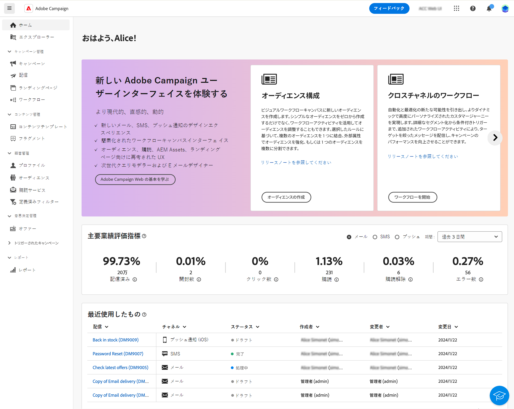
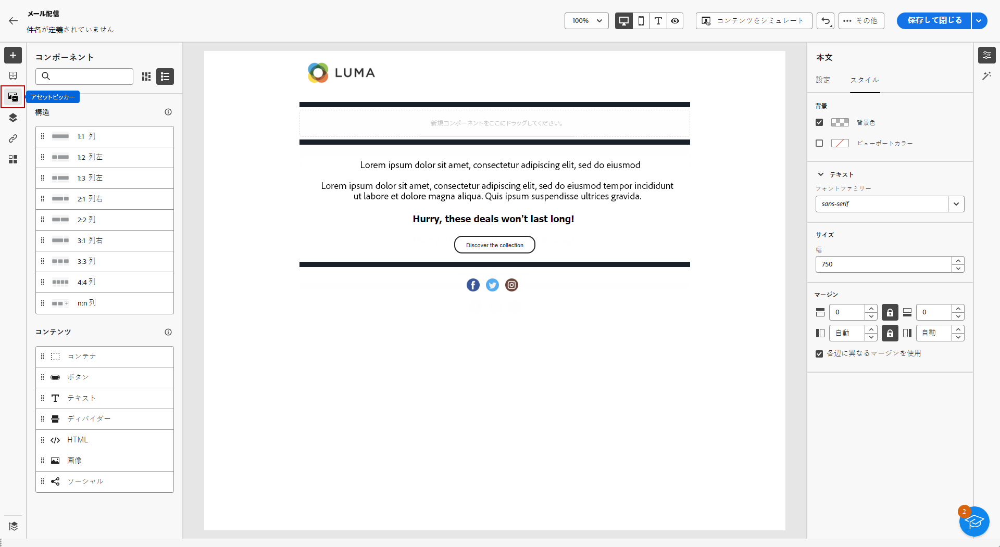

# Campaign Standard から v8 へ {#ac-acs}

Adobe Campaign v8 へようこそ。

Campaign Standard から Campaign v8 に移行する場合に、このリファレンスガイドを参照してください。新しい Campaign 環境を把握し、役割の開始に必要な手順を確認するのに役立ちます。

1. まず、[Adobe Campaign v8 の新機能](#new)について説明します。

1. 次に、役割に応じて、[Adobe Campaign Standard と Adobe Campaign v8 のエクスペリエンスの違い](#experiences)について説明します。

## 新機能 {#new}

このページでは、Adobe Campaign web ユーザーインターフェイスの最新の機能強化について説明します。主な機能とリリースの更新機能の包括的なリストについて詳しくは、[この節](../../v8/rn/whats-new.md)を参照してください。

### Campaign v8 の機能強化 {#ac-enhancements}

Adobe Campaign v8 に付属する主な機能強化を以下に示します。

* **Web ユーザーインターフェイス**

  Adobe Campaign v8 は、クライアントコンソールと web ユーザーインターフェイスの両方を提供し、様々なユーザーの好みやニーズに応えます。クライアントコンソールは強力なデスクトップアプリケーションエクスペリエンスを提供する一方、web ユーザーインターフェイスは直感的でアクセスしやすいように設計されているので、Adobe Campaign Standard に精通しているマーケターにとって理想的な選択肢となります。

  Web ユーザーインターフェイスには Adobe Campaign Standard と多くの類似点がありますが、一部の用語が異なる場合があります。

  [Adobe Campaign web ユーザーインターフェイスについて詳しくは、こちらを参照](../../v8/campaign-web-home.md)してください。

  {zoomable="yes"}

  すべての新機能および改善点は、[リリースノート](../../v8/rn/release-notes.md)に記載されています。Adobe Campaign web ユーザーインターフェイスのリリースは、機能のデプロイメントに対してより拡張性の高い、段階的なアプローチを可能にする継続的な配信モデルに基づいて動作します。したがって、これらのリリースノートは月に数回更新されます。定期的に確認してください。

* **パフォーマンス**

  Adobe Campaign v8 では、高度なクラウド規模のデータベーステクノロジーを活用し、パフォーマンスと効率性を大幅に向上させます。この再設計されたアーキテクチャには、次のような主なメリットがあります。

   * *拡大・縮小*：システムは現在、処理能力の大幅な向上をサポートし、バッチ処理のスループットは **1 時間あたり最大 2,000 万操作**&#x200B;に達します。この新しいアーキテクチャにより、さらに高いプロファイルを予測可能なパフォーマンスで管理できます。
   * *速度*：システムは、セグメント化、配信準備、トランザクションメッセージのスループット（現在は **1 時間あたり 100 万件**）など、あらゆるマーケティングアクティビティ向けに改善されました。

  完全に管理されたクラウドサービスでは、ユーザーに次の機能を提供します。

   * リアルタイムデータ探索：データに即座にアクセスして分析することで、クイックインサイトを得て、より多くの情報に基づいた意思決定が可能になります。

   * オーディエンスの迅速な作成：ターゲットオーディエンスを数分以内で簡単に作成し、キャンペーンのセグメント化を効率化できます。

  全体的に、Adobe Campaign v8 の堅牢なアーキテクチャは、速度と効率を向上させ、広範で複雑なマーケティングキャンペーンを管理する強力な基盤を提供します。

### Adobe Campaign v8 の新機能 {#ac-new-features}

Campaign Standard ユーザーが Adobe Campaign v8 に移行する場合は、次の機能が使用できるようになりました。

* **リッチプッシュ**

  Adobe Campaign v8 では、ユーザーの注意を引き付け、アクションを促すリッチプッシュ通知を送信する機能を提供します。これらの通知には、テキスト、画像、ボタン、カウントダウンタイマー、サウンドなど、様々な要素を含めることができます。

  {zoomable="yes"}

  これらのリッチ通知の作成を容易にするのに、Adobe Campaign v8 では、カルーセルやタイマーなどの複雑な通知のコンテンツを設計およびカスタマイズできる様々なテンプレートが用意されています。

  次の場合、顧客のシステムに基づいて通知を調整できます。

   * [Android](../../v8/push/rich-push.md) テンプレートの場合

   * [iOS](../../v8/push/rich-push.md) テンプレートの場合

  プッシュ通知は、モバイルアプリのユーザーを引き付ける重要なツールで、ユーザーがアプリを積極的に使用していない場合でもユーザーにリーチできます。

* **Adobe Experience Manager as a Cloud Service**

  Adobe Campaign v8 は、Adobe Experience Manager as a Cloud Service とシームレスに統合され、パーソナライズされたコンテンツリッチエクスペリエンスを顧客に提供する機能を強化します。このネイティブ統合により、コンテンツ管理が効率化され、Adobe Experience Manager の堅牢な機能を活用してマーケティング活動を最適化できます。

  この統合によって有効になる主な機能は次のとおりです。

   * *アセット管理*：Adobe Campaign v8 内では、E メールデザイナーがアセットにアクセスして管理するピッカーを提供します。この機能により、Adobe Experience Manager の要素を配信に簡単に統合できるので、コンテンツ管理がより効率的になります。[詳しくは、アセット管理を参照してください](../../v8/integrations/aem-assets.md)。

     {zoomable="yes"}

   * *メールテンプレートの読み込み*：Adobe Campaign v8 を使用すると、Adobe Experience Manager からメールテンプレートを直接参照して Campaign に読み込むことができます。[詳しくは、メールテンプレートの読み込みを参照してください](../../v8/integrations/aem-content.md)。

     {zoomable="yes"}

  Adobe Experience Manager as a Cloud Service では、クラウドネイティブの俊敏性を提供し、価値実現までの時間を短縮し、進化するビジネスニーズに適応できます。この統合により、コンテンツ管理機能が強化されるだけでなく、すべてのタッチポイントにわたって、よりパーソナライズされた魅力的なエクスペリエンスを顧客に提供できます。

* **AI アシスタント - コンテンツアクセラレータ**

  Campaign の AI アシスタントを使用すると、メール、SMS、プッシュなどすべてのチャネルでマーケティングキャンペーンを、直感的でシンプルかつ手間のかからない方法で作成および実行でき、時間を節約し、効率を向上させ、より良い結果を導き出すことができます。

  {zoomable="yes"}

  AI アシスタントは、あらゆるチャネルで、プロフェッショナルでブランドに一貫性のあるコンテンツを作成する方法に革命をもたらします。高度な 生成 AI モデルとブランドガイドラインの深い理解により、AI アシスタントは、ブランドの概要を示したスタイル、レイアウト、トーンなどに最適化されたコンテンツを使用して、マーケティング目的に基づいてパーソナライズされた魅力的で効果的なコンテンツを自動生成します。

  AI アシスタントを使用すると、マーケティングキャンペーンを、直感的でシンプルかつ手間のかからない方法で作成および実行でき、時間を節約し、効率を向上させ、より良い結果を導き出すことができます。

  {zoomable="yes"}

  様々なメールテンプレートを提供し、画像を生成および再生成します。AI アシスタント - コンテンツアクセラレータについて詳しくは、[この節](../../v8/email/generative-content.md)を参照してください。Adobe Campaign v8 には、[メール](../../v8/email/generative-content.md)、[SMS](../../v8/email/generative-sms.md)、[プッシュ](../../v8/email/generative-push.md)で使用できる AI アシスタントが用意されています。

* **アップグレードされた SMS インフラストラクチャ - SMS v2.0**

  SMS は、その堅牢性と数十億台の端末にわたる比類のない互換性に加え、そのシンプルさと使いやすさにより、非常に価値のある通信チャネルとなっています。

  Adobe Campaign v8 には、SMS の送信を改善する新しいインフラストラクチャが付属しています。[詳しくは、新しい SMS 設定を参照してください](https://experienceleague.adobe.com/ja/docs/campaign/campaign-v8/send/sms/sms){target="_blank"}。

* **アップグレードされたプッシュインフラストラクチャ**

  Adobe Campaign v8 では、最新の最先端テクノロジーに基づいて作成された堅牢なフレームワークを活用した、最新のプッシュ通知サービスが導入されています。このサービスは、新しいレベルのスケーラビリティを実現するように設計されており、シームレスな効率でより多くのオーディエンスに通知を届けることができます。インフラストラクチャの強化とプロセスの最適化により、より高いスケールと信頼性が期待でき、これまでにない方法でモバイルアプリユーザーと関わり、つながりを持てるようになります。

  [詳しくは、アップグレードされたプッシュインフラストラクチャを参照してください](https://experienceleague.adobe.com/ja/docs/campaign/campaign-v8/send/push/push-data-collection){target="_blank"}。

## Managed Services {#ac-managed-services}

Adobe Campaign v8 は Managed Cloud Services として利用でき、先を見越した監視、タイムリーな警告、サービスのガバナンスを提供します。アドビに管理されるクラウドサービスは、低い TCO（総所有コスト）で、より機敏で安全な、拡張性の高いクロスチャネルキャンペーン管理ソリューションをマーケターに提供します。この新しい製品は、先を見越した監視とタイムリーな警告を備えたサービスを組み合わせています。

## v8 に追加された Campaign Standard 機能 {#ac-v8-added}

Campaign v8 への移行をスムーズに行うために、Campaign v8 に Campaign Standard の主な機能が追加されました。詳しくは、[このドキュメント](https://experienceleague.adobe.com/docs/experience-cloud/campaign/campaign-standard-migration-home.html?lang=ja){target="_blank"}を参照してください。

* **動的レポート**：動的レポートでは、マーケティングアクティビティの影響を測定する完全にカスタマイズ可能なリアルタイムのレポートを提供します。プロファイルデータへのアクセスが追加され、開封数やクリック数などの機能的なメールキャンペーンデータに加えて、性別、市区町村、年齢などのプロファイルディメンション別のデモグラフィック分析を可能にします。[詳細情報](https://experienceleague.adobe.com/docs/experience-cloud/campaign/reporting/get-started-reporting.html?lang=ja){target="_blank"}

* **一元化されたブランディング**：どの会社にも、ブランドの視覚的ガイドラインと技術的ガイドラインがあります。Adobe Campaign を使用すれば、ロゴからメール送信者、URL、ドメインなどの技術的側面に至るまで、一貫したブランドを顧客に提供する一連の仕様を定義できます。[詳細情報](https://experienceleague.adobe.com/docs/experience-cloud/campaign/branding/branding-gs.html?lang=ja)

* **Rest API** - Campaign Stardard で移行したユーザーは、Rest API を使用して Adobe Campaign の統合を作成し、使用するテクノロジーのパネルと Adobe Campaign をインターフェイスで接続することで独自のエコシステムを作成できます。[詳細情報](https://experienceleague.adobe.com/docs/experience-cloud/campaign/apis/get-started-apis.html?lang=ja){target="_blank"}

* **ランディングページ** - Campaign v8 のランディングページにいくつかの改善が加えられ、Campaign Standard と同等の機能を実現しました。詳しくは、[リリースノート](../../v8/rn/release-notes.md#new-24-4)とランディングページ[ドキュメント](../../v8/landing-pages/get-started-lp.md)を参照してください。

* **ビジュアルフラグメント** - ビジュアルフラグメントは、1 つ以上のメール配信またはコンテンツテンプレートで参照できる再利用可能なビジュアルコンポーネントです。フラグメントを変更すると、そのフラグメントを使用するすべてのコンテンツが更新されます。この機能を使用すると、マーケティングユーザーが改善されたデザインプロセスでメッセージコンテンツを迅速に組み立てるために使用できる複数のカスタムコンテンツブロックを事前に作成できます。[詳細情報](../../v8//content/use-visual-fragments.md)

## Campaign Standard と Campaign v8 の主な違い {#experiences}

ほとんどの概念は、Adobe Campaign v8 と Adobe Campaign Standard で類似しています。ただし、以下に示すようにいくつかの違いがあります。

### 用語の変更 {#terminology-changes}

Campaign Standard と Campaign v8 の用語の違いを以下に示します。

* カスタムリソースは&#x200B;**スキーマ**&#x200B;です
* メッセージは&#x200B;**配信**&#x200B;と呼ばれます
* 製品ユーザーは&#x200B;**オペレーター**&#x200B;です
* 役割は&#x200B;**ネームド権限**&#x200B;で設定されます
* セキュリティグループは&#x200B;**オペレーターグループ**&#x200B;です
* 組織単位は&#x200B;**フォルダー権限**&#x200B;によって管理されます

また、既存の Campaign ユーザーとして、一部の概念は最新の用語標準に合わせて名前が変更されています。これらの変更は Campaign Web ユーザーインターフェイスにのみ適用され、クライアントコンソールには反映されません。以下を参照してください。

* 受信者は、**プロファイル**&#x200B;になりました。[詳細情報](../../v8/audience/gs-audiences-recipients.md)。
* シードアドレスは、**テストプロファイル**&#x200B;になりました。[詳細情報](../../v8/preview-test/test-deliveries.md)
* 配信分析は、**配信準備**&#x200B;になりました。メッセージの準備を開始する必要がある場合は、「**準備**」ボタンをクリックします。[詳細情報](../../v8/monitor/prepare-send.md)
* メールのプレビューが、「**コンテンツをシミュレート**」ボタンから使用できるようになりました。[詳細情報](../../v8/preview-test/preview-test.md)
* リストは、**オーディエンス**&#x200B;になりました。[詳細情報](../../v8/audience/gs-audiences-recipients.md)

## 新しいユーザーエクスペリエンス

Adobe Campaign v8 の新しいユーザーエクスペリエンスについて詳しくは、役割に応じた関連リファレンスガイドを参照してください。

<table>
<tr>
  <td>
    
    

  </td>
  <td>
  
    

  </td>
  </tr>
  <tr>
    <td>
    <a href="marketers.md">
    <strong>マーケター</strong>
    </a>
    </td>
    <td>
      <a href="admin-developers.md">
      <strong>管理人または開発者</strong>
      </a>
    </td>
  </tr>
    <td>
    <em>キャンペーンマネージャー、メディアマーケティングスペシャリスト</em>
    </td>
    <td>
      <em>システム管理者、テクニカルマーケティングスペシャリスト</em>
    </td>
  <tr>
    <td>
    <b>主なタスク／責任は次のとおりです。</b>
    </td>
      <td>
    <b>主なタスク／責務は次のとおりです。</b>
    </td>
  </tr>
  <tr>
    <td>
      <li>マーケティングキャンペーンの作成
      <li>ワークフローの設計
      <li>キャンペーンのテストと実行
      <li>マルチチャネルキャンペーンのデプロイ
      <li>キャンペーンの最適化
      <li>自動キャンペーンの最適化
    </td>
    <td>
        <li>アクセス管理
        <li>システムの設定
        <li>システムのカスタマイズ
    </td>
</tr>
</table>

<!--
## Deprecated items

Adobe constantly evaluates product capabilities to identify older features that should be replaced with more modern alternatives to improve overall customer value, always under careful consideration of backward compatibility.

Please refer to [this documentation for information on deprecated items](https://experienceleague.adobe.com/en/docs/campaign-standard/using/release-notes/deprecated-features).-->
