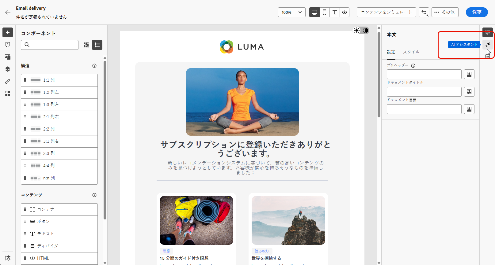
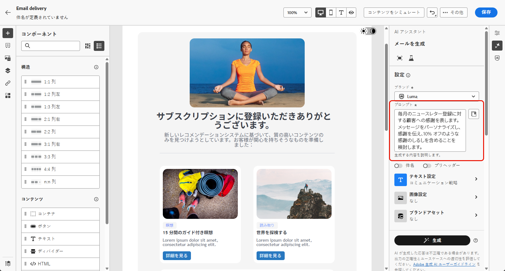

# Campaign Standard から v8 へ {#ac-acs}

Adobe Campaign v8 へようこそ。

Campaign Standard環境から Campaign v8 に移行する場合は、このリファレンスガイドを参照してください。 新しい Campaign 環境を把握し、役割の基本を学ぶために必要な手順を説明するのに役立ちます。

1. まず、[Adobe Campaign v8 の新機能 ](#new) を学びます。

1. 次に [Adobe Campaign StandardとAdobe Campaign v8 のエクスペリエンスの違い ](#experiences) を説明します。

## 新機能 {#new}

Adobe Campaign web ユーザーインターフェイスの最新の機能強化については、このページを参照してください。 主な機能とリリースアップデート機能の包括的なリストについては、[ この節 ](../../v8/rn/whats-new.md) を参照してください。

### Campaign v8 の機能強化 {#ac-enhancements}

Adobe Campaign v8 に伴う主な機能強化を以下に示します。

* **Web ユーザーインターフェイス**

  Adobe Campaign v8 は、クライアントコンソールと web ユーザーインターフェイスの両方を提供し、様々なユーザーの好みやニーズに応えます。 クライアントコンソールは強力なデスクトップアプリケーションエクスペリエンスを提供しますが、web ユーザーインターフェイスは直感的でアクセスしやすい設計になっており、Adobe Campaign Standardに精通したマーケターにとって理想的な選択肢です。

  Web ユーザーインターフェイスはAdobe Campaign Standardと多くの類似点を持っていますが、用語によっては異なるものもあります。

  [Adobe Campaign web ユーザーインターフェイスの詳細については、こちらを参照 ](../../v8/campaign-web-home.md) してください。

  {zoomable="yes"}

  すべての新機能と改善点は、[ リリースノート ](../../v8/rn/release-notes.md) に記載されています。 Adobe Campaign web ユーザーインターフェイスのリリースは、機能のデプロイメントに対してより拡張性の高い、段階的なアプローチを可能にする継続的な配信モデルに基づいて動作します。したがって、これらのリリースノートは月に数回更新されます。定期的に確認してください。

* **パフォーマンス**

  Adobe Campaign v8 では、高度なクラウドスケールデータベーステクノロジーを利用して、パフォーマンスと効率が大幅に向上しています。 この再設計されたアーキテクチャには、次のような主なメリットがあります。

   * *拡張*：このシステムは、処理能力の大幅な増加に対応するようになり、バッチ処理のスループットは 1 時間あたり最大 2,000 万 **の操作に達しました**。 この新しいアーキテクチャを使用すると、より高いプロファイルを予測可能なパフォーマンスで管理できます。
   * *速度*：システムは、あらゆるマーケティングアクティビティ（セグメント化、配信準備、トランザクションメッセージのスループット、1 時間あたり 100 万 **に達した** に対して改善されました。

  完全に管理されたクラウドサービスは、次の機能をユーザーに提供します。

   * リアルタイムデータ探索：データに即座にアクセスして分析し、迅速なインサイトを得て、より多くの情報に基づいた意思決定を行います。

   * オーディエンスの迅速な構築：ターゲットオーディエンスを数分以内で簡単に作成し、キャンペーンのセグメント化を効率化します。

  全体的に、Adobe Campaign v8 の堅牢なアーキテクチャは、速度と効率を向上させ、広範で複雑なマーケティングキャンペーンを管理するための強力な基盤となります。

### Adobe Campaign v8 の新機能 {#ac-new-features}

Adobe Campaign v8 に移行するCampaign Standardユーザーとして、次の機能が使用できるようになりました。

* **リッチプッシュ**

  Adobe Campaign v8 では、リッチなプッシュ通知を送信できます。これにより、ユーザーの注意を引き、行動を起こすよう促すことができます。 これらの通知には、テキスト、画像、ボタン、カウントダウンタイマー、サウンドなど、様々な要素が含まれます。

  {zoomable="yes"}

  これらの豊富な通知を簡単に作成できるように、Adobe Campaign v8 には、カルーセルやタイマーなどの複雑な通知のコンテンツをデザインしてカスタマイズできる様々なテンプレートが用意されています。

  顧客のシステムに応じて通知をカスタマイズできます。

   * [Android](../../v8/push/rich-push.md) テンプレートの場合

   * [iOs](../../v8/push/rich-push.md) テンプレートの場合

  プッシュ通知は、モバイルアプリユーザーを引き付けるための重要なツールで、アプリを積極的に使用していない場合でもユーザーにリーチできます。

* **Adobe Experience Manager as a Cloud Service**

  Adobe Campaign v8 はAdobe Experience Manager as a Cloud Serviceとシームレスに統合され、パーソナライズされた豊富なコンテンツを顧客に提供する機能を強化します。 このネイティブな統合により、コンテンツ管理が合理化され、Adobe Experience Managerの堅牢な機能を活用してマーケティング活動が最適化されます。

  この統合によって有効になる主な機能は次のとおりです。

   * *アセット管理*:Adobe Campaign v8 内では、電子メールデザイナーは、アセットにアクセスして管理するためのピッカーを提供します。 この機能により、Adobe Experience Managerの要素を配信に簡単に統合できるので、コンテンツ管理の効率が向上します。 [ アセット管理の詳細情報 ](../../v8/integrations/aem-assets.md)

     {zoomable="yes"}

   * *メールテンプレートの読み込み*: Adobe Campaign v8 では、メールテンプレートを参照して、Adobe Experience Managerから直接 Campaign に読み込むことができます。 [ メールテンプレートの読み込みの詳細情報 ](../../v8/integrations/aem-content.md)

     {zoomable="yes"}

  Adobe Experience Manager as a Cloud Serviceは、クラウドネイティブな俊敏性を備えており、価値創出までの時間を短縮し、変化するビジネスニーズに適応することができます。 この統合により、コンテンツ管理機能が強化されるだけでなく、すべてのタッチポイントにわたって、よりパーソナライズされた魅力的なエクスペリエンスを顧客に提供できるようになります。

* **AI アシスタント – コンテンツアクセラレーター**

  Campaign AI アシスタントを使用すると、メール、SMS、プッシュなどのチャネルをまたいだマーケティングキャンペーンを、直感的でシンプルかつ手間のかからない方法で作成および実行でき、時間を節約し、効率を向上させ、より良い結果を導き出すことができます。

  {zoomable="yes"}

  AI アシスタントは、チャネル間でプロフェッショナルでブランドに一貫性のあるコンテンツを作成する方法に革命をもたらします。 高度な GenAI モデルとブランドガイドラインの深い理解により、AI アシスタントは、ブランドの概要を示すスタイル、レイアウト、トーンなどに最適化されたコンテンツを使用して、マーケティング目的に基づいてパーソナライズされた魅力的で効果的なコンテンツを自動生成します。

  AI アシスタントを使用すると、マーケティングキャンペーンの作成と実行が直感的でシンプルで手間のかからず、時間を節約し、効率を向上させ、より良い結果を導くことができます。

  {zoomable="yes"}

  様々なメールテンプレートを提供し、画像を生成して再生成します。 AI アシスタント – コンテンツアクセラレーターについて詳しくは、[ この節 ](../../v8/email/generative-content.md) を参照してください。 Adobe Campaign v8 では、[ メール ](../../v8/email/generative-content.md)、[SMS](../../v8/email/generative-sms.md)、[ プッシュ ](../../v8/email/generative-push.md) 用の AI アシスタントを使用できます。

* **アップグレードされた SMS インフラストラクチャ - SMS v2.0**

  SMS のシンプルさと使いやすさは、数十億の端末に対する堅牢性と比類のない互換性に加えて、非常に貴重な通信チャネルになります。

  Adobe Campaign v8 には、SMS の送信を改善する新しいインフラストラクチャが付属しています。 [ 新しい SMS 設定の詳細情報 ](https://experienceleague.adobe.com/en/docs/campaign/campaign-v8/send/sms/sms){target="_blank"}。

* **アップグレードされたプッシュインフラストラクチャ**

  Adobe Campaign v8 では、最新の最先端テクノロジーに基づいて構築された堅牢なフレームワークを活用した、最新のプッシュ通知サービスを導入しています。 このサービスは、新しいレベルのスケーラビリティを実現するように設計されており、シームレスな効率でより多くのオーディエンスに通知を届けることができます。インフラストラクチャの強化とプロセスの最適化により、より高いスケールと信頼性が期待でき、これまでにない方法でモバイルアプリユーザーと関わり、つながりを持てるようになります。

  [ アップグレードされたプッシュインフラストラクチャの詳細情報 ](https://experienceleague.adobe.com/ja/docs/campaign/campaign-v8/send/push/push-data-collection){target="_blank"}。

## Managed Services {#ac-managed-services}

Adobe Campaign v8 は Managed Cloud Services として利用でき、先を見越した監視、タイムリーな警告、サービスのガバナンスを提供します。アドビに管理されるクラウドサービスは、低い TCO（総所有コスト）で、より機敏で安全な、拡張性の高いクロスチャネルキャンペーン管理ソリューションをマーケターに提供します。この新しい製品は、先を見越した監視とタイムリーな警告を備えたサービスを組み合わせています。

## v8 に追加されたCampaign Standard機能 {#ac-v8-added}

Campaign v8 への移行をスムーズに行うために、Campaign v8 に Campaign Standard の主な機能が追加されました。詳しくは、[このドキュメント](https://experienceleague.adobe.com/docs/experience-cloud/campaign/campaign-standard-migration-home.html?lang=ja){target="_blank"}を参照してください。

* **動的レポート**：動的レポートでは、マーケティングアクティビティの影響を測定する完全にカスタマイズ可能なリアルタイムのレポートを提供します。プロファイルデータへのアクセスを可能にし、開封数やクリック数などの機能的なメールキャンペーンデータに加えて、性別、市区町村、年齢などのプロファイルディメンション別のデモグラフィック分析を可能にします。[詳細情報](https://experienceleague.adobe.com/docs/experience-cloud/campaign/reporting/get-started-reporting.html?lang=ja){target="_blank"}

* **一元化されたブランディング**：どの会社にも、ブランドの視覚的ガイドラインと技術的ガイドラインがあります。Adobe Campaign を使用すれば、ロゴからメール送信者、URL、ドメインなどの技術的側面に至るまで、一貫したブランドを顧客に提供する一連の仕様を定義できます。[詳細情報](https://experienceleague.adobe.com/docs/experience-cloud/campaign/branding/branding-gs.html?lang=ja)

* **Rest API** - Campaign Stardard で移行したユーザーは、Rest API を使用して Adobe Campaign の統合を作成し、使用するテクノロジーのパネルと Adobe Campaign をインターフェイスで接続することで独自のエコシステムを作成できます。[詳細情報](https://experienceleague.adobe.com/docs/experience-cloud/campaign/apis/get-started-apis.html?lang=ja){target="_blank"}

* **ランディングページ** - Campaign v8 のランディングページにいくつかの改善が加えられ、Campaign Standard と同等の機能を実現しました。詳しくは、[リリースノート](../../v8/rn/release-notes.md#new-24-4)とランディングページ[ドキュメント](../../v8/landing-pages/get-started-lp.md)を参照してください。

* **ビジュアルフラグメント** - ビジュアルフラグメントは、1 つ以上のメール配信またはコンテンツテンプレートで参照できる再利用可能なビジュアルコンポーネントです。フラグメントを変更すると、そのフラグメントを使用するすべてのコンテンツが更新されます。この機能を使用すると、マーケティングユーザーが改善されたデザインプロセスでメッセージコンテンツを迅速に組み立てるために使用できる複数のカスタムコンテンツブロックを事前に作成できます。[詳細情報](../../v8//content/use-visual-fragments.md)

## Campaign Standardと Campaign v8 の主な違い {#experiences}

ほとんどの概念は、Adobe Campaign v8 とAdobe Campaign Standardの間では似ています。 ただし、以下に示すようにいくつかの違いがあります。

### 用語の変更 {#terminology-changes}

以下は、Campaign Standardと Campaign v8 の用語の違いです。

* カスタムリソースは&#x200B;**スキーマ**&#x200B;です
* メッセージは&#x200B;**配信**&#x200B;と呼ばれます
* 製品ユーザーは&#x200B;**オペレーター**&#x200B;です
* 役割は&#x200B;**ネームド権限**&#x200B;で設定されます
* セキュリティグループは&#x200B;**オペレーターグループ**&#x200B;です
* 組織単位は&#x200B;**フォルダー権限**&#x200B;によって管理されます

また、既存の Campaign ユーザーとして、一部の概念は最新の用語標準に合わせて名前が変更されています。 これらの変更は Campaign Web ユーザーインターフェイスにのみ適用され、クライアントコンソールには反映されません。以下を参照してください。

* 受信者は、**プロファイル**&#x200B;になりました。[詳細情報](../../v8/audience/gs-audiences-recipients.md)。
* シードアドレスは、**テストプロファイル**&#x200B;になりました。[詳細情報](../../v8/preview-test/test-deliveries.md)
* 配信分析は、**配信準備**&#x200B;になりました。メッセージの準備を開始する必要がある場合は、「**準備**」ボタンをクリックします。[詳細情報](../../v8/monitor/prepare-send.md)
* メールのプレビューが、「**コンテンツをシミュレート**」ボタンから使用できるようになりました。[詳細情報](../../v8/preview-test/preview-test.md)
* リストは、**オーディエンス**&#x200B;になりました。[詳細情報](../../v8/audience/gs-audiences-recipients.md)

## 新規ユーザーエクスペリエンス

Adobe Campaign v8 の新しいユーザーエクスペリエンスについては、お客様の役割に応じた関連リファレンスガイドをご覧ください。

<table>
<tr>
  <td>
    
    

  </td>
  <td>
  
    

  </td>
  </tr>
  <tr>
    <td>
    <a href="marketers.md">
    <strong>マーケター</strong>
    </a>
    </td>
    <td>
      <a href="admin-developers.md">
      <strong>管理人または開発者</strong>
      </a>
    </td>
  </tr>
    <td>
    <em>キャンペーンマネージャー、メディアマーケティングスペシャリスト</em>
    </td>
    <td>
      <em>システム管理者、テクニカルマーケティングスペシャリスト</em>
    </td>
  <tr>
    <td>
    <b>主なタスク／責任は次のとおりです。</b>
    </td>
      <td>
    <b>主なタスク／責務は次のとおりです。</b>
    </td>
  </tr>
  <tr>
    <td>
      <li>マーケティングキャンペーンの作成
      <li>ワークフローの設計
      <li>キャンペーンのテストと実行
      <li>マルチチャネルキャンペーンのデプロイ
      <li>キャンペーンの最適化
      <li>自動キャンペーンの最適化
    </td>
    <td>
        <li>アクセス管理
        <li>システムの設定
        <li>システムのカスタマイズ
    </td>
</tr>
</table>

<!--
## Deprecated items

Adobe constantly evaluates product capabilities to identify older features that should be replaced with more modern alternatives to improve overall customer value, always under careful consideration of backward compatibility.

Please refer to [this documentation for information on deprecated items](https://experienceleague.adobe.com/en/docs/campaign-standard/using/release-notes/deprecated-features).-->

