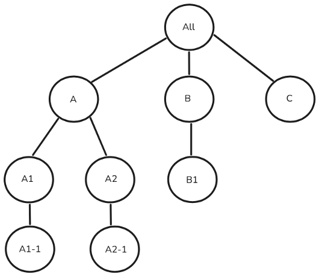
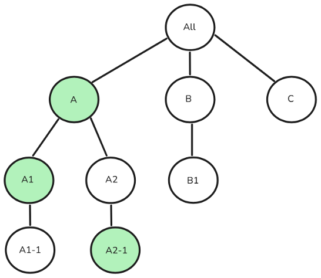
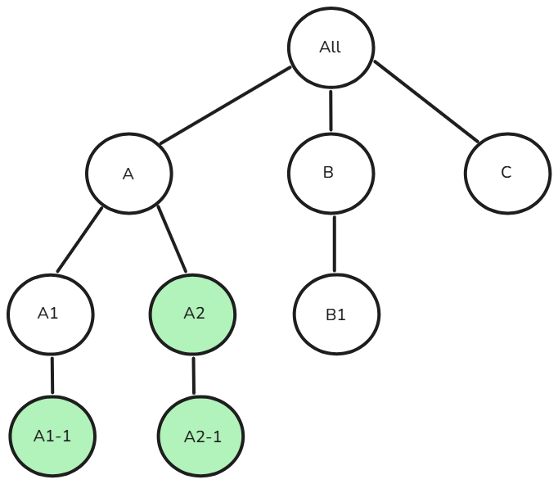

# Campaign StandardからCampaign v8へのユーザーアクセス管理 {#user-management-acs}

Adobe Campaign StandardとAdobe Campaign v8の両方で、異なるユーザー/オペレーターに対する権限を定義および管理できます。 これらの権限は、製品の様々な機能へのアクセスをユーザーに許可する特定の権限で構成されます。 ただし、ふたつの製品では、ユーザーアクセスの管理に個別のアプローチと実装を使用します。

Adobe Campaign StandardおよびCampaign v8では、ユーザーアクセス管理を実現するために次の概念が使用されています。

| Campaign Standard | Campaign v8 |
|---------|----------|
| ユーザー | 演算子 |
| 役割 | ネームド権限 |
| セキュリティグループ | オペレーターグループ |
| 組織単位 | フォルダー権限 |

## セキュリティグループからオペレーターグループへの移行アプローチ

>[!IMPORTANT]
>
>これらの役割/名前付き権限の機能は実装によって異なり、認証の問題（権限の昇格や機能の中断など）が発生する可能性があります。 適切なアクセス制御を確保するために、移行後にこれらのマッピングを確認することをお勧めします。 [詳しくは、権限を参照してください](https://experienceleague.adobe.com/ja/docs/campaign/campaign-v8/admin/permissions/manage-permissions)。

次の表は、Adobe Campaign StandardからCampaign v8に移行する際のユーザーロールグループの移行アプローチの概要を示しています。 Campaign Standardでは、Campaign v8で&#x200B;**オペレーターグループ**&#x200B;と呼ばれる&#x200B;**セキュリティグループ**&#x200B;が、ユーザーに一連の役割を割り当てるために使用されます。 一部のセキュリティグループやオペレーターグループは、すぐに利用できますが、必要に応じて新しいグループを作成したり、既存のグループを変更したりできます。

| | **Campaign Standard** | **Campaign v8** |
|---------|----------|---------|
| **用語**  | セキュリティグループ | オペレーターグループ |

Adobe Campaign StandardとCampaign v8の両方で、**セキュリティグループ**&#x200B;と&#x200B;**オペレーターグループ**&#x200B;がAdmin Consoleの製品プロファイルにマッピングされます。 **セキュリティグループ**&#x200B;または&#x200B;**オペレーターグループ**&#x200B;をユーザーに割り当てる場合は、Admin Consoleで対応する&#x200B;**製品プロファイル**&#x200B;をリンクできます。 この関連付けは、ユーザーがログインしたときに同期されます。 [製品プロファイルの詳細](https://experienceleague.adobe.com/ja/docs/campaign/campaign-v8/admin/permissions/manage-permissions)

| **Campaign Standard セキュリティグループ** | **Campaign v8 オペレーターグループ** |
|----------|---------|
| 管理者 | 管理者 |
| 配信スーパーバイザー | 管理者 |
| ワークフロースーパーバイザー | ワークフロースーパーバイザー  |

## ユーザー役割からネームド権限への移行アプローチ

>[!IMPORTANT]
>
>Adobe Campaign StandardからCampaign v8への移行時に、Campaign v8でのスキーマ作成には管理者権限が必要なため、**データモデル**&#x200B;の役割を持つが&#x200B;**管理**&#x200B;ではないユーザーは、自動的に&#x200B;**管理** アクセス権を取得します。 これを防ぐには、移行前に&#x200B;**データモデル**&#x200B;の役割を削除してください。

Adobe Campaign Standardでは、Campaign v8では、**User role**&#x200B;という用語を&#x200B;**Named right**&#x200B;と呼んでいます。 次の表は、Campaign v8の&#x200B;**ユーザー権限**&#x200B;に使用される用語の概要です。これは、Campaign Standardの&#x200B;**ユーザーロール**&#x200B;に対応しています。

| **Campaign Standard ユーザーロール** | **Campaign v8、名前付き右** | **説明**  |
|----------|---------|---------|
| 管理 | 管理 | 管理権限を持つユーザーは、インスタンスに完全にアクセスできます。 |
| データモデル  | 管理 | パブリケーションを実行し、カスタムリソースを作成する権利。 Campaign v8で管理者が使用できるスキーマ作成に関連する機能。  |
| 配信品質  | 管理  | 以前に分析した配信を承認する権利。  |
| エクスポート | エクスポート | データを書き出す権利。  |
| ファイルアクセス  | ファイルアクセス  | 以前に分析した配信を承認する権利。  |
| 汎用インポート  | 読み込み  | 一般的なデータ読み込みに適しています |
| 配信の準備 | 配信の準備 | 配信を作成、変更、準備、削除する権利。  |
| SQL スクリプト実行 | SQL スクリプト実行 | 任意のSQL コマンドをデータベース上で直接実行する権限。 |
| 配信を開始  | 配信を開始  | 以前に分析した配信を承認する権利。  |
| System Command Execution | プログラム実行 | サーバー上でシステムコマンドを実行する権限。 |
| ワークフロー | ワークフロー | ワークフローの実行を管理する権利は、開始、停止、一時停止など。 |

## 組織単位からの移行アプローチ

>[!IMPORTANT]
>
>直接または間接の親として&#x200B;**All （all）**&#x200B;を持たないAdobe Campaign Standardの組織単位は、Campaign v8に移行されません。
> >複数のセキュリティグループのユーザーには、最もランクの高いセキュリティグループの組織単位が割り当てられます。 複数のグループに並行する最上位ユニットがある場合、Campaign Standardでユーザーの組織単位が選択され、ユーザーは選択された組織単位とその子にのみアクセスできます。 移行後のCampaign v8では、ユーザーは&#x200B;**割り当てられたすべての組織単位とその子**&#x200B;にアクセスでき、権限がエスカレーションされる可能性があります。 これを防ぐには、並列の組織単位を持つセキュリティ グループにユーザーを割り当てないようにします。 [組織ユニットの並列割り当て](#parallel-assignments)について詳しく説明します。

Adobe Campaign Standardでは、同様のアクセス制御を維持するために、**組織ユニット**&#x200B;がCampaign v8の既存の&#x200B;**フォルダー**&#x200B;階層モデルにマッピングされます。 [&#x200B; フォルダー管理の詳細](https://experienceleague.adobe.com/ja/docs/campaign/campaign-v8/admin/permissions/folder-permissions)

| | **Campaign Standard** | **Campaign v8** |
|---------|----------|---------|
| **用語**  | 組織単位 | フォルダー |

### 組織ユニットの並列割り当てについて {#parallel-assignments}

並列組織ユニットの割り当ては、ユーザーが共通の親組織ユニットにアクセスすることなく、階層の別々のブランチに存在する複数のユニット（セキュリティグループを介して割り当てられた）にアクセスできる場合に発生します。 これにより、移行中にセキュリティ リスクが発生します。

例えば、次の組織単位階層について考えてみましょう。

{width="50%" zoomable="yes"}

並列の組織単位を持たない割り当ては、次のようになります。

{width="50%" zoomable="yes"}

ここでは、親組織ユニット Aの下に接続された組織ユニット A、A1、A2-1にアクセスできます。ユーザーはAの下にあるすべてのものにアクセスできます。

次の割り当てには、並列の組織単位が含まれます。

{width="50%" zoomable="yes"}を使用

ユーザーは、共通の割り当てられた親を持たない個別のブランチに存在するA1-1、A2、A2-1にアクセスできます。

**セキュリティへの影響**

* Campaign Standardでは、ユーザーに対して1つの最上位の組織単位（A1-1またはA2）が選択され、その単位とその子のみにアクセスが制限されます。
* Campaign V8への移行後、ユーザーは、割り当てられたすべての組織単位とその子のリソースにアクセスできるようになります。

**解像度**

並列組織ユニットの割り当ては、ユーザーに割り当てられたすべての組織ユニットが、ユーザーにも割り当てられている単一の共通の親ユニットに該当することを確認することで解決できます。

その方法をいくつか紹介します。

1. 複数のブランチへのアクセスを削除する：複数の並列ブランチへのアクセスを取り消し、すべてのアクセスが単一の親の下にあることを確認します。
1. 共通の親を割り当てる：必要なすべてのアクセスポイントを含む適切な共通の親組織単位へのアクセス権を付与します。
1. 階層の再構築：必要なすべてのアクセスを1つのブランチの下に配置するように、組織単位構造を変更します。

上記の例では、ユーザーがA1-1、A2、およびA2-1にアクセスできる場合、特定の解決手順は次のとおりです。

1. 複数のブランチへのアクセスを削除します。

   1. A1-1へのアクセスを取り消し、A2 （A2-1を含む）へのアクセスのみを残す、または
   1. A2およびA2-1へのアクセスを取り消し、A1-1へのアクセスのみを残す

1. 共通の親を割り当てる：

   1. A1-1とA2の両方の共通の親である組織ユニット Aへのアクセス権を付与するか、または
   1. すべての階層に対するアクセス権の付与

1. 階層の再構築：

   1. A1-1をA2の下に移動、または
   1. A1-1の下にA2とA2-1を移動

## プログラムからの移行アプローチ

Campaign v8では、**プログラム**&#x200B;は&#x200B;**フォルダー**&#x200B;として表されます。 Campaign v8では、フォルダーの作成が有効になり、フォルダーへのアクセスを制限できます。

**グループ**&#x200B;と&#x200B;**名前付き権限**&#x200B;を使用すると、**オペレーター**&#x200B;にナビゲーション階層内の特定の&#x200B;**フォルダー**&#x200B;へのアクセス権を付与し、読み取り、書き込み、削除の権限を割り当てることができます。 [&#x200B; フォルダー管理の詳細](https://experienceleague.adobe.com/ja/docs/campaign/campaign-v8/admin/permissions/folder-permissions)

**プログラム**&#x200B;はCampaign v8では&#x200B;**フォルダー**&#x200B;として扱われるので、そのアクセスは他のフォルダーと同じように管理できます。 移行後、Campaign Standard管理者は次の手順を実行できます。

1. エクスプローラーで任意のフォルダーを右クリックし、**[!UICONTROL プロパティ…]**&#x200B;を選択します。

1. 「**[!UICONTROL セキュリティ]**」タブに移動します。

1. 必要なアクセスモデルに従って、オペレーターグループの権限を変更します。 

## REST APIにアクセスするための製品プロファイルマッピング 

Campaign v8の実行インスタンスからトランザクション APIにアクセスするには、**管理者**&#x200B;および&#x200B;**Message Center**&#x200B;製品プロファイルに加えて、新しい&#x200B;**製品プロファイル**&#x200B;が必要です。 この新しい&#x200B;**製品プロファイル**&#x200B;は、Campaign Standardの既存または事前に作成されたテクニカルアカウントに追加されます。

移行後、Campaign Standard ユーザーは&#x200B;**製品プロファイルマッピング**&#x200B;を確認し、**テクニカルアカウント**&#x200B;を&#x200B;**管理者**&#x200B;製品プロファイルにリンクしない場合は、適切な&#x200B;**製品プロファイル**&#x200B;を割り当てる必要があります。 今後の統合では、以前のCampaign Standard **テナント ID**&#x200B;ではなく、**REST URL**&#x200B;でCampaign v8 **テナント ID**&#x200B;を使用することをお勧めします。

## Campaign Standard オペレーターの組み込みCampaign リソースへのアクセスの移行

Campaign Standardから移行されたオペレーターは、Campaign v8の特定の組み込みリソースに読み取りアクセスできます。

## 移行されていないセキュリティグループと役割 {#non-migrated-groups-roles}

以下に、移行されていないCampaign Standard ロールのリストを示します。

* デフォルトのリレーアカウント 

* Message Center プッシュ 

以下は、移行されていないCampaign Standard セキュリティグループのマッピングのリストです。

* Message Center Agents

* Message Center プッシュエージェント

* Adobe Experience Manager application manager

* リレーアカウント

>[!NOTE]
>
>Adobe Campaign Standardで作成されユーザーに割り当てられたカスタムロールは、Adobe Campaign v8に移行されません。
