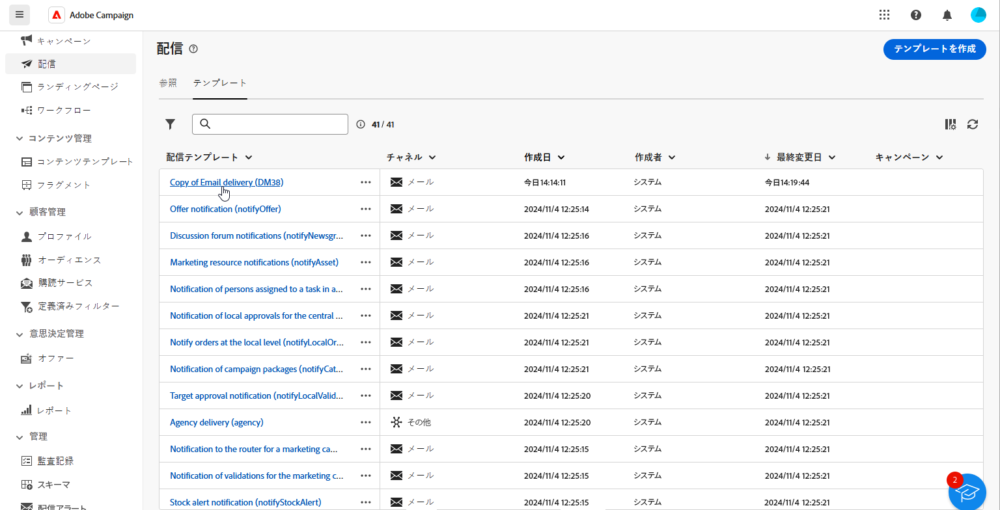
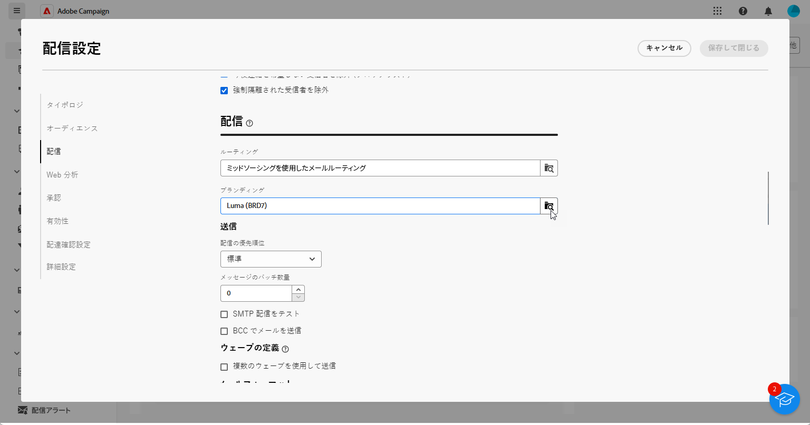
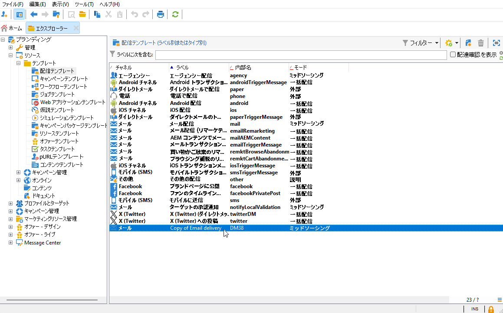
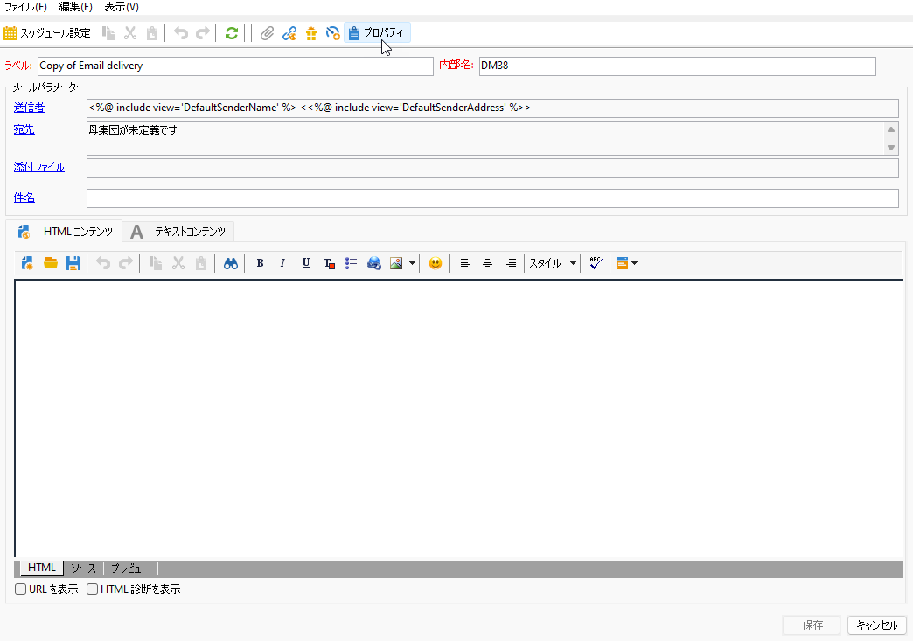
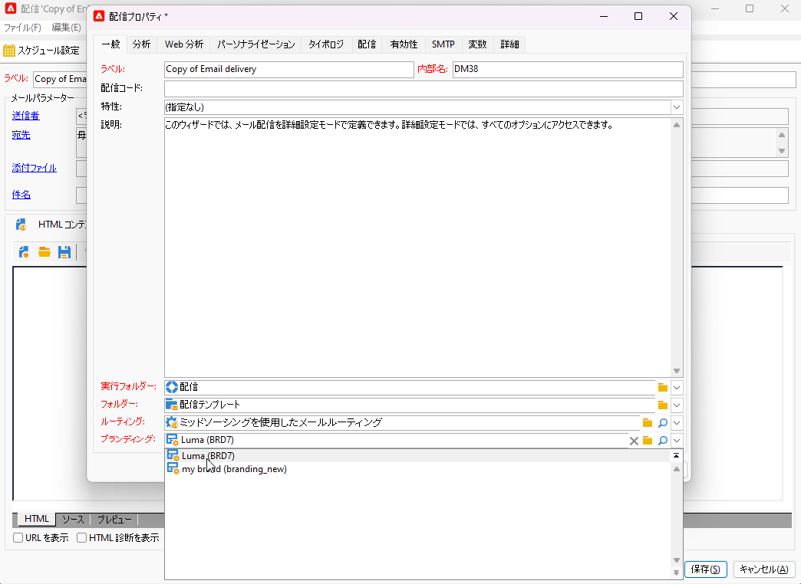
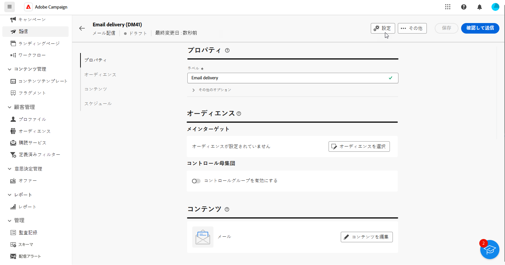
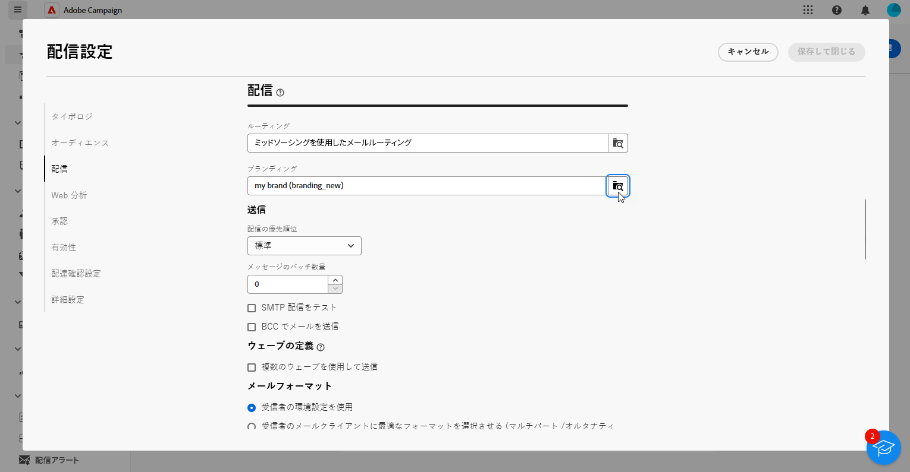
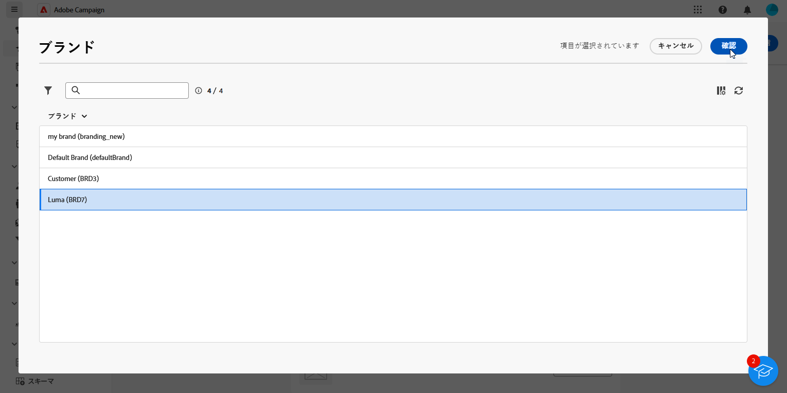
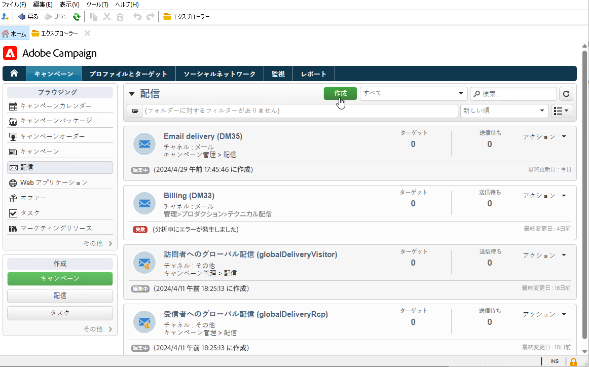
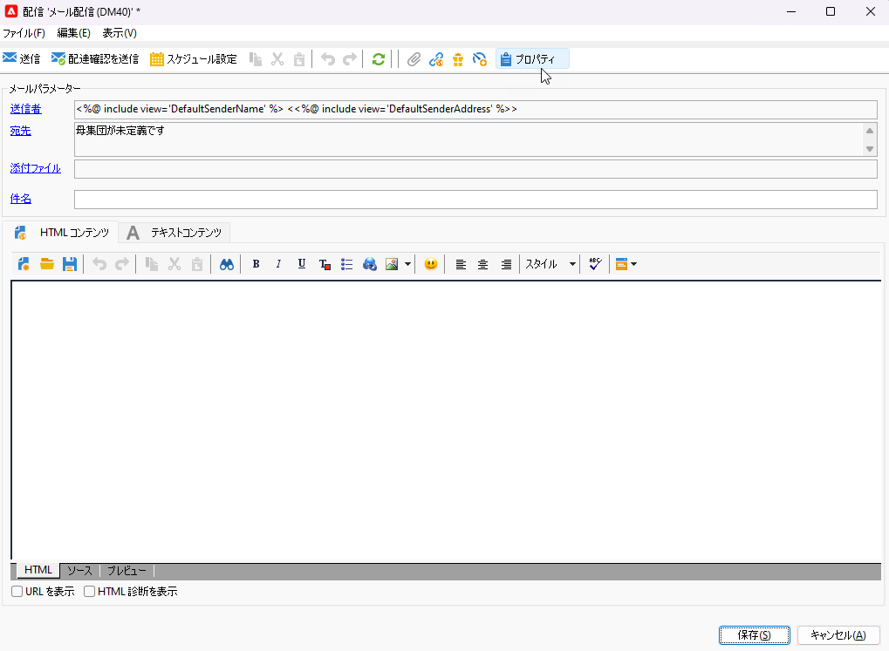

# ブランドの割り当て {#branding-assign}

## テンプレートへのブランドのリンク {#linking-a-brand-to-a-template}

ブランドに定義したパラメーターを使用するには、そのブランドが配信テンプレートにリンクされている必要があります。それには、テンプレートを作成または編集する必要があります。

これで、テンプレートはブランドにリンクされます。メールエディターでは、**デフォルト送信者のメールアドレス**、**デフォルトの送信者名**、**ロゴ**&#x200B;などの要素では、設定済みのブランドデータが使用されます。

>[!BEGINTABS]

>[!TAB Adobe Campaign web]

配信テンプレートを作成するには、組み込みテンプレートの複製、既存の配信のテンプレートへの変換またはゼロから配信テンプレートの作成を行います。[詳細情報](../../msg/delivery-template.md)

テンプレートを作成したら、それをブランドにリンクできます。手順は次のとおりです。

1. **[!UICONTROL 配信]**&#x200B;の左側のメニューから、「**[!UICONTROL テンプレート]**」タブに移動し、配信テンプレートを選択します。

   

1. 「**[!UICONTROL 設定]**」をクリックします。

   

1. 「**[!UICONTROL 配信]**」タブから、「**[!UICONTROL ブランディング]**」フィールドにアクセスし、テンプレートにリンクするブランドを選択します。

   

1. 選択内容を確定し、テンプレートを保存します。

これで、このテンプレートを使用して配信を送信できるようになりました。

>[!TAB Adobe Campaign v8]

配信テンプレートを作成するには、組み込みテンプレートの複製、既存の配信のテンプレートへの変換またはゼロから配信テンプレートの作成を行います。[詳細情報](https://experienceleague.adobe.com/docs/campaign/campaign-v8/send/create-templates.html?lang=ja)

テンプレートを作成したら、それをブランドにリンクできます。手順は次のとおりです。

1. Adobe Campaign エクスプローラーで、**[!UICONTROL リソース]** `>` **[!UICONTROL テンプレート]** `>` **[!UICONTROL 配信テンプレート]**&#x200B;に移動します。

1. 配信テンプレートを選択するか、既存の配信テンプレートを複製します。

   

1. 選択した配信テンプレートの&#x200B;**[!UICONTROL プロパティ]**&#x200B;にアクセスします。

   

1. 「**[!UICONTROL 一般]**」タブの&#x200B;**[!UICONTROL ブランディング]**&#x200B;ドロップダウンからブランドを選択します。

   

1. 設定が完了したら、「**OK**」を選択します。

これで、このテンプレートを使用して配信を送信できるようになりました。

>[!ENDTABS]

## 配信へのブランドの割り当て {#assigning-a-brand-to-an-email}

>[!BEGINTABS]

>[!TAB Adobe Campaign web]

新しいスタンドアロン配信を作成するには、次の手順に従います。

1. 左側のパネルの&#x200B;**[!UICONTROL 配信]**&#x200B;メニューを参照し、「**[!UICONTROL 配信を作成]**」ボタンをクリックします。

   

1. 「メール」または「プッシュ通知」をチャネルとして選択し、リストから配信テンプレートを選択します。

1. 「**[!UICONTROL 配信を作成]**」ボタンをクリックして、確定します。

1. **[!UICONTROL プロパティ]**&#x200B;ページから、「**[!UICONTROL 設定]**」をクリックします。

   

1. 「**[!UICONTROL 配信]**」タブから、「**[!UICONTROL ブランディング]**」フィールドにアクセスします。

   

1. テンプレートにリンクするブランドを選択します。

   

1. 配信をさらにパーソナライズします。メールの作成について詳しくは、[最初のメールの作成](../../email/create-email.md)の節を参照してください。

>[!TAB Adobe Campaign v8]

新しいスタンドアロン配信を作成するには、次の手順に従います。

1. 新しい配信を作成するには、「**[!UICONTROL キャンペーン]**」タブに移動します。

1. 「**[!UICONTROL 配信]**」をクリックし、既存の配信リストの上にある「**[!UICONTROL 作成]**」ボタンをクリックします。

   

1. 配信テンプレートを選択します。

1. 選択した配信テンプレートの&#x200B;**[!UICONTROL プロパティ]**&#x200B;にアクセスします。

   

1. 「**[!UICONTROL 一般]**」タブの&#x200B;**[!UICONTROL ブランディング]**&#x200B;ドロップダウンからブランドを選択します。

   

1. 設定が完了したら、「**OK**」を選択します。

1. 配信をさらにパーソナライズします。メールの作成について詳しくは、[メールのデザインと送信](../../email/create-email.md)の節を参照してください。

>[!ENDTABS]

## トランザクションメッセージに関連付けられたブランディングの確認 {#check-branding-transactional}

>[!IMPORTANT]
>
>この節は、トランザクションメッセージ（Message Center）にのみ適用されます。
>
>トランザクション機能は Campaign web UI で使用できますが、以下の検証手順は Campaign v8 クライアントコンソール（コントロールインスタンス）で実行する必要があります。

リアルタイム（RT）実行インスタンスからコントロールインスタンスに同期されるトランザクション配信では、ルーティングやブランディングなどのプロパティはレプリケートされません。 これらの同期された配信は、コントロールインスタンスに配信指標を返すために、同じテンプレートから毎週生成されます。

このため、コントロールインスタンスにはデフォルトのブランドが表示されます。 メッセージ実行時に使用される実際のブランドとルーティング設定は、コントロールインスタンスのトランザクションメッセージテンプレートで定義されます。

トランザクションメッセージに使用されたブランドを確認するには：

1. リアルタイムに公開されるトランザクションテンプレートの内部名（例：`TransactionalMessaging4768`）を識別します。

   

1. コントロールインスタンスの **トランザクションメッセージテンプレート** で、この内部名を検索します。

   

1. テンプレートを開いて、ブランドとその他の関連プロパティを表示します。
