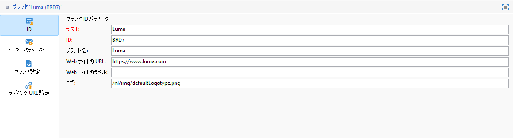
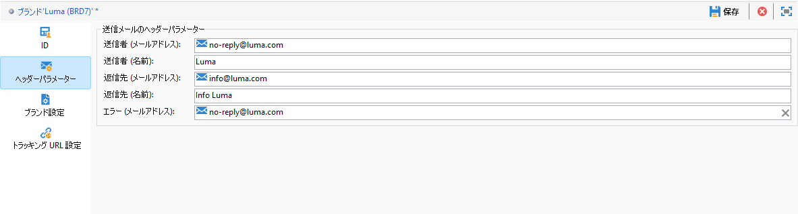
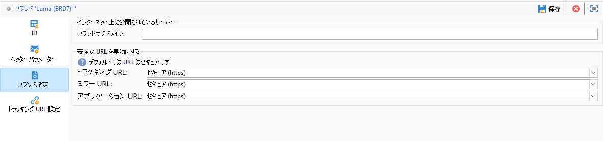

# ブランドの設定 {#branding-configure}

>[!IMPORTANT]
>
>ブランドは、エンドユーザーが作成または変更することはできません。これらの操作は、Adobe Campaign の技術管理者が実行する必要があります。ご要望がある場合は、アドビカスタマーケアにお問合せください。

Adobe Campaign v8 では、ブランドは&#x200B;**[!UICONTROL 管理／プラットフォーム／ブランディング]**&#x200B;メニューにあります。

**[!UICONTROL ブランドは]**、次の特性によって定義されます。

* **[!UICONTROL Identity]**：ブランドを定義しパーソナライズします。このセクションには、次のフィールドが含まれています。

   * **[!UICONTROL Label]**：インターフェイスに表示されます。
   * **[!UICONTROL ID]**
   * **[!UICONTROL Brand name]**
   * **[!UICONTROL Website URL]** と **[!UICONTROL Website label]**
   * **[!UICONTROL Logo URL]**

  

* **[!UICONTROL 送信メールのヘッダーパラメーター]**：キャンペーンの受信者に表示される内容をパーソナライズします。このセクションには、次のフィールドが含まれています。

   * **[!UICONTROL Sender (email address)]**：ブランドの電子メールアドレスです。
   * **[!UICONTROL Sender (name)]**：ブランドの名前です。
   * **[!UICONTROL Reply to (email address)]**：ユーザーからの返信先のメールアドレスです。
   * ブランド名を含む&#x200B;**[!UICONTROL Reply to (name)]**：ユーザーからの返信先（ブランド）の名前です。
   * **[!UICONTROL ）Error (email address)]**：エラーの場合に使用するメールアドレスです。

  >[!IMPORTANT]
  >
  >メールのヘッダーパラメーターを更新した後、送信者の名前とメールアドレスが、テンプレートから作成されたメール内で変更されていない場合は、テンプレートの詳細設定を確認します。

  

* **[!UICONTROL ブランド設定]**：ランディングページへのアクセスのトラッキングにも使用するサーバーを定義します。このセクションには、次のフィールドが含まれています。

   * **[!UICONTROL ブランドサブドメイン]**：アドビからのデリゲーションをリクエストされた、このブランドに固有の指定されたサブドメイン URL を指します。

  トラッキング、ミラー、アプリケーションサーバーの設定は、ルーティングに関連付けられた個別の外部アカウントに保存されます。これらの設定は、プロビジョニング中に適用されるので、変更しないでください。URL を表示するには、外部アカウントから「**[!UICONTROL ブランディングプレフィックス]**」タブにアクセスします。

  

* **[!UICONTROL トラッキング URL 設定]**&#x200B;メニューを使用すると、Adobe Analytics や Google Analytics などの web 分析ツールとの統合の追加パラメーターを定義して、URL トラッキングを強化できます。

  **[!UICONTROL 追加の URL パラメーター]**&#x200B;メニューを使用して、適用条件と共にキーと値のペアとして追加のパラメーターを作成します。各パラメーター名は一意で空でない必要があり、各パラメーター値は空でない必要があります。適用条件は空にすることができますが、これらの値には JST タグを含めることはできません。

  これらのパラメーターは、**[!UICONTROL ドメイン名のリスト]**&#x200B;で指定したドメイン名（正規表現を含めることができる）に一致するトラッキング対象 URL に適用されます。

  **例：**`https://www.example.com` のようなトラッキング対象 URL は、そのドメインに追加パラメーター `age=21` および `deliveryName=DM101` が設定されている場合は `https://www.example.com/?age=21&deliveryName=DM101` になります。

## トランザクションメッセージのブランディングの設定 {#branding-transactional-config}

>[!IMPORTANT]
>
>この節は、トランザクションメッセージ（Message Center）にのみ適用されます。
>
>トランザクション機能は Campaign web UI で使用できますが、以下の手順は Campaign v8 クライアントコンソール（コントロールインスタンス）で実行する必要があります。

ブランディングにトランザクションメッセージ（Message Center）を使用している場合は、追加の設定が必要です。

### リアルタイムインスタンスのトラッキング式

リアルタイム（RT）コントロールインスタンスでブランディングをアクティブ化すると、トラッキング式を管理する特定のトラッキングオプションが使用されます。これらの式は、各 RT 実行インスタンスで個別に設定するのではなく、RT コントロールインスタンスで一元的に設定されます。

次のオプションは、RT 配信で使用されるトラッキング式を定義します。

* **`NmsTracking_RT_ClickFormula`**：RT インスタンスのクリックの追跡に使用される式を指定します

* **`NmsTracking_RT_OpenFormula`**：RT インスタンスの開封トラッキングに使用される式を指定します

実装でトランザクションメッセージのカスタムトラッキング式が必要な場合は、以下のオプションを使用します。

* **`Branding_RT_ListXtkOptions_toPublish`**：カスタム式の XTK オプション名をここにリストします（コンマで区切ります）。これにより、RT 配信でカスタムトラッキング式を適用できます。