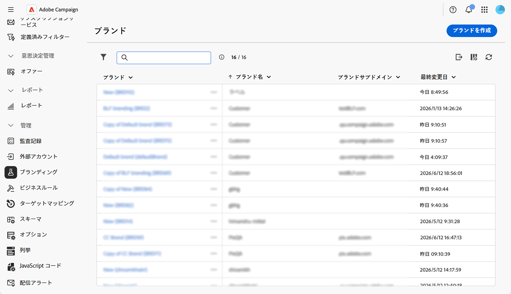
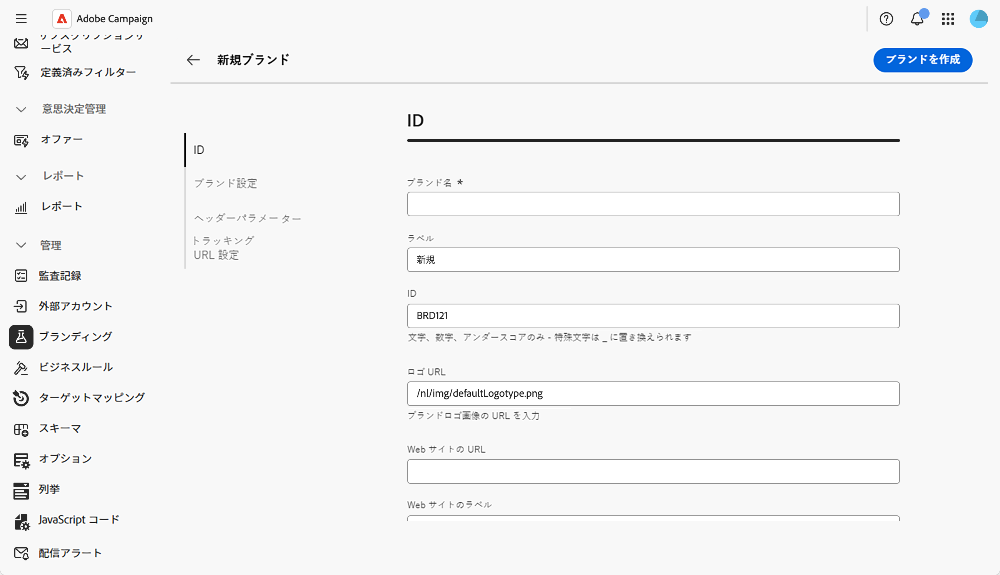
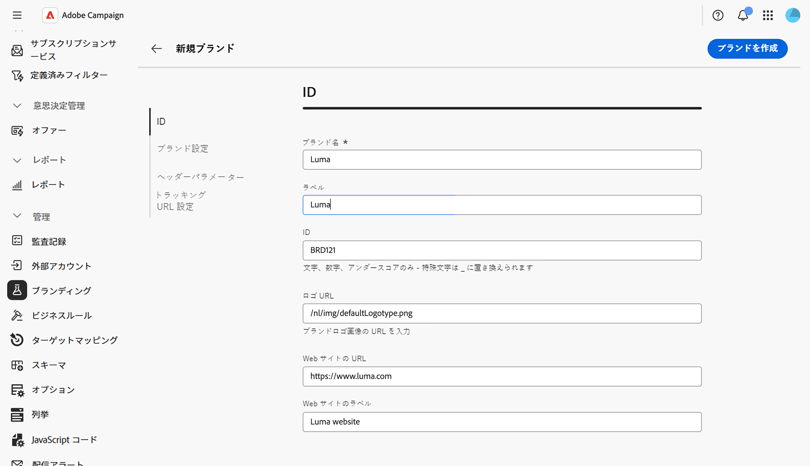
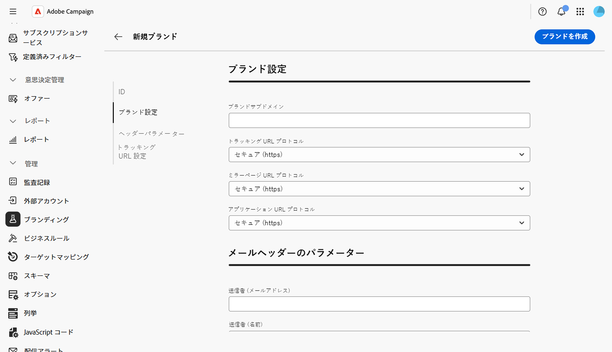
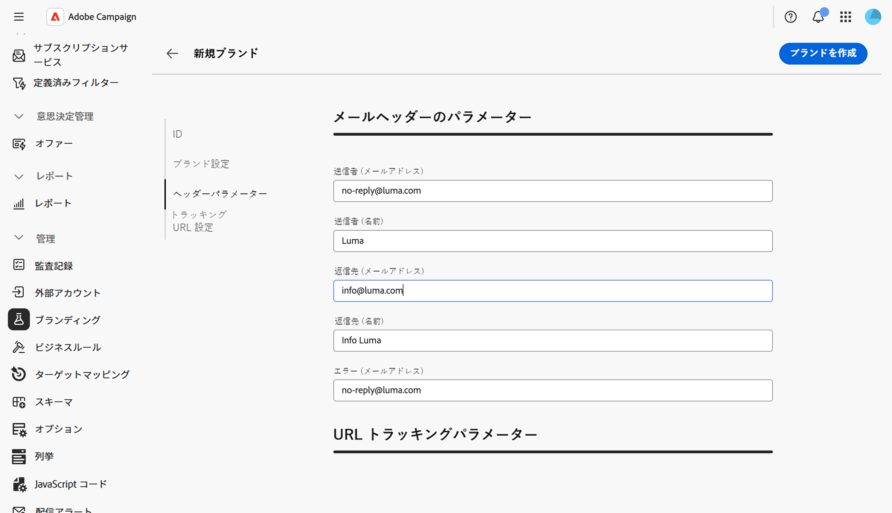
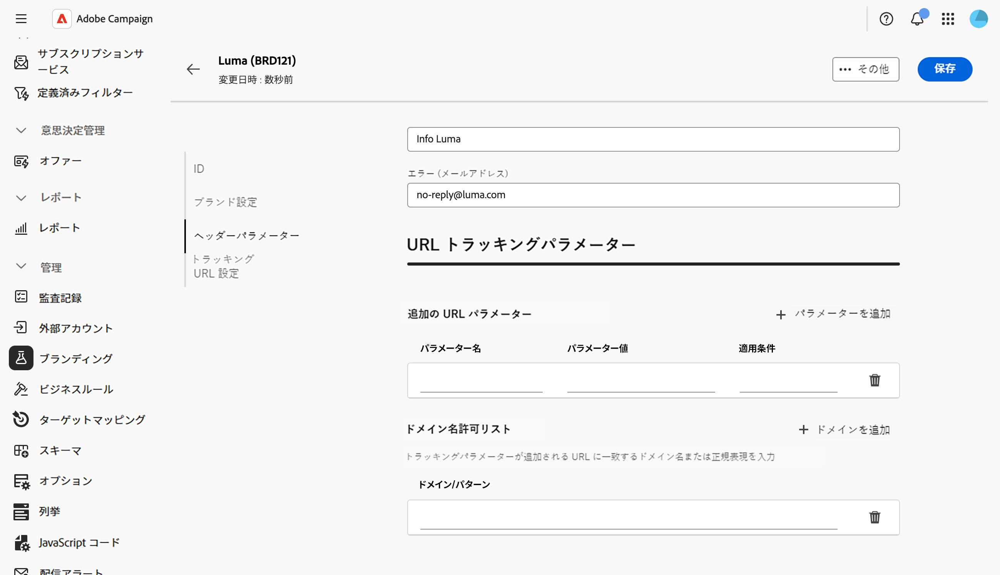

# ブランドの設定 {#branding-configure}

技術管理者は、web UI から複数のブランドを直接作成および管理できます。 これにより、ロゴやメールトラッキング設定など、ブランドアイデンティティを設定するすべての要素を定義できます。

>[!NOTE]
>
>この機能を利用するには、インスタンスにブランディングパッケージが必要です。 **ブランディング**&#x200B;メニューが表示されない場合は、アドビ担当者にお問い合わせください。

## ブランドの作成または編集 {#create-edit-brand}

>[!CONTEXTUALHELP]
>id="acw_branding_create"
>title="ブランドの作成"
>abstract="「**ブランドを作成**」をクリックして、新しいブランドアイデンティティを定義します。 設定タブでブランドの詳細を入力し、「**ブランドを作成**」をクリックして保存します。 ブランドは、配信テンプレートとスタンドアロン配信にリンクできるようになります。"

新しいブランドを作成するには、次の手順に従います。

1. 左側のメニューから&#x200B;**[!UICONTROL 管理／ブランディング]**&#x200B;に移動するか、**[!UICONTROL エクスプローラー]**&#x200B;から&#x200B;**[!UICONTROL 管理／プラットフォーム／ブランディング]**&#x200B;に移動します。

1. リストの上にある「**[!UICONTROL ブランドを作成]**」ボタンをクリックします。

   

1. 様々なセクションにブランドの詳細を入力します。 各フィールドについて詳しくは、以下の[ブランド属性](#brand-attributes)の節を参照してください。

   

1. 「**[!UICONTROL ブランドを作成]**」をクリックして保存します。 これで、ブランドを配信テンプレートやスタンドアロン配信とリンクできるようになりました。 [ブランドを割り当てる方法の詳細情報](branding-assign.md)。

既存のブランドを編集するには、リストからブランドを選択し、フィールドを更新して、変更を保存します。

## ブランド属性 {#brand-attributes}

**[!UICONTROL ブランド]**&#x200B;は、「**[!UICONTROL ID]**」、「**[!UICONTROL ブランド設定]**」、「**[!UICONTROL メールヘッダーのパラメーター]**」、「**[!UICONTROL URL トラッキングパラメーター]**」の 4 つのセクションをまたいで設定されています。

### ID {#identity}

「**[!UICONTROL ID]**」セクションでは、ブランドを定義およびパーソナライズできます。

このセクションには、次のフィールドが含まれています。

* **[!UICONTROL ブランド名]**：ブランドの名前。 このフィールドは必須です。
* **[!UICONTROL ラベル]**：インターフェイスに表示されるラベル。
* **[!UICONTROL ID]**：内部識別子が自動的に生成されます。 これは変更できます。 文字、数字、アンダースコアのみ許可されています。 特殊文字はアンダースコアに置き換えられます。
* **[!UICONTROL ロゴ URL]**：ブランドロゴ画像の URL。
* **[!UICONTROL Web サイトの URL]** と **[!UICONTROL web サイトのラベル]**：ブランドに関連付けられた web サイトの URL とラベル。

### ブランド設定 {#brand-configs}

「**[!UICONTROL ブランド設定]**」セクションでは、トラッキングとランディングページへのアクセスに使用するサブドメインと URL プロトコルを定義します。

このセクションには、次のフィールドが含まれています。

* **[!UICONTROL ブランドサブドメイン]**：アドビからのデリゲーションに対してリクエストされた、このブランドに固有のサブドメイン URL。
* **[!UICONTROL トラッキング URL プロトコル]**、**[!UICONTROL ミラーページ URL プロトコル]**&#x200B;および&#x200B;**[!UICONTROL アプリケーション URL プロトコル]**：各 URL タイプで使用されるプロトコル（例：**セキュア（https）**）。

>[!NOTE]
>
>トラッキング、ミラー、アプリケーションサーバーの設定は、ルーティングに関連付けられた個別の外部アカウントに保存されます。 これらの設定は、プロビジョニング中に適用されるので、変更しないでください。 URL を表示するには、外部アカウントから「**[!UICONTROL ブランディングプレフィックス]**」タブにアクセスします。

### メールヘッダーのパラメーター {#header-param}

**[!UICONTROL メールヘッダーのパラメーター]**&#x200B;を使用すると、キャンペーンのヘッダーセクションで受信者に表示される内容をパーソナライズできます。

このセクションには、次のフィールドが含まれています。

* **[!UICONTROL 送信者（メールアドレス）]**：ブランドのメールアドレス。
* **[!UICONTROL 送信者（名前）]**：ブランドの名前。
* **[!UICONTROL 返信先（メールアドレス）]**：顧客が返信できるメールアドレス。
* **[!UICONTROL 返信先（名前）]**：返信の表示名。
* **[!UICONTROL エラー（メールアドレス）]**：エラーの場合に使用するメールアドレス。

<!--
>[!IMPORTANT]
>
>After having updated the header parameters of the emails, if the name and email address of the sender have not changed in the email created from the template, check the template's advanced settings.
-->

### URL トラッキングパラメーター {#tracking-param}

「**[!UICONTROL URL トラッキングパラメーター]**」セクションでは、Adobe Analytics や Google Analytics などの web 分析ツールとの統合用の追加パラメーターを定義して、URL トラッキングを強化できます。

このセクションには、次のフィールドが含まれています。

* **[!UICONTROL 追加の URL パラメーター]**：適用条件と共にキーと値のペアとしてパラメーターを追加します。 各パラメーター名は一意で空でない必要があり、各パラメーター値は空でない必要があります。 適用条件は空にすることができますが、これらの値には JST タグを含めることはできません。

* **[!UICONTROL ドメイン名の許可リスト]**：トラッキングパラメーターを付与する URL に一致するドメイン名または正規表現を追加します。

**例：**`https://www.luma.com` のようなトラッキング対象 URL は、そのドメインに追加パラメーター `age=21` および `deliveryName=DM101` が設定されている場合は `https://www.luma.com/?age=21&deliveryName=DM101` になります。

## トランザクションメッセージのブランディングの設定 {#branding-transactional-config}

>[!IMPORTANT]
>
>この節は、トランザクションメッセージ（Message Center）にのみ適用されます。
>
>トランザクション機能は Campaign web UI で使用できますが、以下の手順は Campaign v8 クライアントコンソール（コントロールインスタンス）で実行する必要があります。

ブランディングにトランザクションメッセージ（Message Center）を使用している場合は、追加の設定が必要です。

### リアルタイムインスタンスのトラッキング式

リアルタイム（RT）コントロールインスタンスでブランディングをアクティブ化すると、トラッキング式を管理する特定のトラッキングオプションが使用されます。 これらの式は、各 RT 実行インスタンスで個別に設定するのではなく、RT コントロールインスタンスで一元的に設定されます。

次のオプションは、RT 配信で使用されるトラッキング式を定義します。

* **`NmsTracking_RT_ClickFormula`**：RT インスタンスのクリックの追跡に使用される式を指定します

* **`NmsTracking_RT_OpenFormula`**：RT インスタンスの開封トラッキングに使用される式を指定します

実装でトランザクションメッセージのカスタムトラッキング式が必要な場合は、以下のオプションを使用します。

* **`Branding_RT_ListXtkOptions_toPublish`**：カスタム式の XTK オプション名をここにリストします（コンマで区切ります）。 これにより、RT 配信でカスタムトラッキング式を適用できます。
