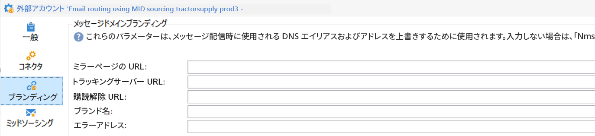

# ブランディングの基本を学ぶ {#branding-gs}

>[!AVAILABILITY]
>
>この機能は、新しい実装でのみオンデマンドで使用できます。 アクセスするには、アドビ担当者にお問い合わせください。

どの会社にも、視覚的要素と技術的な詳細の両方を定義するブランドガイドラインがあります。 Adobe Campaign では、これらのガイドラインを一元的に管理できるので、メールのロゴからキャンペーンで使用する URL やドメインまで、すべての操作で一貫したブランドイメージを顧客に提供できます。

技術管理者は、Web UIから複数のブランドを直接作成および管理できます。 これにより、ロゴやメールトラッキング設定など、ブランドアイデンティティを設定するすべての要素を定義できます。 作成したら、これらのブランドは配信に簡単にリンクできます。 [&#x200B; ブランドの作成と設定方法を説明します](branding-configure.md)。

Campaign で組織の新しいエンティティを追加することや、別のサブドメインで送信する必要がある新しいタイプのメールを作成できます。 手順は次のとおりです。

1. **新しいサブドメインの設定** - アドビで使用する新しいサブドメインの場合、最初の手順は設定することです。 これは、[Campaign コントロールパネル](https://experienceleague.adobe.com/docs/control-panel/using/subdomains-and-certificates/subdomains-branding.html?lang=ja)を通じて実行することも、アドビの技術担当者に問い合わせることもできます。 サブドメインの設定について詳しくは、[このページ](https://experienceleague.adobe.com/ja/docs/deliverability-learn/deliverability-best-practice-guide/additional-resources/campaign/ac-domain-name-setup)を参照してください。

   >[!NOTE]
   >
   >コントロールパネルは、すべての管理者ユーザーがアクセスできます。 ユーザーに管理者アクセス権を付与する手順については、[このページ](https://experienceleague.adobe.com/docs/control-panel/using/discover-control-panel/managing-permissions.html?lang=ja#discover-control-panel)で詳しく説明しています。

1. **配信テンプレートを作成** – 新しいブランドが使用可能になったら、この新しいブランドを参照する新しい空の配信テンプレートを少なくとも1つ作成することをお勧めします。 [詳細情報](branding-assign.md)。

1. **配信品質のガイドラインを確認** – 新しいドメインの使用を開始する前に、Adobe配信品質チームと戦略について話し合う必要があります。 例えば、IPをドメイン間で分割するために新しいアフィニティを作成する必要がある場合、および/またはランプアップ計画を定義する必要がある場合、ベストプラクティスを定義するのに役立ちます。

## 互換性に関するメモ {#compatibility-note}

新しい一元化された新しいブランディングモデルは、クライアントコンソールで以前使用されていた[レガシーブランディング](https://experienceleague.adobe.com/docs/campaign-classic/using/transactional-messaging/configure-transactional-messaging/additional-configurations.html?lang=ja#configuring-multibranding){target="_blank"}設定とは互換性がありません。

レガシーアプローチでは、顧客は extAccount フォームを拡張し、「**ブランディング**」タブを使用してブランディングを実装しました。

ブランド作成を示す

既存の環境でこのレガシー設定を使用している場合は、新しい一元化されたブランディングモデルに直接移行できません。 新しいシステムを採用するには、ブランディング設定の完全な再実装が必要です。