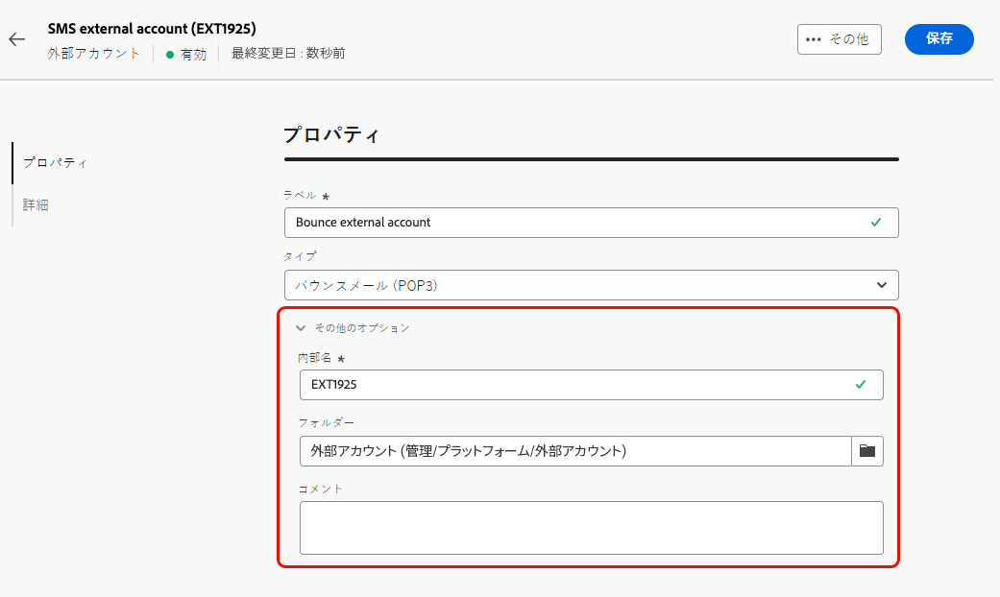
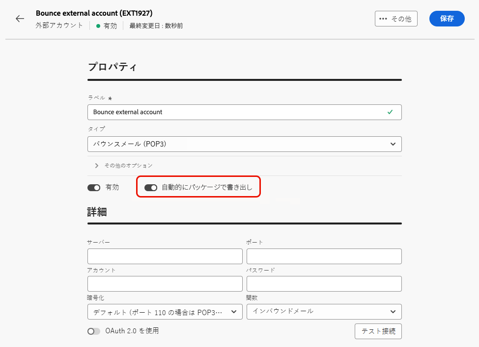

# 外部アカウントの作成 {#create-external-account}

>[!CONTEXTUALHELP]
>id="acw_homepage_welcome_rn2"
>title="外部アカウントのオーサリング"
>abstract="Campaign 管理者は、Campaign web ユーザーインターフェイスから外部システムとの新しい接続を設定できるようになりました。また、既存の外部アカウントを表示、更新、管理することもできます。"
>additional-url="https://experienceleague.adobe.com/docs/campaign-web/v8/release-notes/release-notes.html?lang=ja" text="リリースノートを参照してください"

新しい外部アカウントを作成するには、次に示す手順に従います。 具体的な設定は、作成している外部アカウントのタイプによって異なります。

1. 左側のパネルメニューから、**[!UICONTROL 管理]**&#x200B;の下にある「**[!UICONTROL 外部アカウント]**」を選択します。

1. 「**[!UICONTROL 外部アカウントを作成]**」をクリックします。

   

1. **[!UICONTROL ラベル]**&#x200B;を入力し、外部アカウントの&#x200B;**[!UICONTROL タイプ]**&#x200B;を選択します。

   * [キャンペーン固有のタイプ](external-account.md)
   * [Adobe ソリューションの統合](integration-external-account.md)
   * [データを転送](transfer-external-account.md)
   * [外部データベース](external-account-database.md)

   

1. 「**[!UICONTROL 作成]**」をクリックします。

1. **[!UICONTROL その他のオプション]**&#x200B;ドロップダウンから、必要に応じて、**[!UICONTROL 内部名]**&#x200B;または&#x200B;**[!UICONTROL フォルダー]**&#x200B;のパスを変更します。

   

1. この外部アカウントによって管理されているデータを自動的にエクスポートするには、「**[!UICONTROL パッケージで自動的にエクスポート]**」オプションを有効にします。<!--Exported where??-->

   

1. 「**[!UICONTROL 詳細]**」セクションで、選択した外部アカウントタイプに基づいて資格情報を指定し、アカウントへのアクセスを設定します。[詳細情報](#bounce)

1. 「**[!UICONTROL テスト接続]**」をクリックして、設定が正しいことを確認します。

1. **[!UICONTROL 詳細…]**&#x200B;メニューから、外部アカウントを複製または削除します。

   

1. 設定が完了したら、「**[!UICONTROL 保存]**」をクリックします。
