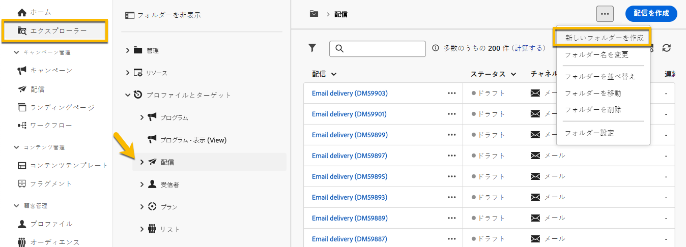
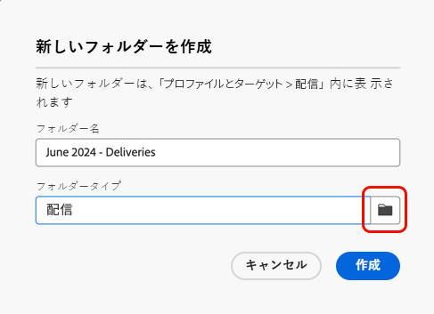
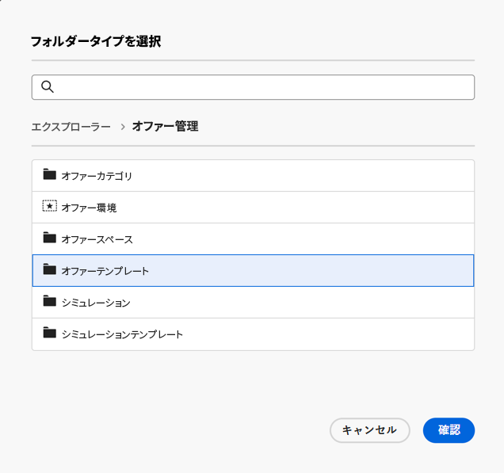

# フォルダーの作成と管理

Adobe Campaign では、ナビゲーションツリーを管理するための新しいフォルダーを作成できます。**[!UICONTROL エクスプローラー]**&#x200B;で、新しいフォルダーを作成するフォルダーに移動します。

「**[!UICONTROL …]**」ボタンの下に、**[!UICONTROL 新しいフォルダーを作成]**&#x200B;があります。

{zoomable="yes"}

新しいフォルダーを作成すると、デフォルトでは、フォルダータイプはフォルダーの親のタイプになります。
この例では、**[!UICONTROL 配信]**&#x200B;フォルダー内にフォルダーを作成します。

{zoomable="yes"}

フォルダータイプのアイコンをクリックすると、フォルダーのタイプを変更し、次に示すリストで選択できます。

{zoomable="yes"}

「**[!UICONTROL 確認]**」ボタンをクリックして、フォルダータイプを設定します。

特定のタイプのないフォルダーを作成する場合は、「**[!UICONTROL 汎用フォルダー]**」タイプを選択します。

Adobe Campaign コンソールでは、[こちら](https://experienceleague.adobe.com/ja/docs/campaign/campaign-v8/config/configuration/folders-and-views)で説明するフォルダーの作成と管理のプロセスがあり、フォルダーの権限を設定することができます。[詳細情報](https://experienceleague.adobe.com/ja/docs/campaign/campaign-v8/admin/permissions/folder-permissions)
