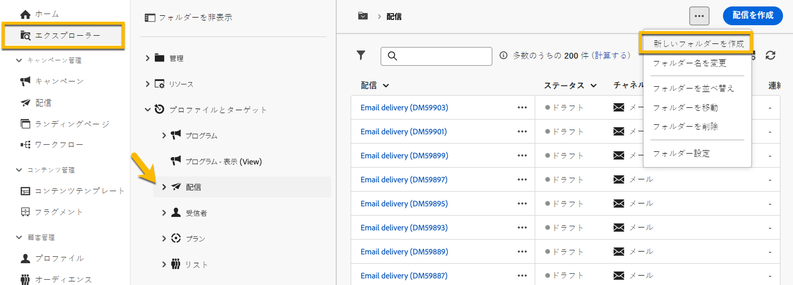
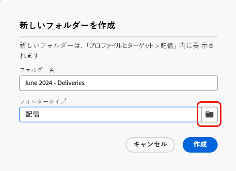
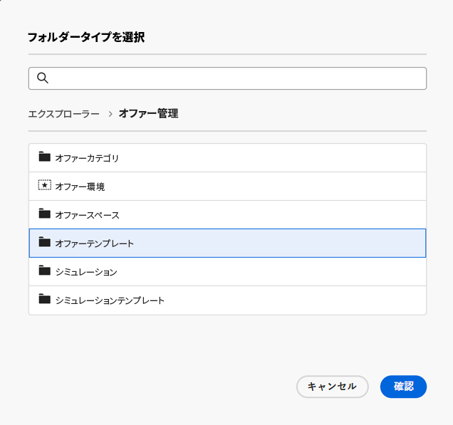

# フォルダーの作成と管理

Adobe Campaign では、ナビゲーションツリーを管理するための新しいフォルダーを作成できます。 **[!UICONTROL エクスプローラー]**&#x200B;で、新しいフォルダーを作成するフォルダーに移動します。

「**[!UICONTROL …]**」ボタンの下で、「**[!UICONTROL 新しいフォルダーを作成]**」を選択します。

{zoomable="yes"}

新しいフォルダーを作成すると、フォルダータイプはデフォルトで親フォルダーのタイプになります。\
この例では、**[!UICONTROL 配信]**&#x200B;フォルダーにフォルダーを作成します。

{zoomable="yes"}

フォルダータイプを変更するには、フォルダータイプアイコンをクリックし、表示されるリストからタイプを選択します。

{zoomable="yes"}

「**[!UICONTROL 確認]**」ボタンをクリックして、フォルダータイプを設定します。

特定のタイプのないフォルダーを作成するには、「**[!UICONTROL 汎用フォルダー]**」タイプを選択します。

Adobe Campaign コンソールで、フォルダーを作成および管理するプロセスについて詳しくは、[こちら](https://experienceleague.adobe.com/ja/docs/campaign/campaign-v8/config/configuration/folders-and-views)を参照してください。 また、フォルダーの権限を設定することもできます。 [詳細情報](https://experienceleague.adobe.com/ja/docs/campaign/campaign-v8/admin/permissions/folder-permissions)。