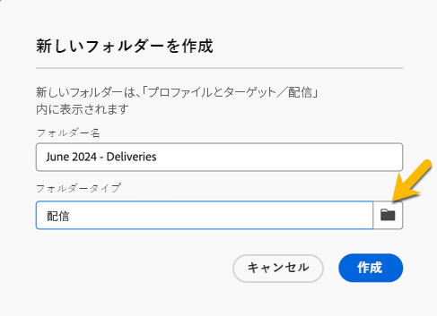

# フォルダーの作成と管理

Adobe Campaignでは、新しいフォルダーを作成してナビゲーションツリーを管理できます。 対象： **[!UICONTROL エクスプローラー]**&#x200B;新規フォルダーを作成するフォルダーに移動します。

の下 **[!UICONTROL ...]** ボタンが表示されます **[!UICONTROL 新規フォルダーを作成]**

{zoomable="yes"}

新しいフォルダーを作成する場合、デフォルトでは、フォルダータイプはフォルダーの親のタイプになります。
この例では、にフォルダーを作成します **[!UICONTROL 配信]** フォルダー。

{zoomable="yes"}

フォルダータイプのアイコンをクリックして、フォルダーのタイプを変更し、表示されるリストで選択できます。

{zoomable="yes"}

「」をクリックすると、フォルダータイプを設定できます。 **[!UICONTROL 確認]** ボタン。

特定のタイプを持たないフォルダーを作成する場合は、 **[!UICONTROL 汎用フォルダー]** タイプ。

Adobe Campaign コンソールでは、フォルダーの作成と管理のプロセスについて説明します [こちら](https://experienceleague.adobe.com/en/docs/campaign/campaign-v8/config/configuration/folders-and-views)を選択して、フォルダーに対する権限を設定できます。 [詳細情報](https://experienceleague.adobe.com/en/docs/campaign/campaign-v8/admin/permissions/folder-permissions)
