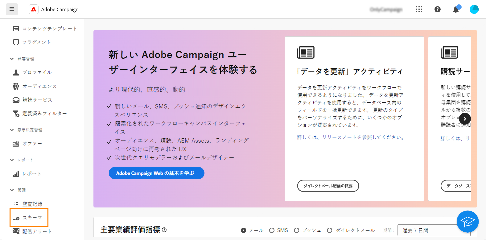
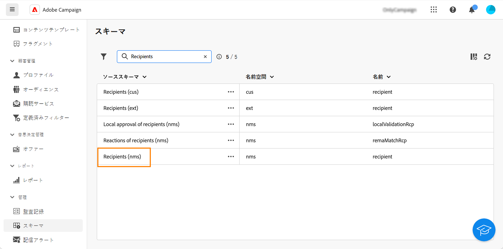
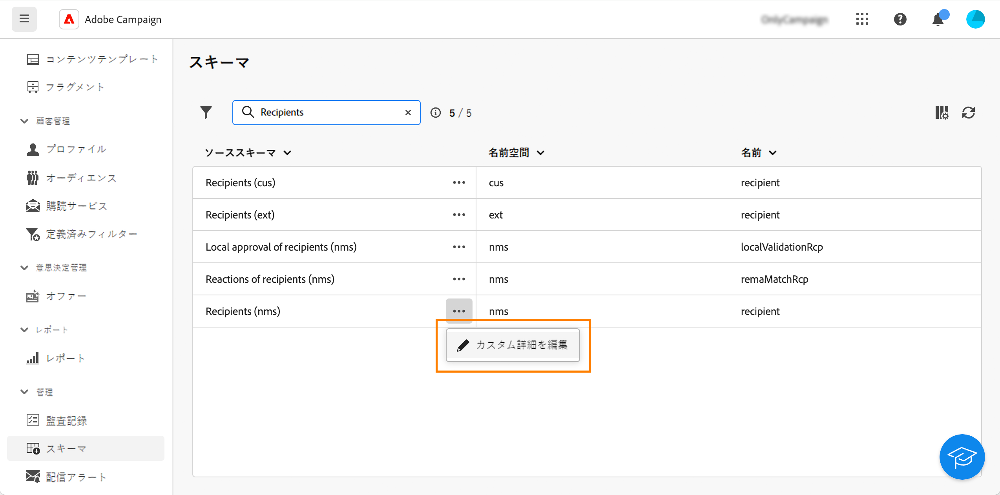
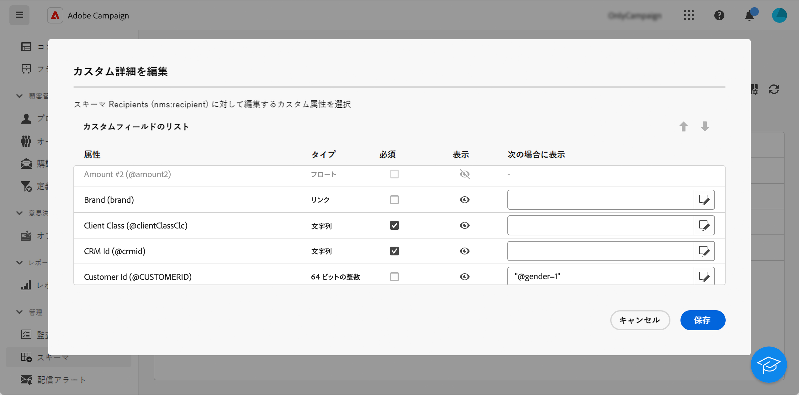
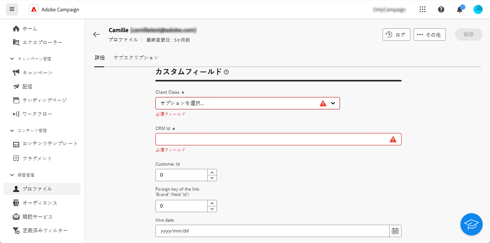

# カスタムフィールドの設定 {#custom-fields}

カスタムフィールドは、Adobe Campaign コンソールからすぐに使えるスキーマに追加されている属性です。詳しくは、[Adobe Campaign v8 ドキュメント](https://experienceleague.adobe.com/docs/campaign/campaign-v8/developer/shemas-forms/extend-schema.html?lang=ja){target="_blank"}を参照してください。

これらのカスタムフィールドは、プロファイルやテストプロファイルの詳細など、様々な画面に表示されます。

Web ユーザーインターフェイスでは、カスタムフィールドは作成できませんが、表示方法は変更できます。変更は、すべての Campaign ユーザーに適用されます。

>[!NOTE]
>
>カスタムフィールドを変更するには、管理者権限が必要です。

カスタムフィールドは、次のスキーマで使用できます。

* 受信者（nms）
* キャンペーン（nms）
* 配信（nms）
* シードアドレス（nms）

カスタムフィールドを設定するには、次の手順に従います。

1. **管理**&#x200B;の下の「**スキーマ**」をクリックします。

   {zoomable="yes"}

1. 目的のスキーマを見つけます（例：**受信者（nms）**&#x200B;スキーマ）。

   {zoomable="yes"}

1. 「**その他のアクション**」ボタンをクリックし、「**カスタム詳細を編集**」を選択します。

   {zoomable="yes"}

   「**カスタム詳細を編集**」画面には、すべてのカスタムフィールドとそのタイプが表示されます。

   {zoomable="yes"}

   この画面では、次のアクションを実行できます。

   * 上下の矢印キーを使用して、異なるフィールドの順序を変更します。
   * 「**必須**」ボックスをオンにして、フィールドを必須にします。
   * 「**表示**」ボタンをクリックして、フィールドを表示または非表示にします。
   * 「**次の場合に表示**」ボタンをクリックし、使用可能な xtk 関数を使用して xtk 式を記述して、表示条件を追加します。

1. カスタムフィールドを表示する画面に移動します。この例では、プロファイルの詳細画面を使用します。

   {zoomable="yes"}
