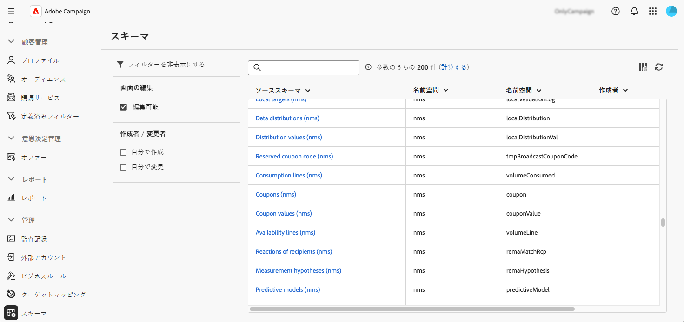
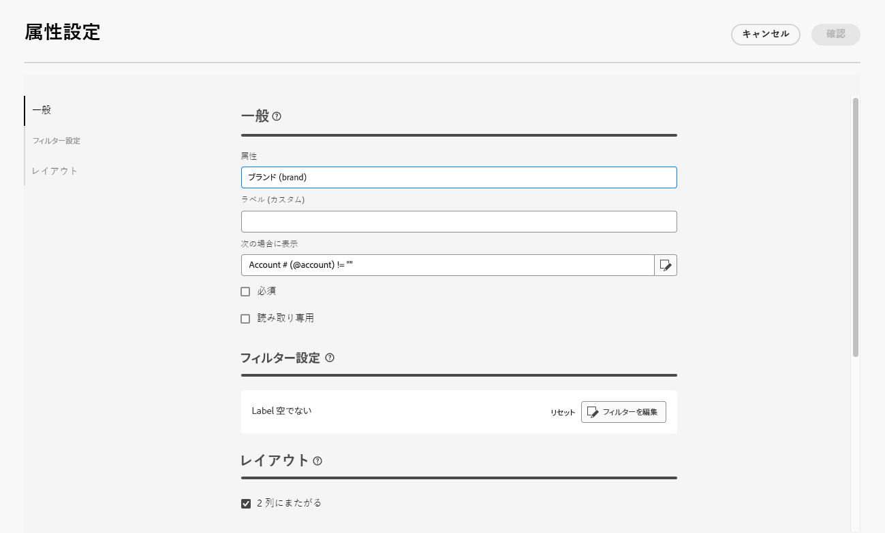
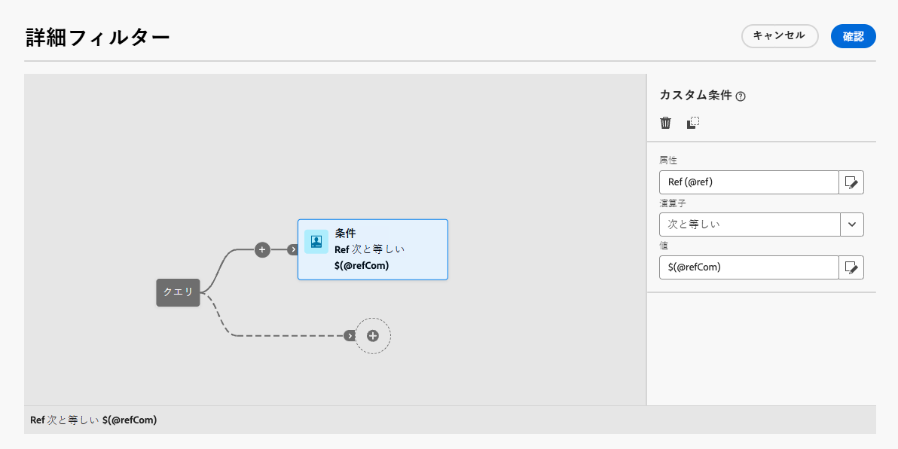
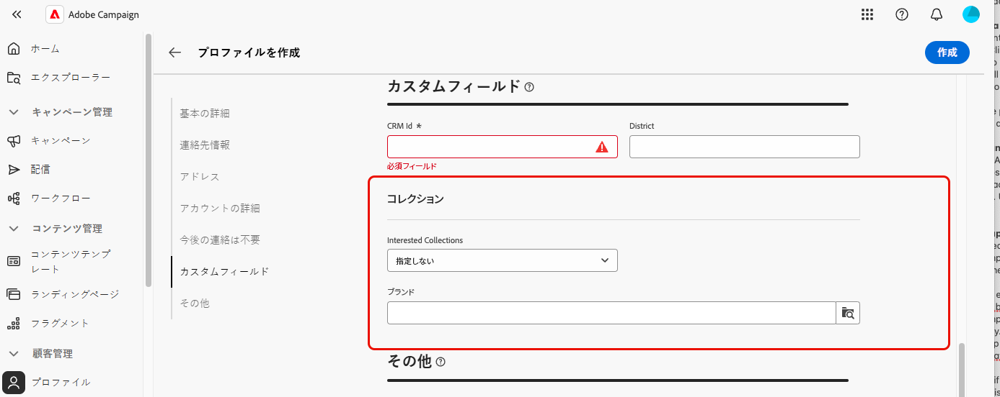

# カスタムフィールドの設定 {#custom-fields}

>[!CONTEXTUALHELP]
>id="acw_schema_editcustomfields"
>title="カスタム詳細の編集"
>abstract="選択したスキーマのインターフェイスに表示されるすべてのカスタムフィールドが表示されます。 上下の矢印キーを使用してインターフェイスに表示される順序を変更したり、区切り文字を追加してフィールドをサブセクションにグループ化したりできます。 カスタムフィールドを削除したり、表示条件などの設定を編集したりするには、「。..」ボタンをクリックします。"

>[!CONTEXTUALHELP]
>id="acw_schema_editcustomfields_settings_general"
>title="一般"
>abstract="カスタムフィールドの一般設定を定義します。 ラベルが指定されない場合、スキーマで定義されたラベルが表示されます。 **次の場合に表示** フィールドを使用して、フィールドの表示時期を制御する xtk 式を使用した条件を定義します。 インターフェイスでフィールドを必須または読み取り専用としてマークすることもできます。"

>[!CONTEXTUALHELP]
>id="acw_schema_editcustomfields_settings_link"
>title="リンクプロパティ"
>abstract="クエリモデラーを使用して、リンクタイプのカスタムフィールドを表示するためのルールを指定します。 例えば、別のフィールドの入力に基づいてリスト値を制限します。"

>[!CONTEXTUALHELP]
>id="acw_schema_editcustomfields_settings_layout"
>title="レイアウト"
>abstract="デフォルトでは、カスタムフィールドはインターフェイスで 2 つの列に表示されます。 このオプションをオンにすると、2 つの列ではなく、画面の全幅にカスタムフィールドが表示されます。"

>[!CONTEXTUALHELP]
>id="acw_schema_editcustomfields_separatorproperties"
>title="区切り記号プロパティ"
>abstract="サブセクションのインターフェイスに表示する名前を指定します。"

<!-- NOT USED IN THE UI?-->
>[!CONTEXTUALHELP]
>id="acw_schema_editcustomfields_settings"
>title="属性の設定"
>abstract="属性の設定"

カスタムフィールドは、Adobe Campaign コンソールを通じて標準スキーマに追加される追加の属性です。 組織のニーズに合わせて新しい属性を含めることで、スキーマをカスタマイズできます。 スキーマを拡張する方法については、[Adobe Campaign v8 ドキュメント ](https://experienceleague.adobe.com/docs/campaign/campaign-v8/developer/shemas-forms/extend-schema.html?lang=ja){target="_blank"} を参照してください。

カスタムフィールドは、Campaign web インターフェイスのプロファイルの詳細など、様々な画面に表示できます。 管理者は、表示するフィールドと表示方法を制御できます。 これらの変更は、すべての Campaign ユーザーに適用されます。

>[!NOTE]
>
>カスタムフィールドを管理するには、管理者権限が必要です。

カスタムフィールドは、次のスキーマで使用できます。

* キャンペーン（nms）
* プラン （nms）
* プログラム（nms）
* 受信者（nms）
* シードアドレス（nms）
* 配信（nms）

## インターフェイスへのカスタムフィールドの追加 {#add}

インターフェイスにカスタムフィールドを表示するには、次の手順に従います。

1. 左側のナビゲーションパネルで **[!UICONTROL スキーマ]** メニューを参照し、目的のスキーマを見つけます。

   フィルターウィンドウの **[!UICONTROL 編集可能]** フィルターを使用すると、カスタムフィールドを含むスキーマをすばやく特定できます。

   

1. リストでスキーマ名を選択して開きます。 詳細なスキーマビューに [ スキーマの詳細の表示 ](../administration/schemas.md) が表示されます。 「**[!UICONTROL カスタム詳細を編集]**」ボタンをクリックして、カスタムフィールドにアクセスします。 この例では、「受信者 **[!UICONTROL スキーマのフィールドを追加し]** す。

   

1. スキーマのインターフェイスに表示されるカスタムフィールドのリストが表示されます。 ここでは、「CRM ID」フィールドは、プロファイルの詳細画面に表示され、必須としてマークされています。

   | カスタムフィールドの設定 | インターフェイスでのレンダリング |
   |  ---  |  ---  |
   | {zoomable="yes"} | {zoomable="yes"} |

1. インターフェイスにカスタムフィールドを追加するには、「。..」ボタンをクリックし、次のいずれかのオプションを選択します。

   * **[!UICONTROL カスタムフィールドを選択]**: インターフェイスに表示する 1 つ以上のカスタムフィールドを選択します。
   * **[!UICONTROL カスタムフィールドのリストを自動的に入力]**：スキーマ用に定義されたすべてのカスタムフィールドをインターフェイスに追加します。

   

1. カスタムフィールドを追加すると、次の操作を実行できます。

   * **フィールドの並べ替え**：上向き矢印と下向き矢印を使用します。
   * **フィールドを必須にする**:「**必須**」チェックボックスを選択します。
   * **フィールド設定を編集**：省略記号ボタンをクリックし、「**[!UICONTROL 編集]**」を選択します。 [詳細情報](#settings)
   * **フィールドを削除**：省略記号ボタンをクリックし、「**[!UICONTROL 削除]**」を選択します。
   * **インターフェイスのサブセクションにフィールドを整理**：上向き矢印と下向き矢印の横にある省略記号ボタンをクリックし、「**[!UICONTROL 区切り記号を追加]**」を選択します。 [詳細情報](#separator)

## カスタムフィールドの設定 {#settings}

各カスタムフィールドに特定の設定を指定するには、目的のフィールドの横にある省略記号ボタンをクリックし、「**[!UICONTROL 編集]**」を選択します。

使用可能な設定は次のとおりです。

* **[!UICONTROL 属性]**：カスタムフィールドの名前です。
* **[!UICONTROL ラベル（カスタム）]**: インターフェイスに表示するラベル。 ラベルが指定されない場合、スキーマで定義されたラベルが表示されます。
* **[!UICONTROL 次の場合に表示]**：フィールドがいつ表示されるかを制御する xtk 式を使用して条件を定義します。 例えば、別のフィールドが空の場合にこのフィールドを非表示にします。
* **[!UICONTROL 必須]**：インターフェイスのフィールドを必須にします。
* **[!UICONTROL 読み取り専用]**: インターフェイスでフィールドを読み取り専用にします。 ユーザーはフィールドの値を編集できません。
* **[!UICONTROL フィルター設定]** （リンクタイプのフィールドの場合）: クエリモデラーを使用して、リンクタイプのカスタムフィールドを表示するためのルールを指定します。 例えば、別のフィールドの入力に基づいてリスト値を制限します。

  また、構文 `$(<field-name>)` を使用して、条件内の他のフィールドに入力された値を参照することもできます。 これにより、まだデータベースに保存されていない場合でも、フォームに入力されたフィールドの現在の値を参照できます。

  以下の例では、条件は、@ref フィールドの値が@refCom フィールドに入力された値と一致するかどうかを確認します。 これに対し、`$(@refCom)` の代わりに `@refCom` を使用すると、データベースに存在するので@ref フィールドの値が参照されます。

  +++例の表示

  

+++

* **[!UICONTROL 2 列に及ぶ]**：デフォルトでは、カスタムフィールドは 2 列でインターフェイスに表示されます。 このオプションをオンにすると、2 つの列ではなく、画面の全幅にカスタムフィールドが表示されます。

## サブセクションでのカスタムフィールドの整理 {#separator}

Campaign web ユーザーインターフェイスでは、インターフェイスのカスタムフィールドをグループ化して読みやすくするために、区切り文字を追加できます。 それには、次の手順に従います。

1. 上下の矢印の横にある省略記号ボタンをクリックし、「**[!UICONTROL 区切り記号を追加]**」を選択します。

1. 区切り記号を表す新しい行がリストに追加されます。 省略記号ボタンをクリックし、「**[!UICONTROL 編集]** を選択してサブセクションに名前を付けます。

1. 上下の矢印を使用して、区切り記号を目的の場所に移動します。 区切り記号の下にリストされるフィールドは、その下にグループ化されます。

   この例では、「関心のあるコレクション」フィールドと「ブランド」フィールドが「コレクション」サブセクションにグループ化されています。

   | カスタムフィールドの設定 | インターフェイスでのレンダリング |
   |  ---  |  ---  |
   | {zoomable="yes"} | {zoomable="yes"} |
