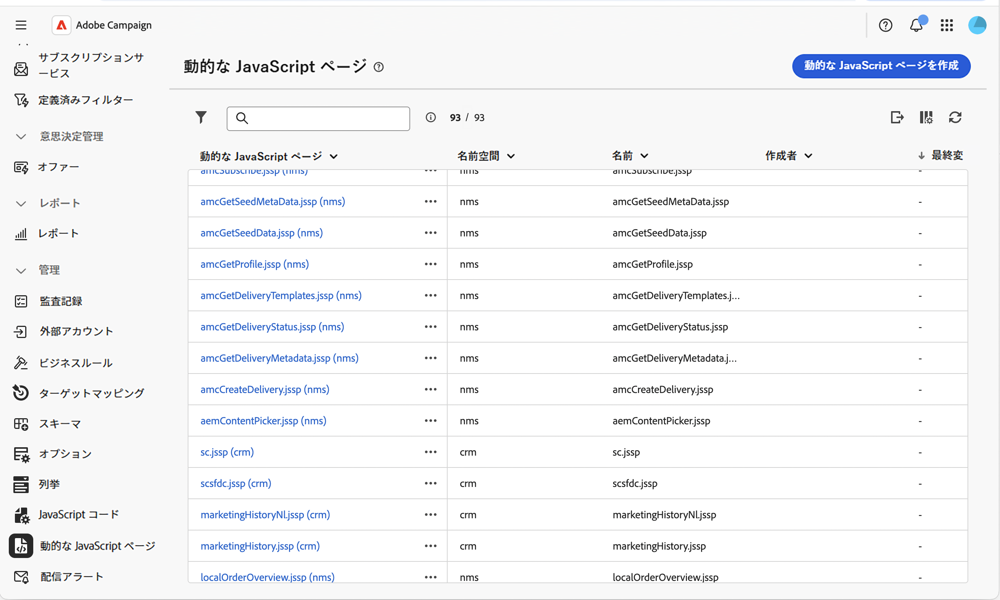
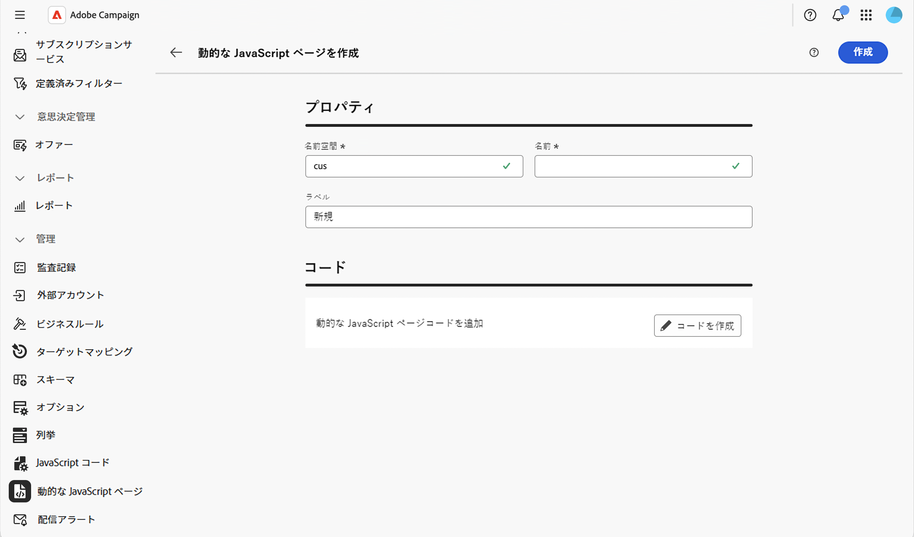
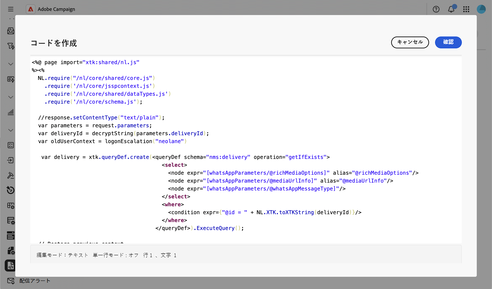

# ダイナミックJavaScriptページの操作 {#dynamic-javascript-pages}

>[!CONTEXTUALHELP]
>id="acw_dynamic_javascript_pages_list"
>title="動的な JavaScript ページ"
>abstract="動的JavaScript ページ（JSSP）を使用すると、カスタム API、書き出し、web アプリケーションロジックなどのURLを介してアクセスしたときに動的コンテンツを生成するサーバーサイドページを構築できます。 このリストから、動的なJavaScript ページを作成、変更、複製、または削除できます。"

>[!CONTEXTUALHELP]
>id="acw_dynamic_javascript_pages_create"
>title="動的な JavaScript ページを作成"
>abstract="動的なJavaScript ページの名前空間、名前、ラベルを定義し、JavaScript コードを使用してコンテンツを記述します。 作成した名前空間と名前は変更できません。"

## ダイナミックJavaScriptページについて {#about}

動的JavaScript ページ（JSSP）を使用すると、カスタム API、書き出し、web アプリケーションロジックなどのURLを介してアクセスしたときに動的コンテンツを生成するサーバーサイドページを構築できます。 これらのページは、左側のナビゲーションパネルの&#x200B;**[!UICONTROL 管理]** > **[!UICONTROL 動的JavaScript ページ]** メニューに保存されます。

利用可能なオプションを表示する

動的なJavaScript ページリストから、次の操作を実行できます。

* **ページを複製または削除する**：省略記号ボタンをクリックし、目的のアクションを選択します。
* **ページを変更**: ページの名前をクリックしてプロパティを開き、変更を加えて保存します。
* **新しい動的JavaScript ページを作成**:「**[!UICONTROL 動的JavaScript ページを作成]**」ボタンをクリックします。

<!--
>[!NOTE]
>
>In the Campaign console, dynamic JavaScript pages are available under **[!UICONTROL Administration]** > **[!UICONTROL Configuration]** > **[!UICONTROL Dynamic JavaScript pages]**. Although the menu location differs from the Web user interface, the list is identical and operates like a mirror.
-->

## ダイナミックなJavaScript ページの作成 {#create}

ダイナミック JavaScript ページを作成するには、次の手順に従います。

1. 「**[!UICONTROL Dynamic JavaScript page]**」メニューに移動し、「**[!UICONTROL Dynamic JavaScript page]**」ボタンをクリックします。

1. ページのプロパティを定義します。

   * **[!UICONTROL 名前空間]**：カスタムリソースに関連する名前空間を指定します。 デフォルトでは、名前空間は「cus」ですが、実装によって異なる場合があります。
   * **[!UICONTROL 名前]**: ページの参照に使用される一意のID。
   * **[!UICONTROL ラベル]**：動的なJavaScript ページリストに表示される説明ラベル。

   

   >[!NOTE]
   >
   >作成後は、「**[!UICONTROL 名前空間]**」フィールドと「**[!UICONTROL 名前]**」フィールドを変更することはできません。 変更をおこなうには、ページを複製し、必要に応じて更新します。

1. 「**[!UICONTROL コードを作成]**」ボタンをクリックしてページのコンテンツを定義し、`<%@ page %>` ディレクティブと`NL.require()`呼び出しを使用してJSSP コードを記述してコアライブラリを読み込みます。

   

1. 「**[!UICONTROL 確認]**」をクリックして、コードを保存します。

1. ダイナミック JavaScript ページの準備ができたら、**[!UICONTROL 作成]**&#x200B;をクリックします。 このページには、名前空間と名前から作成されたURL （`https://<your-instance>/<namespace>/<name>`形式）でアクセスできるようになりました。 例えば、`cus`名前空間の`recipientAPI.jssp`という名前のページには、`https://<your-instance>/cus/recipientAPI.jssp`からアクセスできます。

再利用可能なJavaScript関数について詳しくは、[JavaScript コードの操作](javascript-codes.md)を参照してください。
