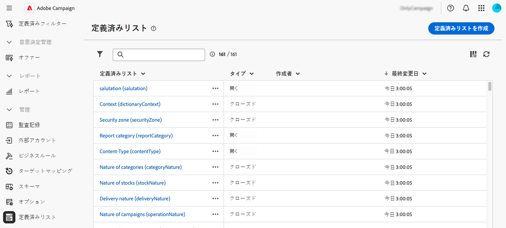
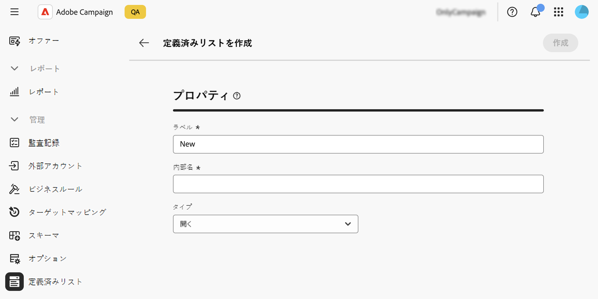
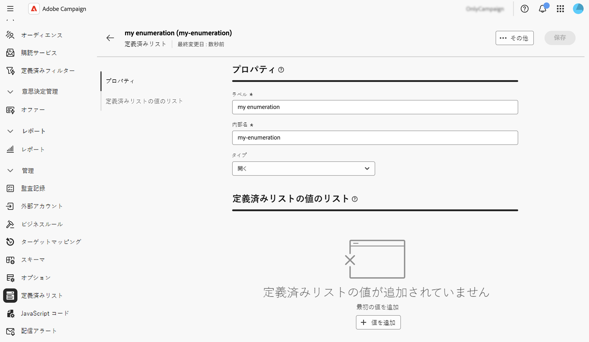
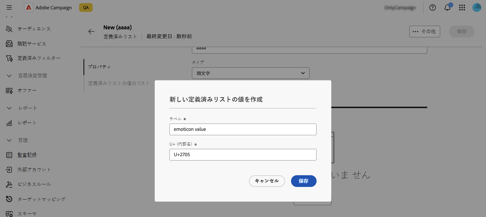
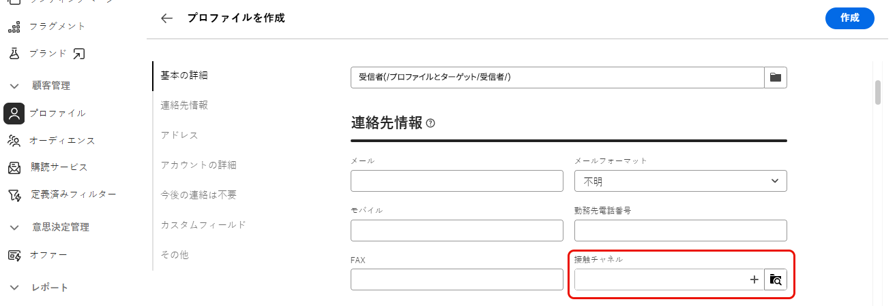
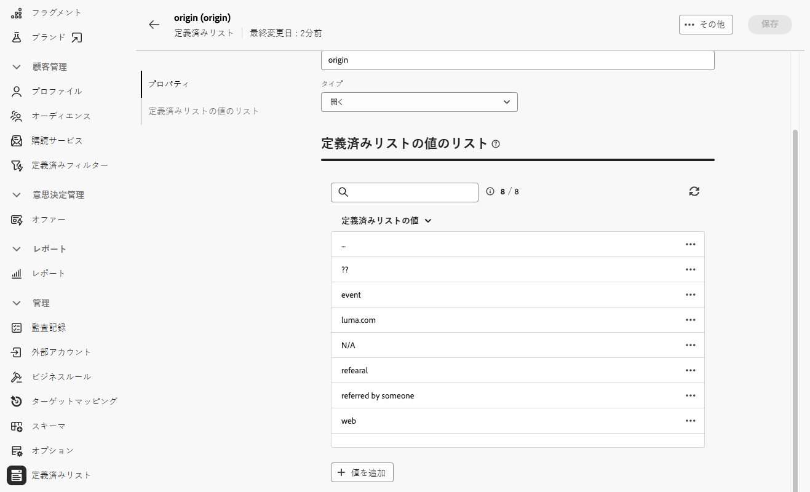
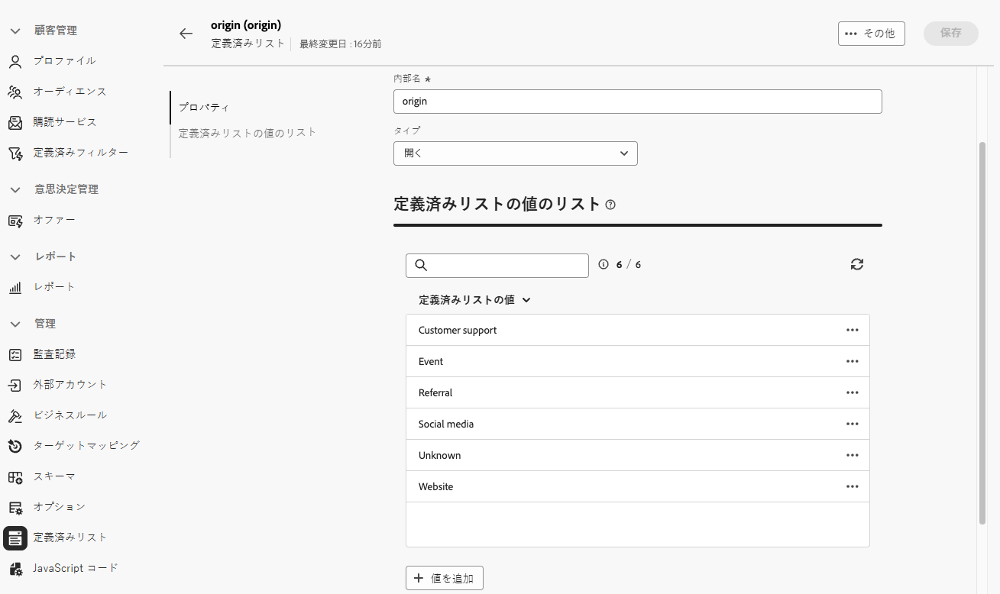
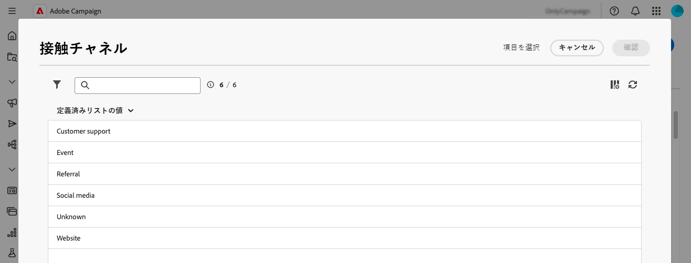

# 列挙の管理 {#enumerations}

>[!CONTEXTUALHELP]
>id="acw_enumerations_list"
>title="列挙"
>abstract="列挙とは、フィールドへの入力候補としてシステムによって表示される値のリストです。列挙を使用してフィールドの値を統一すると、データ入力やクエリ内での使用が簡単になります。"

>[!CONTEXTUALHELP]
>id="acw_enumerations_properties"
>title="プロパティ"
>abstract="名前、内部名、タイプなどの列挙のプロパティを定義します。**[!UICONTROL クローズド]**&#x200B;列挙には、**[!UICONTROL 列挙]**&#x200B;メニューからのみ変更できる値の固定リストがあります。**[!UICONTROL オープン]**&#x200B;列挙を使用すると、ユーザーはこの列挙に基づいてフィールドに新しい値を直接追加できます。**[!UICONTROL システム]**&#x200B;列挙は、システムフィールドに関連付けられています。**[!UICONTROL 顔文字]**&#x200B;列挙を使用すると、顔文字リストを更新できます。"

>[!CONTEXTUALHELP]
>id="acw_enumerations_values"
>title="列挙値のリスト"
>abstract="列挙に値を追加するには、「**[!UICONTROL 値を追加]**」ボタンをクリックして、必要に応じて設定します。"

## 列挙とは {#about}

列挙とは、フィールドへの入力候補としてシステムによって表示される値のリストです。列挙を使用してフィールドの値を統一すると、データ入力やクエリ内での使用が簡単になります。値のリストはドロップダウンリストとして表示され、値を選択すると、その値がフィールドに入力されます。また、このドロップダウンリストには予測入力機能があり、最初の数文字を入力すると続きが自動的に補完されます。

このタイプのフィールドの値は、左側のナビゲーションパネルの&#x200B;**[!UICONTROL 管理]**／**[!UICONTROL 列挙]**&#x200B;メニューを通じて定義します。

## 列挙の作成 {#create}

列挙を作成するには、次の手順に従います。

1. **[!UICONTROL 列挙]**&#x200B;メニューに移動し、「**[!UICONTROL 列挙を作成]**」ボタンをクリックします。

1. 列挙の&#x200B;**[!UICONTROL ラベル]**&#x200B;と&#x200B;**[!UICONTROL 内部名]**&#x200B;を入力します。

   

1. 列挙の&#x200B;**[!UICONTROL タイプ]**&#x200B;を選択します。

   * **[!UICONTROL クローズド]**&#x200B;列挙には、**[!UICONTROL 列挙]**&#x200B;メニューからのみ変更できる値の固定リストがあります。
   * **[!UICONTROL オープン]**&#x200B;列挙を使用すると、ユーザーはこの列挙に基づいてフィールドに新しい値を直接追加できます。
   * **[!UICONTROL システム]**&#x200B;列挙は、システムフィールドに関連付けられています。
   * **[!UICONTROL 顔文字]**&#x200B;列挙を使用すると、顔文字リストを更新できます。

1. 「**[!UICONTROL 作成]**」をクリックします。列挙の詳細が表示され、リストに値を追加できます。

   

1. 値を追加するには、「**[!UICONTROL 値を追加]**」ボタンをクリックして、必要に応じて設定します。

   * **[!UICONTROL ラベル]**：列挙に表示されるラベル。
   * **[!UICONTROL 内部名]**：値の内部名（システム列挙の場合）。
   * **[!UICONTROL U+（内部名）]**（顔文字列挙）：顔文字の Unicode コード（顔文字列挙の場合）。

   

1. 変更を保存します。列挙は、使用した画面で更新されます。

## ユースケース：列挙への定義済みの値の追加 {#uc}

デフォルトでは、プロファイルの詳細画面の「接触チャネル」フィールドにユーザーが自由に任意の値を入力できます。

ユーザーがフィールドに値を入力するたびに、その値は「接触チャネル」列挙に自動的に追加されます。これにより、時間の経過に伴い、値リストに冗長な値、一貫性のない値、誤った値が含まれる場合があります。

データの一貫性を確保し、フィールドに入力する際にユーザーをガイドするには、定義済みの値のセットを定義します。次の手順に従います。

1. **[!UICONTROL 列挙]**&#x200B;メニューに移動し、「接触チャネル」列挙を開きます。

2. ユーザーが入力した値のリストを確認し、クリーンアップします。値を削除するには、値の横にある省略記号ボタンをクリックします。リストに含まれる不一致が多すぎる場合は、列挙全体を削除して、最初から再作成します。

   

3. 定義済みの値を追加します。これを行うには、「**[!UICONTROL 値を追加]**」ボタンをクリックして、ユーザーが選択する定義済みの値を入力します。

   

4. 一貫性を確保するには、列挙タイプを&#x200B;**[!UICONTROL クローズド]**&#x200B;に切り替えて、ユーザーを定義済みの値に制限します。柔軟性が必要な場合は、**[!UICONTROL オープン]**&#x200B;のままにして、新しいユーザーのエントリを許可します。

5. プロファイルの詳細画面に戻ります。「接触チャネル」フィールドに、選択用に定義済みの値が表示されるようになりました。

   