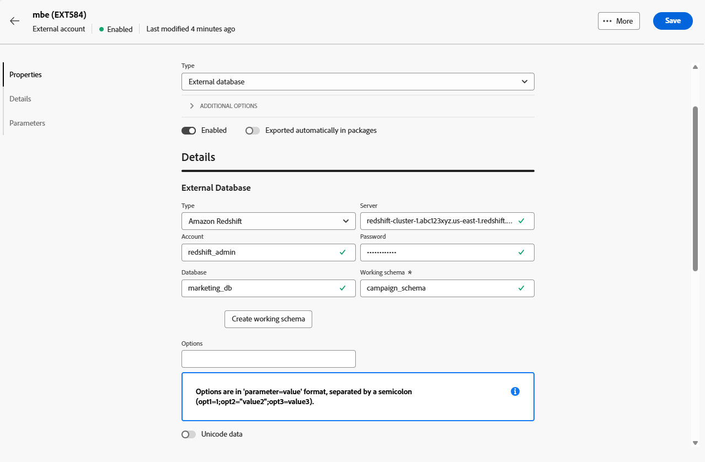

# 外部データベースアカウント {#external-accounts}

外部データベース タイプの外部アカウントを使用して、Adobe Campaignをサードパーティのデータベースに接続します。

外部アカウントの設定は、接続先のデータベースエンジンによって異なります。 サポートされている各データベースの手順について詳しくは、以下の節を参照してください。

## Amazon Redshift

Amazon Redshift 外部アカウントを使用すると、Campaign インスタンスをAmazon Redshift 外部データベースに接続できます。

Adobe Campaign web ユーザーインターフェイスで、Amazon Redshift 外部アカウントを設定します。

1. [ 外部アカウントを作成 ](external-account.md) し、外部アカウントの **[!UICONTROL タイプ]** として **[!UICONTROL 外部データベース]** を選択し、**[!UICONTROL プロバイダータイプ]** としてAmazon Redshift を選択します。

1. 「**[!UICONTROL 作成]**」をクリックします。

1. **[!UICONTROL Amazon Redshift]** 外部アカウントを設定するには、次のフィールドに入力します。

   * **[!UICONTROL タイプ]**:Amazon Redshift

   * **[!UICONTROL サーバー]**: Redshift サーバーの DNS 名を入力します。

   * **[!UICONTROL アカウント]**：認証に使用する Redshift ユーザー名を指定します。

   * **[!UICONTROL パスワード]**：ユーザーアカウントに関連付けるパスワードを入力します。

   * **[!UICONTROL データベース]**：データベース名がまだ DSN で定義されていない場合は、データベース名を指定します。 DSN にデータベースが含まれる場合は、このフィールドを空のままにします。

   * **[!UICONTROL 作業用スキーマ]**:Adobe Campaignを操作するスキーマ名を入力します。

   * **[!UICONTROL オプション]**：環境で必要になる可能性のある詳細設定オプションを追加します。

   * **[!UICONTROL タイムゾーン]**：正確な時間ベースの操作を確保するために、サーバーのタイムゾーンを選択または入力します。

   

1. 接続を設定したら、リモート Redshift データベースにAdobe Campaign SQL 関数を作成します。 これらの関数を使用できるようになったら、「**[!UICONTROL 関数をデプロイ]**」をクリックしてアクティブ化します。

1. **[!UICONTROL ストレージアカウント]** をリンクすると、パフォーマンスを最適化し、Adobe CampaignとAmazon Redshift の間でより高速なデータ読み込みプロセスが可能になります。

1. **[!UICONTROL アカウントの役割]** を入力します。これにより、Adobe Campaignが Redshift 環境を操作する際に使用する権限が決まります。

## Amazon Redshift （レガシー）

Amazon Redshift （従来の）外部アカウントを使用すると、Campaign インスタンスをAmazon Redshift 外部データベースに接続できます。

Adobe Campaign web ユーザーインターフェイスで、Amazon Redshift （従来の）外部アカウントを設定します。

1. [ 外部アカウントを作成 ](external-account.md) し、外部アカウントの **[!UICONTROL タイプ]** として **[!UICONTROL 外部データベース]** を選択し、**[!UICONTROL プロバイダータイプ]** としてAmazon Redshift （レガシー）を選択します。

1. 「**[!UICONTROL 作成]**」をクリックします。

1. **[!UICONTROL Amazon Redshift （従来）]** 外部アカウントを設定するには、次のフィールドに入力します。

   * **[!UICONTROL タイプ]**:Amazon Redshift （レガシー）

   * **[!UICONTROL サーバー]**: Redshift サーバーの DNS 名を入力します。

   * **[!UICONTROL アカウント]**：認証に使用する Redshift ユーザー名を指定します。

   * **[!UICONTROL パスワード]**：ユーザーアカウントに関連付けるパスワードを入力します。

   * **[!UICONTROL データベース]**：データベース名がまだ DSN で定義されていない場合は、データベース名を指定します。 DSN にデータベースが含まれる場合は、このフィールドを空のままにします。

   * **[!UICONTROL 作業用スキーマ]**:Adobe Campaignを操作するスキーマ名を入力します。

   * **[!UICONTROL タイムゾーン]**：正確な時間ベースの操作を確保するために、サーバーのタイムゾーンを選択または入力します。

   

1. 接続を設定したら、リモート Redshift データベースにAdobe Campaign SQL 関数を作成します。 これらの関数を使用できるようになったら、「**[!UICONTROL 関数をデプロイ]**」をクリックしてアクティブ化します。

## Azure Synapse Analytics

Azure Synapse Analytics 外部アカウントを使用すると、Campaign インスタンスをAzure Synapse外部データベースに接続できます。

Adobe Campaign Web ユーザーインターフェイスで、Azure Synapse Analytics 外部アカウントを設定します。

1. [ 外部アカウントを作成 ](external-account.md) し、外部アカウントの **[!UICONTROL タイプ]** として **[!UICONTROL 外部データベース]** を選択し、**[!UICONTROL プロバイダータイプ]** としてAmazon Redshift を選択します。

1. 「**[!UICONTROL 作成]**」をクリックします。

1. **[!UICONTROL Azure Synapse Analytics]** 外部アカウントを設定するには、次のフィールドに入力します。

   * **[!UICONTROL タイプ]**：Azure Synapse Analytics

   * **[!UICONTROL サーバー]**:Azure Synapse サーバーの URL を入力します。

   * **[!UICONTROL アカウント]**:Synapse データベースで認証するユーザー名を指定します。

   * **[!UICONTROL パスワード]**：アカウントに関連付けるパスワードを入力します。

   * **[!UICONTROL データベース]**:Adobe Campaignの接続先となるターゲットデータベースを指定します。

   * **[!UICONTROL Tables and functions prefix]**：デフォルトでは、これはアカウント名に設定されています。 Campaign 関連のオブジェクトを識別するために別のプレフィックスを使用したい場合は、調整できます。

   * **[!UICONTROL オプション]**：環境で必要になる可能性のある詳細設定オプションを追加します。

   * **[!UICONTROL タイムゾーン]**：正確な時間ベースの操作を確保するために、サーバーのタイムゾーンを選択または入力します。

   

1. 「**[!UICONTROL 作業用テーブル領域を使用]**」オプションを使用可能にし、作業用テーブルが格納される **[!UICONTROL テーブルのテーブル領域]** を指定できます。

1. 必要に応じて、「**[!UICONTROL 作業テーブル領域をインデックスに使用]** オプションを有効にし、「**[!UICONTROL インデックステーブル領域]** を指定します。

   

1. 接続を設定したら、リモートのAzure Synapse Analytics データベースにAdobe Campaignの SQL 関数を作成します。 これらの関数を使用できるようになったら、「**[!UICONTROL 関数をデプロイ]**」をクリックしてアクティブ化します。

## Databricks

Databricks 外部アカウントを使用すると、Campaign インスタンスを Databricks 外部データベースに接続できます。

Adobe Campaign web ユーザーインターフェイスで、Databricks 外部アカウントを設定します。

1. [ 外部アカウントを作成 ](external-account.md) し、外部アカウントの **[!UICONTROL タイプ]** として「**[!UICONTROL 外部データベース]**」を選択し、**[!UICONTROL プロバイダータイプ]** として「Databricks」を選択します。

1. 「**[!UICONTROL 作成]**」をクリックします。

1. **[!UICONTROL Databricks]** 外部アカウントを設定するには、次のフィールドに入力します。

   * **[!UICONTROL タイプ]**:Databricks

   * **[!UICONTROL サーバー]**:Databricks サーバーの DNS 名を入力します。

   * **[!UICONTROL アカウント]**：認証に使用する Databricks ユーザー名を指定します。

   * **[!UICONTROL パスワード]**：ユーザーアカウントに関連付けるパスワードを入力します。

   * **[!UICONTROL カタログ]**：使用するカタログを指定します。

   * **[!UICONTROL 作業用スキーマ]**:Adobe Campaignで作業用オブジェクトを作成および管理するスキーマの名前を入力します。

   * **[!UICONTROL オプション]**：環境で必要になる可能性のある詳細設定オプションを追加します。

   

1. 接続を設定したら、リモート Databricks データベースにAdobe Campaignの SQL 関数を作成します。 これらの関数を使用できるようになったら、「**[!UICONTROL 関数をデプロイ]**」をクリックしてアクティブ化します。

1. **[!UICONTROL ストレージアカウント]** をリンクすると、パフォーマンスを最適化し、Adobe Campaignと Databricks 間のデータ読み込みプロセスを高速化できます。

## Google BigQuery

Google BigQuery 外部アカウントを使用すると、Campaign インスタンスをGoogle BigQuery 外部データベースに接続できます。

Adobe Campaign web ユーザーインターフェイスで、Google BigQuery 外部アカウントを設定します。

1. [ 外部アカウントを作成 ](external-account.md) し、外部アカウントの **[!UICONTROL タイプ]** として **[!UICONTROL 外部データベース]** を選択し、**[!UICONTROL プロバイダータイプ]** としてGoogle BigQuery を選択します。

1. 「**[!UICONTROL 作成]**」をクリックします。

1. **[!UICONTROL Google BigQuery]** 外部アカウントを設定するには、次のフィールドに入力します。

   * **[!UICONTROL タイプ]**:Google BigQuery

   * **[!UICONTROL アカウント]**:Adobe Campaignが BigQuery への接続に使用するユーザー名またはサービスアカウントを入力します。

   * **[!UICONTROL ログインファイルのアップロード方法]**：キーファイルパスを手動で入力するか、キーファイルをサーバーに直接アップロードして、サービスアカウントのキーを指定する方法を選択します。

   * **[!UICONTROL サーバー]**：手動入力オプションを選択する場合は、サーバー URL を指定します。

   * **[!UICONTROL プロジェクト]**:BigQuery インスタンスに関連付けられたGoogle Cloud プロジェクト ID を指定します。

   * **[!UICONTROL データセット]**:Adobe Campaignがデータを保存してクエリするデータセットの名前を入力します。

   * **[!UICONTROL オプション]**：環境で必要になる可能性のある詳細設定オプションを追加します。

   

1. **[!UICONTROL パラメーター]** の下に、サービスアカウントキーの JSON ファイルの内容を貼り付けて、Google BigQuery でAdobe Campaignを認証します。

1. 接続を設定したら、リモートのGoogle BigQuery データベースにAdobe Campaignの SQL 関数を作成します。 これらの関数を使用できるようになったら、「**[!UICONTROL 関数をデプロイ]**」をクリックしてアクティブ化します。

1. 環境で BigQuery サーバーに接続するためにプロキシアクセスが必要な場合は、プロキシ設定を指定します。

   まず、プロキシタイプ（http、http_no_tunnel、socks4、socks5）を選択します。

1. 安全なアクセスを確立するために、次のプロキシ設定フィールドに入力します。

   * **[!UICONTROL Proxy Host]**: プロキシサーバーのアドレスです。
   * **[!UICONTROL Proxy Port]**：プロキシサーバーが使用するポートです。
   * **[!UICONTROL Proxy UID]**：必要に応じて、プロキシサーバーで認証を行うユーザー ID。
   * **[!UICONTROL Proxy Host]**：プロキシUIDに対応するパスワード（該当する場合）。

   

## Microsoft SQL Server

Microsoft SQL Server 外部アカウントを使用すると、Campaign インスタンスをMicrosoft SQL Server 外部データベースに接続できます。

Adobe Campaign Web ユーザーインターフェイスで、Microsoft SQL Server 外部アカウントを設定します。

1. [ 外部アカウントを作成 ](external-account.md) し、外部アカウントの **[!UICONTROL タイプ]** として **[!UICONTROL 外部データベース]** を選択し、**[!UICONTROL プロバイダータイプ]** としてMicrosoft SQL Server を選択します。

1. 「**[!UICONTROL 作成]**」をクリックします。

1. **[!UICONTROL Microsoft SQL Server]** 外部アカウントを設定するには、次のフィールドに入力します。

   * **[!UICONTROL 種類]**:Microsoft SQL Server

   * **[!UICONTROL Server]**:Microsoft SQL Server の DNS 名を入力します。

   * **[!UICONTROL アカウント]**：認証に使用するMicrosoft SQL Server ユーザー名を指定します。

   * **[!UICONTROL パスワード]**：ユーザーアカウントに関連付けるパスワードを入力します。

   * **[!UICONTROL データベース]**：データベース名がまだ DSN で定義されていない場合は、データベース名を指定します。 DSN にデータベースが含まれる場合は、このフィールドを空のままにします。

   * **[!UICONTROL オプション]**：環境で必要になる可能性のある詳細設定オプションを追加します。

   * **[!UICONTROL Tables and functions prefix]**：デフォルトでは、これはアカウント名に設定されています。 Campaign 関連のオブジェクトを識別するために別のプレフィックスを使用したい場合は、調整できます。

   * **[!UICONTROL タイムゾーン]**：正確な時間ベースの操作を確保するために、サーバーのタイムゾーンを選択または入力します。

   

1. 「**[!UICONTROL 作業用テーブル領域を使用]**」オプションを使用可能にし、作業用テーブルが格納される **[!UICONTROL テーブルのテーブル領域]** を指定できます。

1. 必要に応じて、「**[!UICONTROL 作業テーブル領域をインデックスに使用]** オプションを有効にし、「**[!UICONTROL インデックステーブル領域]** を指定します。

1. 接続を設定したら、リモートのAdobe Campaign SQL Server データベースにMicrosoft SQL 関数を作成します。 これらの関数を使用できるようになったら、「**[!UICONTROL 関数をデプロイ]**」をクリックしてアクティブ化します。

## MySQL

MySQL 外部アカウントを使用すると、Campaign インスタンスを MySQL 外部データベースに接続できます。
Adobe Campaign web ユーザーインターフェイスで、MySQL 外部アカウントを設定します。

1. [ 外部アカウントを作成 ](external-account.md) し、外部アカウントの **[!UICONTROL タイプ]** として **[!UICONTROL 外部データベース]** を選択し、**[!UICONTROL プロバイダータイプ]** として MySQL を選択します。

1. 「**[!UICONTROL 作成]**」をクリックします。

1. **[!UICONTROL MySQL]** 外部アカウントを設定するには、次のフィールドに入力します。

   * **[!UICONTROL 型]**:MySQL

   * **[!UICONTROL サーバー]**:MySQL サーバーの DNS 名を入力します。

   * **[!UICONTROL アカウント]**：認証に使用する MySQL ユーザー名を指定します。

   * **[!UICONTROL パスワード]**：ユーザーアカウントに関連付けるパスワードを入力します。

   * **[!UICONTROL データベース]**：データベース名がまだ DSN で定義されていない場合は、データベース名を指定します。 DSN にデータベースが含まれる場合は、このフィールドを空のままにします。

   * **[!UICONTROL タイムゾーン]**：正確な時間ベースの操作を確保するために、サーバーのタイムゾーンを選択または入力します。

   

1. 「**[!UICONTROL 作業用テーブル領域を使用]**」オプションを使用可能にし、作業用テーブルが格納される **[!UICONTROL テーブルのテーブル領域]** を指定できます。

1. 必要に応じて、「**[!UICONTROL 作業テーブル領域をインデックスに使用]** オプションを有効にし、「**[!UICONTROL インデックステーブル領域]** を指定します。

1. 接続を設定したら、リモート MySQL データベースにAdobe Campaignの SQL 関数を作成します。 これらの関数を使用できるようになったら、「**[!UICONTROL 関数をデプロイ]**」をクリックしてアクティブ化します。

## Netezza

Netezza外部アカウントを使用すると、Campaign インスタンスをNetezza外部データベースに接続できます。

Adobe Campaign web ユーザーインターフェイスで、Netezza外部アカウントを設定します。

1. [ 外部アカウントを作成 ](external-account.md) し、外部アカウントの **[!UICONTROL タイプ]** として **[!UICONTROL 外部データベース]** を選択し、**[!UICONTROL プロバイダータイプ]** としてNetezzaを選択します。

1. 「**[!UICONTROL 作成]**」をクリックします。

1. **[!UICONTROL Netezza]** 外部アカウントを設定するには、次のフィールドに入力します。

   * **[!UICONTROL タイプ]**：Netezza

   * **[!UICONTROL サーバー]**:Netezza サーバーの DNS 名を入力します。

   * **[!UICONTROL アカウント]**：認証に使用するNetezza ユーザー名を指定します。

   * **[!UICONTROL パスワード]**：ユーザーアカウントに関連付けるパスワードを入力します。

   * **[!UICONTROL データベース]**：データベース名がまだ DSN で定義されていない場合は、データベース名を指定します。 DSN にデータベースが含まれる場合は、このフィールドを空のままにします。

   * **[!UICONTROL タイムゾーン]**：正確な時間ベースの操作を確保するために、サーバーのタイムゾーンを選択または入力します。

   

1. 「**[!UICONTROL 作業用テーブル領域を使用]**」オプションを使用可能にし、作業用テーブルが格納される **[!UICONTROL テーブルのテーブル領域]** を指定できます。

1. 必要に応じて、「**[!UICONTROL 作業テーブル領域をインデックスに使用]** オプションを有効にし、「**[!UICONTROL インデックステーブル領域]** を指定します。

1. 接続を設定したら、リモートのNetezza データベースにAdobe Campaignの SQL 関数を作成します。 これらの関数を使用できるようになったら、「**[!UICONTROL 関数をデプロイ]**」をクリックしてアクティブ化します。

## ODBC（Sybase ASE、Sybase IQ）

ODBC （Sybase ASE、Sybase IQ）外部アカウントを使用すると、Campaign インスタンスを ODBC （Sybase ASE、Sybase IQ）外部データベースに接続できます。
Adobe Campaign Web ユーザーインターフェイスで、ODBC （Sybase ASE、Sybase IQ）外部アカウントを設定します。

1. [ 外部アカウントを作成 ](external-account.md) し、外部アカウントの **[!UICONTROL タイプ]** として **[!UICONTROL 外部データベース]** を選択し、**[!UICONTROL プロバイダータイプ]** として ODBC （Sybase ASE、Sybase IQ）を選択します。

1. 「**[!UICONTROL 作成]**」をクリックします。

1. **[!UICONTROL ODBC （Sybase ASE、Sybase IQ）]** 外部アカウントを設定するには、次のフィールドに入力します。

   * **[!UICONTROL タイプ]**：ODBC（Sybase ASE、Sybase IQ）

   * **[!UICONTROL Server]**: ODBC （Sybase ASE、Sybase IQ） サーバの DNS 名を入力します。

   * **[!UICONTROL アカウント]**：認証に使用する ODBC （Sybase ASE、Sybase IQ） サーバーのユーザー名を指定します。

   * **[!UICONTROL パスワード]**：ユーザーアカウントに関連付けるパスワードを入力します。

   * **[!UICONTROL データベース]**：データベース名がまだ DSN で定義されていない場合は、データベース名を指定します。 DSN にデータベースが含まれる場合は、このフィールドを空のままにします。

   * **[!UICONTROL オプション]**：環境で必要になる可能性のある詳細設定オプションを追加します。

   * **[!UICONTROL 一括挿入ツール]**：一括挿入ツールの実行可能ファイルのフルパスを指定します。

   * **[!UICONTROL タイムゾーン]**：正確な時間ベースの操作を確保するために、サーバーのタイムゾーンを選択または入力します。

   

1. 「**[!UICONTROL 作業用テーブル領域を使用]**」オプションを使用可能にし、作業用テーブルが格納される **[!UICONTROL テーブルのテーブル領域]** を指定できます。

1. 必要に応じて、「**[!UICONTROL 作業テーブル領域をインデックスに使用]** オプションを有効にし、「**[!UICONTROL インデックステーブル領域]** を指定します。

1. コネクションを設定した後、リモート ODBC データベースにAdobe Campaign SQL 関数を作成します。 これらの関数を使用できるようになったら、「**[!UICONTROL 関数をデプロイ]**」をクリックしてアクティブ化します。

## リモートデータベースへの HTTP リレー

リモートデータベース外部アカウントへの HTTP リレーを使用すると、Campaign インスタンスをリモートデータベース外部データベースへの HTTP リレーに接続できます。

Adobe Campaign web ユーザーインターフェイスで、リモートデータベース外部アカウントへの HTTP リレーを設定します。

1. [ 外部アカウントを作成 ](external-account.md) し、外部アカウントの **[!UICONTROL タイプ]** として **[!UICONTROL 外部データベース]** を選択し、**[!UICONTROL プロバイダータイプ]** としてAmazon Redshift を選択します。

1. 「**[!UICONTROL 作成]**」をクリックします。

1. **[!UICONTROL リモートデータベースへの HTTP リレー]** 外部アカウントを設定するには、次のフィールドに入力します。

   * **[!UICONTROL タイプ]**：リモートデータベースへの HTTP リレー

   * **[!UICONTROL サーバー]**：リモートデータベースに接続する HTTP リレーサーバーの完全な URL を入力します。

   * **[!UICONTROL アカウント]**:HTTP リレーサーバーでの認証に使用するユーザー名を指定します。

   * **[!UICONTROL パスワード]**：このアカウントに関連付けるパスワードを入力します。

   * **[!UICONTROL データソース]**:Adobe Campaignがリレーを介して接続するターゲットデータベースを指定します。

   * **[!UICONTROL オプション]**：環境で必要になる可能性のある詳細設定オプションを追加します。

   

1. 「**[!UICONTROL 作業用テーブル領域を使用]**」オプションを使用可能にし、作業用テーブルが格納される **[!UICONTROL テーブルのテーブル領域]** を指定できます。

1. 必要に応じて、「**[!UICONTROL 作業テーブル領域をインデックスに使用]** オプションを有効にし、「**[!UICONTROL インデックステーブル領域]** を指定します。

1. 接続を設定した後、リモートデータベースデータベースへのリモート HTTP リレーにAdobe Campaign SQL 関数を作成します。 これらの関数を使用できるようになったら、「**[!UICONTROL 関数をデプロイ]**」をクリックしてアクティブ化します。

## Oracle

Oracle外部アカウントを使用すると、Campaign インスタンスをOracle外部データベースに接続できます。
Adobe Campaign web ユーザーインターフェイスで、Oracle外部アカウントを設定します。

1. [ 外部アカウントを作成 ](external-account.md) し、外部アカウントの **[!UICONTROL タイプ]** として **[!UICONTROL 外部データベース]** を選択し、**[!UICONTROL プロバイダータイプ]** としてOracleを選択します。

1. 「**[!UICONTROL 作成]**」をクリックします。

1. **[!UICONTROL Oracle]** 外部アカウントを設定するには、次のフィールドに入力します。

   * **[!UICONTROL タイプ]**：Oracle

   * **[!UICONTROL サーバー]**:Oracle サーバーの DNS 名を入力します。

   * **[!UICONTROL アカウント]**：認証に使用するOracle ユーザー名を指定します。

   * **[!UICONTROL パスワード]**：ユーザーアカウントに関連付けるパスワードを入力します。

   * **[!UICONTROL タイムゾーン]**：正確な時間ベースの操作を確保するために、サーバーのタイムゾーンを選択または入力します。

   

1. 「**[!UICONTROL 作業用テーブル領域を使用]**」オプションを使用可能にし、作業用テーブルが格納される **[!UICONTROL テーブルのテーブル領域]** を指定できます。

1. 必要に応じて、「**[!UICONTROL 作業テーブル領域をインデックスに使用]** オプションを有効にし、「**[!UICONTROL インデックステーブル領域]** を指定します。

1. 接続を設定したら、リモートのOracle データベースにAdobe Campaignの SQL 関数を作成します。 これらの関数を使用できるようになったら、「**[!UICONTROL 関数をデプロイ]**」をクリックしてアクティブ化します。

## PostgreSQL

PostgreSQL 外部アカウントを使用すると、Campaign インスタンスを PostgreSQL 外部データベースに接続できます。
Adobe Campaign web ユーザーインターフェイスで、PostgreSQL 外部アカウントを設定します。

1. [ 外部アカウントを作成 ](external-account.md) し、外部アカウントの **[!UICONTROL タイプ]** として **[!UICONTROL 外部データベース]** を選択し、**[!UICONTROL プロバイダータイプ]** として PostgreSQL を選択します。

1. 「**[!UICONTROL 作成]**」をクリックします。

1. **[!UICONTROL PostgreSQL]** 外部アカウントを設定するには、次のフィールドに入力します。

   * **[!UICONTROL 型]**:PostgreSQL

   * **[!UICONTROL サーバー]**:PostgreSQL サーバーの DNS 名を入力します。

   * **[!UICONTROL アカウント]**：認証に使用する PostgreSQL ユーザー名を指定します。

   * **[!UICONTROL パスワード]**：ユーザーアカウントに関連付けるパスワードを入力します。

   * **[!UICONTROL データベース]**：データベース名がまだ DSN で定義されていない場合は、データベース名を指定します。 DSN にデータベースが含まれる場合は、このフィールドを空のままにします。

   * **[!UICONTROL 作業用スキーマ]**:Adobe Campaignで作業用オブジェクトを作成および管理するスキーマの名前を入力します。

   * **[!UICONTROL タイムゾーン]**：正確な時間ベースの操作を確保するために、サーバーのタイムゾーンを選択または入力します。

   

1. 「**[!UICONTROL 作業用テーブル領域を使用]**」オプションを使用可能にし、作業用テーブルが格納される **[!UICONTROL テーブルのテーブル領域]** を指定できます。

1. 必要に応じて、「**[!UICONTROL 作業テーブル領域をインデックスに使用]** オプションを有効にし、「**[!UICONTROL インデックステーブル領域]** を指定します。

1. 接続を設定したら、リモートの PostgreSQL データベースにAdobe Campaignの SQL 関数を作成します。 これらの関数を使用できるようになったら、「**[!UICONTROL 関数をデプロイ]**」をクリックしてアクティブ化します。

## SAP HANA

SAP HANA外部アカウントを使用すると、Campaign インスタンスをSAP HANA外部データベースに接続できます。

Adobe Campaign web ユーザーインターフェイスで、SAP HANA外部アカウントを設定します。

1. [ 外部アカウントを作成 ](external-account.md) し、外部アカウントの **[!UICONTROL タイプ]** として **[!UICONTROL 外部データベース]** を選択し、**[!UICONTROL プロバイダータイプ]** としてSAP HANAを選択します。

1. 「**[!UICONTROL 作成]**」をクリックします。

1. **[!UICONTROL SAP HANA]** 外部アカウントを設定するには、次のフィールドに入力します。

   * **[!UICONTROL 型]**:SAP HANA

   * **[!UICONTROL サーバー]**:SAP HANA サーバーの DNS 名を入力します。

   * **[!UICONTROL アカウント]**：認証に使用するSAP HANA ユーザー名を指定します。

   * **[!UICONTROL パスワード]**：ユーザーアカウントに関連付けるパスワードを入力します。

   * **[!UICONTROL オプション]**：環境で必要になる可能性のある詳細設定オプションを追加します。

   * **[!UICONTROL 作業用スキーマ]**:Adobe Campaignで作業用オブジェクトを作成および管理するスキーマの名前を入力します。

   * **[!UICONTROL タイムゾーン]**：正確な時間ベースの操作を確保するために、サーバーのタイムゾーンを選択または入力します。

   

1. 「**[!UICONTROL 作業用テーブル領域を使用]**」オプションを使用可能にし、作業用テーブルが格納される **[!UICONTROL テーブルのテーブル領域]** を指定できます。

1. 必要に応じて、「**[!UICONTROL 作業テーブル領域をインデックスに使用]** オプションを有効にし、「**[!UICONTROL インデックステーブル領域]** を指定します。

1. 接続を設定したら、リモートのSAP HANA データベースにAdobe Campaignの SQL 関数を作成します。 これらの関数を使用できるようになったら、「**[!UICONTROL 関数をデプロイ]**」をクリックしてアクティブ化します。

## Snowflake

Snowflake外部アカウントを使用すると、Campaign インスタンスをSnowflake外部データベースに接続できます。

Adobe Campaign web ユーザーインターフェイスで、Snowflake外部アカウントを設定します。

1. [ 外部アカウントを作成 ](external-account.md) し、外部アカウントの **[!UICONTROL タイプ]** として **[!UICONTROL 外部データベース]** を選択し、**[!UICONTROL プロバイダータイプ]** としてSnowflakeを選択します。

1. 「**[!UICONTROL 作成]**」をクリックします。

1. **[!UICONTROL Snowflake]** 外部アカウントを設定するには、次のフィールドに入力します。

   * **[!UICONTROL 型]**:Snowflake

   * **[!UICONTROL サーバー]**:Snowflake サーバーの DNS 名を入力します。

   * **[!UICONTROL アカウント]**：認証に使用するSnowflake ユーザー名を指定します。

   * **[!UICONTROL パスワード]**：ユーザーアカウントに関連付けるパスワードを入力します。

   * **[!UICONTROL データベース]**：データベース名がまだ DSN で定義されていない場合は、データベース名を指定します。 DSN にデータベースが含まれる場合は、このフィールドを空のままにします。

   * **[!UICONTROL 作業用スキーマ]**:Adobe Campaignで作業用オブジェクトを作成および管理するスキーマの名前を入力します。

   * **[!UICONTROL オプション]**：環境で必要になる可能性のある詳細設定オプションを追加します。

   * **[!UICONTROL タイムゾーン]**：正確な時間ベースの操作を確保するために、サーバーのタイムゾーンを選択または入力します。

   

1. 接続を設定したら、リモートのSnowflake データベースにAdobe Campaignの SQL 関数を作成します。 これらの関数を使用できるようになったら、「**[!UICONTROL 関数をデプロイ]**」をクリックしてアクティブ化します。

1. キーペア認証を使用している場合は、**[!UICONTROL keypair.auth]** メニューから、次の値を入力します。

   * **[!UICONTROL パスワード]**：秘密鍵を保護するパスフレーズ（該当する場合）。

   * **[!UICONTROL 秘密鍵]**:Snowflake アカウントの認証に使用する秘密鍵。

## Teradata

Teradata外部アカウントを使用すると、Campaign インスタンスをTeradata外部データベースに接続できます。

Adobe Campaign web ユーザーインターフェイスで、Teradata外部アカウントを設定します。

1. [ 外部アカウントを作成 ](external-account.md) し、外部アカウントの **[!UICONTROL タイプ]** として **[!UICONTROL 外部データベース]** を選択し、**[!UICONTROL プロバイダータイプ]** としてTeradataを選択します。

1. 「**[!UICONTROL 作成]**」をクリックします。

1. **[!UICONTROL Teradata]** 外部アカウントを設定するには、次のフィールドに入力します。

   * **[!UICONTROL タイプ]**：Teradata

   * **[!UICONTROL サーバー]**:Teradata サーバーの DNS 名を入力します。

   * **[!UICONTROL アカウント]**：認証に使用するTeradata ユーザー名を指定します。

   * **[!UICONTROL パスワード]**：ユーザーアカウントに関連付けるパスワードを入力します。

   * **[!UICONTROL データベース]**：データベース名がまだ DSN で定義されていない場合は、データベース名を指定します。 DSN にデータベースが含まれる場合は、このフィールドを空のままにします。

   * **[!UICONTROL オプション]**：環境で必要になる可能性のある詳細設定オプションを追加します。

   * **[!UICONTROL タイムゾーン]**：正確な時間ベースの操作を確保するために、サーバーのタイムゾーンを選択または入力します。

   

1. 「**[!UICONTROL 作業用テーブル領域を使用]**」オプションを使用可能にし、作業用テーブルが格納される **[!UICONTROL テーブルのテーブル領域]** を指定できます。

1. 必要に応じて、「**[!UICONTROL 作業テーブル領域をインデックスに使用]** オプションを有効にし、「**[!UICONTROL インデックステーブル領域]** を指定します。

1. 接続を設定したら、リモートのTeradata データベースにAdobe Campaignの SQL 関数を作成します。 これらの関数を使用できるようになったら、「**[!UICONTROL 関数をデプロイ]**」をクリックしてアクティブ化します。

1. 必要に応じて、各接続が確立された後にスクリプトを自動的に実行する場合は **[!UICONTROL PostConnect スクリプト]** を入力します。 スクリプトを毎回実行する場合は、「**[!UICONTROL 毎回実行]** オプションを有効にします。

## Vertica Analytics

Adobe Campaign web ユーザーインターフェイスで、Vertica Analytics外部アカウントを設定します。

1. [ 外部アカウントを作成 ](external-account.md) し、外部アカウントの **[!UICONTROL タイプ]** として **[!UICONTROL 外部データベース]** を選択し、**[!UICONTROL プロバイダータイプ]** としてVertica Analyticsを選択します。

1. 「**[!UICONTROL 作成]**」をクリックします。

1. **[!UICONTROL Vertica Analytics]** 外部アカウントを設定するには、次のフィールドに入力します。

   * **[!UICONTROL 型]**:Vertica Analytics

   * **[!UICONTROL サーバー]**:Vertica Analytics サーバーの DNS 名を入力します。

   * **[!UICONTROL アカウント]**：認証に使用するVertica Analytics ユーザー名を指定します。

   * **[!UICONTROL パスワード]**：ユーザーアカウントに関連付けるパスワードを入力します。

   * **[!UICONTROL データベース]**：データベース名がまだ DSN で定義されていない場合は、データベース名を指定します。 DSN にデータベースが含まれる場合は、このフィールドを空のままにします。

   * **[!UICONTROL 作業用スキーマ]**:Adobe Campaignで作業用オブジェクトを作成および管理するスキーマの名前を入力します。

   * **[!UICONTROL オプション]**：環境で必要になる可能性のある詳細設定オプションを追加します。

   * **[!UICONTROL タイムゾーン]**：正確な時間ベースの操作を確保するために、サーバーのタイムゾーンを選択または入力します。

   

1. 接続を設定したら、リモートのVertica Analytics データベースにAdobe Campaignの SQL 関数を作成します。 これらの関数を使用できるようになったら、「**[!UICONTROL 関数をデプロイ]**」をクリックしてアクティブ化します。

## Microsoft Fabric {#fabric}

Microsoft Fabric 外部アカウントを使用すると、Campaign インスタンスをMicrosoft Fabric 外部データベースに接続できます。

Adobe Campaign Web ユーザーインターフェイスで、Microsoft Fabric 外部アカウントを設定します。

1. [ 外部アカウントを作成 ](external-account.md) し、外部アカウントの **[!UICONTROL タイプ]** として **[!UICONTROL 外部データベース]** を選択し、**[!UICONTROL プロバイダータイプ]** としてMicrosoft Fabric を選択します。

1. 「**[!UICONTROL 作成]**」をクリックします。

1. **[!UICONTROL Microsoft Fabric]** 外部アカウントを設定するには、次のフィールドに入力します。

   * **[!UICONTROL 種類]**:Microsoftファブリック

   * **[!UICONTROL サーバー]**:Microsoft Fabric サーバーの DNS 名を入力します。

   * **[!UICONTROL アカウント]**：認証に使用するMicrosoft Fabric のユーザー名（またはサービスプリンシパル）を指定します。

   * **[!UICONTROL パスワード]**：アカウントに関連付けられているパスワードまたは秘密鍵を入力します。

   * **[!UICONTROL オプション]**：環境で必要になる可能性のある詳細設定オプションを追加します。

   

1. 接続を設定したら、リモート Redshift データベースにAdobe Campaign SQL 関数を作成します。 これらの関数を使用できるようになったら、「**[!UICONTROL 関数をデプロイ]**」をクリックしてアクティブ化します。

1. **[!UICONTROL ストレージアカウント]** をリンクすると、パフォーマンスが最適化され、Adobe CampaignとMicrosoft Fabric 間でのデータ読み込みプロセスが高速化されます。

1. **[!UICONTROL アカウントの役割]** を入力します。これにより、Adobe Campaignが Redshift 環境を操作する際に使用する権限が決まります。
