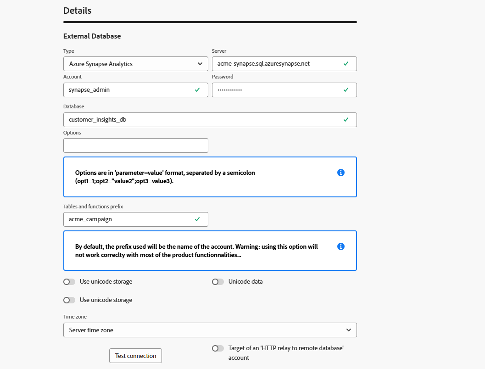

# 外部データベースアカウント {#external-accounts}

外部データベースタイプの外部アカウントを使用して、Adobe Campaign をサードパーティのデータベースに接続します。

外部アカウントの設定は、接続先のデータベースエンジンによって異なります。サポートされている各データベースの手順について詳しくは、以下の節を参照してください。

## Amazon Redshift

Amazon Redshift 外部アカウントを使用すれば、Campaign インスタンスを Amazon Redshift 外部データベースに接続できます。

Adobe Campaign web ユーザーインターフェイスで、Amazon Redshift 外部アカウントを設定します。

1. [外部アカウントを作成](external-account.md)し、外部アカウントの&#x200B;**[!UICONTROL タイプ]**&#x200B;として「**[!UICONTROL 外部データベース]**」を選択し、**[!UICONTROL プロバイダータイプ]**&#x200B;として「Amazon Redshift」を選択します。

1. 「**[!UICONTROL 作成]**」をクリックします。

1. **[!UICONTROL Amazon Redshift]** 外部アカウントを設定するには、次のフィールドに入力します。

   * **[!UICONTROL タイプ]**：Amazon Redshift

   * **[!UICONTROL サーバー]**：Redshift サーバーの DNS 名を入力します。

   * **[!UICONTROL アカウント]**：認証に使用する Redshift ユーザー名を指定します。

   * **[!UICONTROL パスワード]**：ユーザーアカウントに関連付けるパスワードを入力します。

   * **[!UICONTROL データベース]**：データベース名がまだ DSN で定義されていない場合は、データベース名を指定します。DSN にデータベースが含まれる場合は、このフィールドを空のままにします。

   * **[!UICONTROL 作業スキーマ]**：Adobe Campaign が動作するスキーマ名を入力します。

   * **[!UICONTROL オプション]**：環境に応じて必要になる場合がある詳細設定オプションを追加します。

   * **[!UICONTROL タイムゾーン]**：サーバーのタイムゾーンを選択または入力し、正確な時間ベースの操作が確実に行われるようにします。

   

1. 接続を設定したら、リモート Redshift データベースに Adobe Campaign SQL 関数を作成します。これらの関数が使用可能になったら、「**[!UICONTROL 関数をデプロイ]**」をクリックしてアクティブ化します。

1. **[!UICONTROL ストレージアカウント]**&#x200B;をリンクすると、パフォーマンスが最適化され、Adobe Campaign と Amazon Redshift 間のデータ読み込みプロセスが高速化されます。

1. Adobe Campaign が Redshift 環境とやり取りする際に使用する権限を決定する&#x200B;**[!UICONTROL アカウントの役割]**&#x200B;を入力します。

## Amazon Redshift（レガシー）

Amazon Redshift（レガシー）外部アカウントを使用すれば、Campaign インスタンスを Amazon Redshift 外部データベースに接続できます。

Adobe Campaign web ユーザーインターフェイスで、Amazon Redshift（レガシー）外部アカウントを設定します。

1. [外部アカウントを作成](external-account.md)し、外部アカウントの&#x200B;**[!UICONTROL タイプ]**&#x200B;として「**[!UICONTROL 外部データベース]**」を選択し、**[!UICONTROL プロバイダータイプ]**&#x200B;として「Amazon Redshift（レガシー）」を選択します。

1. 「**[!UICONTROL 作成]**」をクリックします。

1. **[!UICONTROL Amazon Redshift（レガシー）]**&#x200B;外部アカウントを設定するには、次のフィールドに入力します。

   * **[!UICONTROL タイプ]**：Amazon Redshift（レガシー）

   * **[!UICONTROL サーバー]**：Redshift サーバーの DNS 名を入力します。

   * **[!UICONTROL アカウント]**：認証に使用する Redshift ユーザー名を指定します。

   * **[!UICONTROL パスワード]**：ユーザーアカウントに関連付けるパスワードを入力します。

   * **[!UICONTROL データベース]**：データベース名がまだ DSN で定義されていない場合は、データベース名を指定します。DSN にデータベースが含まれる場合は、このフィールドを空のままにします。

   * **[!UICONTROL 作業スキーマ]**：Adobe Campaign が動作するスキーマ名を入力します。

   * **[!UICONTROL タイムゾーン]**：サーバーのタイムゾーンを選択または入力し、正確な時間ベースの操作が確実に行われるようにします。

   

1. 接続を設定したら、リモート Redshift データベースに Adobe Campaign SQL 関数を作成します。これらの関数が使用可能になったら、「**[!UICONTROL 関数をデプロイ]**」をクリックしてアクティブ化します。

## Azure Synapse Analytics

Azure Synapse Analytics 外部アカウントを使用すれば、Campaign インスタンスを Azure Synapse 外部データベースに接続できます。

Adobe Campaign web ユーザーインターフェイスで、Azure Synapse Analytics 外部アカウントを設定します。

1. [外部アカウントを作成](external-account.md)し、外部アカウントの&#x200B;**[!UICONTROL タイプ]**&#x200B;として「**[!UICONTROL 外部データベース]**」を選択し、**[!UICONTROL プロバイダータイプ]**&#x200B;として「Amazon Redshift」を選択します。

1. 「**[!UICONTROL 作成]**」をクリックします。

1. **[!UICONTROL Azure Synapse Analytics]** 外部アカウントを設定するには、次のフィールドに入力します。

   * **[!UICONTROL タイプ]**：Azure Synapse Analytics

   * **[!UICONTROL サーバー]**：Azure Synapse サーバーの URL を入力します。

   * **[!UICONTROL アカウント]**：Synapse データベースで認証するユーザー名を指定します。

   * **[!UICONTROL パスワード]**：アカウントに関連付けるパスワードを入力します。

   * **[!UICONTROL データベース]**：Adobe Campaign の接続先となるターゲットデータベースを指定します。

   * **[!UICONTROL テーブルと関数の接頭辞]**：デフォルトでは、アカウント名に設定されています。Campaign 関連のオブジェクトを特定することを目的に別の接頭辞を使用する場合は、調整できます。

   * **[!UICONTROL オプション]**：環境に応じて必要になる場合がある詳細設定オプションを追加します。

   * **[!UICONTROL タイムゾーン]**：サーバーのタイムゾーンを選択または入力し、正確な時間ベースの操作が確実に行われるようにします。

   

1. 「**[!UICONTROL テーブルに作業用テーブルスペースを使用]**」オプションを有効にして、作業用テーブルが保存される「**[!UICONTROL テーブルのテーブルスペース]**」を指定できます。

1. 必要に応じて、「**[!UICONTROL インデックスに作業用テーブルスペースを使用]**」オプションを有効にして、「**[!UICONTROL インデックステーブルスペース]**」を指定します。

   

1. 接続を設定したら、リモート Azure Synapse Analytics データベースに Adobe Campaign SQL 関数を作成します。これらの関数が使用可能になったら、「**[!UICONTROL 関数をデプロイ]**」をクリックしてアクティブ化します。

## Databricks

Databricks 外部アカウントを使用すれば、Campaign インスタンスを Databricks 外部データベースに接続できます。

Adobe Campaign web ユーザーインターフェイスで、Databricks 外部アカウントを設定します。

1. [外部アカウントを作成](external-account.md)し、外部アカウントの&#x200B;**[!UICONTROL タイプ]**&#x200B;として「**[!UICONTROL 外部データベース]**」を選択し、**[!UICONTROL プロバイダータイプ]**&#x200B;として「Databricks」を選択します。

1. 「**[!UICONTROL 作成]**」をクリックします。

1. **[!UICONTROL Databricks]** 外部アカウントを設定するには、次のフィールドに入力します。

   * **[!UICONTROL タイプ]**：Databricks

   * **[!UICONTROL サーバー]**：Databricks サーバーの DNS 名を入力します。

   * **[!UICONTROL アカウント]**：認証に使用する Databricks ユーザー名を指定します。

   * **[!UICONTROL パスワード]**：ユーザーアカウントに関連付けるパスワードを入力します。

   * **[!UICONTROL カタログ]**：使用するカタログを指定します。

   * **[!UICONTROL 作業スキーマ]**：Adobe Campaign が作業オブジェクトを作成および管理するスキーマの名前を入力します。

   * **[!UICONTROL オプション]**：環境に応じて必要になる場合がある詳細設定オプションを追加します。

   

1. 接続を設定したら、リモート Databricks データベースに Adobe Campaign SQL 関数を作成します。これらの関数が使用可能になったら、「**[!UICONTROL 関数をデプロイ]**」をクリックしてアクティブ化します。

1. **[!UICONTROL ストレージアカウント]**&#x200B;をリンクすると、パフォーマンスが最適化され、Adobe Campaign と Databricks 間のデータ読み込みプロセスが高速化されます。

## Google BigQuery

Google BigQuery 外部アカウントを使用すれば、Campaign インスタンスを Google BigQuery 外部データベースに接続できます。

Adobe Campaign web ユーザーインターフェイスで、Google BigQuery 外部アカウントを設定します。

1. [外部アカウントを作成](external-account.md)し、外部アカウントの&#x200B;**[!UICONTROL タイプ]**&#x200B;として「**[!UICONTROL 外部データベース]**」を選択し、**[!UICONTROL プロバイダータイプ]**&#x200B;として「Google BigQuery」を選択します。

1. 「**[!UICONTROL 作成]**」をクリックします。

1. **[!UICONTROL Google BigQuery]** 外部アカウントを設定するには、次のフィールドに入力します。

   * **[!UICONTROL タイプ]**：Google BigQuery

   * **[!UICONTROL アカウント]**：Adobe Campaign が BigQuery への接続に使用するユーザー名またはサービスアカウントを入力します。

   * **[!UICONTROL ログインファイルのアップロード方法]**：キーファイルのパスを手動で入力するか、キーファイルをサーバーに直接アップロードして、サービスアカウントキーを指定する方法を選択します。

   * **[!UICONTROL サーバー]**：手動入力オプションを選択した場合は、サーバーの URL を指定します。

   * **[!UICONTROL プロジェクト]**：BigQuery インスタンスに関連付けられている Google Cloud プロジェクト ID を指定します。

   * **[!UICONTROL データセット]**：Adobe Campaign がデータの保存およびクエリを実行するデータセットの名前を入力します。

   * **[!UICONTROL オプション]**：環境に応じて必要になる場合がある詳細設定オプションを追加します。

   

1. **[!UICONTROL パラメーター]**&#x200B;の下に、サービスアカウントキーの JSON ファイルのコンテンツをペーストして、Adobe Campaign を Google BigQuery で認証します。

1. 接続を設定したら、リモート Google BigQuery データベースに Adobe Campaign SQL 関数を作成します。これらの関数が使用可能になったら、「**[!UICONTROL 関数をデプロイ]**」をクリックしてアクティブ化します。

1. 環境で BigQuery サーバーへの接続にプロキシアクセスが必要な場合は、プロキシ設定を指定します。

   まず、プロキシタイプ（http、http_no_tunnel、socks4、socks5）を選択します。

1. 安全なアクセスを確立するのに、次のプロキシ設定フィールドに入力します。

   * **[!UICONTROL プロキシホスト]**：プロキシサーバーのアドレス。
   * **[!UICONTROL プロキシポート]**：プロキシサーバーが使用するポート。
   * **[!UICONTROL プロキシ UID]**：必要に応じて、プロキシサーバーで認証するユーザー ID。
   * **[!UICONTROL プロキシホスト]**：プロキシ UID に対応するパスワード（該当する場合）。

   

## Microsoft SQL Server

Microsoft SQL Server 外部アカウントを使用すれば、Campaign インスタンスを Microsoft SQL Server 外部データベースに接続できます。

Adobe Campaign web ユーザーインターフェイスで、Microsoft SQL Server 外部アカウントを設定します。

1. [外部アカウントを作成](external-account.md)し、外部アカウントの&#x200B;**[!UICONTROL タイプ]**&#x200B;として「**[!UICONTROL 外部データベース]**」を選択し、**[!UICONTROL プロバイダータイプ]**&#x200B;として「Microsoft SQL Server」を選択します。

1. 「**[!UICONTROL 作成]**」をクリックします。

1. **[!UICONTROL Microsoft SQL Server]** 外部アカウントを設定するには、次のフィールドに入力します。

   * **[!UICONTROL タイプ]**：Microsoft SQL Server

   * **[!UICONTROL サーバー]**：Microsoft SQL Server の DNS 名を入力します。

   * **[!UICONTROL アカウント]**：認証に使用する Microsoft SQL Server ユーザー名を指定します。

   * **[!UICONTROL パスワード]**：ユーザーアカウントに関連付けるパスワードを入力します。

   * **[!UICONTROL データベース]**：データベース名がまだ DSN で定義されていない場合は、データベース名を指定します。DSN にデータベースが含まれる場合は、このフィールドを空のままにします。

   * **[!UICONTROL オプション]**：環境に応じて必要になる場合がある詳細設定オプションを追加します。

   * **[!UICONTROL テーブルと関数の接頭辞]**：デフォルトでは、アカウント名に設定されています。Campaign 関連のオブジェクトを特定することを目的に別の接頭辞を使用する場合は、調整できます。

   * **[!UICONTROL タイムゾーン]**：サーバーのタイムゾーンを選択または入力し、正確な時間ベースの操作が確実に行われるようにします。

   

1. 「**[!UICONTROL テーブルに作業用テーブルスペースを使用]**」オプションを有効にして、作業用テーブルが保存される「**[!UICONTROL テーブルのテーブルスペース]**」を指定できます。

1. 必要に応じて、「**[!UICONTROL インデックスに作業用テーブルスペースを使用]**」オプションを有効にして、「**[!UICONTROL インデックステーブルスペース]**」を指定します。

1. 接続を設定したら、リモート Microsoft SQL Server データベースに Adobe Campaign SQL 関数を作成します。これらの関数が使用可能になったら、「**[!UICONTROL 関数をデプロイ]**」をクリックしてアクティブ化します。

## MySQL

MySQL 外部アカウントを使用すれば、Campaign インスタンスを MySQL 外部データベースに接続できます。Adobe Campaign web ユーザーインターフェイスで、MySQL 外部アカウントを設定します。

1. [外部アカウントを作成](external-account.md)し、外部アカウントの&#x200B;**[!UICONTROL タイプ]**&#x200B;として「**[!UICONTROL 外部データベース]**」を選択し、**[!UICONTROL プロバイダータイプ]**&#x200B;として「MySQL」を選択します。

1. 「**[!UICONTROL 作成]**」をクリックします。

1. **[!UICONTROL MySQL]** 外部アカウントを設定するには、次のフィールドに入力します。

   * **[!UICONTROL タイプ]**：MySQL

   * **[!UICONTROL サーバー]**：MySQL サーバーの DNS 名を入力します。

   * **[!UICONTROL アカウント]**：認証に使用する MySQL ユーザー名を指定します。

   * **[!UICONTROL パスワード]**：ユーザーアカウントに関連付けるパスワードを入力します。

   * **[!UICONTROL データベース]**：データベース名がまだ DSN で定義されていない場合は、データベース名を指定します。DSN にデータベースが含まれる場合は、このフィールドを空のままにします。

   * **[!UICONTROL タイムゾーン]**：サーバーのタイムゾーンを選択または入力し、正確な時間ベースの操作が確実に行われるようにします。

   

1. 「**[!UICONTROL テーブルに作業用テーブルスペースを使用]**」オプションを有効にして、作業用テーブルが保存される「**[!UICONTROL テーブルのテーブルスペース]**」を指定できます。

1. 必要に応じて、「**[!UICONTROL インデックスに作業用テーブルスペースを使用]**」オプションを有効にして、「**[!UICONTROL インデックステーブルスペース]**」を指定します。

1. 接続を設定したら、リモート MySQL データベースに Adobe Campaign SQL 関数を作成します。これらの関数が使用可能になったら、「**[!UICONTROL 関数をデプロイ]**」をクリックしてアクティブ化します。

## Netezza

Netezza 外部アカウントを使用すれば、Campaign インスタンスを Netezza 外部データベースに接続できます。

Adobe Campaign web ユーザーインターフェイスで、Netezza 外部アカウントを設定します。

1. [外部アカウントを作成](external-account.md)し、外部アカウントの&#x200B;**[!UICONTROL タイプ]**&#x200B;として「**[!UICONTROL 外部データベース]**」を選択し、**[!UICONTROL プロバイダータイプ]**&#x200B;として「Netezza」を選択します。

1. 「**[!UICONTROL 作成]**」をクリックします。

1. **[!UICONTROL Netezza]** 外部アカウントを設定するには、次のフィールドに入力します。

   * **[!UICONTROL タイプ]**：Netezza

   * **[!UICONTROL サーバー]**：Netezza サーバーの DNS 名を入力します。

   * **[!UICONTROL アカウント]**：認証に使用する Netezza ユーザー名を指定します。

   * **[!UICONTROL パスワード]**：ユーザーアカウントに関連付けるパスワードを入力します。

   * **[!UICONTROL データベース]**：データベース名がまだ DSN で定義されていない場合は、データベース名を指定します。DSN にデータベースが含まれる場合は、このフィールドを空のままにします。

   * **[!UICONTROL タイムゾーン]**：サーバーのタイムゾーンを選択または入力し、正確な時間ベースの操作が確実に行われるようにします。

   

1. 「**[!UICONTROL テーブルに作業用テーブルスペースを使用]**」オプションを有効にして、作業用テーブルが保存される「**[!UICONTROL テーブルのテーブルスペース]**」を指定できます。

1. 必要に応じて、「**[!UICONTROL インデックスに作業用テーブルスペースを使用]**」オプションを有効にして、「**[!UICONTROL インデックステーブルスペース]**」を指定します。

1. 接続を設定したら、リモート Netezza データベースに Adobe Campaign SQL 関数を作成します。これらの関数が使用可能になったら、「**[!UICONTROL 関数をデプロイ]**」をクリックしてアクティブ化します。

## ODBC（Sybase ASE、Sybase IQ）

ODBC（Sybase ASE、Sybase IQ）外部アカウントを使用すれば、Campaign インスタンスを ODBC（Sybase ASE、Sybase IQ）外部データベースに接続できます。
Adobe Campaign web ユーザーインターフェイスで、ODBC（Sybase ASE、Sybase IQ）外部アカウントを設定します。

1. [外部アカウントを作成](external-account.md)し、外部アカウントの&#x200B;**[!UICONTROL タイプ]**&#x200B;として「**[!UICONTROL 外部データベース]**」を選択し、**[!UICONTROL プロバイダータイプ]**&#x200B;として「ODBC（Sybase ASE、Sybase IQ）」を選択します。

1. 「**[!UICONTROL 作成]**」をクリックします。

1. **[!UICONTROL ODBC（Sybase ASE、Sybase IQ）]**&#x200B;外部アカウントを設定するには、次のフィールドに入力します。

   * **[!UICONTROL タイプ]**：ODBC（Sybase ASE、Sybase IQ）

   * **[!UICONTROL サーバー]**：ODBC（Sybase ASE、Sybase IQ）サーバーの DNS 名を入力します。

   * **[!UICONTROL アカウント]**：認証に使用する ODBC（Sybase ASE、Sybase IQ）ユーザー名を指定します。

   * **[!UICONTROL パスワード]**：ユーザーアカウントに関連付けるパスワードを入力します。

   * **[!UICONTROL データベース]**：データベース名がまだ DSN で定義されていない場合は、データベース名を指定します。DSN にデータベースが含まれる場合は、このフィールドを空のままにします。

   * **[!UICONTROL オプション]**：環境に応じて必要になる場合がある詳細設定オプションを追加します。

   * **[!UICONTROL 一括挿入ツール]**：一括挿入ツールの実行可能ファイルへの完全パスを指定します。

   * **[!UICONTROL タイムゾーン]**：サーバーのタイムゾーンを選択または入力し、正確な時間ベースの操作が確実に行われるようにします。

   

1. 「**[!UICONTROL テーブルに作業用テーブルスペースを使用]**」オプションを有効にして、作業用テーブルが保存される「**[!UICONTROL テーブルのテーブルスペース]**」を指定できます。

1. 必要に応じて、「**[!UICONTROL インデックスに作業用テーブルスペースを使用]**」オプションを有効にして、「**[!UICONTROL インデックステーブルスペース]**」を指定します。

1. 接続を設定したら、リモート ODBC データベースに Adobe Campaign SQL 関数を作成します。これらの関数が使用可能になったら、「**[!UICONTROL 関数をデプロイ]**」をクリックしてアクティブ化します。

## リモートデータベースへの HTTP リレー

「リモートデータベースへの HTTP リレー」外部アカウントを使用すれば、Campaign インスタンスをリモートデータベースへの HTTP リレー外部データベースに接続できます。

Adobe Campaign web ユーザーインターフェイスで、「リモートデータベースへの HTTP リレー」外部アカウントを設定します。

1. [外部アカウントを作成](external-account.md)し、外部アカウントの&#x200B;**[!UICONTROL タイプ]**&#x200B;として「**[!UICONTROL 外部データベース]**」を選択し、**[!UICONTROL プロバイダータイプ]**&#x200B;として「Amazon Redshift」を選択します。

1. 「**[!UICONTROL 作成]**」をクリックします。

1. **[!UICONTROL リモートデータベースへの HTTP リレー]**&#x200B;外部アカウントを設定するには、次のフィールドに入力します。

   * **[!UICONTROL タイプ]**：リモートデータベースへの HTTP リレー

   * **[!UICONTROL サーバー]**：リモートデータベースに接続する HTTP リレーサーバーの完全な URL を入力します。

   * **[!UICONTROL アカウント]**：HTTP リレーサーバーでの認証に使用するユーザー名を指定します。

   * **[!UICONTROL パスワード]**：このアカウントに関連付けるパスワードを入力します。

   * **[!UICONTROL データソース]**：Adobe Campaign がリレー経由で接続するターゲットデータベースを指定します。

   * **[!UICONTROL オプション]**：環境に応じて必要になる場合がある詳細設定オプションを追加します。

   

1. 「**[!UICONTROL テーブルに作業用テーブルスペースを使用]**」オプションを有効にして、作業用テーブルが保存される「**[!UICONTROL テーブルのテーブルスペース]**」を指定できます。

1. 必要に応じて、「**[!UICONTROL インデックスに作業用テーブルスペースを使用]**」オプションを有効にして、「**[!UICONTROL インデックステーブルスペース]**」を指定します。

1. 接続を設定したら、リモート「リモートデータベースへの HTTP リレー」データベースに Adobe Campaign SQL 関数を作成します。これらの関数が使用可能になったら、「**[!UICONTROL 関数をデプロイ]**」をクリックしてアクティブ化します。

## Oracle

Oracle 外部アカウントを使用すれば、Campaign インスタンスを Oracle 外部データベースに接続できます。
Adobe Campaign web ユーザーインターフェイスで、Oracle 外部アカウントを設定します。

1. [外部アカウントを作成](external-account.md)し、外部アカウントの&#x200B;**[!UICONTROL タイプ]**&#x200B;として「**[!UICONTROL 外部データベース]**」を選択し、**[!UICONTROL プロバイダータイプ]**&#x200B;として「Oracle」を選択します。

1. 「**[!UICONTROL 作成]**」をクリックします。

1. **[!UICONTROL Oracle]** 外部アカウントを設定するには、次のフィールドに入力します。

   * **[!UICONTROL タイプ]**：Oracle

   * **[!UICONTROL サーバー]**：Oracle サーバーの DNS 名を入力します。

   * **[!UICONTROL アカウント]**：認証に使用する Oracle ユーザー名を指定します。

   * **[!UICONTROL パスワード]**：ユーザーアカウントに関連付けるパスワードを入力します。

   * **[!UICONTROL タイムゾーン]**：サーバーのタイムゾーンを選択または入力し、正確な時間ベースの操作が確実に行われるようにします。

   

1. 「**[!UICONTROL テーブルに作業用テーブルスペースを使用]**」オプションを有効にして、作業用テーブルが保存される「**[!UICONTROL テーブルのテーブルスペース]**」を指定できます。

1. 必要に応じて、「**[!UICONTROL インデックスに作業用テーブルスペースを使用]**」オプションを有効にして、「**[!UICONTROL インデックステーブルスペース]**」を指定します。

1. 接続を設定したら、リモート Oracle データベースに Adobe Campaign SQL 関数を作成します。これらの関数が使用可能になったら、「**[!UICONTROL 関数をデプロイ]**」をクリックしてアクティブ化します。

## PostgreSQL

PostgreSQL 外部アカウントを使用すれば、Campaign インスタンスを PostgreSQL 外部データベースに接続できます。
Adobe Campaign web ユーザーインターフェイスで、PostgreSQL 外部アカウントを設定します。

1. [外部アカウントを作成](external-account.md)し、外部アカウントの&#x200B;**[!UICONTROL タイプ]**&#x200B;として「**[!UICONTROL 外部データベース]**」を選択し、**[!UICONTROL プロバイダータイプ]**&#x200B;として「PostgreSQL」を選択します。

1. 「**[!UICONTROL 作成]**」をクリックします。

1. **[!UICONTROL PostgreSQL]** 外部アカウントを設定するには、次のフィールドに入力します。

   * **[!UICONTROL タイプ]**：PostgreSQL

   * **[!UICONTROL サーバー]**：PostgreSQL サーバーの DNS 名を入力します。

   * **[!UICONTROL アカウント]**：認証に使用する PostgreSQL ユーザー名を指定します。

   * **[!UICONTROL パスワード]**：ユーザーアカウントに関連付けるパスワードを入力します。

   * **[!UICONTROL データベース]**：データベース名がまだ DSN で定義されていない場合は、データベース名を指定します。DSN にデータベースが含まれる場合は、このフィールドを空のままにします。

   * **[!UICONTROL 作業スキーマ]**：Adobe Campaign が作業オブジェクトを作成および管理するスキーマの名前を入力します。

   * **[!UICONTROL タイムゾーン]**：サーバーのタイムゾーンを選択または入力し、正確な時間ベースの操作が確実に行われるようにします。

   

1. 「**[!UICONTROL テーブルに作業用テーブルスペースを使用]**」オプションを有効にして、作業用テーブルが保存される「**[!UICONTROL テーブルのテーブルスペース]**」を指定できます。

1. 必要に応じて、「**[!UICONTROL インデックスに作業用テーブルスペースを使用]**」オプションを有効にして、「**[!UICONTROL インデックステーブルスペース]**」を指定します。

1. 接続を設定したら、リモート PostgreSQL データベースに Adobe Campaign SQL 関数を作成します。これらの関数が使用可能になったら、「**[!UICONTROL 関数をデプロイ]**」をクリックしてアクティブ化します。

## SAP HANA

SAP HANA 外部アカウントを使用すれば、Campaign インスタンスを SAP HANA 外部データベースに接続できます。

Adobe Campaign web ユーザーインターフェイスで、SAP HANA 外部アカウントを設定します。

1. [外部アカウントを作成](external-account.md)し、外部アカウントの&#x200B;**[!UICONTROL タイプ]**&#x200B;として「**[!UICONTROL 外部データベース]**」を選択し、**[!UICONTROL プロバイダータイプ]**&#x200B;として「SAP HANA」を選択します。

1. 「**[!UICONTROL 作成]**」をクリックします。

1. **[!UICONTROL SAP HANA]** 外部アカウントを設定するには、次のフィールドに入力します。

   * **[!UICONTROL タイプ]**：SAP HANA

   * **[!UICONTROL サーバー]**：SAP HANA サーバーの DNS 名を入力します。

   * **[!UICONTROL アカウント]**：認証に使用する SAP HANA ユーザー名を指定します。

   * **[!UICONTROL パスワード]**：ユーザーアカウントに関連付けるパスワードを入力します。

   * **[!UICONTROL オプション]**：環境に応じて必要になる場合がある詳細設定オプションを追加します。

   * **[!UICONTROL 作業スキーマ]**：Adobe Campaign が作業オブジェクトを作成および管理するスキーマの名前を入力します。

   * **[!UICONTROL タイムゾーン]**：サーバーのタイムゾーンを選択または入力し、正確な時間ベースの操作が確実に行われるようにします。

   

1. 「**[!UICONTROL テーブルに作業用テーブルスペースを使用]**」オプションを有効にして、作業用テーブルが保存される「**[!UICONTROL テーブルのテーブルスペース]**」を指定できます。

1. 必要に応じて、「**[!UICONTROL インデックスに作業用テーブルスペースを使用]**」オプションを有効にして、「**[!UICONTROL インデックステーブルスペース]**」を指定します。

1. 接続を設定したら、リモート SAP HANA データベースに Adobe Campaign SQL 関数を作成します。これらの関数が使用可能になったら、「**[!UICONTROL 関数をデプロイ]**」をクリックしてアクティブ化します。

## Snowflake

Snowflake 外部アカウントを使用すれば、Campaign インスタンスを Snowflake 外部データベースに接続できます。

Adobe Campaign web ユーザーインターフェイスで、Snowflake 外部アカウントを設定します。

1. [外部アカウントを作成](external-account.md)し、外部アカウントの&#x200B;**[!UICONTROL タイプ]**&#x200B;として「**[!UICONTROL 外部データベース]**」を選択し、**[!UICONTROL プロバイダータイプ]**&#x200B;として「Snowflake」を選択します。

1. 「**[!UICONTROL 作成]**」をクリックします。

1. **[!UICONTROL Snowflake]** 外部アカウントを設定するには、次のフィールドに入力します。

   * **[!UICONTROL タイプ]**：Snowflake

   * **[!UICONTROL サーバー]**：Snowflake サーバーの DNS 名を入力します。

   * **[!UICONTROL アカウント]**：認証に使用する Snowflake ユーザー名を指定します。

   * **[!UICONTROL パスワード]**：ユーザーアカウントに関連付けるパスワードを入力します。

   * **[!UICONTROL データベース]**：データベース名がまだ DSN で定義されていない場合は、データベース名を指定します。DSN にデータベースが含まれる場合は、このフィールドを空のままにします。

   * **[!UICONTROL 作業スキーマ]**：Adobe Campaign が作業オブジェクトを作成および管理するスキーマの名前を入力します。

   * **[!UICONTROL オプション]**：環境に応じて必要になる場合がある詳細設定オプションを追加します。

   * **[!UICONTROL タイムゾーン]**：サーバーのタイムゾーンを選択または入力し、正確な時間ベースの操作が確実に行われるようにします。

   

1. 接続を設定したら、リモート Snowflake データベースに Adobe Campaign SQL 関数を作成します。これらの関数が使用可能になったら、「**[!UICONTROL 関数をデプロイ]**」をクリックしてアクティブ化します。

1. キーペア認証を使用している場合は、**[!UICONTROL keypair.auth]** メニューから、次の必要な値を入力します。

   * **[!UICONTROL パスワード]**：該当する場合、秘密鍵を保護するパスフレーズ。

   * **[!UICONTROL 秘密鍵]**：Snowflake アカウントの認証に使用する秘密鍵。

## Teradata

Teradata 外部アカウントを使用すれば、Campaign インスタンスを Teradata 外部データベースに接続できます。

Adobe Campaign web ユーザーインターフェイスで、Teradata 外部アカウントを設定します。

1. [外部アカウントを作成](external-account.md)し、外部アカウントの&#x200B;**[!UICONTROL タイプ]**&#x200B;として「**[!UICONTROL 外部データベース]**」を選択し、**[!UICONTROL プロバイダータイプ]**&#x200B;として「Teradata」を選択します。

1. 「**[!UICONTROL 作成]**」をクリックします。

1. **[!UICONTROL Teradata]** 外部アカウントを設定するには、次のフィールドに入力します。

   * **[!UICONTROL タイプ]**：Teradata

   * **[!UICONTROL サーバー]**：Teradata サーバーの DNS 名を入力します。

   * **[!UICONTROL アカウント]**：認証に使用する Teradata ユーザー名を指定します。

   * **[!UICONTROL パスワード]**：ユーザーアカウントに関連付けるパスワードを入力します。

   * **[!UICONTROL データベース]**：データベース名がまだ DSN で定義されていない場合は、データベース名を指定します。DSN にデータベースが含まれる場合は、このフィールドを空のままにします。

   * **[!UICONTROL オプション]**：環境に応じて必要になる場合がある詳細設定オプションを追加します。

   * **[!UICONTROL タイムゾーン]**：サーバーのタイムゾーンを選択または入力し、正確な時間ベースの操作が確実に行われるようにします。

   

1. 「**[!UICONTROL テーブルに作業用テーブルスペースを使用]**」オプションを有効にして、作業用テーブルが保存される「**[!UICONTROL テーブルのテーブルスペース]**」を指定できます。

1. 必要に応じて、「**[!UICONTROL インデックスに作業用テーブルスペースを使用]**」オプションを有効にして、「**[!UICONTROL インデックステーブルスペース]**」を指定します。

1. 接続を設定したら、リモート Teradata データベースに Adobe Campaign SQL 関数を作成します。これらの関数が使用可能になったら、「**[!UICONTROL 関数をデプロイ]**」をクリックしてアクティブ化します。

1. 必要に応じて、各接続を確立した後にスクリプトを自動的に実行する場合は、**[!UICONTROL PostConnect スクリプト]**&#x200B;を入力します。スクリプトを毎回実行する場合は、「**[!UICONTROL 毎回実行]**」オプションを有効にします。

## Vertica Analytics

Adobe Campaign web ユーザーインターフェイスで、Vertica Analytics 外部アカウントを設定します。

1. [外部アカウントを作成](external-account.md)し、外部アカウントの&#x200B;**[!UICONTROL タイプ]**&#x200B;として「**[!UICONTROL 外部データベース]**」を選択し、**[!UICONTROL プロバイダータイプ]**&#x200B;として「Vertica Analytics」を選択します。

1. 「**[!UICONTROL 作成]**」をクリックします。

1. **[!UICONTROL Vertica Analytics]** 外部アカウントを設定するには、次のフィールドに入力します。

   * **[!UICONTROL タイプ]**：Vertica Analytics

   * **[!UICONTROL サーバー]**：Vertica Analytics サーバーの DNS 名を入力します。

   * **[!UICONTROL アカウント]**：認証に使用する Vertica Analytics ユーザー名を指定します。

   * **[!UICONTROL パスワード]**：ユーザーアカウントに関連付けるパスワードを入力します。

   * **[!UICONTROL データベース]**：データベース名がまだ DSN で定義されていない場合は、データベース名を指定します。DSN にデータベースが含まれる場合は、このフィールドを空のままにします。

   * **[!UICONTROL 作業スキーマ]**：Adobe Campaign が作業オブジェクトを作成および管理するスキーマの名前を入力します。

   * **[!UICONTROL オプション]**：環境に応じて必要になる場合がある詳細設定オプションを追加します。

   * **[!UICONTROL タイムゾーン]**：サーバーのタイムゾーンを選択または入力し、正確な時間ベースの操作が確実に行われるようにします。

   

1. 接続を設定したら、リモート Vertica Analytics データベースに Adobe Campaign SQL 関数を作成します。これらの関数が使用可能になったら、「**[!UICONTROL 関数をデプロイ]**」をクリックしてアクティブ化します。

## Microsoft Fabric {#fabric}

Microsoft Fabric外部アカウントを使用すれば、Campaign インスタンスを Microsoft Fabric 外部データベースに接続できます。

Adobe Campaign web ユーザーインターフェイスで、Microsoft Fabric 外部アカウントを設定します。

1. [外部アカウントを作成](external-account.md)し、外部アカウントの&#x200B;**[!UICONTROL タイプ]**&#x200B;として「**[!UICONTROL 外部データベース]**」を選択し、**[!UICONTROL プロバイダータイプ]**&#x200B;として「Microsoft Fabric」を選択します。

1. 「**[!UICONTROL 作成]**」をクリックします。

1. **[!UICONTROL Microsoft Fabric]** 外部アカウントを設定するには、次のフィールドに入力します。

   * **[!UICONTROL タイプ]**：Microsoft Fabric

   * **[!UICONTROL サーバー]**：Microsoft Fabric サーバーの DNS 名を入力します。

   * **[!UICONTROL アカウント]**：認証に使用する Microsoft Fabric ユーザー名（またはサービスプリンシパル）を指定します。

   * **[!UICONTROL パスワード]**：アカウントに関連付けるパスワードまたは秘密鍵を入力します。

   * **[!UICONTROL オプション]**：環境に応じて必要になる場合がある詳細設定オプションを追加します。

   

1. 接続を設定したら、リモート Redshift データベースに Adobe Campaign SQL 関数を作成します。これらの関数が使用可能になったら、「**[!UICONTROL 関数をデプロイ]**」をクリックしてアクティブ化します。

1. **[!UICONTROL ストレージアカウント]**&#x200B;をリンクすると、パフォーマンスが最適化され、Adobe Campaign と Microsoft Fabric 間のデータ読み込みプロセスが高速化されます。

1. Adobe Campaign が Redshift 環境とやり取りする際に使用する権限を決定する&#x200B;**[!UICONTROL アカウントの役割]**&#x200B;を入力します。
