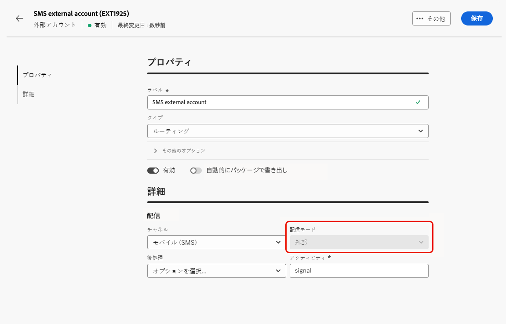

# 外部アカウントの管理 {#external-accounts}

>[!AVAILABILITY]
>
>* 外部アカウントは現在、バウンスメール（POP3）、ルーティング、実行インスタンスでのみ使用できます。 その他のアカウントタイプは、後で追加されます。
>
>* Adobe Campaign コンソールで作成された、サポートされていない外部アカウントは、web ユーザーインターフェイスに表示されますが、編集やアクセスはできません。

Adobe Campaignには、様々なシステムと容易に統合できるように事前設定済みの外部アカウントが含まれています。 追加のプラットフォームに接続したり、ワークフローに合わせて接続をカスタマイズしたりするには、web ユーザーインターフェイスを使用して新しい外部アカウントを作成します。 これにより、シームレスなデータ転送が可能になります。

## 外部アカウントの作成 {#create-ext-account}

新しい外部アカウントを作成するには、次の手順に従います。詳細な設定は、外部アカウントのタイプによって異なります。[詳細情報](#campaign-specific)

1. 左側のパネルメニューから、**[!UICONTROL 管理]**&#x200B;の下にある「**[!UICONTROL 外部アカウント]**」を選択します。

1. 「**[!UICONTROL 外部アカウントを作成]**」をクリックします。

   

1. **[!UICONTROL ラベル]**&#x200B;を入力し、外部アカウントの&#x200B;**[!UICONTROL タイプ]**&#x200B;を選択します。

   >[!NOTE]
   >
   >Campaign 固有のタイプの設定について詳しくは、[この節](#campaign-specific)を参照してください。

   

1. 「**[!UICONTROL 作成]**」をクリックします。

1. **[!UICONTROL その他のオプション]** ドロップダウンから、必要に応じて **[!UICONTROL 内部名]** または **[!UICONTROL フォルダー]** パスを変更します。

   

1. この外部アカウントで管理されているデータを自動的にエクスポートするには、「**[!UICONTROL パッケージで自動的にエクスポートされる]** オプションを有効にします。<!--Exported where??-->

   

1. 「**[!UICONTROL 詳細]**」セクションで、選択した外部アカウントタイプに基づいて資格情報を指定し、アカウントへのアクセスを設定します。 [詳細情報](#bounce)

1. **[!UICONTROL 接続をテスト]** をクリックして、設定が正しいことを確認します。

1. **[!UICONTROL 詳細…]**&#x200B;メニューから、外部アカウントを複製または削除します。

   

1. 設定が完了したら、「**[!UICONTROL 保存]**」をクリックします。

## Campaign 固有の外部アカウント {#campaign-specific}

選択した外部アカウントタイプに応じて、次の手順に従ってアカウント設定を指定します。

### バウンスメール（POP3） {#bounce}

>[!AVAILABILITY]
>
> OAuth 2.0 は現在サポートされていません。

バウンスメール外部アカウントで、メールサービスの接続に使用する外部 POP3 アカウントを指定します。POP3 アクセス用に設定されたすべてのサーバーは、返信メールを受信できます。

**[!UICONTROL バウンスメール（POP3）]**&#x200B;外部アカウントを設定するには、次のフィールドに入力します。

* **[!UICONTROL サーバー]** - POP3 サーバーの URL。

* **[!UICONTROL ポート]** - POP3 接続のポート番号（デフォルトポートは 110）。

* **[!UICONTROL アカウント]** - ユーザーの名前。

* **[!UICONTROL パスワード]**：ユーザーアカウントのパスワード。

* **[!UICONTROL 暗号化]** – 選択した暗号化のタイプ。次のものが含まれます。
   * デフォルト （ポート 110 の場合は POP3、ポート 995 の場合は POP3S）。
   * STARTTLS の送信後に SSL に切り替える POP3。
   * 非セキュアな POP3 （デフォルトポート 110）。
   * SSL による POP3 セキュア （デフォルトポート 995）。

* **[!UICONTROL 関数]** - **[!UICONTROL インバウンドメール]** を選択して受信メール用のアカウントを設定するか、**[!UICONTROL SOAP ルーター]** を選択してSOAP リクエストを処理します。

### ルーティング {#routing}

外部配信用の特定の外部アカウントを設定するには、次の手順に従います。

1. 外部アカウントを作成します。[詳細情報](../administration/external-account.md#create-ext-account)

1. **[!UICONTROL ルーティング]**&#x200B;タイプを選択します。

   {zoomable="yes"}

1. 目的のチャネルを選択し、「**[!UICONTROL 作成]**」をクリックします。

1. 外部アカウントの「**[!UICONTROL 詳細]**」セクションでは、**[!UICONTROL 配信モード]**&#x200B;として「**[!UICONTROL 外部]**」がデフォルトで選択されています。

   {zoomable="yes"}

   >[!NOTE]
   >
   >現在、**[!UICONTROL 外部]** は使用可能な唯一のモードです。

1. 配信の実行後のプロセスを処理するには、これを後処理ワークフローに外部化します。 [ 外部シグナル ](../workflows/activities/external-signal.md) アクティビティを持つワークフローを作成し、「**[!UICONTROL 後処理]**」フィールドから選択します。

   {zoomable="yes"}

1. 「**[!UICONTROL アクティビティ]**」フィールドで、ログに表示された後処理ワークフローアクティビティの名前を編集します。<!--you can edit the name of the activity that will be created if you add an external or bulk delivery to a workflow-->

### 実行インスタンス {#instance-exec}

セグメント化されたアーキテクチャがある場合は、コントロールインスタンスに関連付けられている実行インスタンスを特定し、それらの間の接続を確立します。 トランザクションメッセージテンプレートは、実行インスタンスにデプロイされます。

**[!UICONTROL 実行インスタンス]**&#x200B;の外部アカウントを設定するには：

* **[!UICONTROL URL]** – 実行インスタンスがインストールされているサーバーの URL。

* **[!UICONTROL Account]** - オペレーターフォルダーで定義された Message Center エージェントに一致するアカウント名。

* **[!UICONTROL パスワード]** - オペレーターフォルダーで定義されたアカウントのパスワード。

* **[!UICONTROL メソッド]** - Web サービスまたは Federated Data Access （FDA）を選択します。

  FDA の場合、FDA アカウントを選択します。 外部システムへの Campaign の接続は上級ユーザーに制限され、クライアントコンソールからのみ使用できます。[詳細情報](https://experienceleague.adobe.com/ja/docs/campaign/campaign-v8/connect/fda#_blank)

* **[!UICONTROL アーカイブワークフローの作成]** - 1 つ以上のインスタンスがあるかどうかに関係なく、Message Center に登録された実行インスタンスごとに、実行インスタンスに関連付けられた外部アカウントごとに個別のアーカイブワークフローを作成します。