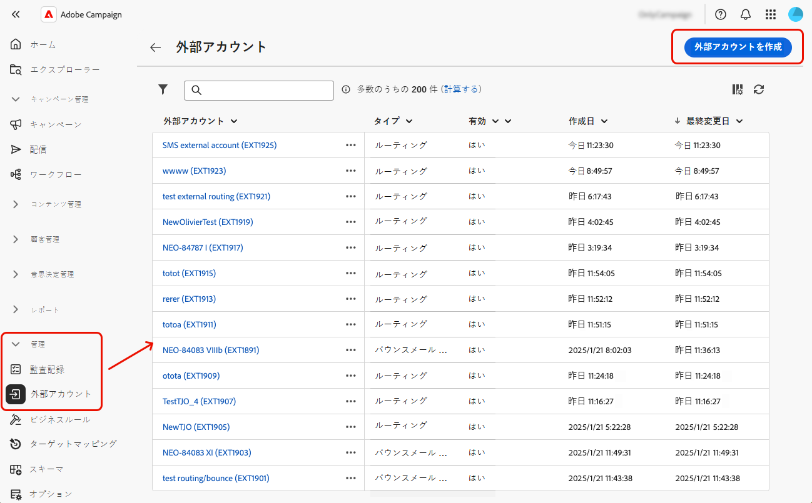

# 外部アカウントの管理 {#external-accounts}

>[!CONTEXTUALHELP]
>id="acw_homepage_welcome_rn3"
>title="外部アカウントのオーサリング"
>abstract="Campaign 管理者は、Campaign web ユーザーインターフェイスから外部システムとの新しい接続を設定できるようになりました。また、既存の外部アカウントを表示、更新、管理することもできます。"
>additional-url="https://experienceleague.adobe.com/docs/campaign-web/v8/release-notes/release-notes.html?lang=ja" text="リリースノートを参照してください"

Adobe Campaign には、様々なシステムと簡単に統合できる事前定義済みの外部アカウントが含まれます。追加のプラットフォームに接続したり、ワークフローに合わせて接続をカスタマイズしたりするには、web ユーザーインターフェイスを使用して新しい外部アカウントを容易に作成します。これにより、シームレスなデータ転送を確実に行えるようになります。

## 外部アカウントの作成 {#create-ext-account}

新しい外部アカウントを作成するには、次の手順に従います。詳細な設定は、外部アカウントのタイプによって異なります。[詳細情報](#campaign-specific)

1. 左側のパネルメニューから、**[!UICONTROL 管理]**&#x200B;の下にある「**[!UICONTROL 外部アカウント]**」を選択します。

1. 「**[!UICONTROL 外部アカウントを作成]**」をクリックします。

   

1. **[!UICONTROL ラベル]**&#x200B;を入力し、外部アカウントの&#x200B;**[!UICONTROL タイプ]**&#x200B;を選択します。

   >[!NOTE]
   >
   >Campaign 固有のタイプの設定について詳しくは、[この節](#campaign-specific)を参照してください。

   

1. 「**[!UICONTROL 作成]**」をクリックします。

1. **[!UICONTROL その他のオプション]**&#x200B;ドロップダウンから、必要に応じて、**[!UICONTROL 内部名]**&#x200B;または&#x200B;**[!UICONTROL フォルダー]**&#x200B;のパスを変更します。

   

1. この外部アカウントによって管理されているデータを自動的にエクスポートするには、「**[!UICONTROL パッケージで自動的にエクスポート]**」オプションを有効にします。<!--Exported where??-->

   

1. 「**[!UICONTROL 詳細]**」セクションで、選択した外部アカウントタイプに基づいて資格情報を指定し、アカウントへのアクセスを設定します。[詳細情報](#bounce)

1. 「**[!UICONTROL テスト接続]**」をクリックして、設定が正しいことを確認します。

1. **[!UICONTROL 詳細…]**&#x200B;メニューから、外部アカウントを複製または削除します。

   

1. 設定が完了したら、「**[!UICONTROL 保存]**」をクリックします。

## Campaign 固有の外部アカウント {#campaign-specific}

選択した外部アカウントタイプに応じて、次の手順に従ってアカウント設定を指定します。

### バウンスメール（POP3） {#bounce}

バウンスメール外部アカウントで、メールサービスの接続に使用する外部 POP3 アカウントを指定します。POP3 アクセス用に設定されたすべてのサーバーは、返信メールを受信できます。

**[!UICONTROL バウンスメール（POP3）]**&#x200B;外部アカウントを設定するには、次のフィールドに入力します。

* **[!UICONTROL サーバー]** - POP3 サーバーの URL。

* **[!UICONTROL ポート]** - POP3 接続ポート番号（デフォルトポートは 110）。

* **[!UICONTROL アカウント]** - ユーザーの名前。

* **[!UICONTROL パスワード]**：ユーザーアカウントのパスワード。

* **[!UICONTROL 暗号化]** - 次を含む選択した暗号化のタイプ：
   * デフォルト（ポート 110 の場合は POP3、ポート 995 の場合は POP3S）。
   * STARTTLS の送信後に SSL に切り替える POP3。
   * 非セキュアな POP3（デフォルトポート 110）。
   * SSL による POP3 セキュア（デフォルトポート 995）。

* **[!UICONTROL 関数]** - 受信メールを受信するアカウントを設定するには「**[!UICONTROL インバウンドメール]**」を選択し、SOAP リクエストを処理するには「**[!UICONTROL SOAP ルーター]**」を選択します。

>[!IMPORTANT]
>
>Microsoft OAuth 2.0 を使用して POP3 外部アカウントを設定する前に、まず Azure portal にアプリケーションを登録する必要があります。詳しくは、[このページ](https://learn.microsoft.com/en-us/entra/identity-platform/quickstart-register-app){target=_blank}を参照してください。

Microsoft OAuth 2.0 を使用して POP3 外部を設定するには、「Microsoft OAuth 2.0」オプションをチェックし、次のフィールドに入力します。

* **[!UICONTROL Azure テナント]**

  Azure ID （またはディレクトリ（テナント） ID）は、Azure portal のアプリケーションの概要の「初期設定」ドロップダウンで確認できます。

* **[!UICONTROL Azure クライアント ID]**

  クライアント ID （またはアプリケーション（クライアント） ID）は、Azure portal のアプリケーションの概要の「初期設定」ドロップダウンで確認できます。

* **[!UICONTROL Azure クライアントシークレット]**

  クライアントシークレット ID は、Azure portal のアプリケーションの証明書と秘密鍵メニューから、「クライアントシークレット」列で確認することができます。

* **[!UICONTROL Azure リダイレクト URL]**

  リダイレクト URL は Azure portal のアプリケーションの認証メニューで確認することができます。 次の構文でnl/jsp/oauth.jsp終わる必要があります。例：`https://redirect.adobe.net/nl/jsp/oauth.jsp`。

セットアップを行い、クライアントコンソールの「接続をテスト」ボタンを使用するには、インターネットアクセスが必要です。 セットアップ後、inMail プロセスはインターネットを使用せずにMicrosoft サーバーと通信できます。

別の資格情報を入力した後、接続の設定をクリックして、外部アカウントの設定を完了できます。

### ルーティング {#routing}

外部配信用の特定の外部アカウントを設定するには、次の手順に従います。

1. 外部アカウントを作成します。[詳細情報](../administration/external-account.md#create-ext-account)

1. **[!UICONTROL ルーティング]**&#x200B;タイプを選択します。

   {zoomable="yes"}

1. 目的のチャネルを選択し、「**[!UICONTROL 作成]**」をクリックします。

1. 外部アカウントの「**[!UICONTROL 詳細]**」セクションでは、**[!UICONTROL 配信モード]**&#x200B;として「**[!UICONTROL 外部]**」がデフォルトで選択されています。

   {zoomable="yes"}

   >[!NOTE]
   >
   >現在、使用可能なモードは&#x200B;**[!UICONTROL 外部]**&#x200B;のみです。

1. 配信実行後のプロセスを処理するには、後処理ワークフローに外部化します。[外部シグナル](../workflows/activities/external-signal.md)アクティビティを含むワークフローを作成し、「**[!UICONTROL 後処理]**」フィールドから選択します。

   {zoomable="yes"}

1. 「**[!UICONTROL アクティビティ]**」フィールドでは、ログに表示される後処理ワークフローアクティビティの名前を編集します。<!--you can edit the name of the activity that will be created if you add an external or bulk delivery to a workflow-->

### 実行インスタンス {#instance-exec}

セグメント化されたアーキテクチャを使用している場合は、コントロールインスタンスに関連付けられた実行インスタンスを識別し、それらの間の接続を確立します。トランザクションメッセージテンプレートは、実行インスタンスにデプロイされます。

**[!UICONTROL 実行インスタンス]**&#x200B;の外部アカウントを設定するには：

* **[!UICONTROL URL]** - 実行インスタンスがインストールされているサーバーの URL。

* **[!UICONTROL アカウント]** - オペレータフォルダーで定義されている Message Center エージェントに一致するアカウント名。

* **[!UICONTROL パスワード]** - 「オペレーター」フォルダーで定義されたアカウントのパスワード。

* **[!UICONTROL メソッド]** - web サービスまたは Federated Data Access（FDA）から選択します。

  FDA の場合は、FDA アカウントを選択します。外部システムへの Campaign の接続は上級ユーザーに制限され、クライアントコンソールからのみ使用できます。[詳細情報](https://experienceleague.adobe.com/ja/docs/campaign/campaign-v8/connect/fda#_blank)

* **[!UICONTROL アーカイブワークフローの作成]** -1 つ以上のインスタンスがあるかどうかに関係なく、Message Center に登録された実行インスタンスごとに、実行インスタンスに関連付けられた外部アカウントにつき個別のアーカイブワークフローを作成します。

## Adobe ソリューション統合外部アカウント

### Adobe Experience Cloud

Adobe IDを使用してAdobe Campaign コンソールに接続するには、Adobe Experience Cloud（MAC）外部アカウントを設定する必要があります。

* **[!UICONTROL IMS サーバー]**

  IMS サーバーの URL。また、ステージングと本番用のインスタンスがいずれも、同じ IMS 本番エンドポイントを指していることを確認します。

* **[!UICONTROL IMS スコープ]**

  スコープは、IMS によりプロビジョニングされているスコープのサブセットでなければなりません。

* **[!UICONTROL IMS クライアント識別子]**

  IMS クライアントの ID。

* **[!UICONTROL IMS クライアント秘密鍵]**

  IMS クライアント秘密鍵の認証情報。

* **[!UICONTROL コールバックサーバー]**

  Adobe Campaign インスタンスの URL にアクセスします。

* **[!UICONTROL IMS 組織 ID]**

  組織の ID。 組織 ID を見つけるには、[ このページ ](https://experienceleague.adobe.com/docs/core-services/interface/administration/organizations.html?lang=ja){target=_blank} を参照してください。

* **[!UICONTROL 関連付けマスク]**

  このフィールドでは、Enterprise Dashboard の設定名を Adobe Campaign のグループと同期させる構文を定義することができます。

* **[!UICONTROL サーバー]**

  Adobe Experience Cloud インスタンスの URL。

* **[!UICONTROL テナント]**

  Adobe Experience Cloud テナントの名前。

## データ転送外部アカウント

### Amazon Simple Storage Service （S3） {#amazon-simple-storage-service--s3--external-account}

Amazon Simple Storage Service（S3）コネクタを使用して Adobe Campaign との間でデータのインポートまたはエクスポートをおこなうことができます。コネクタのセットアップはワークフローアクティビティでおこなえます。詳しくは、[このページ](https://experienceleague.adobe.com/en/docs/campaign-web/v8/wf/design-workflows/transfer-file){target=_blank}を参照してください。

この新規外部アカウントを設定する際には、次の情報を提供する必要があります。

* **[!UICONTROL AWS S3 アカウントサーバー]**

  サーバーの URL。次のように入力する必要があります。

  `  <S3bucket name>.s3.amazonaws.com/<s3object path>`

* **[!UICONTROL AWS アクセスキー ID]**

  AWS アクセスキー ID の見つけ方については、この[ページ](https://docs.aws.amazon.com/ja_jp/general/latest/gr/aws-sec-cred-types.html#access-keys-and-secret-access-keys)を参照してください。

* **[!UICONTROL AWS への秘密アクセスキー]**

  AWS への秘密アクセスキーの見つけ方については、この[ページ](https://aws.amazon.com/jp/blogs/security/wheres-my-secret-access-key/)を参照してください。

* **[!UICONTROL AWS リージョン]**

  AWS リージョンについて詳しくは、この[ページ](https://aws.amazon.com/about-aws/global-infrastructure/regions_az/)を参照してください。

* **[!UICONTROL サーバー側の暗号化を使用]**&#x200B;チェックボックスをオンにすると、ファイルを S3 暗号モードで保存できます。

アクセスキー ID および秘密アクセスキーの見つけ方については、Amazon Web サービス[ドキュメント](https://docs.aws.amazon.com/ja_jp/general/latest/gr/aws-sec-cred-types.html#access-keys-and-secret-access-keys)を参照してください。

### Azure Blob ストレージ {#azure-blob-external-account}

**[!UICONTROL Azure Blob Storage]** 外部アカウントを使用すると、**[!UICONTROL ファイル転送]** ワークフローアクティビティでAdobe Campaignとの間でデータをインポートまたはエクスポートできます。 詳しくは、[この節](https://experienceleague.adobe.com/en/docs/campaign-web/v8/wf/design-workflows/transfer-file){target=_blank}を参照してください。

**[!UICONTROL Azure 外部アカウント]** をAdobe Campaignで使用できるように設定するには、次の情報が必要です。

* **[!UICONTROL サーバー]**

  Azure Blob ストレージサーバーの URL。

* **[!UICONTROL 暗号化]**

  選択した暗号化のタイプ（**[!UICONTROL なし]**&#x200B;または **[!UICONTROL SSL]**）。

* **[!UICONTROL アクセスキー]**

  **[!UICONTROL アクセスキー]** の場所については、この [ ページ ](https://docs.microsoft.com/ja-JP/azure/storage/common/storage-account-keys-manage?tabs=azure-portal) を参照してください。

## Hadoop

Hadoop外部アカウントを使用すると、Campaign インスタンスをHadoop外部データベースに接続できます。 Hadoopについて詳しくは、[Campaign V7 コンソールのドキュメント ](https://experienceleague.adobe.com/en/docs/campaign-classic/using/installing-campaign-classic/accessing-external-database/configure-fda/config-databases/configure-fda-hadoop){target=_blank} を参照してください。

* **[!UICONTROL サーバー]**

  Hadoop ストレージサーバーの URL。

* **[!UICONTROL アカウント]**

  Hadoop サーバーアカウントの名前。
