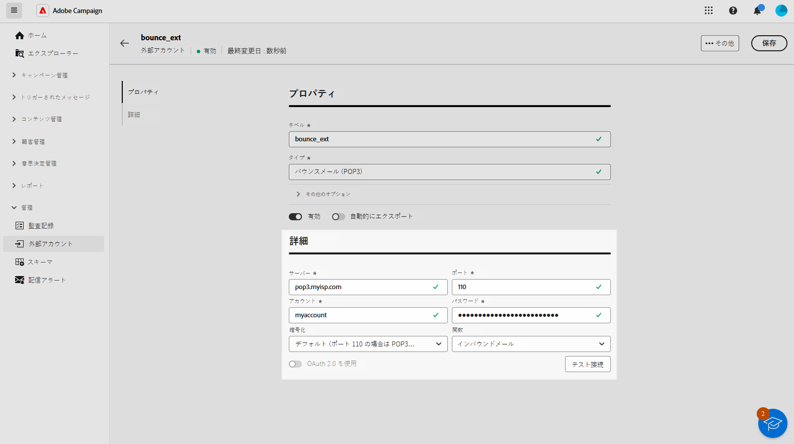

# 外部アカウントの管理 {#external-accounts}

>[!AVAILABILITY]
>
>* 外部アカウントは現在、バウンスメール（POP3）、ルーティング、実行インスタンスでのみ使用できます。 今後、アカウントタイプが追加される予定です。
>
>* Adobe Campaign コンソールで作成された、サポートされていない外部アカウントは、web ユーザーインターフェイスに表示されますが、編集やアクセスはできません。

Adobe Campaign には、様々なシステムと簡単に統合できる事前定義済みの外部アカウントのセットが付属します。追加のプラットフォームに接続したり、ワークフローに合わせて接続をカスタマイズしたりする必要がある場合は、web ユーザーインターフェイスを使用して新しい外部アカウントを容易に作成して、固有のニーズを満たし、シームレスなデータ転送を確実に行えるようになりました。

## 外部アカウントの作成 {#create-ext-account}

新しい外部アカウントを作成するには、次の手順に従います。詳細な設定は、外部アカウントのタイプによって異なります。[詳細情報](#campaign-specific)

1. 左側のパネルメニューから、**[!UICONTROL 管理]**&#x200B;の下にある「**[!UICONTROL 外部アカウント]**」を選択します。

1. 「**[!UICONTROL 外部アカウントを作成]**」をクリックします。

   

1. **[!UICONTROL ラベル]**&#x200B;を入力し、外部アカウントの&#x200B;**[!UICONTROL タイプ]**&#x200B;を選択します。

   >[!NOTE]
   >
   >Campaign 固有のタイプの設定について詳しくは、[この節](#campaign-specific)を参照してください。

   

1. 「**[!UICONTROL 作成]**」をクリックします。

1. **[!UICONTROL その他のオプション]**&#x200B;ドロップダウンから、必要に応じて、**[!UICONTROL 内部名]**&#x200B;または&#x200B;**[!UICONTROL フォルダー]**&#x200B;のパスを変更できます。

   

1. この外部アカウントによって管理されているデータを自動的にエクスポートする場合は、「**[!UICONTROL パッケージで自動的にエクスポート]**」オプションを有効にします。<!--Exported where??-->

   

1. 「**[!UICONTROL 詳細]**」セクションで、選択した外部アカウントタイプに応じて資格情報を指定し、アカウントへのアクセスを設定します。[詳細情報](#bounce)

1. 「**[!UICONTROL テスト接続]**」をクリックして、設定が正しいことを確認します。

1. **[!UICONTROL 詳細...]**&#x200B;メニューから、外部アカウントを複製または削除できます。

   

1. 設定が完了したら、「**[!UICONTROL 保存]**」をクリックします。

## Campaign 固有の外部アカウント {#campaign-specific}

選択した外部アカウントタイプに応じて、次の手順に従ってアカウント設定を指定します。

### バウンスメール（POP3） {#bounce}

>[!AVAILABILITY]
>
> OAuth 2.0 は現在サポートされていません。

バウンスメール外部アカウントで、メールサービスの接続に使用する外部 POP3 アカウントを指定します。POP3 アクセス用に設定されたすべてのサーバーは、返信メールを受信できます。

**[!UICONTROL バウンスメール（POP3）]**&#x200B;外部アカウントを設定するには、次のフィールドに入力します。

* **[!UICONTROL サーバー]** - POP3 サーバーの URL

* **[!UICONTROL ポート]** - POP3 接続ポート番号（デフォルトポートは 110）

* **[!UICONTROL アカウント]** - ユーザーの名前

* **[!UICONTROL パスワード]** - ユーザーアカウントのパスワード

* **[!UICONTROL 暗号化]** - 次の間で選択した暗号化のタイプ：

   * デフォルト (ポート 110 の場合は POP3、ポート 995 の場合は POP3S)
   * STARTTLS の送信後に SSL に切り替える POP3
   * 非セキュアな POP3（デフォルトポート 110）
   * SSL による POP3 セキュア（デフォルトポート 995）

* **[!UICONTROL 関数]** - 外部アカウントが受信メールを受信するように設定されている場合のインバウンドメール、または SOAP リクエストを処理するための SOAP ルーター。

### ルーティング {#routing}

外部配信で使用する特定の外部アカウントを設定するには、次の手順に従います。

1. 外部アカウントを作成します。[詳細情報](../administration/external-account.md#create-ext-account)

1. **[!UICONTROL ルーティング]**&#x200B;タイプを選択します。

   {zoomable="yes"}

1. 目的のチャネルを選択し、「**[!UICONTROL 作成]**」をクリックします。

1. 外部アカウントの「**[!UICONTROL 詳細]**」セクションでは、**[!UICONTROL 配信モード]**&#x200B;として「**[!UICONTROL 外部]**」がデフォルトで選択されています。

   {zoomable="yes"}

   >[!NOTE]
   >
   >現在、使用可能なモードは&#x200B;**[!UICONTROL 外部]**&#x200B;のみです。

1. 配信実行後のプロセスを処理するために、後処理ワークフローに外部化できます。これを行うには、[外部シグナル](../workflows/activities/external-signal.md)アクティビティを含むワークフローを作成し、「**[!UICONTROL 後処理]**」フィールドから選択する必要があります。

   {zoomable="yes"}

1. 「**[!UICONTROL アクティビティ]**」フィールドでは、ログに表示される後処理ワークフローアクティビティの名前を編集できます。<!--you can edit the name of the activity that will be created if you add an external or bulk delivery to a workflow-->

### 実行インスタンス {#instance-exec}

セグメント化されたアーキテクチャを使用している場合は、コントロールインスタンスに関連付けられた実行インスタンスを識別し、それらの間の接続を確立する必要があります。トランザクションメッセージテンプレートは、実行インスタンスにデプロイされます。

**[!UICONTROL 実行インスタンス]**&#x200B;の外部アカウントを設定するには：

* **[!UICONTROL URL]**

  実行インスタンスがインストールされているサーバーの URL。

* **[!UICONTROL アカウント]**

  アカウント名、オペレーターフォルダーで定義されている Message Center エージェントと同じである必要があります。

* **[!UICONTROL パスワード]**

  「オペレーター」フォルダーで定義されたアカウントのパスワード。

* **[!UICONTROL 方法]**

  Web サービスまたは Federated Data Access（FDA）から選択します。
FDA メソッドの場合は、FDA アカウントを選択します。外部システムへの Campaign の接続は上級ユーザーに制限され、クライアントコンソールからのみ使用できます。[詳細情報](https://experienceleague.adobe.com/ja/docs/campaign/campaign-v8/connect/fda#_blank)

* **[!UICONTROL アーカイブワークフローの作成]**

  1 つ以上のインスタンスがあるかどうかに関係なく、Message Center に登録された実行インスタンスごとに、実行インスタンスに関連付けられた外部アカウントにつき個別のアーカイブワークフローを作成する必要があります。
