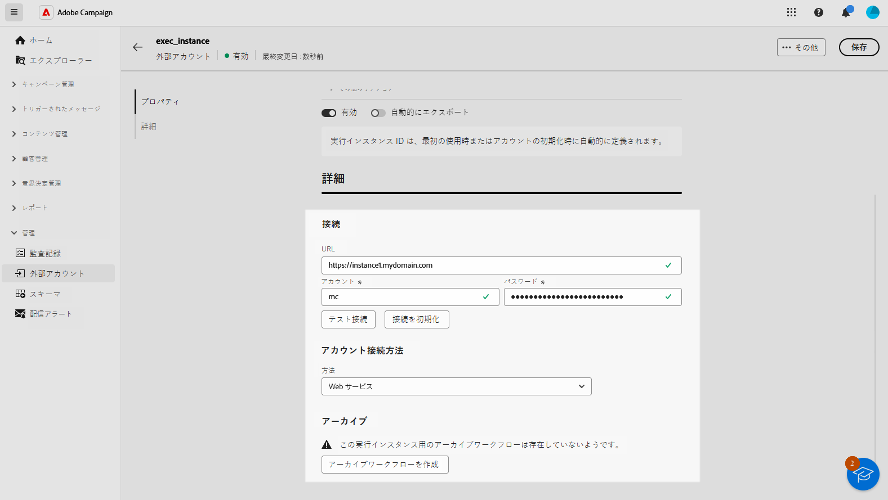

# 外部アカウントの設定 {#external-accounts}

>[!AVAILABILITY]
>
> 外部アカウントは、現在、バウンスメール（POP3）および実行インスタンスでのみ使用でき、今後追加されるアカウントタイプを備えていることに注意してください。
> Adobe Campaign コンソールで作成された、サポートされていない外部アカウントは、web ユーザーインターフェイスに表示されますが、編集やアクセスはできません。

Adobe Campaignには、様々なシステムと簡単に統合できるように、事前設定済みの外部アカウントのセットが付属しています。 追加のプラットフォームに接続したり、ワークフローに合わせて接続をカスタマイズしたりする必要がある場合、特定のニーズを満たす web ユーザーインターフェイスを使用して新しい外部アカウントを簡単に作成し、シームレスなデータ転送を確実に行うことができるようになりました。

## 外部アカウントの作成 {#create-ext-account}

新しい外部アカウントを作成するには、次の手順に従います。 詳細な設定は、外部アカウントのタイプによって異なります。

1. 左側のペインメニューから、「**[!UICONTROL 管理]** の **[!UICONTROL 外部アカウント]** を選択します。

1. **[!UICONTROL 外部アカウントを作成]** をクリックします。

   

1. **[!UICONTROL ラベル]** を入力し、外部アカウント **[!UICONTROL タイプ]** を選択します。

   

1. 「**[!UICONTROL 作成]**」をクリックします。

1. **[!UICONTROL 詳細オプション]** ドロップダウンから、必要に応じて **[!UICONTROL 内部名]** または **[!UICONTROL フォルダー]** パスを変更できます。

   

1. この外部アカウントで管理されているデータを自動的に書き出す場合は ]**自動的に書き出し**[!UICONTROL  を有効にします。

1. 選択した外部アカウントタイプに応じて資格情報を指定し、アカウントへのアクセスを設定します。

1. **[!UICONTROL 接続をテスト]** をクリックして、設定が正しいことを確認します

1. **[!UICONTROL その他…]** メニューから、外部アカウントを複製または削除します。

   

1. 設定が完了したら、「**[!UICONTROL 保存]**」をクリックします。

## Campaign 固有の外部アカウント {#campaign-specific}

### バウンスメール (POP3) {#bounce}

>[!AVAILABILITY]
>
> OAuth 2.0 は現在サポートされていません。

バウンスメールの外部アカウントで、メールサービスの接続に使用する外部 POP3 アカウントを指定します。 POP3 アクセス用に設定されたすべてのサーバーは、返信メールを受信できます。

**[!UICONTROL バウンスメール（POP3）]** 外部アカウントの設定

* **[!UICONTROL サーバー]**

  POP3 サーバーの URL

* **[!UICONTROL ポート]**

  POP3 接続ポート番号（デフォルトポートは 110）

* **[!UICONTROL アカウント]**

  ユーザーの名前

* **[!UICONTROL パスワード]**

  ユーザーアカウントのパスワード

* **[!UICONTROL 暗号化]**

  選択した暗号化のタイプ （期間：）

   * デフォルト (ポート 110 の場合は POP3、ポート 995 の場合は POP3S)
   * STARTTLS の送信後に SSL に切り替える POP3
   * 非セキュアな POP3 (デフォルトポート 110)
   * SSL による POP3 セキュア (デフォルトポート 995)

* **[!UICONTROL 関数]**

  インバウンドメール （外部アカウントが受信メールまたはSOAP ルーターを受信するように設定されている場合）:SOAP リクエストを処理します。

### 実行インスタンス{#instance-exec}

セグメント化されたアーキテクチャがある場合は、コントロールインスタンスに関連付けられた実行インスタンスを特定し、それらの間に接続を確立する必要があります。 トランザクションメッセージテンプレートは、実行インスタンスにデプロイされます。

**[!UICONTROL 実行インスタンス]** 外部アカウントを設定するには：

* **[!UICONTROL URL]**

  実行インスタンスがインストールされているサーバーの URL。

* **[!UICONTROL アカウント]**

  アカウント名、オペレーターフォルダーで定義されている Message Center エージェントと同じである必要があります。

* **[!UICONTROL パスワード]**

  「オペレーター」フォルダーで定義されたアカウントのパスワード。

* **[!UICONTROL 方法]**

  Web サービスまたは Federated Data Access （FDA）から選択します。
FDA メソッドの場合は、FDA アカウントを選択します。 外部システムへの Campaign 接続は、上級ユーザーに制限され、クライアントコンソールからのみ使用できます。 [詳細情報](https://experienceleague.adobe.com/en/docs/campaign/campaign-v8/connect/fda#_blank)

* **[!UICONTROL アーカイブワークフローの作成]**

  1 つ以上のインスタンスがあるかどうかに関係なく、Message Center に登録された実行インスタンスごとに、実行インスタンスに関連付けられた外部アカウントごとに個別のアーカイブワークフローを作成する必要があります。
