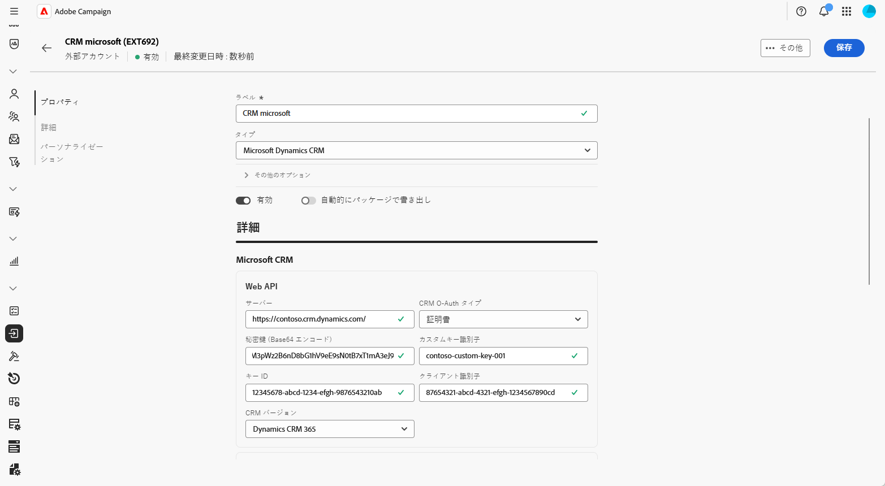
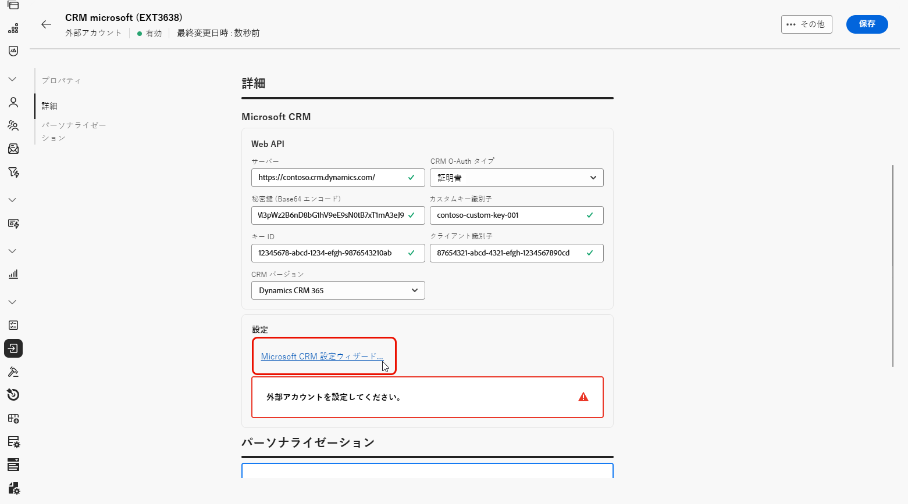
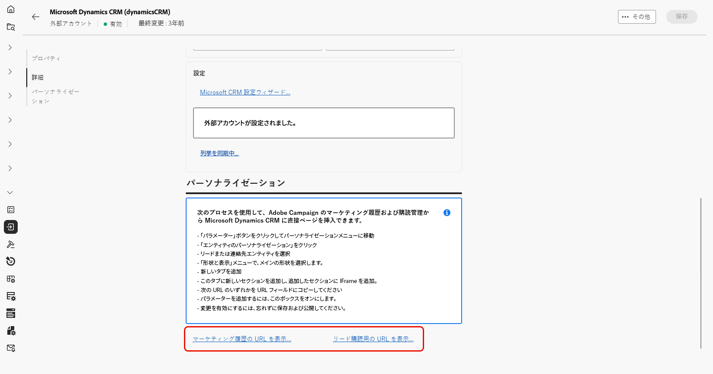
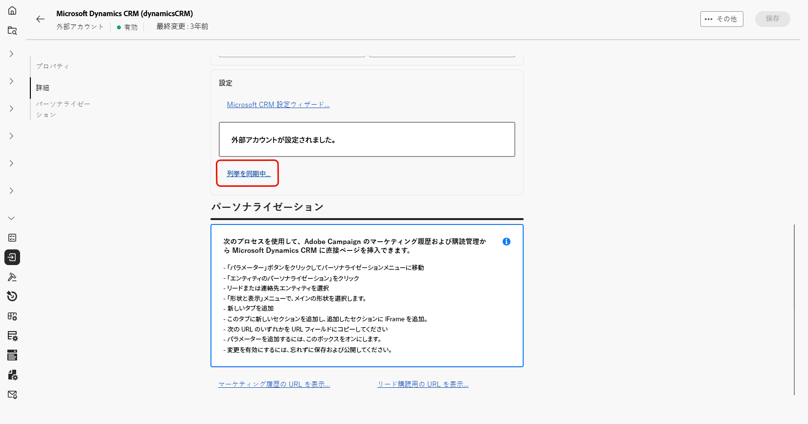
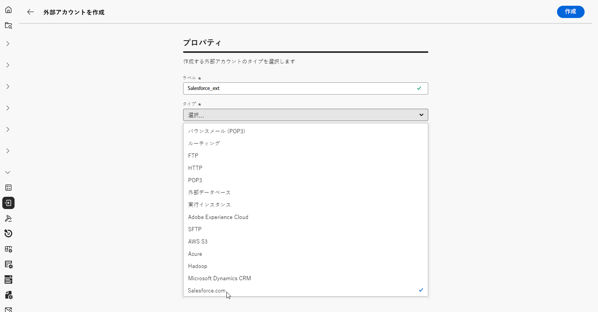
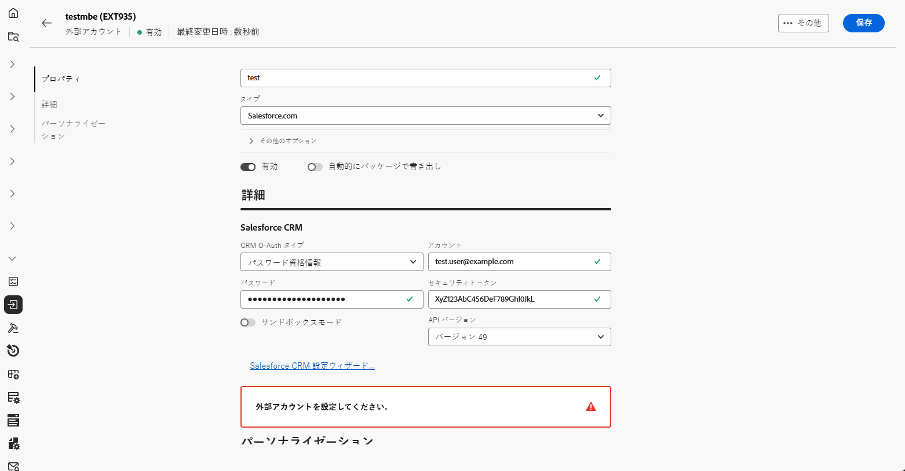
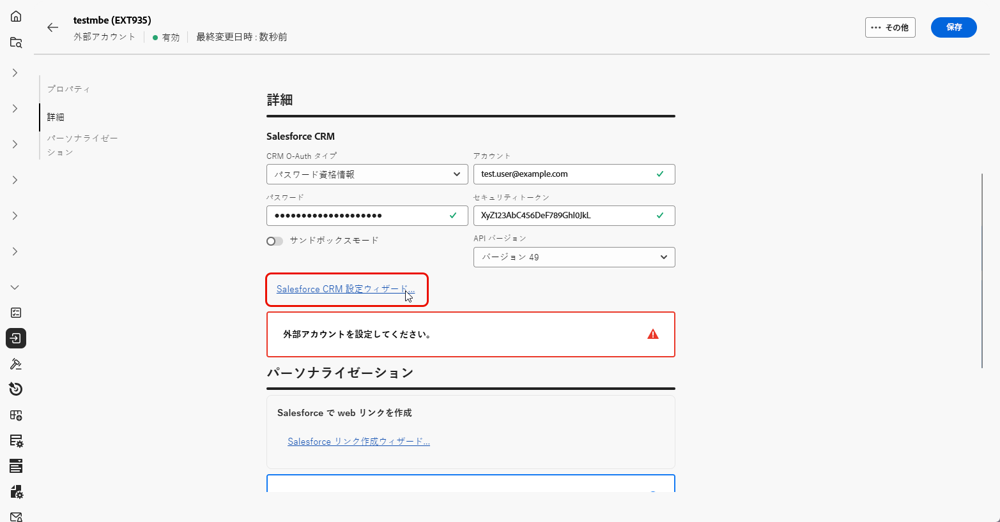
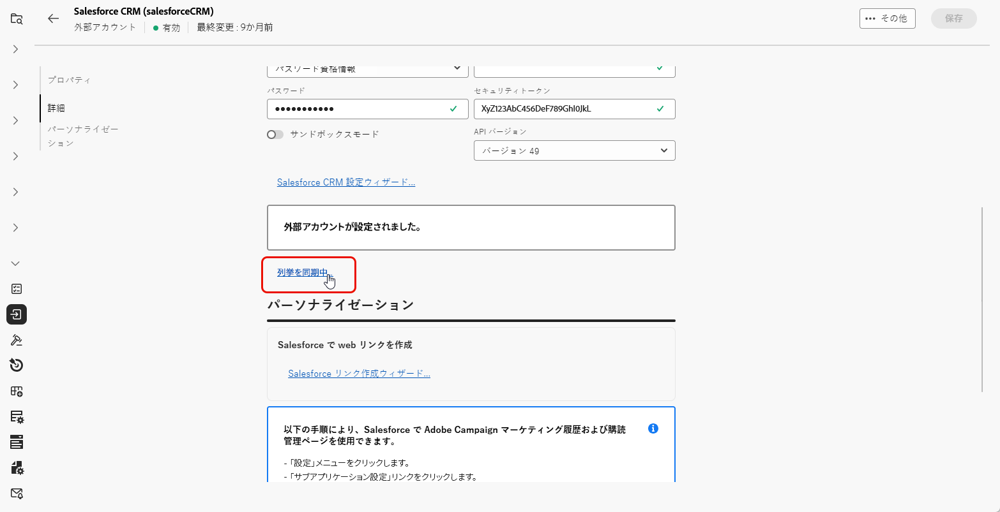

# CRM 外部アカウント {#external-crm}

外部の CRM タイプのアカウントを使用して、Adobe Campaignをサードパーティのデータベースに接続します。

この外部アカウントの設定は、接続先の特定のデータベースエンジンによって異なります。 サポートされている各データベースのセットアップ手順について詳しくは、以下の節を参照してください。

## Microsoft Dynamics CRM

Microsoft Dynamics CRM 外部アカウントを使用すると、Campaign インスタンスをMicrosoft Dynamics CRM 外部データベースに接続できます。

Adobe Campaign Web ユーザーインターフェイスで、Microsoft Dynamics CRM 外部アカウントを設定します。

1. [ 外部アカウントを作成 ](external-account.md) し、外部アカウントの **[!UICONTROL タイプ]** として「**[!UICONTROL 外部データベース]**」を選択し、**[!UICONTROL プロバイダータイプ]** として「Microsoft Dynamics CRM」を選択します。

1. 「**[!UICONTROL 作成]**」をクリックします。

1. **[!UICONTROL Microsoft Dynamics CRM]** 外部アカウントを設定するには、次のフィールドに入力します。

   

   +++ CRM OAuth タイプの場合：パスワード資格情報

   * **[!UICONTROL サーバー]**:Microsoft CRM サーバーの URL を入力します。

     Microsoft CRM Server の URL を見つけるには、Microsoft Dynamics CRM アカウントにログインし、「Dynamics 365」を選択してからアプリを開きます。 サーバーの URL は、ブラウザーのアドレスバーに表示されます（例：`https://myserver.crm.dynamics.com/`）。

   * **[!UICONTROL アカウント]**:Microsoft CRM へのログインに使用するアカウントを指定します。

   * **[!UICONTROL パスワード]**：指定したアカウントに関連付けられているパスワードを入力します。

   * **[!UICONTROL クライアント識別子]**:Microsoft Azure Management Portal にあるクライアント ID を入力します。

   * **[!UICONTROL CRM バージョン]**：Dynamics CRM 365 CRM バージョンを選択します。

   +++

    

   +++ CRM O-Auth タイプの場合：証明書

   * **[!UICONTROL サーバー]**:Microsoft CRM サーバーの URL を入力します。

     Microsoft CRM Server の URL を見つけるには、Microsoft Dynamics CRM アカウントにログインし、「Dynamics 365」を選択してからアプリを開きます。 サーバーの URL は、ブラウザーのアドレスバーに表示されます（例：`https://myserver.crm.dynamics.com/`）。

   * **[!UICONTROL 秘密鍵（Base64 エンコード）]**:Base64 形式でエンコードされた秘密鍵を指定します。

     それには、Base64 エンコーダーを利用するか、Linux の場合はコマンドライン `base64 -w0 private.key` を使用します。

   * **[!UICONTROL カスタムキー識別子]**：証明書に使用するカスタムキー識別子を入力します。

   * **[!UICONTROL キー ID]**：証明書に関連付けられたキー ID を入力します。

   * **[!UICONTROL クライアント識別情報]**: Microsoft Azure Management にあるクライアント ID を入力します

   * **[!UICONTROL CRM バージョン]**：Dynamics CRM 365 CRM バージョンを選択します。

   +++

1. 接続の設定後、**[!UICONTROL Microsoft CRM 設定ウィザードにアクセスして]** Microsoft CRM テーブルリストを生成します。

   「**[!UICONTROL 次へ]**」をクリックして、必要なテーブルを選択します。

   

1. **[!UICONTROL テーブルラベル]** と **[!UICONTROL テーブル内部名]** を指定して、リモートテーブルを取得または追加するMicrosoft CRM テーブルを選択し、**[!UICONTROL 選択]** 切替スイッチを有効にします。

   「**[!UICONTROL 次へ]**」をクリックします。

1. 「**[!UICONTROL 開始]**」をクリックし、選択したテーブルに基づいてMicrosoft CRM スキーマの作成を開始します。

1. 画面の指示に従って、Adobe Campaign マーケティング履歴および購読管理からMicrosoft Dynamics CRM に直接ページを挿入します。

1. **[!UICONTROL マーケティング履歴 URL を表示]** をクリックすると、マーケティング履歴ページを統合するための URL が表示され、**[!UICONTROL リード購読の URL を表示]** をクリックすると、購読管理ページを統合するための URL が表示されます。

   

1. Microsoft CRM 外部アカウントを設定したら、「**[!UICONTROL 保存]**」をクリックします。

1. 外部アカウントを作成したら、「**[!UICONTROL 定義済みリストを同期…]**」をクリックして、定義済みリストをMicrosoft CRM からAdobe Campaign Web ユーザーインターフェイスに自動的に同期できます。

   

1. Microsoft CRM 列挙に一致するAdobe Campaign列挙を選択します。

   Adobe Campaignの値をMicrosoft CRM の値に置き換えるには、「**[!UICONTROL 置換]** オプションを有効にします。

## Salesforce {#salesforce}

Salesforce外部アカウントをAdobe Campaignで使用できるように設定するには、次の情報が必要です。

1. [ 外部アカウントを作成 ](external-account.md) し、外部アカウントの **[!UICONTROL タイプ]** として **[!UICONTROL 外部データベース]** を選択し、**[!UICONTROL プロバイダータイプ]** としてSalesforce.comを選択します。

   

1. 「**[!UICONTROL 作成]**」をクリックします。

1. **[!UICONTROL Salesforce]** 外部アカウントを設定するには、次のフィールドに入力します。

   * **[!UICONTROL CRM O-Auth タイプ]**:**[!UICONTROL パスワード資格情報]** または **[!UICONTROL 資格情報]**

   * **[!UICONTROL アカウント]**:Salesforce CRM へのログインに使用するアカウント。

   * **[!UICONTROL パスワード]**：指定したアカウントに関連付けられているパスワードを入力します。

   * **[!UICONTROL セキュリティトークン]**: アカウントに関連付けられたSalesforce セキュリティトークンを入力します。

   * **[!UICONTROL API バージョン]**：バージョン 49 を選択します。

   

1. **[!UICONTROL Salesforce CRM 設定ウィザード]** を開いてSalesforce CRM テーブルリストを生成し、「**[!UICONTROL 次へ]**」をクリックします。

   

1. **[!UICONTROL テーブル・ラベル]** と **[!UICONTROL テーブル内部名]** を入力して、リモート・テーブルを取得または追加するSalesforceテーブルを選択し、**[!UICONTROL 選択]** 切替スイッチを有効にします。

   「**[!UICONTROL 次へ]**」をクリックします。

1. 「**[!UICONTROL 開始]**」をクリックし、選択したテーブルに基づいてSalesforce CRM スキーマの作成を開始します。

1. 「**[!UICONTROL Salesforce リンク作成ウィザード…]**」をクリックして、Salesforceで web リンクを生成します。

   次に、「**[!UICONTROL 次へ]**」をクリックして、Salesforceから **リード** および **連絡先** の web リンクを取得します。

1. Salesforceの Web リンクのリストに書き出すリンクを選択します。

1. 画面の指示に従って、Adobe Campaign Web ユーザーインターフェイスからSalesforce CRM に **マーケティング履歴** ページと **購読管理** ページを挿入します。

1. Salesforce CRM 外部アカウントを設定したら、「**[!UICONTROL 保存]**」をクリックします。

1. 外部アカウントを作成したら、「**[!UICONTROL 定義済みリストを同期する…]**」をクリックして、SalesforceからAdobe Campaign Web ユーザーインターフェイスに定義済みリストを自動的に同期できます。

   

1. Salesforce列挙に一致するAdobe Campaign列挙を選択します。

   Adobe Campaignの値をSalesforceの値に置き換えるには、「**[!UICONTROL 置換]** オプションを有効にします。

   

