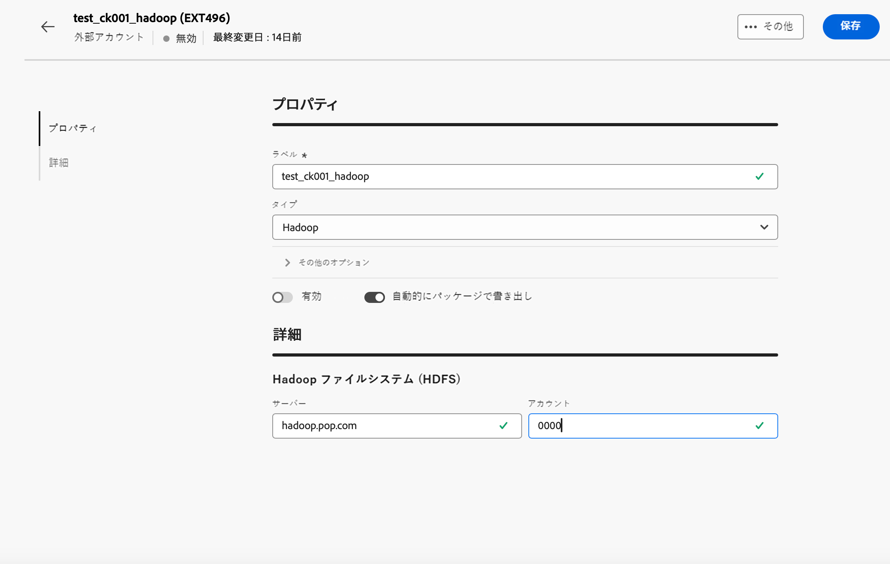

# Hadoop 外部アカウント {#external-hadoop}

Hadoop 外部アカウントを使用すれば、Campaign インスタンスを Hadoop 外部データベースに接続することができます。Hadoop について詳しくは、[Campaign V7 コンソールドキュメント](https://experienceleague.adobe.com/ja/docs/campaign-classic/using/installing-campaign-classic/accessing-external-database/configure-fda/config-databases/configure-fda-hadoop){target=_blank}を参照してください。

**[!UICONTROL Hadoop]** 外部アカウントを設定するには、次のフィールドに入力します。

* **[!UICONTROL サーバー]**

  Hadoop ストレージサーバーの URL。

* **[!UICONTROL アカウント]**

  Hadoop サーバーアカウントの名前。
