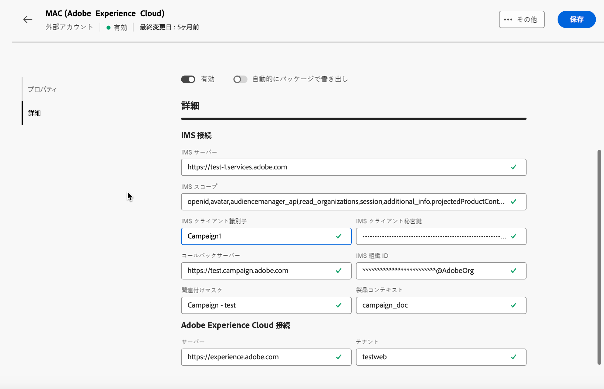

# Adobe ソリューション統合外部アカウント {#integration-external-account}

選択したアドビソリューション統合外部アカウントのタイプに応じて、次の手順に従って、アドビサービスとのシームレスな統合を行う接続とアカウント設定を指定します。

## Adobe Experience Cloud

Adobe ID を使用して Adobe Campaign コンソールに接続するには、Adobe Experience Cloud（MAC）外部アカウントを設定する必要があります。

**[!UICONTROL Adobe Experience Cloud]** 外部アカウントを設定するには、次のフィールドに入力します。

* **[!UICONTROL IMS サーバー]**

  IMS サーバーの URL。 また、ステージングと本番用のインスタンスがいずれも、同じ IMS 本番エンドポイントを指していることを確認します。

* **[!UICONTROL IMS スコープ]**

  スコープは、IMS によりプロビジョニングされているスコープのサブセットでなければなりません。

* **[!UICONTROL IMS クライアント識別子]**

  IMS クライアントの ID。

* **[!UICONTROL IMS クライアント秘密鍵]**

  IMS クライアント秘密鍵の資格情報。

* **[!UICONTROL コールバックサーバー]**

  Adobe Campaign インスタンスのアクセス URL。

* **[!UICONTROL IMS 組織 ID]**

  組織の ID。 組織 ID を見つけるには、[このページ](https://experienceleague.adobe.com/docs/core-services/interface/administration/organizations.html?lang=ja){target=_blank}を参照してください。

* **[!UICONTROL 関連付けマスク]**

  このフィールドでは、Enterprise Dashboard の設定名を Adobe Campaign のグループと同期させる構文を定義することができます。

* **[!UICONTROL サーバー]**

  Adobe Experience Cloud インスタンスの URL。

* **[!UICONTROL テナント]**

  Adobe Experience Cloud テナントの名前。
