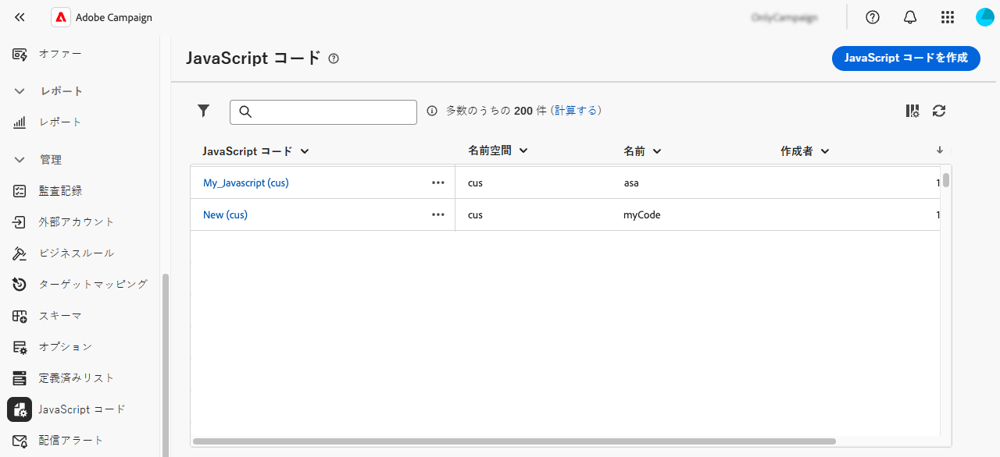

# JavaScript コードの操作 {#javascript-codes}

>[!CONTEXTUALHELP]
>id="acw_javascript_codes_list"
>title="JavaScript コード"
>abstract="JavaScript コード"

>[!CONTEXTUALHELP]
>id="acw_javascript_codes_create"
>title="JavaScript コードを作成"
>abstract="JavaScript コードを作成"

## JavaScript コードについて {#about}

JavaScript コードを使用すると、ライブラリと同様に、ワークフロー全体で利用できる再利用可能な関数を作成できます。 これらの関数は、左側のナビゲーションパネルの **[!UICONTROL 管理]**/**[!UICONTROL JavaScript コード]** メニューに格納されます。



JavaScriptのコードリストから、次の操作を実行できます。

* **コードの複製または削除**：省略記号ボタンをクリックし、目的のアクションを選択します。
* **コードを変更**：コードの名前をクリックしてプロパティを開きます。 変更を加えて保存します。
* **新しいJavaScript コードを作成**:「**[!UICONTROL JavaScript コードを作成]**」ボタンをクリックします。

>[!NOTE]
>
>JavaScriptのコードメニューの場所は、Adobe Campaign コンソールと web ユーザーインターフェイスで異なりますが、リストは同じで、ミラーのように機能します。

## JavaScript コードの作成 {#create}

JavaScript コードを作成するには、次の手順に従います。

1. 「**[!UICONTROL JavaScript コード]**」メニューに移動し、「**[!UICONTROL JavaScript コードを作成]**」ボタンをクリックします。

1. コードのプロパティを定義します。

   * **[!UICONTROL 名前空間]**：カスタムリソースに関連する名前空間を指定します。 デフォルトでは、名前空間は「cus」ですが、実装によって異なる場合があります。
   * **[!UICONTROL 名前]**：コードの参照に使用する一意の ID。
   * **[!UICONTROL ラベル]**:JavaScript コードリストに表示する説明ラベル。

   

   >[!NOTE]
   >
   >作成した **[!UICONTROL 名前空間]** フィールドと **[!UICONTROL 名前]** フィールドは変更できません。 変更を加えるには、コードを複製し、必要に応じて更新します。
   >
   >Campaign コンソールでは、JavaScript コード名は、これら 2 つのフィールドを連結したものとして表示されます。

1. 「**[!UICONTROL コードを作成]**」ボタンをクリックして、JavaScript コードを定義します。 左側のペインには、条件および日付の書式設定に関連する事前定義済みの関数を使用できる 2 つのメニューが表示されます。

   

1. 「**[!UICONTROL 確認]**」をクリックして、コードを保存します。

1. JavaScript コードの準備が整ったら、「**[!UICONTROL 作成]**」をクリックします。  JavaScript コードをワークフロー全体で使用できるようになりました。

## ワークフローからのJavaScript コードの使用 {#workflow}

### JavaScript コードライブラリの読み込み {#library}

ワークフローでJavaScript コードを参照すると、繰り返しタスクのコードが書き直されるのを回避できます。 これらのコードを使用するには、まずワークフローの初期化スクリプトに対応するライブラリを読み込む必要があります。 これにより、ワークフローで使用する関数を含むすべてのライブラリを 1 回ロードできます。

ライブラリを読み込むには、次の手順に従います。

1. ワークフローを開き、「**[!UICONTROL 設定]** ボタンをクリックします。
1. 「**[!UICONTROL 初期化スクリプト]**」セクションに移動し、「**[!UICONTROL コードを作成]**」をクリックします。

   

1. コード内で次の構文を使用して、ライブラリを読み込みます。

   ```
   loadLibrary("/<namespace>/<name>")
   ```

   * `<namespace>` を、JavaScript コードの作成時に指定された名前空間に置き換えます。
   * `<name>` をJavaScript コードの名前に置き換えます。

1. 「**[!UICONTROL 確認]**」をクリックして、設定を保存します。

### ワークフローの参照関数 {#reference}

JavaScript ライブラリが読み込まれると、通常は **[!UICONTROL JavaScript コード]** アクティビティを使用して、JavaScript コードで定義されている関数をワークフロー内で直接参照できます。


