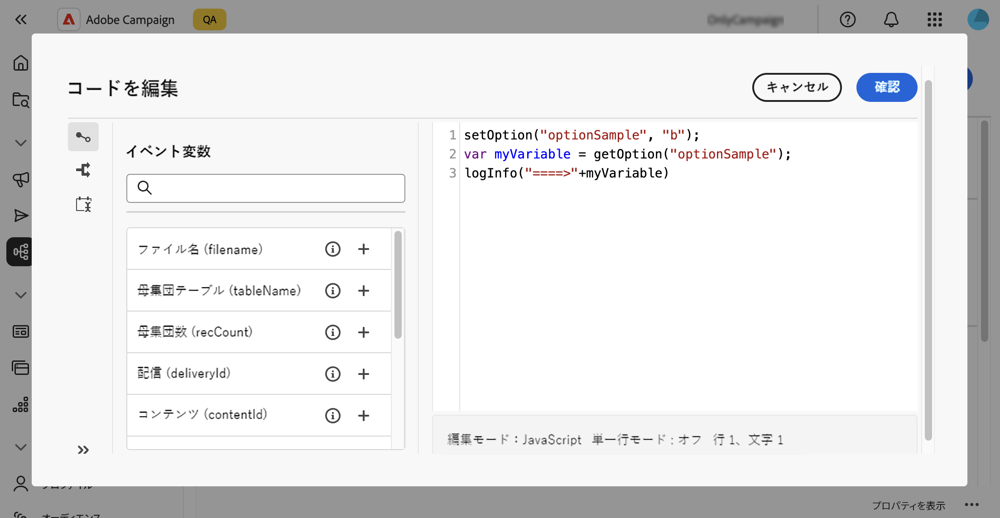

# [!DNL Campaign] オプションの設定 {#options}

>[!CONTEXTUALHELP]
>id="acw_options_list"
>title="オプション"
>abstract="オプション"

>[!CONTEXTUALHELP]
>id="acw_options_create"
>title="オプションを作成"
>abstract="オプションを作成"

Adobe Campaign web には、アプリケーションをより具体的に設定できる技術的オプションが含まれています。これらのオプションの一部はビルトインされていますが、他のオプションは必要に応じて手動で追加できます。

>[!IMPORTANT]
>ビルトインオプションは事前に設定されており、上級ユーザーのみが変更する必要があります。ご不明な点やご要望について詳しくは、アドビ担当者にお問い合わせください。

## Campaign オプションへのアクセス {#access}

オプションは、**[!UICONTROL 管理]**／**[!UICONTROL オプション]**&#x200B;メニューから使用できます。フィルターパネルを使用してリストを絞り込み、必要なオプションをすばやく見つけます。

\
[管理／オプションメニューに表示されるオプションリスト]

>[!NOTE]
>Adobe Campaign コンソールと web ユーザーインターフェイスではオプションメニューの場所が異なりますが、リストは同じで、ミラーのように機能します。使用可能なオプションについて詳しくは、[Campaign v7 ドキュメント](https://experienceleague.adobe.com/ja/docs/campaign-classic/using/installing-campaign-classic/appendices/configuring-campaign-options){target="_blank"}のオプションのリストを参照してください。

オプションリストから、次の操作を実行できます。

* **オプションを複製または削除**：省略記号ボタンをクリックし、目的のアクションを選択します。
* **オプションを変更**：オプションの名前をクリックし、プロパティを開きます。変更を行って保存します。
* **カスタムオプションを作成**：「**[!UICONTROL オプションを作成]**」ボタンをクリックします。

## オプションの作成 {#create}

Adobe Campaign web ユーザーインターフェイスを使用すると、要件に合わせてカスタムオプションを作成できます。これは、**[!UICONTROL JavaScript コード]**&#x200B;ワークフローアクティビティを使用して中間データを保存する際に特に便利です。

オプションを作成するには、次の手順に従います。

1. オプションリストにアクセスし、「**[!UICONTROL オプションを作成]**」をクリックします。
1. オプションの名前を入力し、タイプを選択して目的の値を設定します。
1. 「**[!UICONTROL 作成]**」をクリックして、オプションを作成します。

オプションは、データの一時的なストレージとして機能し、次のメリットがあります。

* タイプ指定された値：オプションは、日付、整数、文字列など、特定のデータタイプをサポートします。
* 柔軟性：オプションを使用すると、ユーザーはデータベーステーブルを管理するオーバーヘッドなしで、データを効率的に保存および取得できます。

次の例では、初期値が「a」の `sampleOption` という名前のカスタムオプションを作成します。ワークフロー内の **[!UICONTROL JavaScript コード]**&#x200B;アクティビティでは、このオプションの値を変更し、変数に保存します。更新した値はワークフローログに表示され、**[!UICONTROL オプション]**&#x200B;メニューに反映されます。

1. オプションを作成します。

   

1. **[!UICONTROL JavaScript コード]**&#x200B;アクティビティを設定し、ワークフローを開始します。

   

1. ワークフローを実行して、ワークフローログで更新した値を確認します。

   

1. 更新した値が&#x200B;**[!UICONTROL オプション]**&#x200B;メニューに表示されるようになりました。

   
