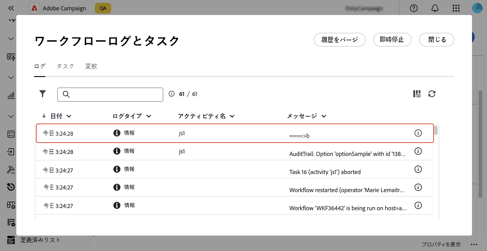

# [!DNL Campaign] オプションの設定 {#options}

>[!CONTEXTUALHELP]
>id="acw_options_list"
>title="オプション"
>abstract="オプション"

>[!CONTEXTUALHELP]
>id="acw_options_create"
>title="オプションを作成"
>abstract="オプションを作成"

Adobe Campaign Web には、より具体的にアプリケーションを設定できるテクニカルオプションが付属しています。 これらのオプションには、組み込みのオプションもあれば、必要に応じて手動で追加できるオプションもあります。

>[!IMPORTANT]
>
>ビルトインオプションは事前に設定されており、上級ユーザーのみが変更できます。 ご不明な点やご要望については、Adobe担当者にお問い合わせください。

## Campaign オプションへのアクセス {#access}

オプションは、**[!UICONTROL 管理]**/**[!UICONTROL オプション]** メニューから使用できます。 フィルターウィンドウを使用してリストを絞り込み、必要なオプションをすばやく見つけます。

>[!NOTE]
>
>Adobe Campaign コンソールと web ユーザーインターフェイスではオプションメニューの場所が異なりますが、リストは同じで、ミラーのように機能します。 使用可能なオプションについて詳しくは、[Campaign v7 ドキュメントのオプションのリストを参照してください ](https://experienceleague.adobe.com/ja/docs/campaign-classic/using/installing-campaign-classic/appendices/configuring-campaign-options){target="_blank"}

オプションリストから、次の操作を実行できます。

* **オプションを複製または削除**：省略記号ボタンをクリックして、目的のアクションを選択します。
* **オプションを変更**：オプションの名前をクリックしてプロパティを開きます。 変更を加えて保存します。
* **カスタムオプションを作成**:「**[!UICONTROL オプションを作成]**」ボタンをクリックします。

## オプションの作成 {#create}

Adobe Campaignの web ユーザーインターフェイスを使用すると、ニーズに合わせて独自のカスタムオプションを作成できます。 これは、**[!UICONTROL JavaScript コード]** ワークフローアクティビティを操作して中間データを保存する場合に特に便利です。

オプションを作成するには：

1. オプションリストにアクセスし、「**[!UICONTROL オプションを作成]**」をクリックします。
1. オプションの名前を入力し、タイプを選択して目的の値を設定します。
1. **[!UICONTROL 作成]** をクリックして、オプションを作成します。

   

オプションは、データの一時的なストレージスペースとして機能し、次の利点があります。

* 型指定された値：オプションは、日付、整数、文字列など、特定のデータタイプをサポートします。
* 柔軟性：オプションを使用すると、データベーステーブルを管理するためのオーバーヘッドなしに、ユーザーがデータを効率的に保存および取得できます。

以下の例では、初期値が「a」の `sampleOption` というカスタムオプションを作成します。 ワークフロー内の **[!UICONTROL JavaScript コード]** アクティビティは、このオプションの値を変更して変数に格納します。 更新された値がワークフローログに表示され、**[!UICONTROL オプション]** メニューに反映されます。

1. オプションを作成します。

   

1. **[!UICONTROL JavaScript コード]** アクティビティを設定し、ワークフローを開始します。

   

1. ワークフローを実行して、更新された値をワークフローログで確認します。

   

1. 更新された値が **[!UICONTROL オプション]** メニューに表示されるようになりました。

   
