<?xml version="1.0" encoding="UTF-8"?>
<xliff xmlns="urn:oasis:names:tc:xliff:document:1.2" xmlns:okp="okapi-framework:xliff-extensions" xmlns:its="http://www.w3.org/2005/11/its" xmlns:itsxlf="http://www.w3.org/ns/its-xliff/" version="1.2" its:version="2.0">
<file original="help/v8/administration/plans-programs.md.mdsc" source-language="en-US" target-language="en-XX" datatype="x-text/markdown">
<body>
<trans-unit id="tu1" restype="x-YAML_METADATA_HEADER_VALUE" xml:space="preserve">
<source xml:lang="en-US">Plans and Programs</source>
<target xml:lang="en-XX">プランとプログラム</target>
</trans-unit>
<trans-unit id="tu2" restype="x-YAML_METADATA_HEADER_VALUE" xml:space="preserve">
<source xml:lang="en-US">Learn how to create and configure plans and programs in Adobe Campaign</source>
<target xml:lang="en-XX">Adobe Campaign でプランとプログラムを作成および設定する方法を学ぶ</target>
</trans-unit>
<trans-unit id="tu3" xml:space="preserve">
<source xml:lang="en-US">Plans and programs</source>
<target xml:lang="en-XX">プランとプログラム</target>
</trans-unit>
<trans-unit id="tu4" xml:space="preserve">
<source xml:lang="en-US">Adobe Campaign allows you to configure your folder hierarchy for marketing plans and programs.</source>
<target xml:lang="en-XX">Adobe Campaign では、マーケティングのプランとプログラムに関するフォルダー階層構造を設定できます。</target>
</trans-unit>
<trans-unit id="tu5" xml:space="preserve">
<source xml:lang="en-US">To better organize these components, Adobe recommends the following hierarchy: Plan <ph id="1" ctype="x-CODE">`>`</ph> Programs <ph id="2" ctype="x-CODE">`>`</ph> Campaigns.</source>
<target xml:lang="en-XX">これらのコンポーネントをより適切に整理するには、アドビではプラン<ph id="1" ctype="x-CODE">`>`</ph>プログラム<ph id="2" ctype="x-CODE">`>`</ph>キャンペーンの階層を使用することをお勧めします。</target>
</trans-unit>
<trans-unit id="tu6" xml:space="preserve">
<source xml:lang="en-US">A <ph id="1" ctype="x-STRONG_EMPHASIS">**</ph>plan<ph id="2" ctype="x-STRONG_EMPHASIS">**</ph> may contain multiple programs. It defines strategic objectives for a specific period.</source>
<target xml:lang="en-XX"><ph id="1" ctype="x-STRONG_EMPHASIS">**</ph>プラン<ph id="2" ctype="x-STRONG_EMPHASIS">**</ph>には複数のプログラムを含めることができます。 特定の期間の戦略目標を定義します。</target>
</trans-unit>
<trans-unit id="tu7" xml:space="preserve">
<source xml:lang="en-US">A <ph id="1" ctype="x-STRONG_EMPHASIS">**</ph>program<ph id="2" ctype="x-STRONG_EMPHASIS">**</ph> may contain other programs as well as campaigns, workflows, and landing pages.</source>
<target xml:lang="en-XX"><ph id="1" ctype="x-STRONG_EMPHASIS">**</ph>プログラム<ph id="2" ctype="x-STRONG_EMPHASIS">**</ph>には、キャンペーン、ワークフロー、ランディングページに加えて、他のプログラムを含めることができます。</target>
</trans-unit>
<trans-unit id="tu8" xml:space="preserve">
<source xml:lang="en-US">A <ph id="1" ctype="x-STRONG_EMPHASIS">**</ph>campaign<ph id="2" ctype="x-STRONG_EMPHASIS">**</ph> may contain deliveries, workflows, and landing pages.</source>
<target xml:lang="en-XX"><ph id="1" ctype="x-STRONG_EMPHASIS">**</ph>キャンペーン<ph id="2" ctype="x-STRONG_EMPHASIS">**</ph>には、配信、ワークフロー、ランディングページを含めることができます。</target>
</trans-unit>
<trans-unit id="tu9" xml:space="preserve">
<source xml:lang="en-US">Create and configure a plan</source>
<target xml:lang="en-XX">プランの作成と設定</target>
</trans-unit>
<trans-unit id="tu10" xml:space="preserve">
<source xml:lang="en-US">To create a plan, create a folder with the folder type <ph id="1" ctype="x-STRONG_EMPHASIS">**[!UICONTROL </ph>Plan<ph id="3" ctype="x-LINK_REF">]**</ph>. <ph id="5" ctype="x-LINK">[</ph>Learn more about creating a folder<ph id="6" ctype="x-LINK">](../get-started/work-with-folders.md)</ph></source>
<target xml:lang="en-XX">プランを作成するには、フォルダータイプが<ph id="1" ctype="x-STRONG_EMPHASIS">**[!UICONTROL </ph>プラン<ph id="3" ctype="x-LINK_REF">]**</ph>のフォルダーを作成する必要があります。 <ph id="5" ctype="x-LINK">[</ph>詳しくは、フォルダーの作成を参照してください<ph id="6" ctype="x-LINK">](../get-started/work-with-folders.md)</ph>。</target>
</trans-unit>
<trans-unit id="tu11" xml:space="preserve">
<source xml:lang="en-US"><ph id="1" ctype="x-IMAGE">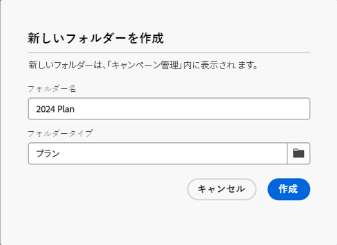{zoomable="yes"}</ph></source>
<target xml:lang="en-XX"><ph id="1" ctype="x-IMAGE">{zoomable="yes"}</ph></target>
</trans-unit>
<trans-unit id="tu12" xml:space="preserve">
<source xml:lang="en-US">Go to the <ph id="1" ctype="x-STRONG_EMPHASIS">**[!UICONTROL </ph>Folder settings<ph id="3" ctype="x-LINK_REF">]**</ph> of your plan to manage it.</source>
<target xml:lang="en-XX">プランを管理するには、プランの<ph id="1" ctype="x-STRONG_EMPHASIS">**[!UICONTROL </ph>フォルダー設定<ph id="3" ctype="x-LINK_REF">]**</ph>に移動します。</target>
</trans-unit>
<trans-unit id="tu13" xml:space="preserve">
<source xml:lang="en-US"><ph id="1" ctype="x-IMAGE">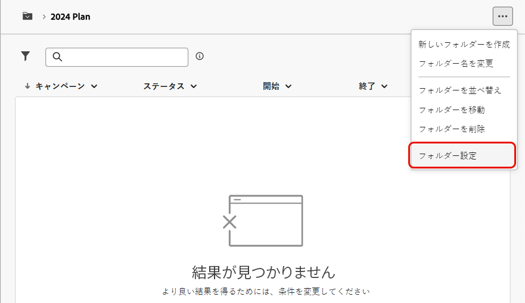{zoomable="yes"}</ph></source>
<target xml:lang="en-XX"><ph id="1" ctype="x-IMAGE">{zoomable="yes"}</ph></target>
</trans-unit>
<trans-unit id="tu14" xml:space="preserve">
<source xml:lang="en-US">Define <ph id="1" ctype="x-STRONG_EMPHASIS">**[!UICONTROL </ph>Custom options<ph id="3" ctype="x-LINK_REF">]**</ph>, and set the scheduling date of your plan.</source>
<target xml:lang="en-XX"><ph id="1" ctype="x-STRONG_EMPHASIS">**[!UICONTROL </ph>カスタムオプション<ph id="3" ctype="x-LINK_REF">]**</ph>を定義し、プランのスケジュール日を設定します。</target>
</trans-unit>
<trans-unit id="tu15" xml:space="preserve">
<source xml:lang="en-US"><ph id="1" ctype="x-IMAGE">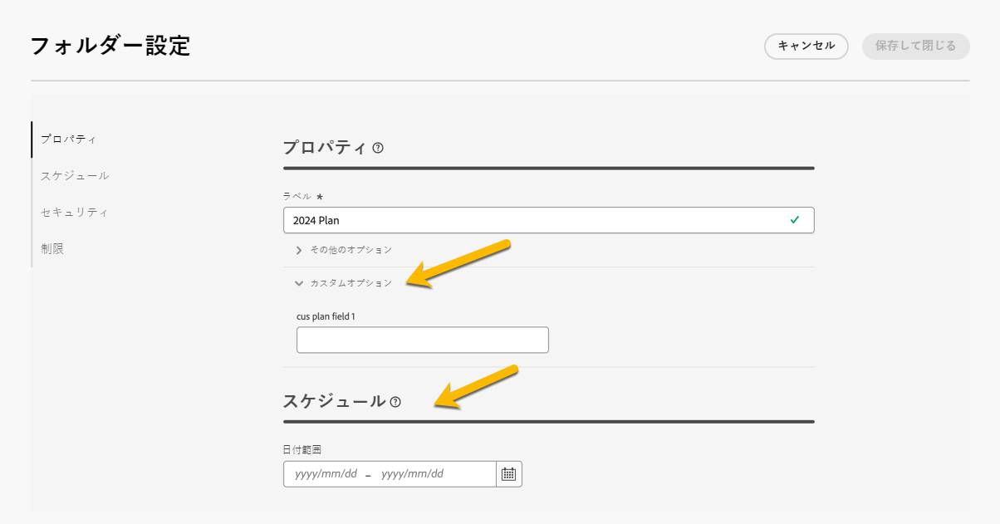{zoomable="yes"}</ph></source>
<target xml:lang="en-XX"><ph id="1" ctype="x-IMAGE">{zoomable="yes"}</ph></target>
</trans-unit>
<trans-unit id="tu16" xml:space="preserve">
<source xml:lang="en-US">To manage the <ph id="1" ctype="x-STRONG_EMPHASIS">**[!UICONTROL </ph>Custom options<ph id="3" ctype="x-LINK_REF">]**</ph>:</source>
<target xml:lang="en-XX"><ph id="1" ctype="x-STRONG_EMPHASIS">**[!UICONTROL </ph>カスタムオプション<ph id="3" ctype="x-LINK_REF">]**</ph>を管理するには：</target>
</trans-unit>
<trans-unit id="tu17" xml:space="preserve">
<source xml:lang="en-US">Browse to the <ph id="1" ctype="x-STRONG_EMPHASIS">**[!UICONTROL </ph>Schemas<ph id="3" ctype="x-LINK_REF">]**</ph>.</source>
<target xml:lang="en-XX"><ph id="1" ctype="x-STRONG_EMPHASIS">**[!UICONTROL </ph>スキーマ<ph id="3" ctype="x-LINK_REF">]**</ph>を参照します。</target>
</trans-unit>
<trans-unit id="tu18" xml:space="preserve">
<source xml:lang="en-US">Choose the <ph id="1" ctype="x-STRONG_EMPHASIS">**[!UICONTROL </ph>Editable<ph id="3" ctype="x-LINK_REF">]**</ph> schemas in the filters.</source>
<target xml:lang="en-XX">フィルターで<ph id="1" ctype="x-STRONG_EMPHASIS">**[!UICONTROL </ph>編集可能<ph id="3" ctype="x-LINK_REF">]**</ph>なスキーマを選択します。</target>
</trans-unit>
<trans-unit id="tu19" xml:space="preserve">
<source xml:lang="en-US">Click the schema.</source>
<target xml:lang="en-XX">スキーマをクリックします。</target>
</trans-unit>
<trans-unit id="tu20" xml:space="preserve">
<source xml:lang="en-US"><ph id="1" ctype="x-IMAGE">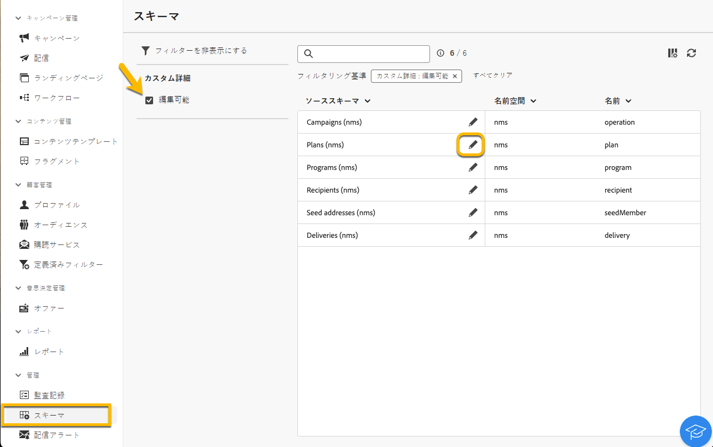{zoomable="yes"}</ph></source>
<target xml:lang="en-XX"><ph id="1" ctype="x-IMAGE">{zoomable="yes"}</ph></target>
</trans-unit>
<trans-unit id="tu21" xml:space="preserve">
<source xml:lang="en-US">Click the <ph id="1" ctype="x-STRONG_EMPHASIS">**[!UICONTROL </ph>Screen edition<ph id="3" ctype="x-LINK_REF">]**</ph> button.</source>
<target xml:lang="en-XX">「<ph id="1" ctype="x-STRONG_EMPHASIS">**[!UICONTROL </ph>画面の編集<ph id="3" ctype="x-LINK_REF">]**</ph>」ボタンをクリックします。</target>
</trans-unit>
<trans-unit id="tu22" xml:space="preserve">
<source xml:lang="en-US"><ph id="1" ctype="x-IMAGE">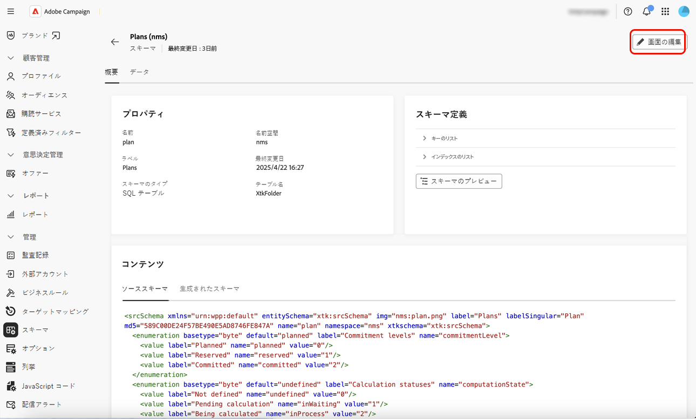{zoomable="yes"}</ph></source>
<target xml:lang="en-XX"><ph id="1" ctype="x-IMAGE">{zoomable="yes"}</ph></target>
</trans-unit>
<trans-unit id="tu23" xml:space="preserve">
<source xml:lang="en-US">Configure the custom options:</source>
<target xml:lang="en-XX">カスタムオプションを設定します。</target>
</trans-unit>
<trans-unit id="tu24" xml:space="preserve">
<source xml:lang="en-US"><ph id="1" ctype="x-IMAGE">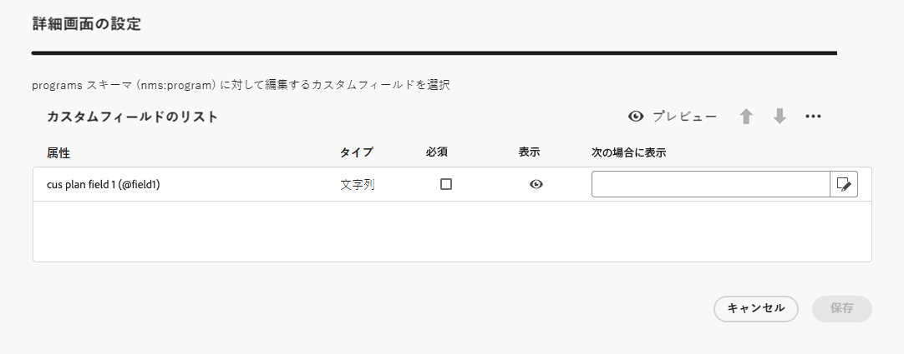{zoomable="yes"}</ph></source>
<target xml:lang="en-XX"><ph id="1" ctype="x-IMAGE">{zoomable="yes"}</ph></target>
</trans-unit>
<trans-unit id="tu25" xml:space="preserve">
<source xml:lang="en-US">Create and configure a program</source>
<target xml:lang="en-XX">プログラムの作成と設定</target>
</trans-unit>
<trans-unit id="tu26" xml:space="preserve">
<source xml:lang="en-US">Programs are available from the left navigation menu, similar to the list views for campaigns, deliveries, and workflows. The <ph id="1" ctype="x-STRONG_EMPHASIS">**[!UICONTROL </ph>Programs<ph id="3" ctype="x-LINK_REF">]**</ph> entry lets you create a program within an existing program, not under a plan.</source>
<target xml:lang="en-XX">プログラムは、キャンペーン、配信、ワークフローのリスト表示と同様に、プログラムは左側のナビゲーションメニューから使用できます。<ph id="1" ctype="x-STRONG_EMPHASIS">**[!UICONTROL </ph>プログラム<ph id="3" ctype="x-LINK_REF">]**</ph>エントリでは、プランの下ではなく、既存のプログラム内にプログラムを作成できます。</target>
</trans-unit>
<trans-unit id="tu27" xml:space="preserve">
<source xml:lang="en-US">To create your first, top-level program in a plan, navigate to your plan in the Explorer (see this <ph id="1" ctype="x-LINK">[</ph>section<ph id="2" ctype="x-LINK">](#create-plan)</ph>), and create a folder with the folder type <ph id="3" ctype="x-STRONG_EMPHASIS">**[!UICONTROL </ph>Program<ph id="5" ctype="x-LINK_REF">]**</ph>. <ph id="7" ctype="x-LINK">[</ph>Learn more about creating a folder<ph id="8" ctype="x-LINK">](../get-started/work-with-folders.md)</ph>.</source>
<target xml:lang="en-XX">プランに最初の上位レベルのプログラムを作成するには、エクスプローラーでプランに移動し（この<ph id="1" ctype="x-LINK">[</ph>節<ph id="2" ctype="x-LINK">](#create-plan)</ph>を参照）、フォルダータイプが<ph id="3" ctype="x-STRONG_EMPHASIS">**[!UICONTROL </ph>プログラム<ph id="5" ctype="x-LINK_REF">]**</ph>のフォルダーを作成します。<ph id="7" ctype="x-LINK">[</ph>詳しくは、フォルダーの作成を参照してください<ph id="8" ctype="x-LINK">](../get-started/work-with-folders.md)</ph>。</target>
</trans-unit>
<trans-unit id="tu28" xml:space="preserve">
<source xml:lang="en-US">To create a program within an existing program, follow the steps below:</source>
<target xml:lang="en-XX">既存のプログラム内にプログラムを作成するには、次の手順に従います。</target>
</trans-unit>
<trans-unit id="tu29" xml:space="preserve">
<source xml:lang="en-US">Browse to the <ph id="1" ctype="x-STRONG_EMPHASIS">**[!UICONTROL </ph>Programs<ph id="3" ctype="x-LINK_REF">]**</ph> entry in the left navigation menu. This view lists all your programs and lets you search and filter. Clicking a program opens it in the Explorer view.</source>
<target xml:lang="en-XX">左側のナビゲーションメニューで<ph id="1" ctype="x-STRONG_EMPHASIS">**[!UICONTROL </ph>プログラム<ph id="3" ctype="x-LINK_REF">]**</ph>エントリに移動します。このビューには、すべてのプログラムが一覧表示され、検索やフィルタリングを実行できます。プログラムをクリックすると、エクスプローラービューで開きます。</target>
</trans-unit>
<trans-unit id="tu30" xml:space="preserve">
<source xml:lang="en-US"><ph id="1" ctype="x-IMAGE">{zoomable="yes"}</ph></source>
<target xml:lang="en-XX"><ph id="1" ctype="x-IMAGE">{zoomable="yes"}</ph></target>
</trans-unit>
<trans-unit id="tu31" xml:space="preserve">
<source xml:lang="en-US">Click <ph id="1" ctype="x-STRONG_EMPHASIS">**[!UICONTROL </ph>Create program<ph id="3" ctype="x-LINK_REF">]**</ph> and configure the following options:</source>
<target xml:lang="en-XX">「<ph id="1" ctype="x-STRONG_EMPHASIS">**[!UICONTROL </ph>プログラムを作成<ph id="3" ctype="x-LINK_REF">]**</ph>」をクリックし、次のオプションを設定します。</target>
</trans-unit>
<trans-unit id="tu32" xml:space="preserve">
<source xml:lang="en-US"><ph id="1" ctype="x-IMAGE">{zoomable="yes"}</ph></source>
<target xml:lang="en-XX"><ph id="1" ctype="x-IMAGE">{zoomable="yes"}</ph></target>
</trans-unit>
<trans-unit id="tu33" xml:space="preserve">
<source xml:lang="en-US">Enter a <ph id="1" ctype="x-STRONG_EMPHASIS">**[!UICONTROL </ph>Label<ph id="3" ctype="x-LINK_REF">]**</ph>.</source>
<target xml:lang="en-XX"><ph id="1" ctype="x-STRONG_EMPHASIS">**[!UICONTROL </ph>ラベル<ph id="3" ctype="x-LINK_REF">]**</ph>を入力します。</target>
</trans-unit>
<trans-unit id="tu34" xml:space="preserve">
<source xml:lang="en-US">Select the existing program to use as the <ph id="1" ctype="x-STRONG_EMPHASIS">**[!UICONTROL </ph>Parent folder<ph id="3" ctype="x-LINK_REF">]**</ph>.</source>
<target xml:lang="en-XX"><ph id="1" ctype="x-STRONG_EMPHASIS">**[!UICONTROL </ph>親フォルダー<ph id="3" ctype="x-LINK_REF">]**</ph>として使用する既存のプログラムを選択します。</target>
</trans-unit>
<trans-unit id="tu35" xml:space="preserve">
<source xml:lang="en-US">Optionally, set a <ph id="1" ctype="x-STRONG_EMPHASIS">**[!UICONTROL </ph>Date range<ph id="3" ctype="x-LINK_REF">]**</ph> in the <ph id="5" ctype="x-STRONG_EMPHASIS">**[!UICONTROL </ph>Schedule<ph id="7" ctype="x-LINK_REF">]**</ph> section.</source>
<target xml:lang="en-XX">オプションとして、「<ph id="5" ctype="x-STRONG_EMPHASIS">**[!UICONTROL </ph>スケジュール<ph id="7" ctype="x-LINK_REF">]**</ph>」セクションで<ph id="1" ctype="x-STRONG_EMPHASIS">**[!UICONTROL </ph>日付範囲<ph id="3" ctype="x-LINK_REF">]**</ph>を設定します。</target>
</trans-unit>
<trans-unit id="tu36" xml:space="preserve">
<source xml:lang="en-US"><ph id="1" ctype="x-regxph" equiv-text="[!TIP">[!TIP]</ph></source>
<target xml:lang="en-XX"><ph id="1" ctype="x-regxph" equiv-text="[!TIP">[!TIP]</ph></target>
</trans-unit>
<trans-unit id="tu37" xml:space="preserve">
<source xml:lang="en-US">If you create a program from the Explorer view, the parent folder is automatically set to the current program.</source>
<target xml:lang="en-XX">エクスプローラービューからプログラムを作成すると、親フォルダーが現在のプログラムに自動的に設定されます。</target>
</trans-unit>
<trans-unit id="tu38" xml:space="preserve">
<source xml:lang="en-US">Click <ph id="1" ctype="x-STRONG_EMPHASIS">**[!UICONTROL </ph>Create program<ph id="3" ctype="x-LINK_REF">]**</ph> again to save changes and create the program. The program is then displayed in the Explorer view. You can rename it, delete it, and access its settings, like any other folder. You can also create sub-programs within this program.</source>
<target xml:lang="en-XX">「<ph id="1" ctype="x-STRONG_EMPHASIS">**[!UICONTROL </ph>プログラムを作成<ph id="3" ctype="x-LINK_REF">]**</ph>」をもう一度クリックして、変更を保存し、プログラムを作成します。その後、エクスプローラービューにプログラムが表示されます。他のフォルダーと同様に、名前変更や削除を行ったり、設定にアクセスしたりできます。また、このプログラム内でサブプログラムを作成することもできます。</target>
</trans-unit>
<trans-unit id="tu39" xml:space="preserve">
<source xml:lang="en-US"><ph id="1" ctype="x-IMAGE">{zoomable="yes"}</ph></source>
<target xml:lang="en-XX"><ph id="1" ctype="x-IMAGE">{zoomable="yes"}</ph></target>
</trans-unit>
<trans-unit id="tu40" xml:space="preserve">
<source xml:lang="en-US">Custom options for a program are configured the same way as for a plan. See <ph id="1" ctype="x-LINK">[</ph>Create and configure a plan<ph id="2" ctype="x-LINK">](#create-plan)</ph>.</source>
<target xml:lang="en-XX">プログラムのカスタムオプションは、プランと同様に設定します。<ph id="1" ctype="x-LINK">[</ph>プランの作成と設定<ph id="2" ctype="x-LINK">](#create-plan)</ph>を参照してください。</target>
</trans-unit>
<trans-unit id="tu41" xml:space="preserve">
<source xml:lang="en-US">How to link a campaign to a program</source>
<target xml:lang="en-XX">キャンペーンをプログラムにリンクする方法</target>
</trans-unit>
<trans-unit id="tu42" xml:space="preserve">
<source xml:lang="en-US">You have two ways to link a campaign to a program:</source>
<target xml:lang="en-XX">キャンペーンをプログラムにリンクするには、次の 2 つの方法があります。</target>
</trans-unit>
<trans-unit id="tu43" xml:space="preserve">
<source xml:lang="en-US">Way #1: You already have a program and want to create a campaign linked to it</source>
<target xml:lang="en-XX">方法 1：既にプログラムがあり、このプログラムにリンクされたキャンペーンを作成する場合</target>
</trans-unit>
<trans-unit id="tu44" xml:space="preserve">
<source xml:lang="en-US">To link a new campaign to your program, create the campaign directly within the program.</source>
<target xml:lang="en-XX">新しいキャンペーンをプログラムにリンクするには、プログラム内でキャンペーンを直接作成します。</target>
</trans-unit>
<trans-unit id="tu45" xml:space="preserve">
<source xml:lang="en-US"><ph id="1" ctype="x-IMAGE">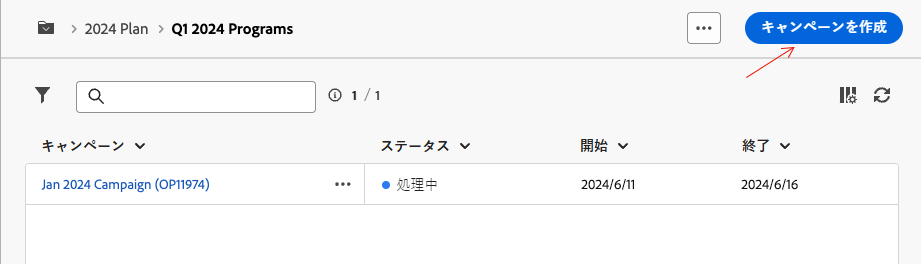{zoomable="yes"}</ph></source>
<target xml:lang="en-XX"><ph id="1" ctype="x-IMAGE">{zoomable="yes"}</ph></target>
</trans-unit>
<trans-unit id="tu46" xml:space="preserve">
<source xml:lang="en-US">The <ph id="1" ctype="x-STRONG_EMPHASIS">**[!UICONTROL </ph>Folder<ph id="3" ctype="x-LINK_REF">]**</ph> settings will automatically populate with the path to your program.</source>
<target xml:lang="en-XX"><ph id="1" ctype="x-STRONG_EMPHASIS">**[!UICONTROL </ph>フォルダー<ph id="3" ctype="x-LINK_REF">]**</ph>設定は、プログラムへのパスと共に自動的に入力されます。</target>
</trans-unit>
<trans-unit id="tu47" xml:space="preserve">
<source xml:lang="en-US"><ph id="1" ctype="x-IMAGE">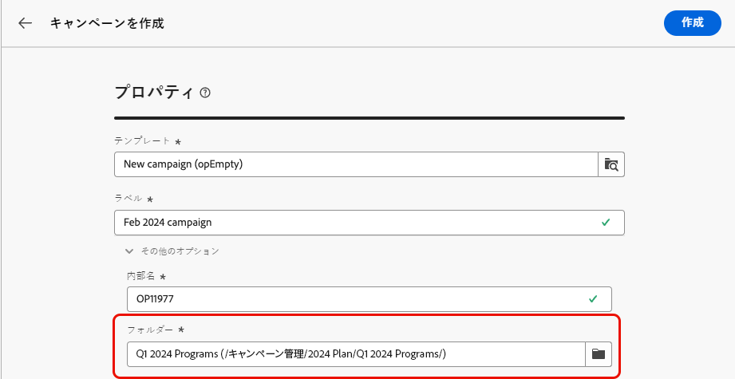{zoomable="yes"}</ph></source>
<target xml:lang="en-XX"><ph id="1" ctype="x-IMAGE">{zoomable="yes"}</ph></target>
</trans-unit>
<trans-unit id="tu48" xml:space="preserve">
<source xml:lang="en-US">Way #2: You already have an existing campaign and want to link it to an existing program</source>
<target xml:lang="en-XX">方法 2：既にキャンペーンがあり、このキャンペーンを既存のプログラムにリンクする場合</target>
</trans-unit>
<trans-unit id="tu49" xml:space="preserve">
<source xml:lang="en-US">Go to the <ph id="1" ctype="x-STRONG_EMPHASIS">**[!UICONTROL </ph>Settings<ph id="3" ctype="x-LINK_REF">]**</ph> button of the campaign you want to link to your program.</source>
<target xml:lang="en-XX">プログラムにリンクするキャンペーンの「<ph id="1" ctype="x-STRONG_EMPHASIS">**[!UICONTROL </ph>設定<ph id="3" ctype="x-LINK_REF">]**</ph>」ボタンに移動します。</target>
</trans-unit>
<trans-unit id="tu50" xml:space="preserve">
<source xml:lang="en-US"><ph id="1" ctype="x-IMAGE">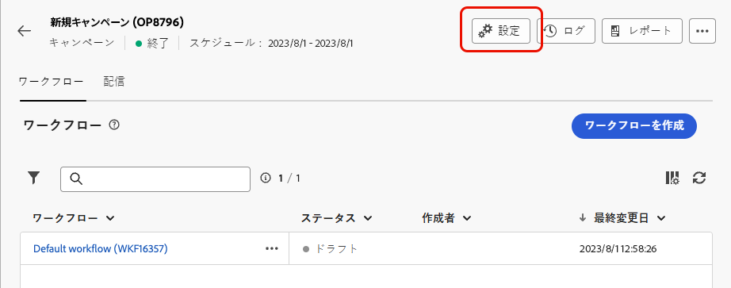{zoomable="yes"}</ph></source>
<target xml:lang="en-XX"><ph id="1" ctype="x-IMAGE">{zoomable="yes"}</ph></target>
</trans-unit>
<trans-unit id="tu51" xml:space="preserve">
<source xml:lang="en-US">In its <ph id="1" ctype="x-STRONG_EMPHASIS">**[!UICONTROL </ph>Properties<ph id="3" ctype="x-LINK_REF">]**</ph>, click the <ph id="5" ctype="x-STRONG_EMPHASIS">**[!UICONTROL </ph>Folder<ph id="7" ctype="x-LINK_REF">]**</ph> icon in the <ph id="9" ctype="x-STRONG_EMPHASIS">**[!UICONTROL </ph>Folder<ph id="11" ctype="x-LINK_REF">]**</ph> settings to choose your <ph id="13" ctype="x-STRONG_EMPHASIS">**[!UICONTROL </ph>Program<ph id="15" ctype="x-LINK_REF">]**</ph> folder.</source>
<target xml:lang="en-XX"><ph id="13" ctype="x-STRONG_EMPHASIS">**[!UICONTROL </ph>プログラム<ph id="15" ctype="x-LINK_REF">]**</ph>フォルダーを選択するには、<ph id="1" ctype="x-STRONG_EMPHASIS">**[!UICONTROL </ph>プロパティ<ph id="3" ctype="x-LINK_REF">]**</ph>で<ph id="9" ctype="x-STRONG_EMPHASIS">**[!UICONTROL </ph>フォルダー<ph id="11" ctype="x-LINK_REF">]**</ph>設定の<ph id="5" ctype="x-STRONG_EMPHASIS">**[!UICONTROL </ph>フォルダー<ph id="7" ctype="x-LINK_REF">]**</ph>アイコンをクリックします。</target>
</trans-unit>
<trans-unit id="tu52" xml:space="preserve">
<source xml:lang="en-US"><ph id="1" ctype="x-IMAGE">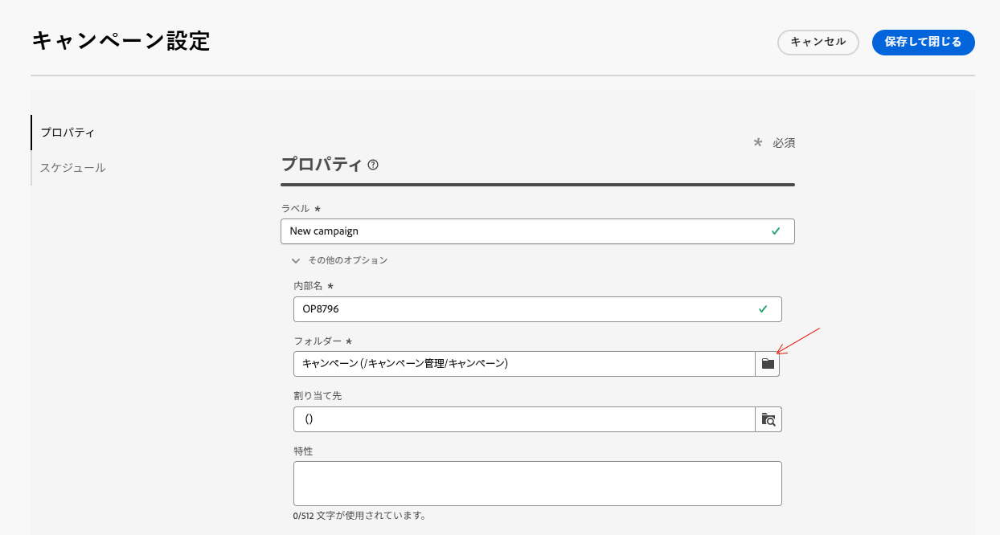{zoomable="yes"}</ph></source>
<target xml:lang="en-XX"><ph id="1" ctype="x-IMAGE">{zoomable="yes"}</ph></target>
</trans-unit>
<trans-unit id="tu53" xml:space="preserve">
<source xml:lang="en-US">Select your <ph id="1" ctype="x-STRONG_EMPHASIS">**[!UICONTROL </ph>Program<ph id="3" ctype="x-LINK_REF">]**</ph> folder, click the <ph id="5" ctype="x-STRONG_EMPHASIS">**[!UICONTROL </ph>Confirm<ph id="7" ctype="x-LINK_REF">]**</ph> button, and then click the <ph id="9" ctype="x-STRONG_EMPHASIS">**[!UICONTROL </ph>Save and Close<ph id="11" ctype="x-LINK_REF">]**</ph> button.</source>
<target xml:lang="en-XX"><ph id="1" ctype="x-STRONG_EMPHASIS">**[!UICONTROL </ph>プログラム<ph id="3" ctype="x-LINK_REF">]**</ph>フォルダーを選択し、「<ph id="5" ctype="x-STRONG_EMPHASIS">**[!UICONTROL </ph>確認<ph id="7" ctype="x-LINK_REF">]**</ph>」ボタンをクリックして、「<ph id="9" ctype="x-STRONG_EMPHASIS">**[!UICONTROL </ph>保存して閉じる<ph id="11" ctype="x-LINK_REF">]**</ph>」ボタンをクリックします。</target>
</trans-unit>
<trans-unit id="tu54" xml:space="preserve">
<source xml:lang="en-US"><ph id="1" ctype="x-IMAGE">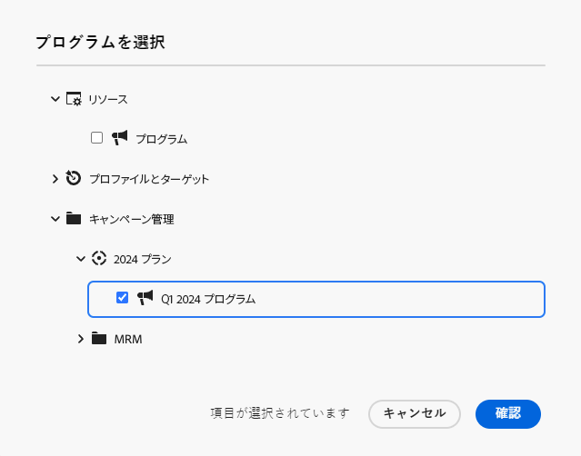{zoomable="yes"}</ph></source>
<target xml:lang="en-XX"><ph id="1" ctype="x-IMAGE">{zoomable="yes"}</ph></target>
</trans-unit>
<trans-unit id="tu55" xml:space="preserve">
<source xml:lang="en-US">Your campaign is now listed in your program.</source>
<target xml:lang="en-XX">キャンペーンがプログラムにリストされました。</target>
</trans-unit>
<trans-unit id="tu56" xml:space="preserve">
<source xml:lang="en-US"><ph id="1" ctype="x-IMAGE">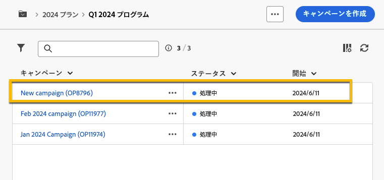{zoomable="yes"}</ph></source>
<target xml:lang="en-XX"><ph id="1" ctype="x-IMAGE">{zoomable="yes"}</ph></target>
</trans-unit>
</body>
</file>
</xliff>