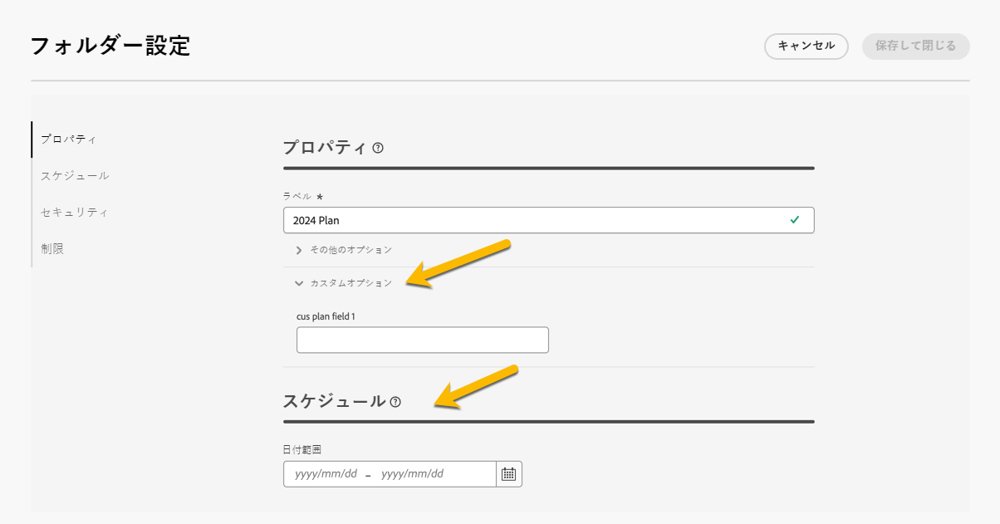
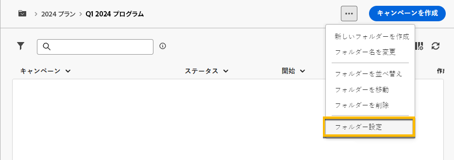
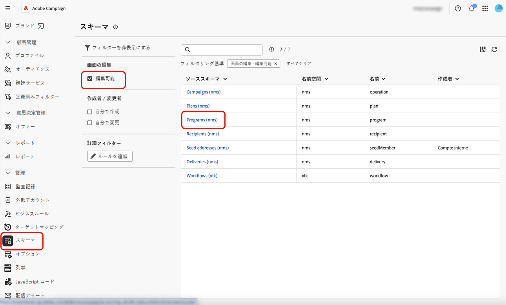

# プランとプログラム

Adobe Campaignでは、マーケティングプランおよびプログラムのフォルダー階層を設定できます。

より適切に整理するために、Adobeでは次の階層をお勧めします。計画 `>` プログラム `>` キャンペーン

* A **計画** 複数のプログラムを含めることができます。 一定期間の戦略目標を定義します。
* A **プログラム** キャンペーン、ワークフロー、ランディングページなど、他のプログラムも含めることができます。
* A **campaign** には、配信、ワークフロー、ランディングページが含まれる場合があります。

## プランの作成と設定 {#create-plan}

プランを作成するには、フォルダータイプを持つフォルダーを作成する必要があります **[!UICONTROL プラン]** [フォルダー作成の詳細情報](create-manage-folder.md).

{zoomable="yes"}

に移動します **[!UICONTROL フォルダー設定]** 管理する計画を持っています。

{zoomable="yes"}

以下を定義できます。 **[!UICONTROL カスタムオプション]**、および計画のスケジュール日を設定します。

{zoomable="yes"}

を管理するには  **[!UICONTROL カスタムオプション]**:

1. を参照してください。 **[!UICONTROL スキーマ]**
1. を選択します。 **[!UICONTROL 編集可能]** フィルターのスキーマ
1. アイコンをクリックする **[!UICONTROL カスタム詳細の編集]**

{zoomable="yes"}

次の設定を行うことができます。

{zoomable="yes"}

## プログラムの作成と設定

プランでプログラムを作成するには、次を行います（[プラン作成の詳細情報](#create-plan)）を選択し、フォルダータイプのフォルダーを作成する必要があります **[!UICONTROL プログラム]** [フォルダー作成の詳細情報](create-manage-folder.md).

{zoomable="yes"}

に移動します **[!UICONTROL フォルダー設定]** 管理するプログラムの。

{zoomable="yes"}

以下を定義できます。 **[!UICONTROL カスタムオプション]**、およびプログラムのスケジュール日を設定します。

{zoomable="yes"}

を管理するには  **[!UICONTROL カスタムオプション]**:

1. を参照してください。 **[!UICONTROL スキーマ]**
1. を選択します。 **[!UICONTROL 編集可能]** フィルターのスキーマ
1. アイコンをクリックする **[!UICONTROL カスタム詳細の編集]**

{zoomable="yes"}

これらを設定できます。

{zoomable="yes"}

## キャンペーンをプログラムにリンクする方法

キャンペーンをプログラムにリンクするには、次の 2 つの方法があります。

### 方法#1：既にプログラムがあり、そのプログラムにリンクされたキャンペーンを作成する必要があります

新しいキャンペーンをプログラムにリンクするには、プログラムでキャンペーンを直接作成します。

{zoomable="yes"}

この **[!UICONTROL フォルダー]** 設定は、プログラムへのパスと共に自動的に入力されます。

{zoomable="yes"}

### 方法#2 既にキャンペーンがあり、既存のプログラムにリンクしたい場合

に移動します **[!UICONTROL 設定]** プログラムにリンクするキャンペーンのボタン：

{zoomable="yes"}

その中で **[!UICONTROL プロパティ]**&#x200B;を選択し、 **[!UICONTROL フォルダー]** アイコン **[!UICONTROL フォルダー]** 設定（を選択するために使用） **[!UICONTROL プログラム]** フォルダー。

{zoomable="yes"}

を選択 **[!UICONTROL プログラム]** フォルダーを開き、クリックします。 **[!UICONTROL 確認]** ボタン、次にオン **[!UICONTROL 保存して閉じる]** ボタン。

{zoomable="yes"}

キャンペーンがプログラムにリストされました。

{zoomable="yes"}