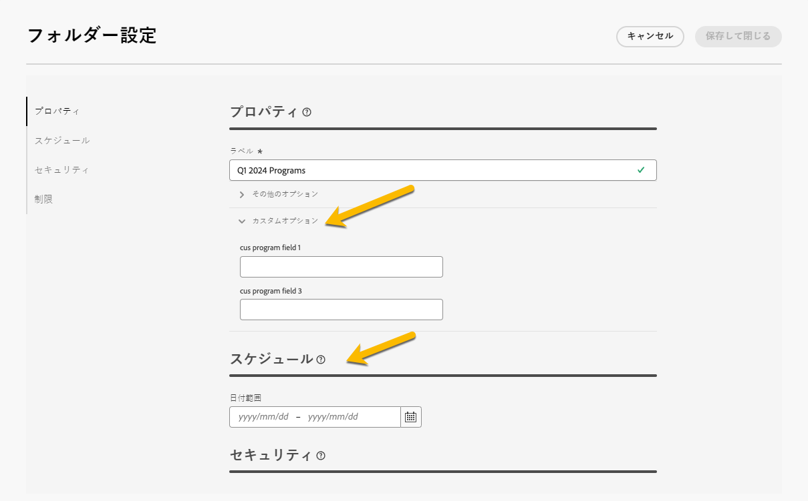
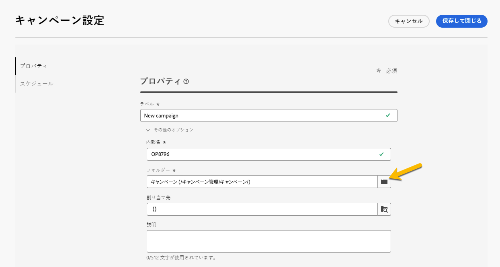

# プランとプログラム {#plan-and-programs}

>[!CONTEXTUALHELP]
>id="acw_homepage_welcome_rn3"
>title="プランとプログラム"
>abstract="Campaign web ユーザーインターフェイスで、マーケティングプランおよびプログラムのフォルダー階層を設定できるようになりました。"
>additional-url="https://experienceleague.adobe.com/docs/campaign-web/v8/release-notes/release-notes.html?lang=ja" text="リリースノートを参照してください"

Adobe Campaign では、マーケティングのプランとプログラムに関するフォルダー階層構造を設定できます。

より適切に整理するために、アドビではプラン`>`プログラム`>` キャンペーンの階層を使用することをお勧めします。

* **プラン**&#x200B;には複数のプログラムを含めることができます。一定期間の戦略目標を定義します。
* **プログラム**&#x200B;には、キャンペーン、ワークフロー、ランディングページに加えて、他のプログラムを含めることができます。
* **キャンペーン**&#x200B;には、配信、ワークフロー、ランディングページを含めることができます。

## プランの作成と設定 {#create-plan}

プランを作成するには、フォルダータイプが&#x200B;**[!UICONTROL プラン]**&#x200B;のフォルダーを作成する必要があります。[詳しくは、フォルダーの作成を参照してください](../get-started/work-with-folders.md)。

{zoomable="yes"}

プランを管理するには、プランの&#x200B;**[!UICONTROL フォルダー設定]**&#x200B;に移動します。

{zoomable="yes"}

**[!UICONTROL カスタムオプション]**&#x200B;を定義し、プランのスケジュール日を設定できます。

{zoomable="yes"}

**[!UICONTROL カスタムオプション]**&#x200B;を管理するには：

1. **[!UICONTROL スキーマ]**&#x200B;を参照します
1. フィルターで&#x200B;**[!UICONTROL 編集可能]**&#x200B;なスキーマを選択します
1. **[!UICONTROL カスタム詳細を編集]**&#x200B;のアイコンをクリックします

{zoomable="yes"}

次の設定を行うことができます。

{zoomable="yes"}

## プログラムの作成と設定

プランにプログラムを作成するには（[詳しくは、プランの作成を参照してください](#create-plan)）、プラン内で、フォルダータイプが&#x200B;**[!UICONTROL プログラム]**&#x200B;のフォルダーを作成する必要があります。[詳しくは、フォルダーの作成を参照してください](../get-started/work-with-folders.md)。

{zoomable="yes"}

プログラムを管理するには、プログラムの&#x200B;**[!UICONTROL フォルダー設定]**&#x200B;に移動します。

{zoomable="yes"}

**[!UICONTROL カスタムオプション]**&#x200B;を定義し、プログラムのスケジュール日を設定できます。

{zoomable="yes"}

**[!UICONTROL カスタムオプション]**&#x200B;を管理するには：

1. **[!UICONTROL スキーマ]**&#x200B;を参照します
1. フィルターで&#x200B;**[!UICONTROL 編集可能]**&#x200B;なスキーマを選択します
1. **[!UICONTROL カスタム詳細を編集]**&#x200B;のアイコンをクリックします

{zoomable="yes"}

次の設定を行うことができます。

{zoomable="yes"}

## キャンペーンをプログラムにリンクする方法

キャンペーンをプログラムにリンクするには、次の 2 つの方法があります。

### 方法#1：既にプログラムがあり、そのプログラムにリンクしたキャンペーンを作成したい

新しいキャンペーンをプログラムにリンクするには、プログラム内でキャンペーンを直接作成します。

{zoomable="yes"}

**[!UICONTROL フォルダー]**&#x200B;設定は、プログラムへのパスと共に自動的に入力されます。

{zoomable="yes"}

### 方法#2：既にキャンペーンがあり、既存のプログラムにリンクしたい場合

プログラムにリンクするキャンペーンの「**[!UICONTROL 設定]**」ボタンに移動します。

{zoomable="yes"}

**[!UICONTROL プログラム]**&#x200B;フォルダーを選択するには、**[!UICONTROL プロパティ]**&#x200B;で&#x200B;**[!UICONTROL フォルダー]**&#x200B;設定の&#x200B;**[!UICONTROL フォルダー]**&#x200B;アイコンをクリックします。

{zoomable="yes"}

**[!UICONTROL プログラム]**&#x200B;フォルダーを選択し、「**[!UICONTROL 確認]**」ボタンをクリックして、「**[!UICONTROL 保存して閉じる]**」ボタンをクリックします。

{zoomable="yes"}

キャンペーンがプログラムにリストされました。

{zoomable="yes"}
