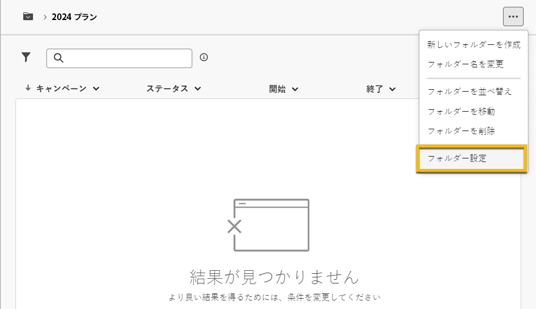
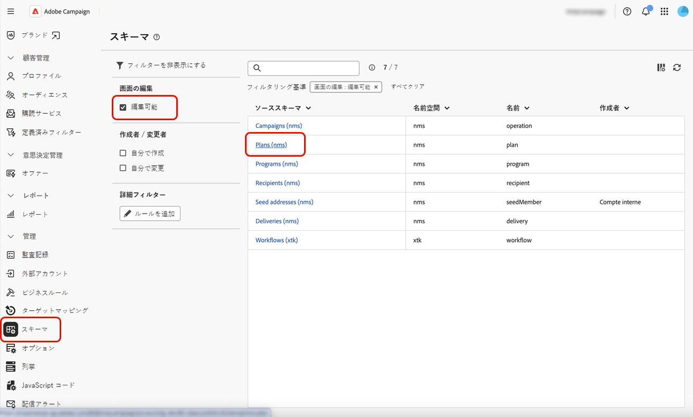
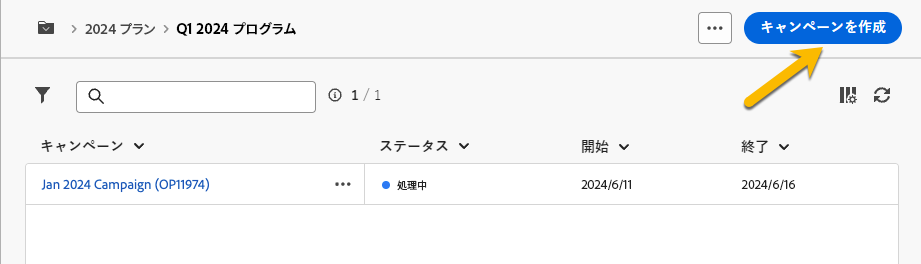
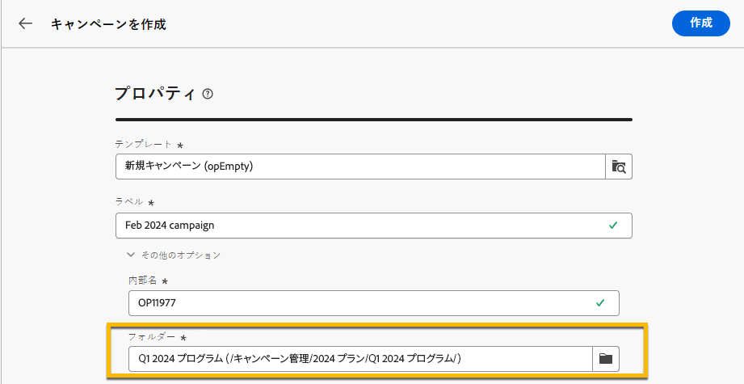
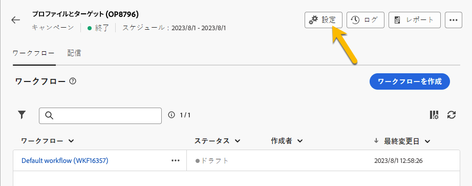

# プランとプログラム {#plan-and-programs}

Adobe Campaign では、マーケティングのプランとプログラムに関するフォルダー階層構造を設定できます。

これらのコンポーネントをより適切に整理するために、Adobeでは、プログラムとキャンペーン `>` プランの階層を使用するこ `>` をお勧めします。

* **プラン**&#x200B;には複数のプログラムを含めることができます。特定の期間の戦略目標を定義します。
* **プログラム** には、キャンペーン、ワークフロー、ランディングページだけでなく、他のプログラムも含まれる場合があります。
* **キャンペーン** には、配信、ワークフロー、ランディングページを含めることができます。

## プランの作成と設定 {#create-plan}

プランを作成するには、フォルダータイプが **[!UICONTROL プラン]** のフォルダーを作成します。 [ フォルダー作成の詳細情報 ](../get-started/work-with-folders.md)

{zoomable="yes"}

プランを管理するには、プランの&#x200B;**[!UICONTROL フォルダー設定]**&#x200B;に移動します。

{zoomable="yes"}

**[!UICONTROL カスタムオプション]** を定義し、プランのスケジュール日を設定します。

{zoomable="yes"}

**[!UICONTROL カスタムオプション]** を管理するには：

1. **[!UICONTROL スキーマ]** を参照します。
1. フィルターで **[!UICONTROL 編集可能]** スキーマを選択します。
1. スキーマをクリックします。

{zoomable="yes"}

1. 「**[!UICONTROL 画面編集]**」ボタンをクリックします。

   {zoomable="yes"}

カスタムオプションを設定します。

{zoomable="yes"}

## プログラムの作成と設定

プランにプログラムを作成するには（[ プラン作成の詳細情報 ](#create-plan)）、プランに移動し、フォルダータイプが **[!UICONTROL プログラム]** のフォルダーを作成します。 [ フォルダー作成の詳細情報 ](../get-started/work-with-folders.md)。

{zoomable="yes"}

プログラムを管理するには、プログラムの&#x200B;**[!UICONTROL フォルダー設定]**&#x200B;に移動します。

{zoomable="yes"}

**[!UICONTROL カスタムオプション]** を定義し、プログラムのスケジュール日を設定します。

{zoomable="yes"}

**[!UICONTROL カスタムオプション]** を管理するには：

1. **[!UICONTROL スキーマ]** を参照します。
1. フィルターで **[!UICONTROL 編集可能]** スキーマを選択します。
1. スキーマをクリックします。

{zoomable="yes"}

1. 「**[!UICONTROL 画面編集]**」ボタンをクリックします。

   {zoomable="yes"}

カスタムオプションを設定します。

{zoomable="yes"}

## キャンペーンをプログラムにリンクする方法

キャンペーンをプログラムにリンクするには、次の 2 つの方法があります。

### 方法 1：既にプログラムがあり、このプログラムにリンクされたキャンペーンを作成する場合

新しいキャンペーンをプログラムにリンクするには、プログラム内で直接キャンペーンを作成します。

{zoomable="yes"}

**[!UICONTROL フォルダー]** 設定には、プログラムへのパスが自動的に入力されます。

{zoomable="yes"}

### 方法 2：既にキャンペーンがあり、このキャンペーンを既存のプログラムにリンクする場合

プログラムにリンクするキャンペーンの **[!UICONTROL 設定]** ボタンに移動します。

{zoomable="yes"}

**[!UICONTROL プロパティ]** で、**[!UICONTROL フォルダー]** 設定の **[!UICONTROL フォルダー]** アイコンをクリックして、**[!UICONTROL プログラム]** フォルダーを選択します。

{zoomable="yes"}

**[!UICONTROL プログラム]** フォルダーを選択し、「**[!UICONTROL 確認]**」ボタンをクリックしてから、「**[!UICONTROL 保存して閉じる]**」ボタンをクリックします。

{zoomable="yes"}

キャンペーンがプログラムにリストされました。

{zoomable="yes"}