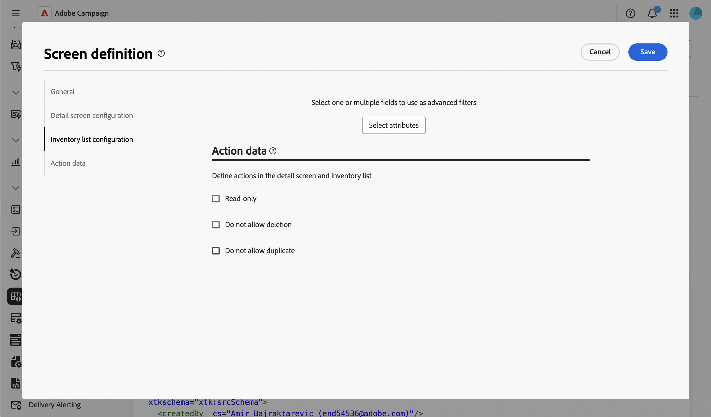
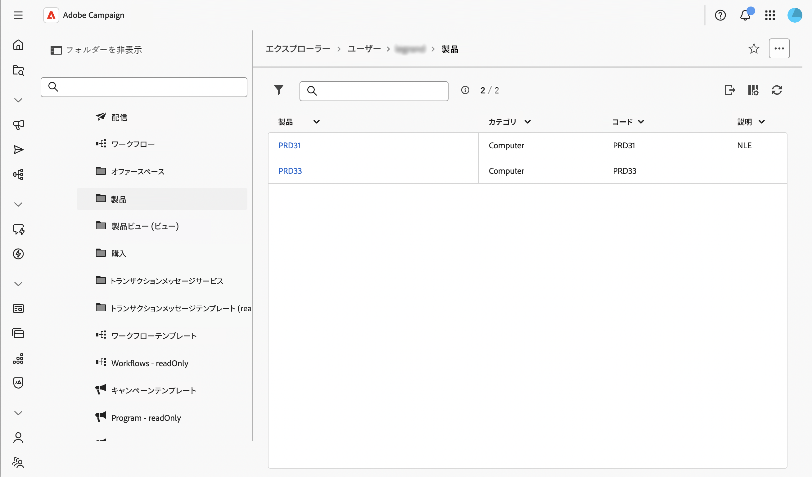
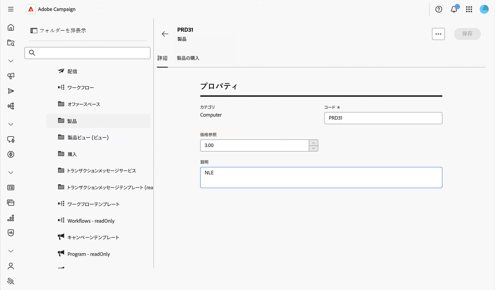

# データに対するアクションを制御 {#action-data}

>[!CONTEXTUALHELP]
>id="acw_schema_action_data"
>title="アクションデータ"
>abstract="スキーマの詳細画面とリスト画面で使用できるアクションを設定します。 「**[!UICONTROL 読み取り専用]**」を有効にして詳細画面を読み取り専用として設定し、リストからアクションを削除します。 「**[!UICONTROL 削除を許可しない]**」を有効にして、詳細画面とリスト画面から削除アクションを削除します。"

「**[!UICONTROL アクションデータ]**」セクションでは、個々のフォルダーで設定された[セキュリティルール](../get-started/work-with-folders.md)に関係なく、カスタムスキーマのレコードで使用できるアクションを制限できます。 この制限は、管理者を含むすべてのユーザーに対して、すべてのフォルダーのスキーマレベルで適用されます。

>[!NOTE]
>
>このセクションは、カスタムスキーマでのみ使用できます。

画面の定義画面とそのアクセス方法について詳しくは、[画面の定義へのアクセス](schemas-browse-access.md#screen-def)の節を参照してください。

アクションデータを設定するには、次の手順に従います。

1. **[!UICONTROL スキーマ]**&#x200B;メニューを参照し、フィルターを使用して編集可能なスキーマを見つけます。

1. リストでスキーマ名を選択して開き、スキーマ詳細ビューの「**[!UICONTROL 画面の編集]**」をクリックし、画面の定義にアクセスします。

1. 画面定義の下部にある「**[!UICONTROL アクションデータ]**」セクションまで下にスクロールします。

   

1. 使用可能なオプションの1つ以上を選択します。

   * **[!UICONTROL 読み取り専用]**：詳細画面は、すべてのユーザーに対して読み取り専用になります。 リストから使用できる作成、複製、更新、削除アクションはなく、詳細画面では削除アクションと複製アクションが非表示になっています。 このオプションの選択は、ビューの設定と似ています。ユーザーは引き続きレコードを開き、再利用（例：配信をターゲットにする場合）できますが、レコードは変更できません。

   * **[!UICONTROL 削除を許可しない]**：削除アクションは、すべてのフォルダーの詳細画面とリストから削除されます。 作成、複製、更新など、その他のアクションは引き続き使用できます。

   * **[!UICONTROL 重複を許可しません]**：重複するアクションは、すべてのフォルダーの詳細画面とリストから削除されます。 作成、削除、更新など、その他のアクションは引き続き使用できます。

     >[!NOTE]
     >
     >**[!UICONTROL 読み取り専用]**&#x200B;を有効にすると、削除と複製も自動的にカバーされるので、**[!UICONTROL 削除を許可しない]**&#x200B;および&#x200B;**[!UICONTROL 重複を許可しない]** オプションは無効になり、**[!UICONTROL 読み取り専用]**&#x200B;が選択されています。

1. 「**[!UICONTROL 保存]**」をクリックします。

1. このスキーマのレコードリストを参照して、結果を確認します。

   この例では、**[!UICONTROL 読み取り専用]**&#x200B;が有効になっています。リストに複製アクションと削除アクションが表示されなくなりました。

   

1. レコードを開き、詳細画面を確認します。 編集を許可せずにフィールドが表示されます。

   
