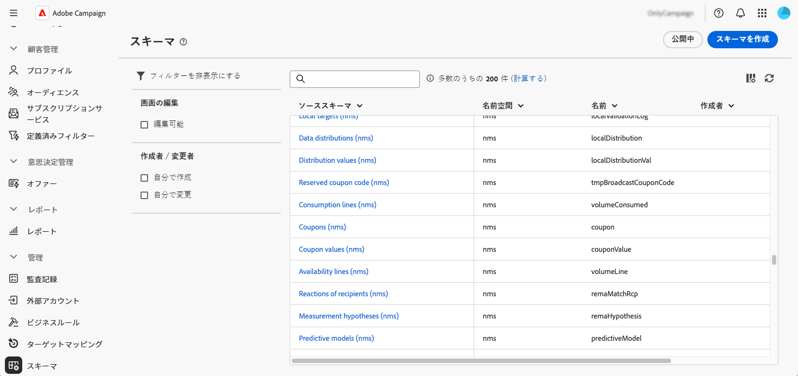
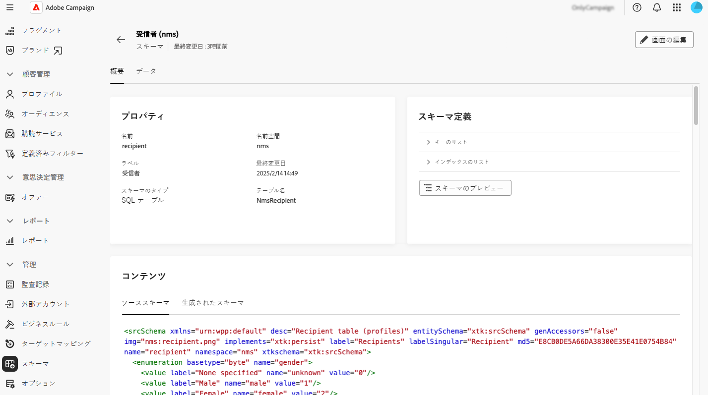
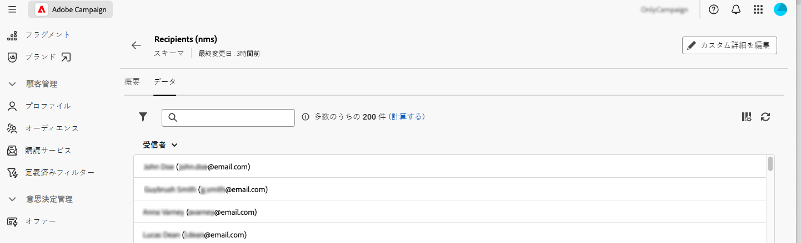
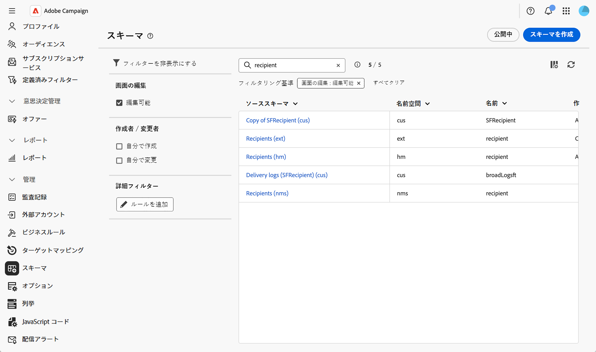
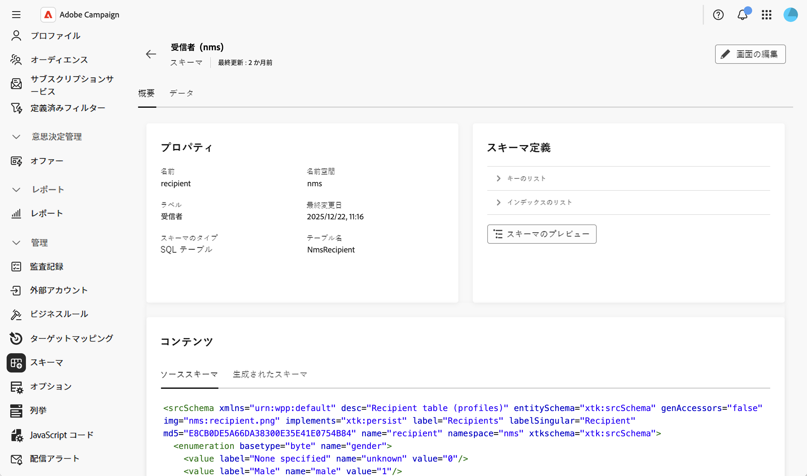
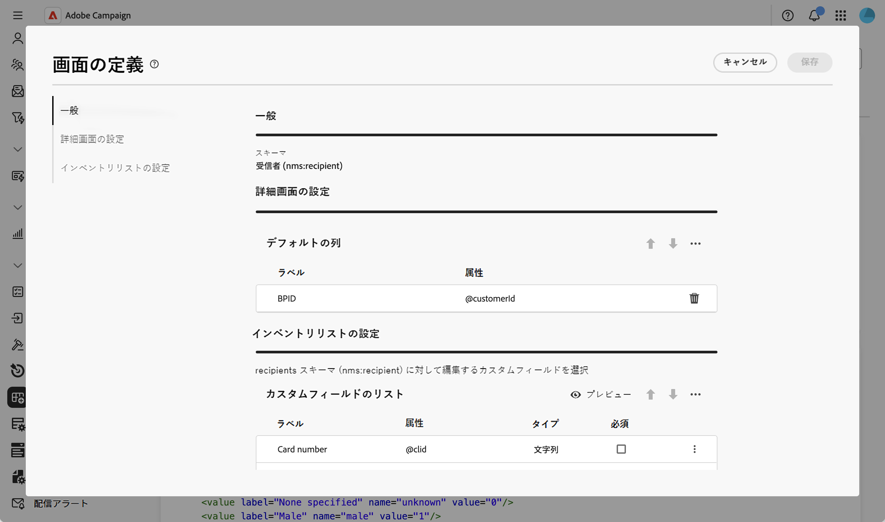

# アクセスと設定のスキーマ {#access}

>[!CONTEXTUALHELP]
>id="acw_schema_action_data"
>title="データに対するアクション"
>abstract="スキーマの詳細画面とリスト画面で使用できるアクションを設定します。 **[!UICONTROL 読み取り専用]**&#x200B;を有効にして、詳細画面を読み取り専用として設定し、リストからアクションを削除します。 「**[!UICONTROL 削除を許可しない]**」を有効にして、詳細画面とリスト画面から削除アクションを削除します。"

スキーマは、**[!UICONTROL 管理]**／**[!UICONTROL スキーマ]**&#x200B;メニューからアクセスできます。

この画面から、既存のすべてのスキーマを表示できます。 編集可能なスキーマのみを表示するなど、リストを絞り込むのに役立つフィルターが使用できます。

スキーマを開くには、その名前を選択します。 詳細なスキーマビューが表示されます。

## スキーマの概要 {#overview}

「**[!UICONTROL 概要]**」タブには、スキーマの一般的なビューが表示されます。

* 「**[!UICONTROL プロパティ]**」セクションには、スキーマ名、名前空間、関連付けられたテーブル名などの主要な情報が表示されます。

* 「**[!UICONTROL スキーマ定義]**」セクションには、データの紐付けに使用するプライマリキーや他のテーブルとのリンクなどのスキーマ定義の詳細が表示されます。

  「**[!UICONTROL スキーマのプレビュー]**」ボタンをクリックすると、スキーマを構成する様々なフィールドとリンクが表示されます。 これにより、スキーマの完全な構造を確認できます。 スキーマをカスタムフィールドで拡張すると、そのすべての拡張を視覚化できます。

* 「**[!UICONTROL コンテンツ]**」セクションには、スキーマの XML コンテンツが表示され、ソースと生成された構文を切り替えることができます。

## スキーマのデータ {#data}

「**[!UICONTROL データ]**」タブには、スキーマのデータに関する情報が表示されます。

## 画面表示のカスタマイズ {#screen-def}

画面の定義では、インターフェイスでのスキーマフィールドの表示方法と編集方法を設定できます。 リストビューのデフォルト列の設定、詳細画面に表示されるカスタムフィールドのカスタマイズ、関連データを表示するコレクションリストの追加、区切り記号と表示基準を使用したセクションへのフィールドの整理を行うことができます。

画面の定義にアクセスするには：

1. **[!UICONTROL スキーマ]**&#x200B;メニューを参照し、フィルターを使用して編集可能なスキーマを見つけます。

   

1. リストでスキーマ名を選択して開き、スキーマ詳細ビューで「**[!UICONTROL 画面の編集]**」ボタンをクリックして、画面の定義にアクセスします。

   

   様々なリストを使用して、上下の矢印アイコンを使用するかドラッグ＆ドロップすることで、エレメントを並べ替えることができます。 項目を削除するには、特定の行のゴミ箱アイコンをクリックするか、省略記号アイコンから「**[!UICONTROL すべて削除]**」を選択します。

   

画面の定義から、以下の操作を実行できます。

* [デフォルトのリスト列を設定](schemas-list-columns.md) - リスト ビューにデフォルトで表示する列を設定します。
* [カスタムフィールドを編集](schemas-custom-fields.md) – 詳細画面に表示するカスタムフィールドを設定し、セクションごとに整理します。
* [コレクションリストを追加](schemas-collection-lists.md) - コレクションリストを追加して、プロファイル画面に関連データを表示します。
