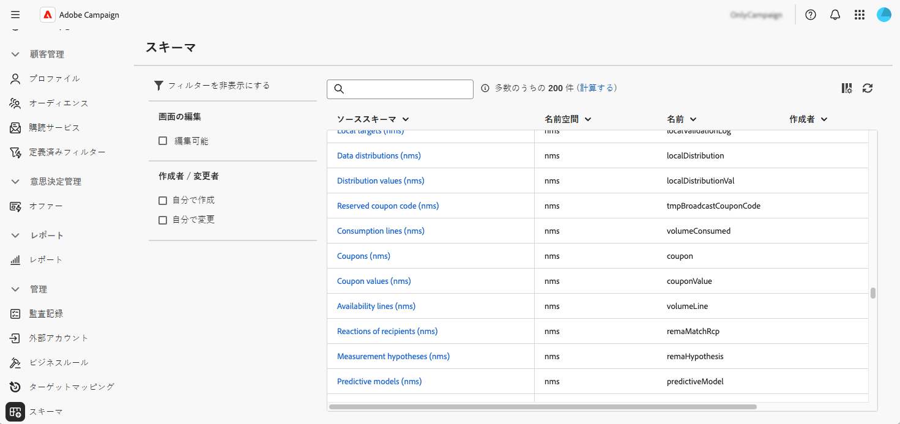

# スキーマへのアクセスと設定 {#access}

スキーマは、**[!UICONTROL 管理]**／**[!UICONTROL スキーマ]**&#x200B;メニューからアクセスできます。

この画面から、既存のすべてのスキーマを表示できます。編集可能なスキーマのみを表示するなど、リストを絞り込むのに役立つフィルターが使用できます。

スキーマを開くには、その名前を選択します。詳細なスキーマビューが表示されます。

## スキーマの概要 {#overview}

「**[!UICONTROL 概要]**」タブには、スキーマの一般的なビューが表示されます。

* 「**[!UICONTROL プロパティ]**」セクションには、スキーマ名、名前空間、関連付けられたテーブル名などの主要な情報が表示されます。

* 「**[!UICONTROL スキーマ定義]**」セクションには、データの紐付けに使用するプライマリキーや他のテーブルとのリンクなどのスキーマ定義の詳細が表示されます。

  「**[!UICONTROL スキーマのプレビュー]**」ボタンをクリックすると、スキーマを構成する様々なフィールドとリンクが表示されます。これにより、スキーマの完全な構造を確認できます。スキーマをカスタムフィールドで拡張すると、そのすべての拡張を視覚化できます。

* 「**[!UICONTROL コンテンツ]**」セクションには、スキーマの XML コンテンツが表示され、ソースと生成された構文を切り替えることができます。

## スキーマのデータ {#data}

「**[!UICONTROL データ]**」タブには、スキーマのデータに関する情報が表示されます。

## 画面の表示をカスタマイズ {#screen-def}

画面定義を使用すると、インターフェイスでのスキーマフィールドの表示および編集方法を設定できます。 リスト ビューの既定の列を構成したり、詳細画面に表示するカスタム フィールドをカスタマイズしたり、コレクション リストを追加して関連データを表示したり、フィールドを区切り記号と表示条件によってセクションに整理することができます。

画面定義にアクセスするには：

1. **[!UICONTROL スキーマ]** メニューを参照し、フィルターを使用して編集可能なスキーマを見つけます。

   

1. リストでスキーマ名を選択して開き、スキーマの詳細表示で「**[!UICONTROL 画面編集]**」ボタンをクリックして、画面定義にアクセスします。

   

   リストが異なれば、上下の矢印アイコンを使用するか、要素をドラッグ&amp;ドロップして、要素を並べ替えることができます。 項目を削除するには、特定の行のごみ箱アイコンをクリックするか、「。..」アイコンから **[!UICONTROL すべて削除]** を選択します。

   

画面の定義から、次の操作を実行できます。

* [ デフォルトのリスト列を設定 ](schemas-list-columns.md) - リスト表示にデフォルトで表示される列を設定します。
* [ カスタムフィールドの編集 ](schemas-custom-fields.md) – 詳細画面に表示するカスタムフィールドを設定し、セクションに整理します。
* [ コレクションリストの追加 ](schemas-collection-lists.md) - コレクションリストを追加して、プロファイル画面に関連データを表示します。
