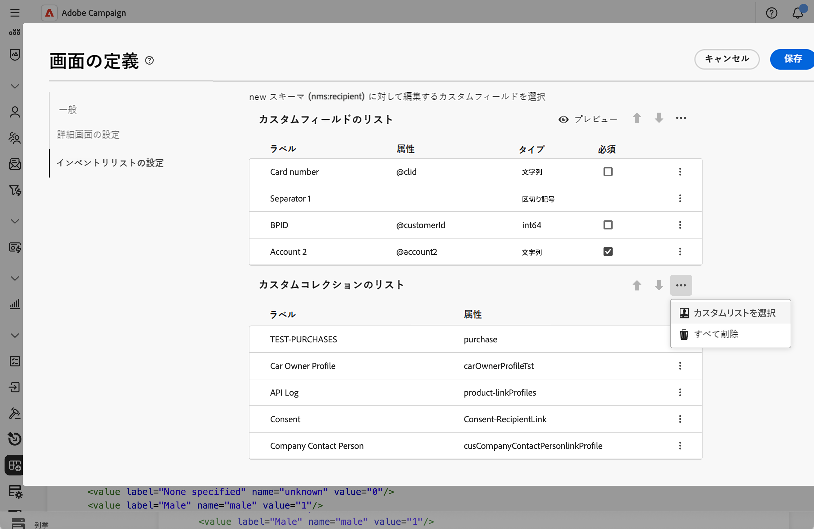
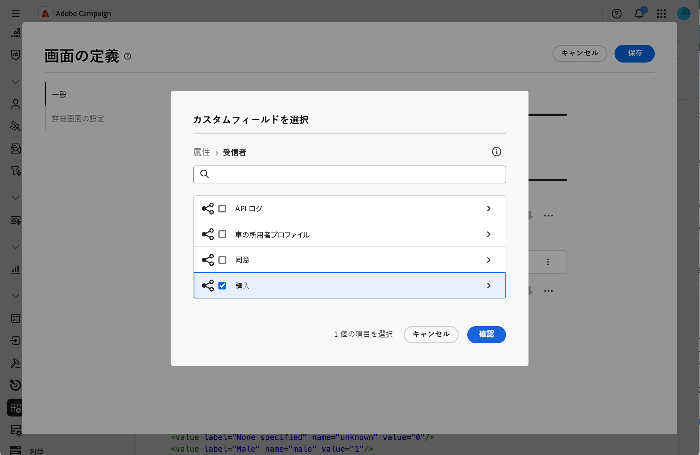
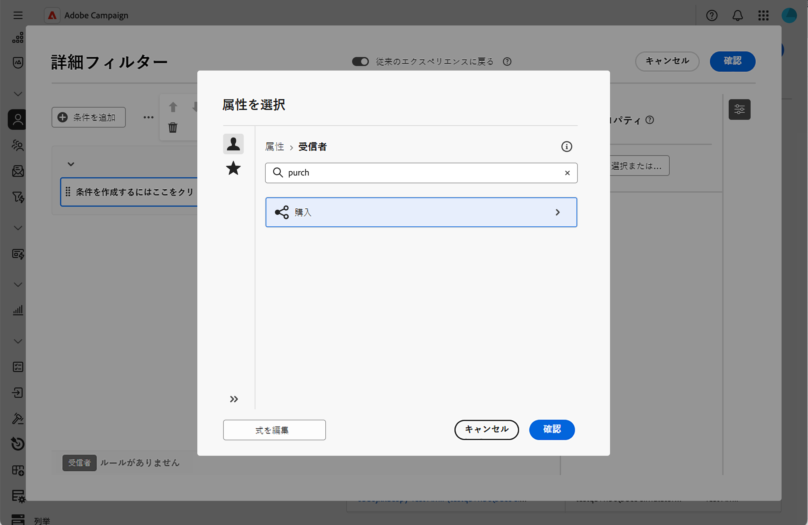
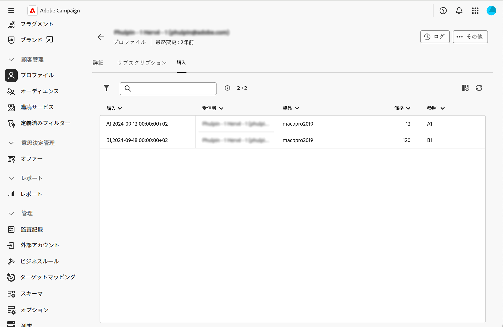

# コレクションリストを追加 {#collection-lists}

この「**カスタムリストのリスト**」セクションでは、購入などのコレクションリンクを定義できます。関連データは、専用タブを通じてプロファイル画面に表示されます。

画面の定義画面とそのアクセス方法について詳しくは、[画面の定義へのアクセス](schemas-browse-access.md#screen-def)のセクションを参照してください。

>[!NOTE]
>
>現在、この機能は、受信者スキーマでのみ使用できます。

コレクションリストを追加するには：

1. **[!UICONTROL スキーマ]**&#x200B;メニューを参照し、フィルターを使用して編集可能なスキーマを見つけます。

1. リストでスキーマ名を選択して開き、スキーマ詳細ビューの「**[!UICONTROL 画面の編集]**」をクリックし、画面の定義にアクセスします。

1. 省略記号アイコンをクリックし、「**[!UICONTROL カスタムリストを選択]**」を選択します。

   

1. 使用可能なカスタムリストの 1 つ（購入など）を選択し、「**[!UICONTROL 確認]**」をクリックします。

   

1. **プロファイル**&#x200B;メニューに移動し、購入したプロファイルをフィルタリングします。

   

1. プロファイルをクリックします。 新しいタブが表示されます。 必要に応じて、列をさらに追加できます。

   
