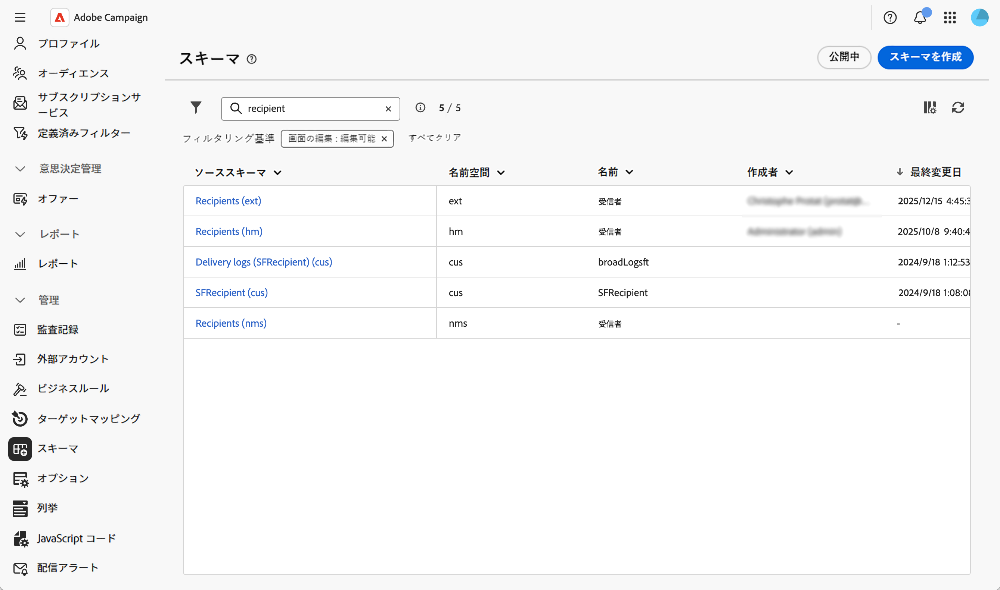
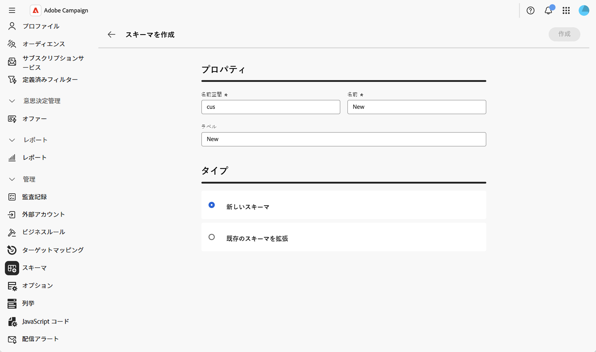
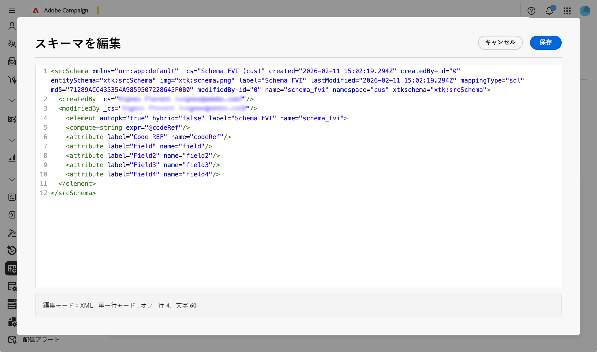
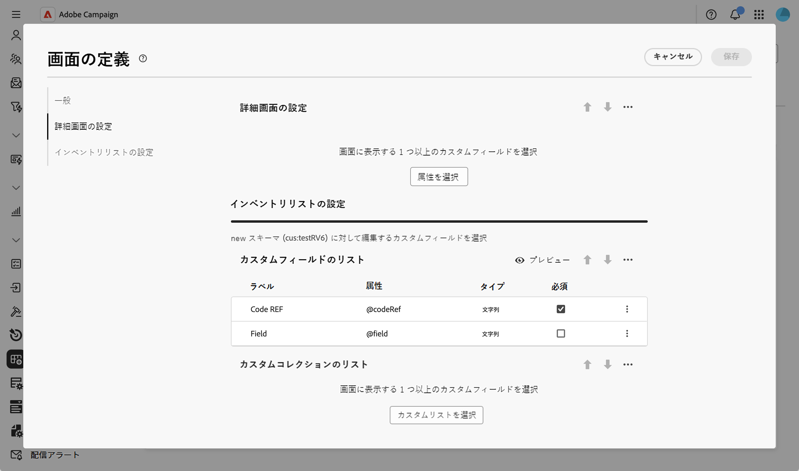
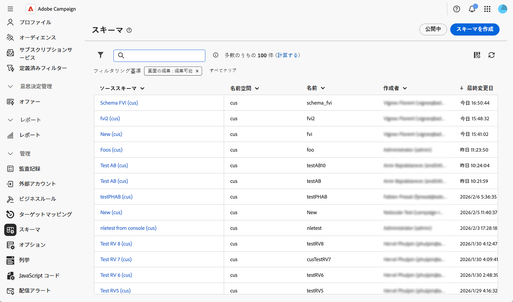
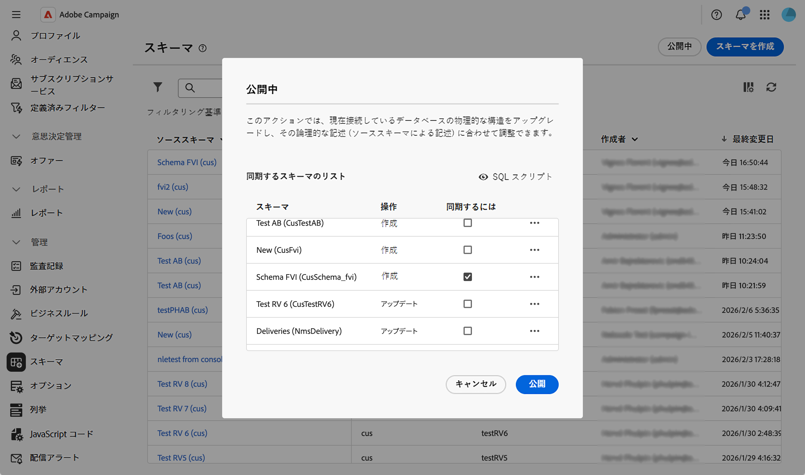
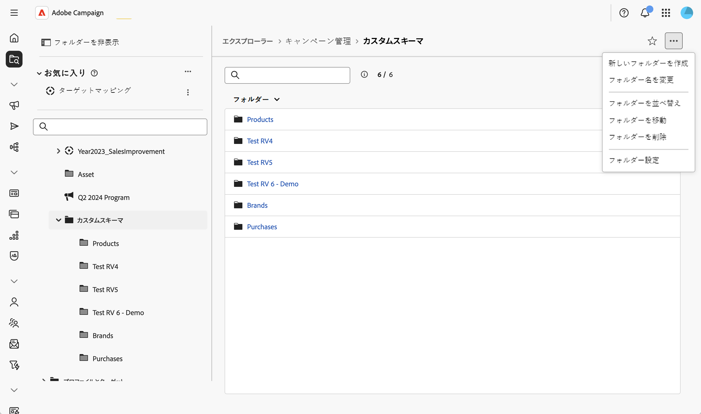
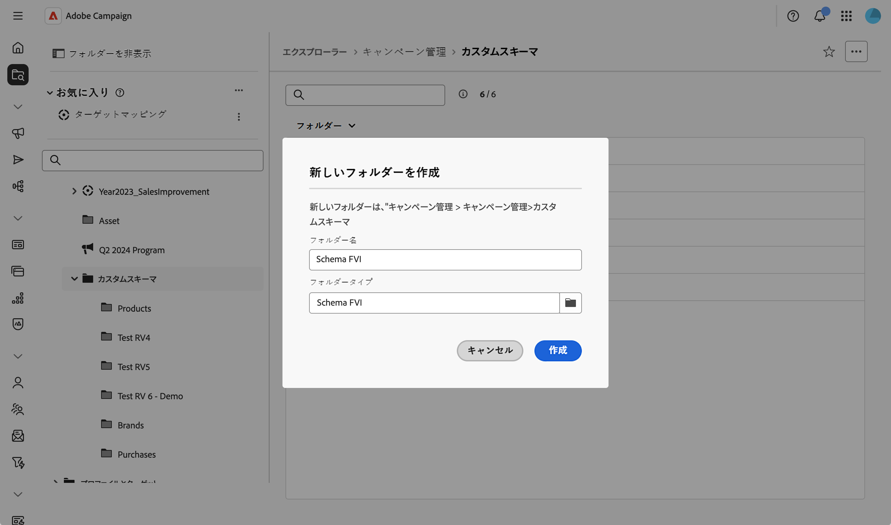

# スキーマの作成と公開 {#create-publish}

## スキーマの作成と管理 {#create-schemas}

新しいスキーマを作成したり、既存のスキーマを拡張したり、外部データベースにアクセスしたりできます。

### スキーマの作成または拡張 {#create-new}

スキーマを作成または拡張するには：

1. **[!UICONTROL 管理]** > **[!UICONTROL スキーマ]**&#x200B;に移動します。
1. 「**[!UICONTROL スキーマを作成]**」をクリックします。

   

1. スキーマの名前空間を入力します（例：カスタムスキーマの`cus`）。
1. 一意の名前とラベルを入力し、新しいスキーマを作成するか、既存のスキーマを拡張するかを選択します。

1. 「**[!UICONTROL 作成]**」をクリックします。
   

スキーマが作成され、生成されたスキーマ構造が表示されます。

デフォルトでは、スキーマは空です。 次に、スキーマエディターを使用して、スキーマに含めるフィールドを追加する必要があります。

1. スキーマの詳細画面の&#x200B;**[!UICONTROL コンテンツ]** セクションで鉛筆アイコンをクリックします。
2. 必要な要素を追加して保存します。 カスタムスキーマ構造の例を次に示します。

   

XML構造が自動的に検証され、スキーマが生成されます。

### スクリーンエディションの定義 {#define-attributes}

スキーマを作成したら、スクリーンエディションを定義する必要があります。

画面の定義画面とそのアクセス方法について詳しくは、[画面の定義にアクセス ](schemas-browse-access.md#screen-def)の節を参照してください。

この例では、2つのカスタムフィールドを追加するだけです。

1. スキーマの詳細ビューで「**[!UICONTROL Screen edition]**」ボタンをクリックして、画面定義にアクセスします。

1. カスタムフィールドの&#x200B;**[!UICONTROL リスト]** テーブルの上にある省略記号アイコンをクリックし、**[!UICONTROL 属性の選択]**&#x200B;を選択します。
1. 追加して確認するカスタムフィールドを選択します。

   

## スキーマの公開と同期 {#publish}

スキーマを作成または変更した後、論理スキーマを物理データベース構造と同期させるためにスキーマを公開する必要があります。

### スキーマの変更を公開 {#publish-changes}

>[!CAUTION]
>
>スキーマの変更を公開すると、データベース構造が変更されます。 公開を確認する前に、これらの変更の影響を必ず把握してください。

スキーマの変更を公開するには：

1. **[!UICONTROL 管理]** / **[!UICONTROL スキーマ]**&#x200B;に移動して、スキーマリストにアクセスします。
1. 「**[!UICONTROL 公開]**」をクリックして確認します。

   適用する変更を表示する

1. 同期するスキーマをリストで選択します。

   適用する変更を表示する

1. 実行されるSQL スクリプトを確認して、データベース構造を更新します。
1. 「**[!UICONTROL 公開]**」をクリックし、公開を続行することを確認します。

>[!NOTE]
>
>データベースの規模や変更の複雑さによっては、このプロセスに時間がかかる場合があります。

### ナビゲーションエントリの作成 {#navigation}

カスタムスキーマを公開した後、エクスプローラーでナビゲーションエントリを作成して、カスタムデータにアクセスできます。

1. **[!UICONTROL Explorer]** メニューに移動し、カスタムスキーマを配置するフォルダーを選択します。
1. 省略記号アイコンをクリックし、**[!UICONTROL 新しいフォルダーを作成]**をクリックします。
   
1. ラベルを追加し、**[!UICONTROL フォルダータイプ]** フィールドでスキーマを選択します。
   
1. カスタムスキーマに&#x200B;**[!UICONTROL Explorer]** ビューからアクセスできるようになりました。

新しいフォルダーから、次のことができます。

* カスタムスキーマ内のレコードのリストを表示します。
* 新しいレコードを作成します。
* 既存のレコードを編集および削除します。
* リストビューにデフォルトで表示する列をカスタマイズします。
