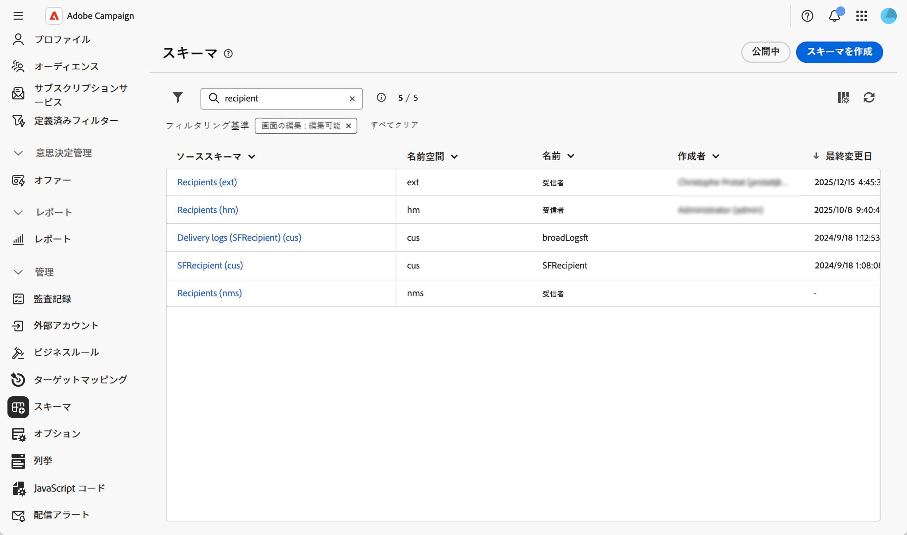
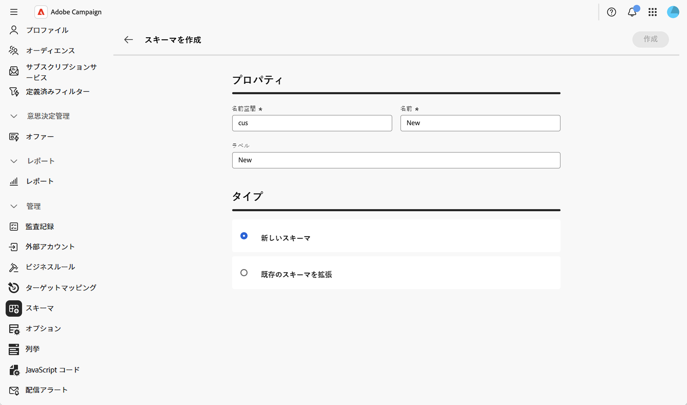
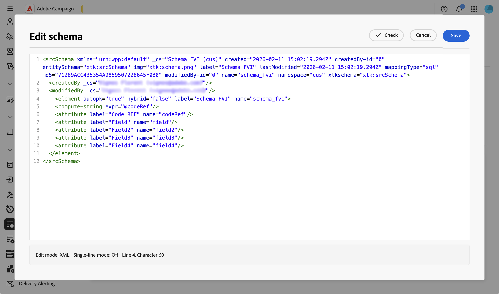
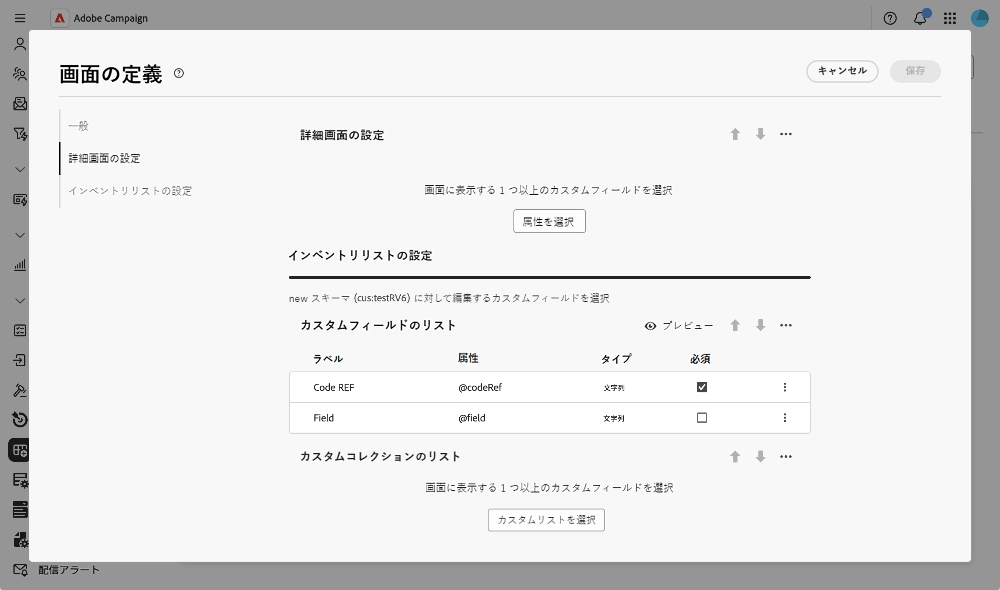
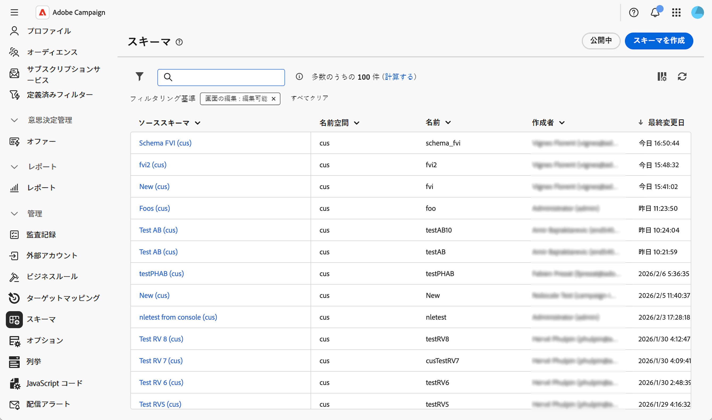
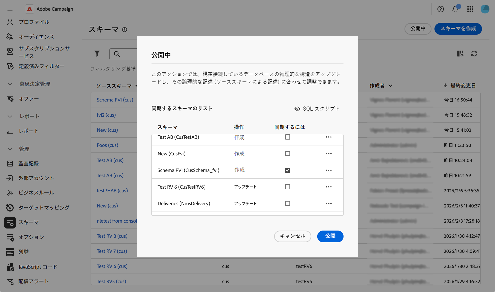
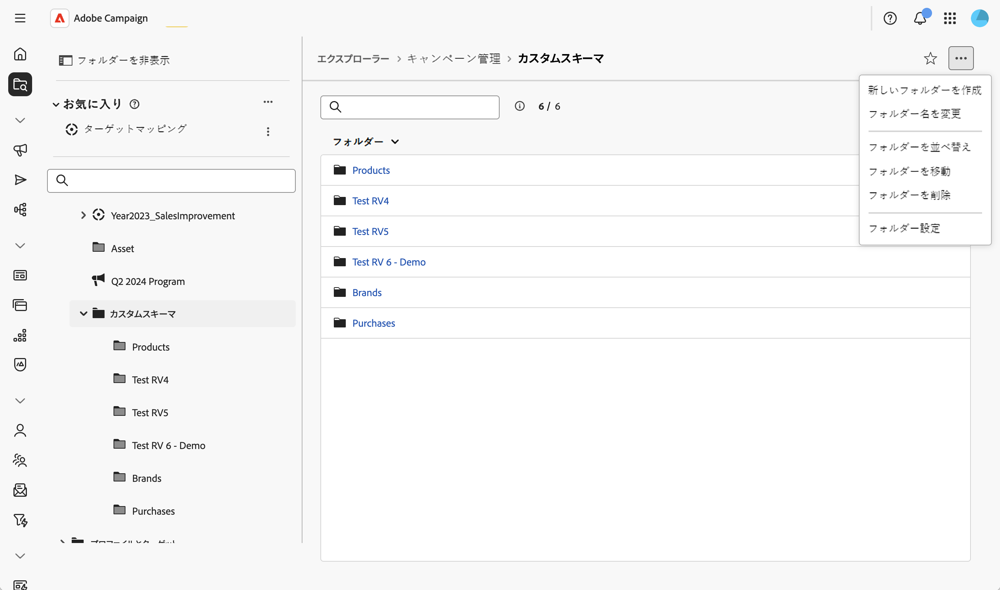
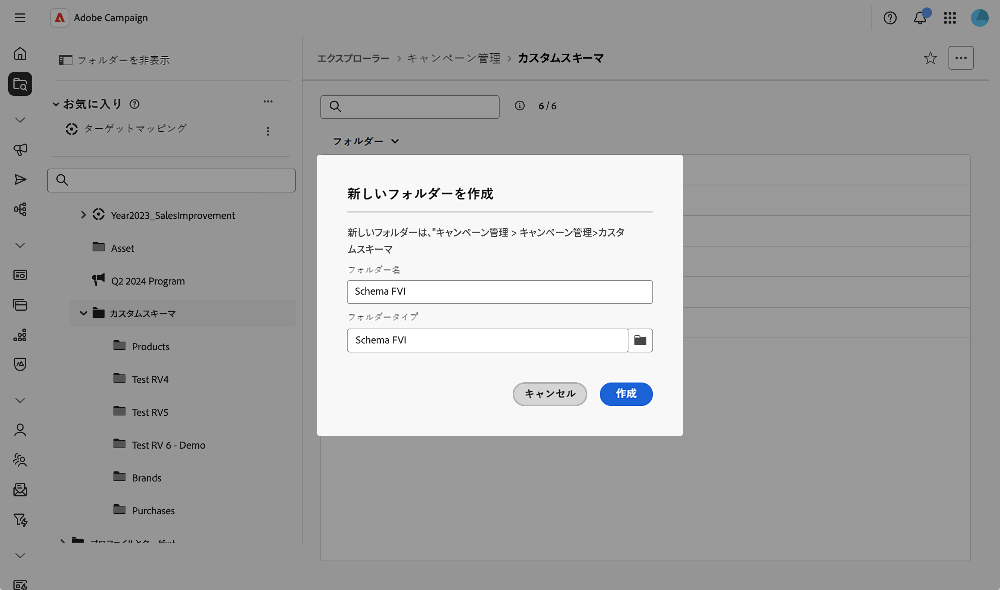

<?xml version="1.0" encoding="UTF-8"?>
<xliff xmlns="urn:oasis:names:tc:xliff:document:1.2" xmlns:okp="okapi-framework:xliff-extensions" xmlns:its="http://www.w3.org/2005/11/its" xmlns:itsxlf="http://www.w3.org/ns/its-xliff/" version="1.2" its:version="2.0">
<file original="help/v8/administration/schemas-create-publish.md.mdsc" source-language="en-US" target-language="en-XX" datatype="x-text/markdown">
<body>
<trans-unit id="tu1" restype="x-YAML_METADATA_HEADER_VALUE" xml:space="preserve">
<source xml:lang="en-US">Create and publish schemas</source>
<target xml:lang="en-XX">スキーマの作成と公開</target>
</trans-unit>
<trans-unit id="tu2" restype="x-YAML_METADATA_HEADER_VALUE" xml:space="preserve">
<source xml:lang="en-US">Learn how to create, extend, and publish schemas.</source>
<target xml:lang="en-XX">スキーマを作成、拡張、公開する方法について説明します。</target>
</trans-unit>
<trans-unit id="tu3" xml:space="preserve">
<source xml:lang="en-US">Create and publish schemas</source>
<target xml:lang="en-XX">スキーマの作成と公開</target>
</trans-unit>
<trans-unit id="tu4" xml:space="preserve">
<source xml:lang="en-US">Create and manage schemas</source>
<target xml:lang="en-XX">スキーマの作成と管理</target>
</trans-unit>
<trans-unit id="tu5" xml:space="preserve">
<source xml:lang="en-US">You can create new schemas, extend existing schemas, and access external databases.</source>
<target xml:lang="en-XX">新しいスキーマの作成、既存のスキーマの拡張、外部データベースへのアクセスができます。</target>
</trans-unit>
<trans-unit id="tu6" xml:space="preserve">
<source xml:lang="en-US">Create or extend a schema</source>
<target xml:lang="en-XX">スキーマの作成または拡張</target>
</trans-unit>
<trans-unit id="tu7" xml:space="preserve">
<source xml:lang="en-US">To create or extend a schema:</source>
<target xml:lang="en-XX">スキーマを作成または拡張するには：</target>
</trans-unit>
<trans-unit id="tu8" xml:space="preserve">
<source xml:lang="en-US">Navigate to <ph id="1" ctype="x-STRONG_EMPHASIS">**[!UICONTROL </ph>Administration<ph id="3" ctype="x-LINK_REF">]**</ph> > <ph id="5" ctype="x-STRONG_EMPHASIS">**[!UICONTROL </ph>Schemas<ph id="7" ctype="x-LINK_REF">]**</ph>.</source>
<target xml:lang="en-XX"><ph id="1" ctype="x-STRONG_EMPHASIS">**[!UICONTROL </ph>管理<ph id="3" ctype="x-LINK_REF">]**</ph>／<ph id="5" ctype="x-STRONG_EMPHASIS">**[!UICONTROL </ph>スキーマ<ph id="7" ctype="x-LINK_REF">]**</ph>に移動します。</target>
</trans-unit>
<trans-unit id="tu9" xml:space="preserve">
<source xml:lang="en-US">Click <ph id="1" ctype="x-STRONG_EMPHASIS">**[!UICONTROL </ph>Create schema<ph id="3" ctype="x-LINK_REF">]**</ph>.</source>
<target xml:lang="en-XX">「<ph id="1" ctype="x-STRONG_EMPHASIS">**[!UICONTROL </ph>スキーマを作成<ph id="3" ctype="x-LINK_REF">]**</ph>」をクリックします。</target>
</trans-unit>
<trans-unit id="tu10" xml:space="preserve">
<source xml:lang="en-US"><ph id="1" ctype="x-IMAGE"></ph></source>
<target xml:lang="en-XX"><ph id="1" ctype="x-IMAGE"></ph></target>
</trans-unit>
<trans-unit id="tu11" xml:space="preserve">
<source xml:lang="en-US">Enter a namespace for your schema (for example, <ph id="1" ctype="x-CODE">`cus`</ph> for custom schemas).</source>
<target xml:lang="en-XX">スキーマの名前空間を入力します（例：カスタムスキーマの <ph id="1" ctype="x-CODE">`cus`</ph>）。</target>
</trans-unit>
<trans-unit id="tu12" xml:space="preserve">
<source xml:lang="en-US">Enter a unique name and label, and choose if you want to create a new schema or extend an existing one.</source>
<target xml:lang="en-XX">一意の名前とラベルを入力し、新しいスキーマを作成するか、既存のスキーマを拡張するかを選択します。</target>
</trans-unit>
<trans-unit id="tu13" xml:space="preserve">
<source xml:lang="en-US">Click <ph id="1" ctype="x-STRONG_EMPHASIS">**[!UICONTROL </ph>Create<ph id="3" ctype="x-LINK_REF">]**</ph>.
</source>
<target xml:lang="en-XX">「<ph id="1" ctype="x-STRONG_EMPHASIS">**[!UICONTROL </ph>作成<ph id="3" ctype="x-LINK_REF">]**</ph>」をクリックします。
</target>
</trans-unit>
<trans-unit id="tu14" xml:space="preserve">
<source xml:lang="en-US"><ph id="1" ctype="x-IMAGE"></ph></source>
<target xml:lang="en-XX"><ph id="1" ctype="x-IMAGE"></ph></target>
</trans-unit>
<trans-unit id="tu15" xml:space="preserve">
<source xml:lang="en-US">The schema is created and the generated schema structure is displayed.</source>
<target xml:lang="en-XX">スキーマが作成され、生成されたスキーマ構造が表示されます。</target>
</trans-unit>
<trans-unit id="tu16" xml:space="preserve">
<source xml:lang="en-US">By default, the schema is empty. You now need to add the fields you want to include in your schema using the schema editor:</source>
<target xml:lang="en-XX">デフォルトでは、スキーマは空です。 次に、スキーマエディターを使用して、スキーマに含めるフィールドを追加する必要があります。</target>
</trans-unit>
<trans-unit id="tu17" xml:space="preserve">
<source xml:lang="en-US">Click the pencil icon in the <ph id="1" ctype="x-STRONG_EMPHASIS">**[!UICONTROL </ph>Content<ph id="3" ctype="x-LINK_REF">]**</ph> section of the schema details screen.</source>
<target xml:lang="en-XX">スキーマの詳細画面の「<ph id="1" ctype="x-STRONG_EMPHASIS">**[!UICONTROL </ph>コンテンツ<ph id="3" ctype="x-LINK_REF">]**</ph>」セクションで鉛筆アイコンをクリックします。</target>
</trans-unit>
<trans-unit id="tu18" xml:space="preserve">
<source xml:lang="en-US">Add the needed elements. Here is an example of a custom schema structure:</source>
<target xml:lang="en-XX">必要な要素を追加します。以下は、カスタムスキーマ構造の例です。</target>
</trans-unit>
<trans-unit id="tu19" xml:space="preserve">
<source xml:lang="en-US"><ph id="1" ctype="x-IMAGE"></ph></source>
<target xml:lang="en-XX"><ph id="1" ctype="x-IMAGE"></ph></target>
</trans-unit>
<trans-unit id="tu20" xml:space="preserve">
<source xml:lang="en-US">Click the <ph id="1" ctype="x-STRONG_EMPHASIS">**[!UICONTROL </ph>Check<ph id="3" ctype="x-LINK_REF">]**</ph> button to verify the XML structure of your schema before saving. Identified errors are displayed at the bottom of the screen, for example "Invalid XML format".</source>
<target xml:lang="en-XX">保存前に「<ph id="1" ctype="x-STRONG_EMPHASIS">**[!UICONTROL </ph>確認<ph id="3" ctype="x-LINK_REF">]**</ph>」ボタンをクリックして、スキーマの XML 構造を検証します。特定されたエラーは、画面の下部に表示されます（例：「無効な XML 形式」）。</target>
</trans-unit>
<trans-unit id="tu21" xml:space="preserve">
<source xml:lang="en-US"><ph id="1" ctype="x-IMAGE"></ph></source>
<target xml:lang="en-XX"><ph id="1" ctype="x-IMAGE"></ph></target>
</trans-unit>
<trans-unit id="tu22" xml:space="preserve">
<source xml:lang="en-US">Fix any errors, then save your changes to generate the schema.</source>
<target xml:lang="en-XX">エラーを修正し、変更を保存してスキーマを生成します。</target>
</trans-unit>
<trans-unit id="tu23" xml:space="preserve">
<source xml:lang="en-US">Define the screen edition</source>
<target xml:lang="en-XX">画面編集の定義</target>
</trans-unit>
<trans-unit id="tu24" xml:space="preserve">
<source xml:lang="en-US">After creating the schema, you need to define the screen edition.</source>
<target xml:lang="en-XX">スキーマを作成したら、画面編集を定義する必要があります。</target>
</trans-unit>
<trans-unit id="tu25" xml:space="preserve">
<source xml:lang="en-US">For more information on the screen definition screen and how to access it, refer to the <ph id="1" ctype="x-LINK">[</ph>Access the screen definition<ph id="2" ctype="x-LINK">](schemas-browse-access.md#screen-def)</ph> section.</source>
<target xml:lang="en-XX">画面の定義画面とそのアクセス方法について詳しくは、<ph id="1" ctype="x-LINK">[</ph>画面の定義へのアクセス<ph id="2" ctype="x-LINK">](schemas-browse-access.md#screen-def)</ph>の節を参照してください。</target>
</trans-unit>
<trans-unit id="tu26" xml:space="preserve">
<source xml:lang="en-US">In our example, we simply add two custom fields:</source>
<target xml:lang="en-XX">この例では、2 つのカスタムフィールドを追加します。</target>
</trans-unit>
<trans-unit id="tu27" xml:space="preserve">
<source xml:lang="en-US">Click the <ph id="1" ctype="x-STRONG_EMPHASIS">**[!UICONTROL </ph>Screen edition<ph id="3" ctype="x-LINK_REF">]**</ph> button in the schema details view to access the screen definition.</source>
<target xml:lang="en-XX">スキーマの詳細ビューで「<ph id="1" ctype="x-STRONG_EMPHASIS">**[!UICONTROL </ph>画面の編集<ph id="3" ctype="x-LINK_REF">]**</ph>」ボタンをクリックして、画面定義にアクセスします。</target>
</trans-unit>
<trans-unit id="tu28" xml:space="preserve">
<source xml:lang="en-US">Click the ellipsis icon above the <ph id="1" ctype="x-STRONG_EMPHASIS">**[!UICONTROL </ph>List of custom fields<ph id="3" ctype="x-LINK_REF">]**</ph> table and choose <ph id="5" ctype="x-STRONG_EMPHASIS">**[!UICONTROL </ph>Select attributes<ph id="7" ctype="x-LINK_REF">]**</ph>.</source>
<target xml:lang="en-XX"><ph id="1" ctype="x-STRONG_EMPHASIS">**[!UICONTROL </ph>カスタムフィールドのリスト<ph id="3" ctype="x-LINK_REF">]**</ph>テーブルの上にある省略アイコンをクリックし、「<ph id="5" ctype="x-STRONG_EMPHASIS">**[!UICONTROL </ph>属性を選択<ph id="7" ctype="x-LINK_REF">]**</ph>」を選択します。</target>
</trans-unit>
<trans-unit id="tu29" xml:space="preserve">
<source xml:lang="en-US">Select the custom fields you want to add and confirm.</source>
<target xml:lang="en-XX">追加するカスタムフィールドを選択し、「確認」をクリックします。</target>
</trans-unit>
<trans-unit id="tu30" xml:space="preserve">
<source xml:lang="en-US"><ph id="1" ctype="x-IMAGE"></ph></source>
<target xml:lang="en-XX"><ph id="1" ctype="x-IMAGE"></ph></target>
</trans-unit>
<trans-unit id="tu31" xml:space="preserve">
<source xml:lang="en-US">Publish and synchronize schemas</source>
<target xml:lang="en-XX">スキーマの公開と同期</target>
</trans-unit>
<trans-unit id="tu32" xml:space="preserve">
<source xml:lang="en-US">After creating or modifying a schema, you need to publish it to synchronize the logical schema with the physical database structure.</source>
<target xml:lang="en-XX">スキーマを作成または変更した後、論理スキーマを物理データベース構造と同期させるためにスキーマを公開する必要があります。</target>
</trans-unit>
<trans-unit id="tu33" xml:space="preserve">
<source xml:lang="en-US">Publish schema changes</source>
<target xml:lang="en-XX">スキーマの変更の公開</target>
</trans-unit>
<trans-unit id="tu34" xml:space="preserve">
<source xml:lang="en-US"><ph id="1" ctype="x-regxph" equiv-text="[!CAUTION">[!CAUTION]</ph></source>
<target xml:lang="en-XX"><ph id="1" ctype="x-regxph" equiv-text="[!CAUTION">[!CAUTION]</ph></target>
</trans-unit>
<trans-unit id="tu35" xml:space="preserve">
<source xml:lang="en-US">Publishing schema changes modifies the database structure. Make sure you understand the impact of these changes before confirming the publication.</source>
<target xml:lang="en-XX">スキーマの変更を公開すると、データベース構造が変更されます。 公開を確認する前に、これらの変更による影響を必ず確認してください。</target>
</trans-unit>
<trans-unit id="tu36" xml:space="preserve">
<source xml:lang="en-US">To publish your schema changes:</source>
<target xml:lang="en-XX">スキーマの変更を公開するには：</target>
</trans-unit>
<trans-unit id="tu37" xml:space="preserve">
<source xml:lang="en-US">Navigate to <ph id="1" ctype="x-STRONG_EMPHASIS">**[!UICONTROL </ph>Administration<ph id="3" ctype="x-LINK_REF">]**</ph> > <ph id="5" ctype="x-STRONG_EMPHASIS">**[!UICONTROL </ph>Schemas<ph id="7" ctype="x-LINK_REF">]**</ph> to access the schema list.</source>
<target xml:lang="en-XX"><ph id="1" ctype="x-STRONG_EMPHASIS">**[!UICONTROL </ph>管理<ph id="3" ctype="x-LINK_REF">]**</ph>／<ph id="5" ctype="x-STRONG_EMPHASIS">**[!UICONTROL </ph>スキーマ<ph id="7" ctype="x-LINK_REF">]**</ph>に移動して、スキーマリストにアクセスします。</target>
</trans-unit>
<trans-unit id="tu38" xml:space="preserve">
<source xml:lang="en-US">Click <ph id="1" ctype="x-STRONG_EMPHASIS">**[!UICONTROL </ph>Publishing<ph id="3" ctype="x-LINK_REF">]**</ph> and confirm.</source>
<target xml:lang="en-XX">「<ph id="1" ctype="x-STRONG_EMPHASIS">**[!UICONTROL </ph>公開<ph id="3" ctype="x-LINK_REF">]**</ph>」をクリックし、確定します。</target>
</trans-unit>
<trans-unit id="tu39" xml:space="preserve">
<source xml:lang="en-US"><ph id="1" ctype="x-IMAGE"></ph></source>
<target xml:lang="en-XX"><ph id="1" ctype="x-IMAGE"></ph></target>
</trans-unit>
<trans-unit id="tu40" xml:space="preserve">
<source xml:lang="en-US">Select, in the list, the schema you want to synchronize.</source>
<target xml:lang="en-XX">同期するスキーマをリストで選択します。</target>
</trans-unit>
<trans-unit id="tu41" xml:space="preserve">
<source xml:lang="en-US"><ph id="1" ctype="x-IMAGE"></ph></source>
<target xml:lang="en-XX"><ph id="1" ctype="x-IMAGE"></ph></target>
</trans-unit>
<trans-unit id="tu42" xml:space="preserve">
<source xml:lang="en-US">Review the SQL script that will be executed to update the database structure.</source>
<target xml:lang="en-XX">データベース構造を更新するために実行される SQL スクリプトをレビューします。</target>
</trans-unit>
<trans-unit id="tu43" xml:space="preserve">
<source xml:lang="en-US">Click <ph id="1" ctype="x-STRONG_EMPHASIS">**[!UICONTROL </ph>Publish<ph id="3" ctype="x-LINK_REF">]**</ph> and confirm to proceed with the publication.</source>
<target xml:lang="en-XX">「<ph id="1" ctype="x-STRONG_EMPHASIS">**[!UICONTROL </ph>公開<ph id="3" ctype="x-LINK_REF">]**</ph>」をクリックして確定し、公開に進みます。</target>
</trans-unit>
<trans-unit id="tu44" xml:space="preserve">
<source xml:lang="en-US"><ph id="1" ctype="x-regxph" equiv-text="[!NOTE">[!NOTE]</ph></source>
<target xml:lang="en-XX"><ph id="1" ctype="x-regxph" equiv-text="[!NOTE">[!NOTE]</ph></target>
</trans-unit>
<trans-unit id="tu45" xml:space="preserve">
<source xml:lang="en-US">The process may take some time depending on the size of your database and the complexity of the changes.</source>
<target xml:lang="en-XX">データベースのサイズや変更の複雑さに応じて、このプロセスに時間がかかる場合があります。</target>
</trans-unit>
<trans-unit id="tu46" xml:space="preserve">
<source xml:lang="en-US">Create a navigation entry</source>
<target xml:lang="en-XX">ナビゲーションエントリの作成</target>
</trans-unit>
<trans-unit id="tu47" xml:space="preserve">
<source xml:lang="en-US">After publishing a custom schema, you can create a navigation entry in the Explorer to access your custom data:</source>
<target xml:lang="en-XX">カスタムスキーマを公開したら、エクスプローラーでナビゲーションエントリを作成して、カスタムデータにアクセスすることができます。</target>
</trans-unit>
<trans-unit id="tu48" xml:space="preserve">
<source xml:lang="en-US">Navigate to the <ph id="1" ctype="x-STRONG_EMPHASIS">**[!UICONTROL </ph>Explorer<ph id="3" ctype="x-LINK_REF">]**</ph> menu and select a folder where you want to place your custom schema.</source>
<target xml:lang="en-XX">「<ph id="1" ctype="x-STRONG_EMPHASIS">**[!UICONTROL </ph>エクスプローラー<ph id="3" ctype="x-LINK_REF">]**</ph>」メニューに移動し、カスタムスキーマを配置するフォルダーを選択します。</target>
</trans-unit>
<trans-unit id="tu49" xml:space="preserve">
<source xml:lang="en-US">Click the ellipsis icon, and click <ph id="1" ctype="x-STRONG_EMPHASIS">**[!UICONTROL </ph>Create new folder<ph id="3" ctype="x-LINK_REF">]**</ph>.
</source>
<target xml:lang="en-XX">省略記号アイコンをクリックし、「<ph id="1" ctype="x-STRONG_EMPHASIS">**[!UICONTROL </ph>新しいフォルダーを作成<ph id="3" ctype="x-LINK_REF">]**</ph>」をクリックします。
</target>
</trans-unit>
<trans-unit id="tu50" xml:space="preserve">
<source xml:lang="en-US"><ph id="1" ctype="x-IMAGE"></ph></source>
<target xml:lang="en-XX"><ph id="1" ctype="x-IMAGE"></ph></target>
</trans-unit>
<trans-unit id="tu51" xml:space="preserve">
<source xml:lang="en-US">Add a label and choose your schema in the <ph id="1" ctype="x-STRONG_EMPHASIS">**[!UICONTROL </ph>Folder type<ph id="3" ctype="x-LINK_REF">]**</ph> field.
</source>
<target xml:lang="en-XX">ラベルを追加し、「<ph id="1" ctype="x-STRONG_EMPHASIS">**[!UICONTROL </ph>フォルダータイプ <ph id="3" ctype="x-LINK_REF">]**</ph>」フィールドでスキーマを選択します。
</target>
</trans-unit>
<trans-unit id="tu52" xml:space="preserve">
<source xml:lang="en-US"><ph id="1" ctype="x-IMAGE"></ph></source>
<target xml:lang="en-XX"><ph id="1" ctype="x-IMAGE"></ph></target>
</trans-unit>
<trans-unit id="tu53" xml:space="preserve">
<source xml:lang="en-US">The custom schema will now be accessible from the <ph id="1" ctype="x-STRONG_EMPHASIS">**[!UICONTROL </ph>Explorer<ph id="3" ctype="x-LINK_REF">]**</ph> view.</source>
<target xml:lang="en-XX"><ph id="1" ctype="x-STRONG_EMPHASIS">**[!UICONTROL </ph>エクスプローラー<ph id="3" ctype="x-LINK_REF">]**</ph>ビューからカスタムスキーマにアクセスできるようになりました。</target>
</trans-unit>
<trans-unit id="tu54" xml:space="preserve">
<source xml:lang="en-US">From the new folder, you can:</source>
<target xml:lang="en-XX">新しいフォルダーから、次の操作を実行できます。</target>
</trans-unit>
<trans-unit id="tu55" xml:space="preserve">
<source xml:lang="en-US">View the list of records in your custom schema.</source>
<target xml:lang="en-XX">カスタムスキーマ内のレコードのリストを表示します。</target>
</trans-unit>
<trans-unit id="tu56" xml:space="preserve">
<source xml:lang="en-US">Create new records.</source>
<target xml:lang="en-XX">新しいレコードを作成します。</target>
</trans-unit>
<trans-unit id="tu57" xml:space="preserve">
<source xml:lang="en-US">Edit and delete existing records.</source>
<target xml:lang="en-XX">既存のレコードを編集および削除します。</target>
</trans-unit>
<trans-unit id="tu58" xml:space="preserve">
<source xml:lang="en-US">Customize which columns are displayed by default in the list view.</source>
<target xml:lang="en-XX">リストビューにデフォルトで表示する列をカスタマイズします。</target>
</trans-unit>
</body>
</file>
</xliff>