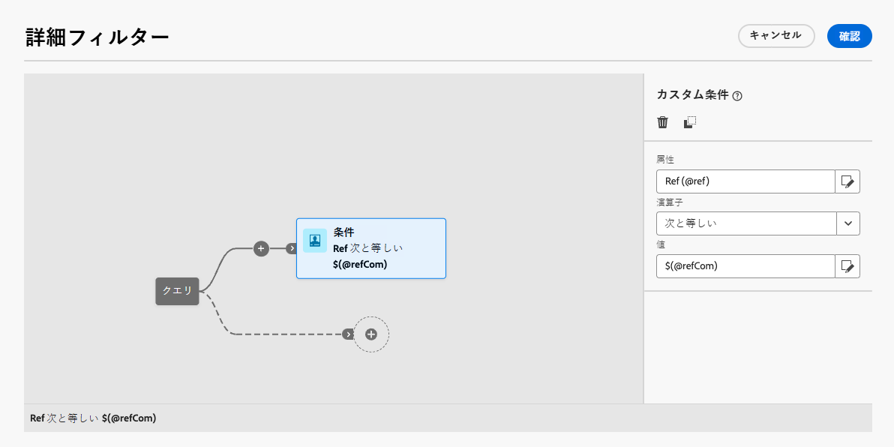
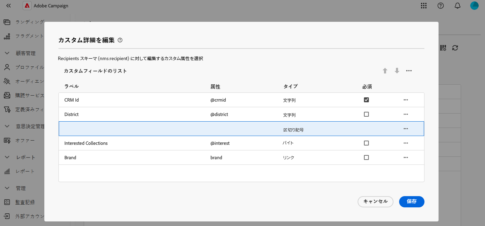
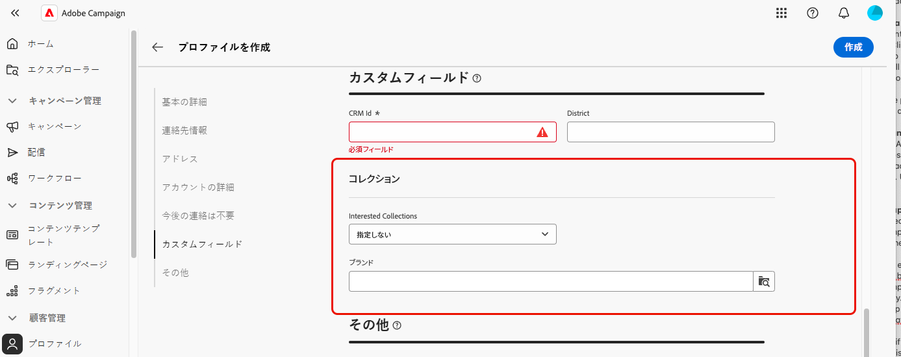

# カスタムフィールドの編集 {#fields}

カスタムフィールドは、Adobe Campaign コンソールから標準スキーマに追加されている属性です。組織のニーズに合わせて新しい属性を含めることで、スキーマをカスタマイズできます。

インターフェイスのプロファイル詳細など、様々な画面にカスタムフィールドを表示できます。 表示するフィールドとインターフェイスでの表示方法を制御できます。

画面定義画面とアクセス方法について詳しくは、[&#x200B; 画面定義へのアクセス &#x200B;](schemas-browse-access.md#screen-def) の節を参照してください。

リストにカスタムフィールドを追加するには：

1. **[!UICONTROL スキーマ]** メニューを参照し、フィルターを使用して編集可能なスキーマを見つけます。

1. リストでスキーマ名を選択して開き、スキーマの詳細表示で「**[!UICONTROL 画面編集]**」ボタンをクリックして、画面定義にアクセスします。

1. **[!UICONTROL カスタムフィールドのリスト]** テーブルの上にある省略記号アイコンをクリックし、**[!UICONTROL 属性を選択]** を選択して、インターフェイスに表示する 1 つ以上のカスタムフィールドを選択します。
   
1. 追加して確認するカスタムフィールドを選択します。

   

   >[!NOTE]
   >
   > また、「**[!UICONTROL カスタムフィールドのリストを自動的に入力]**」を選択して、スキーマ用に定義されたすべてのカスタムフィールドをインターフェイスに追加できます。

カスタムフィールドを追加したら、プレビュー、並べ替え、必須、設定の編集、サブセクションへの整理を行うことができます。

## フィールド設定の指定 {#field-settings}

各カスタムフィールドに特定の設定を指定するには、リストのフィールド行の省略記号アイコンをクリックし、「**[!UICONTROL 編集]**」を選択します。

使用可能な設定を以下に示します。

* **[!UICONTROL 属性]**：カスタムフィールドの名前（読み取り専用）。
* **[!UICONTROL ラベル（カスタム）]**：インターフェイスに表示するラベル。ラベルを指定しない場合は、スキーマで定義されたラベルが表示されます。
* **[!UICONTROL 次の場合に表示]**：フィールドが表示されるタイミングを制御する xtk 式を使用して条件を定義します。例えば、別のフィールドが空の場合は、このフィールドを非表示にします。
* **[!UICONTROL 必須]**：インターフェイスでフィールドを必須にします。
* **[!UICONTROL 読み取り専用]**：インターフェイスでフィールドを読み取り専用にします。ユーザーは、フィールドの値を編集できません。
* **[!UICONTROL フィルター設定]**（リンクタイプのフィールドの場合）：クエリモデラーを使用して、リンクタイプのカスタムフィールドを表示するためのルールを指定します。例えば、別のフィールドの入力に基づいてリストの値を制限します。

  +++例を表示

  また、構文 `$(<field-name>)` を使用して、条件内の他のフィールドに入力された値を参照することもできます。これにより、フィールドがまだデータベースに保存されていない場合でも、フォームに入力されたフィールドの現在の値を参照できます。

  以下の例では、条件は @ref フィールドの値が @refCom フィールドに入力された値と一致するかどうかを確認します。一方、`$(@refCom)` の代わりに `@refCom` を使用すると、データベースに存在する @ref フィールドの値が参照されます。

  

  +++

* **[!UICONTROL 2 列にまたがる]**：デフォルトでは、カスタムフィールドはインターフェイスに 2 列で表示されます。このオプションの切替スイッチをオンにすると、カスタムフィールドが 2 列ではなく画面の全幅に表示されます。

## カスタムフィールドのプレビュー {#preview}

**[!UICONTROL プレビュー]** をクリックして、カスタムフィールドをサンプル画面に表示します。 これにより、必須としてマークされているフィールドなど、インターフェイスでのフィールドの表示方法を確認できます。

## サブセクション内のフィールドの整理 {#separator}

区切り文字を追加して、インターフェイスのカスタムフィールドをグループ化し、読みやすくできます。 それには、次の手順に従います。

1. **[!UICONTROL カスタムフィールドのリスト]** テーブルの上にある省略記号アイコンをクリックし、「**[!UICONTROL 区切り記号を追加]**」を選択します。

1. 区切り記号を表す新しい行をリストに追加します。区切り文字行の省略記号アイコンをクリックし、「**[!UICONTROL 編集]**」を選択します。

1. 区切り文字の **[!UICONTROL ラベル]** を入力し、（オプション）区切り文字がいつ表示されるかを制御する **[!UICONTROL 表示する場合]** 条件を設定します。

   

1. 上下の矢印を使用して、区切り記号を目的の位置に移動します。区切り記号の下にリストされるフィールドは、その下にグループ化されます。

   この例では、「興味のあるコレクション」フィールドと「ブランド」フィールドが「コレクション」サブセクションにグループ化されています。

   | カスタムフィールドの設定 | インターフェイスでのレンダリング |
   |  ---  |  ---  |
   | {zoomable="yes"} | {zoomable="yes"} |
