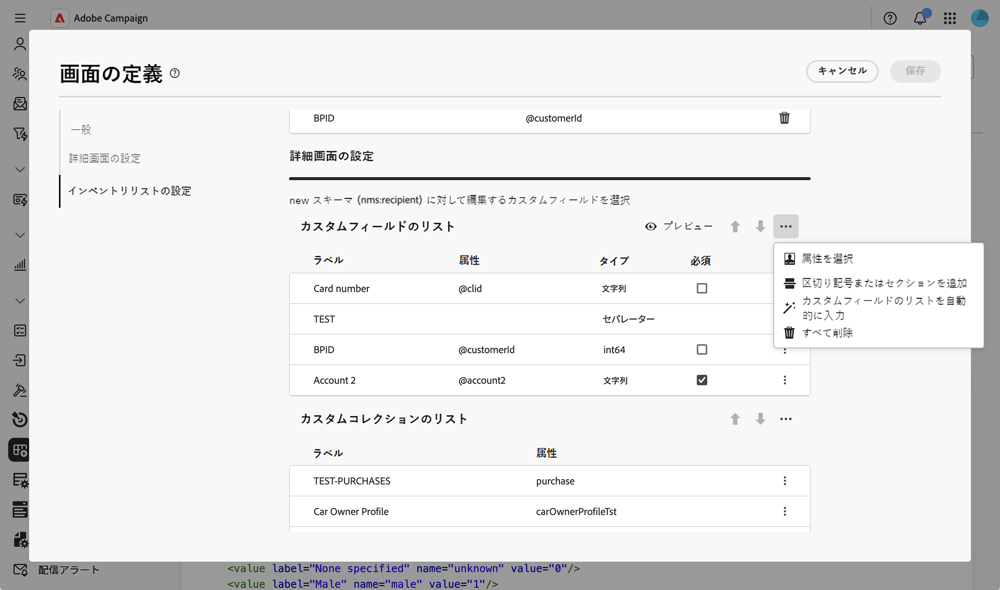
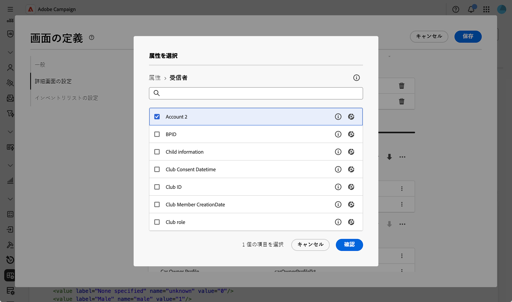
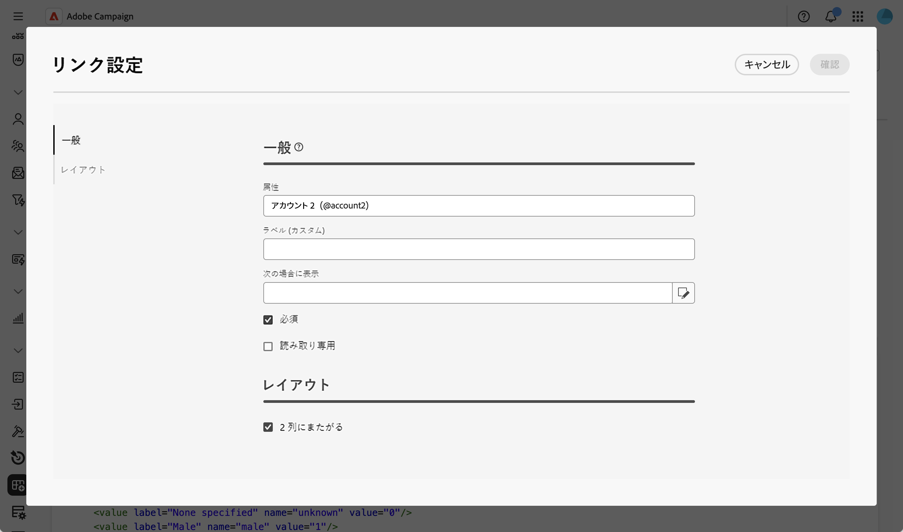
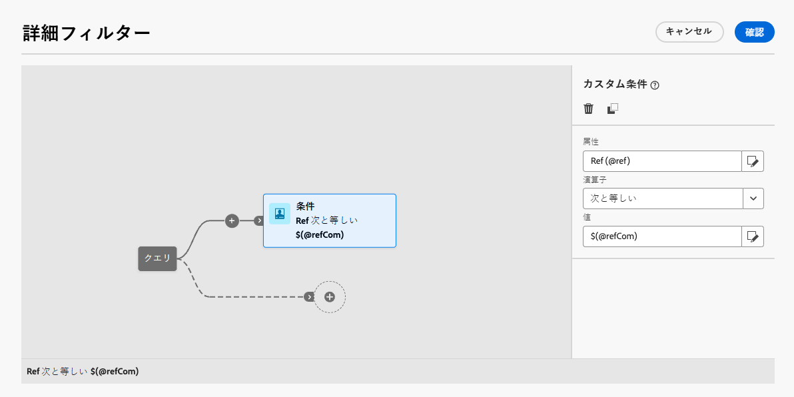
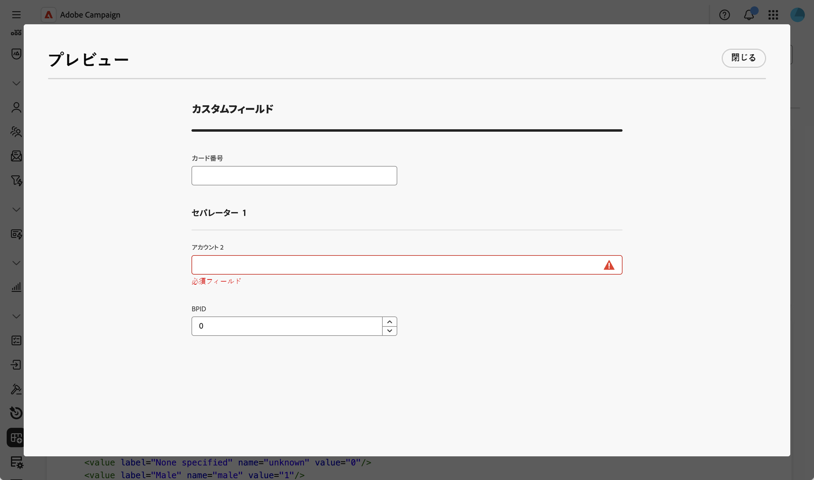
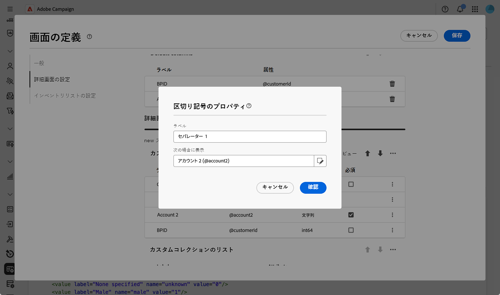
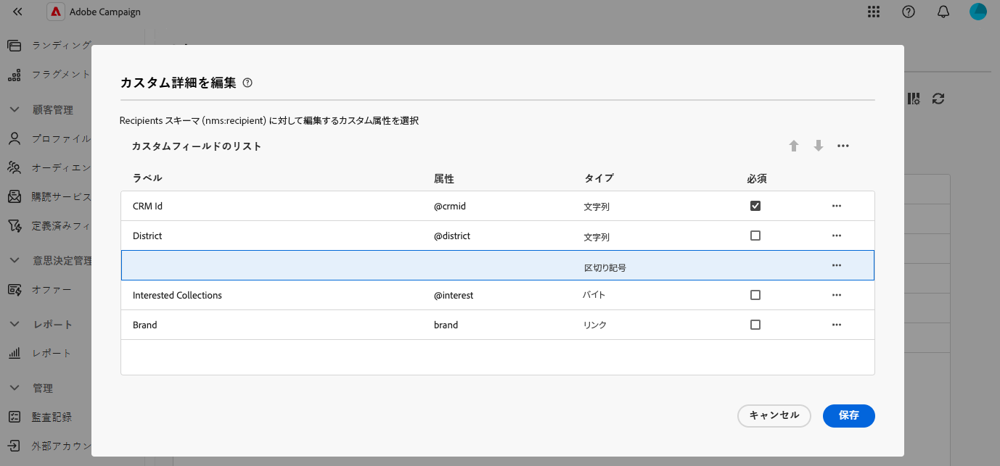
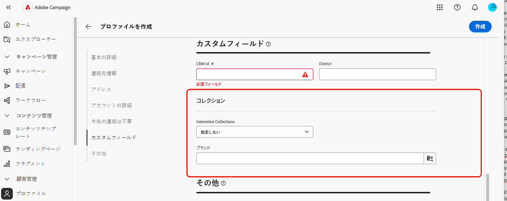

# カスタムフィールドの編集 {#fields}

>[!CONTEXTUALHELP]
>id="acw_schema_detail_screen_configuration"
>title="詳細画面の設定"
>abstract="詳細画面に表示するカスタムフィールドを設定し、セクションに整理します。 コレクションリストを追加して、プロファイル画面に関連データを表示します。"
>additional-url="https://experienceleague.adobe.com/docs/campaign-web/v8/conf/schemas/schemas-collection-lists.htmll?lang=ja" text="コレクションリストの追加"

カスタムフィールドは、Adobe Campaign コンソールから標準スキーマに追加されている属性です。 組織のニーズに合わせて新しい属性を含めることで、スキーマをカスタマイズできます。

カスタムフィールドは、インターフェイスのプロファイル詳細など、様々な画面に表示できます。 表示するフィールドと、インターフェイスでその表示方法を制御できます。

画面の定義画面とそのアクセス方法について詳しくは、[画面の定義へのアクセス](schemas-browse-access.md#screen-def)の節を参照してください。

リストにカスタムフィールドを追加するには：

1. **[!UICONTROL スキーマ]**&#x200B;メニューを参照し、フィルターを使用して編集可能なスキーマを見つけます。

1. リストでスキーマ名を選択して開き、スキーマ詳細ビューの「**[!UICONTROL 画面の編集]**」をクリックし、画面の定義にアクセスします。

1. **[!UICONTROL カスタムフィールドのリスト]**&#x200B;テーブルの上にある省略記号アイコンをクリックし、「**[!UICONTROL 属性を選択]**」を選択して、インターフェースに表示する 1 つまたは複数のカスタムフィールドを選択します。
   
1. 追加するカスタムフィールドを選択し、「確認」をクリックします。

   

   >[!NOTE]
   >
   > また、「**[!UICONTROL カスタムフィールドのリストを自動的に入力]**」を選択すると、スキーマに定義されているすべてのカスタムフィールドがインターフェースに追加されます。

カスタムフィールドを追加すると、プレビュー、並べ替え、必須項目への設定、設定の編集、サブセクションへの整理を行うことができます。

## フィールド設定の指定 {#field-settings}

各カスタムフィールドに特定の設定を指定するには、リスト内のフィールド行にある省略記号アイコンをクリックし、「**[!UICONTROL 編集]**」を選択します。

使用可能な設定を以下に示します。

* **[!UICONTROL 属性]**：カスタムフィールドの名前（読み取り専用）。
* **[!UICONTROL ラベル（カスタム）]**：インターフェイスに表示するラベル。 ラベルを指定しない場合は、スキーマで定義されたラベルが表示されます。
* **[!UICONTROL 次の場合に表示]**：フィールドが表示されるタイミングを制御する xtk 式を使用して条件を定義します。 例えば、別のフィールドが空の場合は、このフィールドを非表示にします。
* **[!UICONTROL 必須]**：インターフェイスでフィールドを必須にします。
* **[!UICONTROL 読み取り専用]**：インターフェイスでフィールドを読み取り専用にします。 ユーザーは、フィールドの値を編集できません。
* **[!UICONTROL フィルター設定]**（リンクタイプのフィールドの場合）：クエリモデラーを使用して、リンクタイプのカスタムフィールドを表示するためのルールを指定します。 例えば、別のフィールドの入力に基づいてリストの値を制限します。

  +++例を表示

  また、構文 `$(<field-name>)` を使用して、条件内の他のフィールドに入力された値を参照することもできます。 これにより、フィールドがまだデータベースに保存されていない場合でも、フォームに入力されたフィールドの現在の値を参照できます。

  以下の例では、条件は @ref フィールドの値が @refCom フィールドに入力された値と一致するかどうかを確認します。 一方、`$(@refCom)` の代わりに `@refCom` を使用すると、データベースに存在する @ref フィールドの値が参照されます。

  

  +++

* **[!UICONTROL 2 列にまたがる]**：デフォルトでは、カスタムフィールドはインターフェイスに 2 列で表示されます。 このオプションの切替スイッチをオンにすると、カスタムフィールドが 2 列ではなく画面の全幅に表示されます。

## カスタムフィールドのプレビュー {#preview}

「**[!UICONTROL プレビュー]**」をクリックして、カスタムフィールドをサンプル画面に表示します。 これにより、フィールドが必須としてマークされるなど、フィールドがインターフェイスで表示される仕組みを確認できます。

## サブセクションでのフィールドの整理 {#separator}

読みやすくするために、インターフェイスのカスタムフィールドをグループ化するための区切り記号を追加できます。 これを行うには、次の手順に従います。

1. **[!UICONTROL カスタムフィールドのリスト]**&#x200B;テーブルの上にある省略記号アイコンをクリックし、「**[!UICONTROL 区切り記号を追加]**」を選択します。

1. 区切り記号を表す新しい行をリストに追加します。 区切り記号の行の省略記号アイコンをクリックし、「**[!UICONTROL 編集]**」を選択します。

1. 区切り記号の&#x200B;**[!UICONTROL ラベル]**&#x200B;を入力し、（オプションで）区切り記号を表示する際に制御する&#x200B;**[!UICONTROL 次の場合に表示]**&#x200B;条件を設定します。

   

1. 上下の矢印を使用して、区切り記号を目的の位置に移動します。 区切り記号の下にリストされるフィールドは、その下にグループ化されます。

   この例では、「興味のあるコレクション」フィールドと「ブランド」フィールドが「コレクション」サブセクションにグループ化されています。

   | カスタムフィールドの設定 | インターフェイスでのレンダリング |
   |  ---  |  ---  |
   | {zoomable="yes"} | {zoomable="yes"} |
