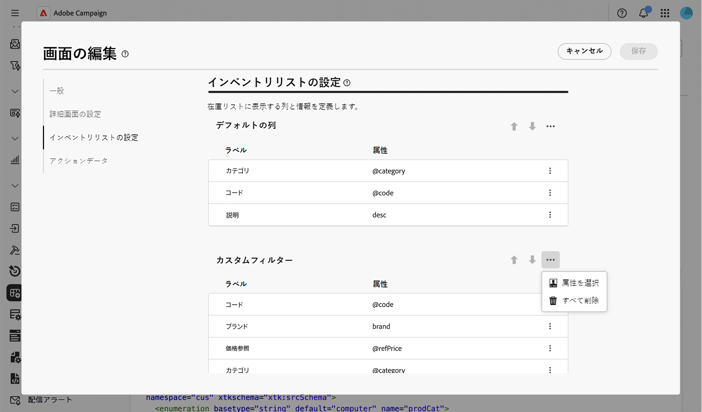
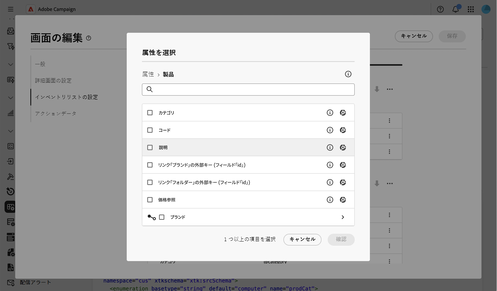
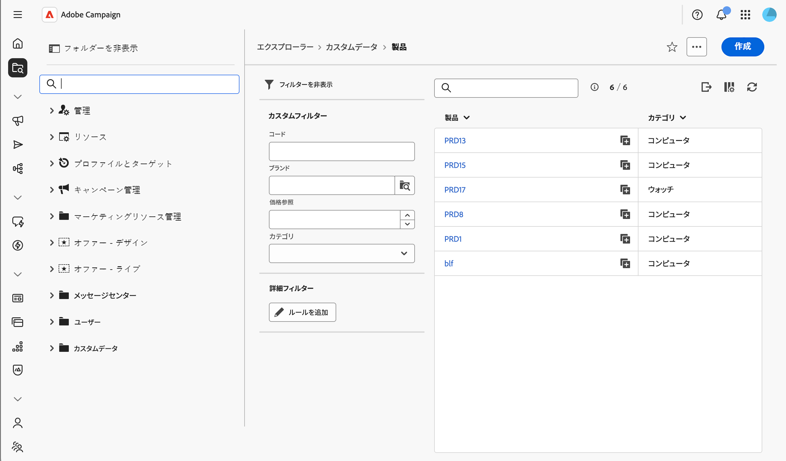

# カスタムフィルターを追加 {#custom-filters}

**[!UICONTROL 在庫リスト設定]**／**[!UICONTROL カスタムフィルター]**&#x200B;セクションでは、スキーマのリスト表示の[フィルターパネル](../query/filter.md)（**[!UICONTROL 詳細フィルター]**&#x200B;のルールビルダーの上部）でクイックアクセスフィールドとして表示される属性を選択できます。

画面の定義画面とそのアクセス方法について詳しくは、[画面の定義へのアクセス](schemas-browse-access.md#screen-def)の節を参照してください。

## カスタムフィルターを追加 {#add}

1. **[!UICONTROL スキーマ]**&#x200B;メニューを参照し、フィルターを使用して編集可能なスキーマを見つけます。

1. リストでスキーマ名を選択して開き、スキーマ詳細ビューの「**[!UICONTROL 画面の編集]**」をクリックし、画面の定義にアクセスします。

1. 「**[!UICONTROL 在庫リスト設定]**」セクションに移動し、**[!UICONTROL カスタムフィルター]**&#x200B;テーブルの上にある省略記号アイコンをクリックして、「**[!UICONTROL 属性を選択]**」を選択します。

   

1. 1 つまたは複数の属性を選択して確認します。

   次の項目を選択できます。

   * スキーマの直接的な属性（例：コードやカテゴリ）。
   * リンク属性（例：製品にリンクされたブランド）。 この場合、フィルターは、リンクされたスキーマに制限された検索ピッカーを使用します。
   * リンクのサブ属性（例：リンクされたフォルダーの完全な名前やリンクされた受信者のメール）。

   

1. 「**[!UICONTROL 保存]**」をクリックします。 上下の矢印を使用するか、ドラッグしてカスタムフィルターを並べ替えることができます。 フィルターを削除するには、その行の省略記号アイコンをクリックし、「**[!UICONTROL 削除]**」を選択します。

1. このスキーマのレコードのリストを参照し、フィルターパネルを開きます。 選択した属性は、**[!UICONTROL 詳細フィルター]**&#x200B;ルールビルダーの上に&#x200B;**[!UICONTROL カスタムフィルター]**&#x200B;として表示されます。

   

   >[!NOTE]
   >
   >日付または日時属性に基づくカスタムフィルターは、日付範囲ピッカーとして表示されます。

1. いずれかのカスタムフィルターに値を入力または選択して、リストを絞り込みます。

## リンクタイプのカスタムフィルターの値を制限 {#settings}

リンク属性に基づくカスタムフィルターでは、ピッカーで使用可能な値を制限できます。

>[!NOTE]
>
>以下に説明する「**[!UICONTROL 編集]**」オプションは、リンク属性に基づくカスタムフィルターでのみ使用できます。 他の属性タイプに基づくカスタムフィルターは、並べ替えまたは削除のみできます。

1. リンクタイプのカスタムフィルターの行で、省略記号アイコンをクリックし、「**[!UICONTROL 編集]**」を選択します。

   

1. 「**[!UICONTROL フィルター設定]**」タブで「**[!UICONTROL フィルターを編集]**」をクリックし、クエリモデラーを使用して、ピッカーで使用可能な値を制限する条件を定義します。 例えば、配信フィルターを、メールチャネルを使用する配信に制限します。

   

1. 変更を確認します。
