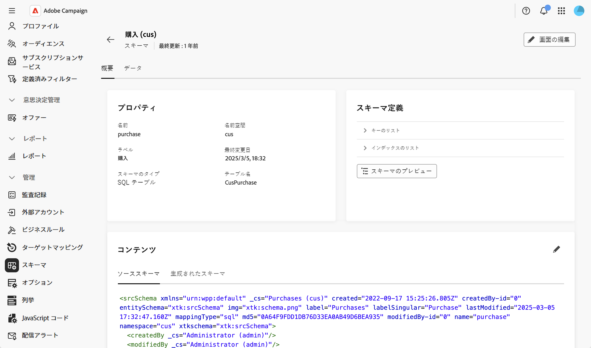
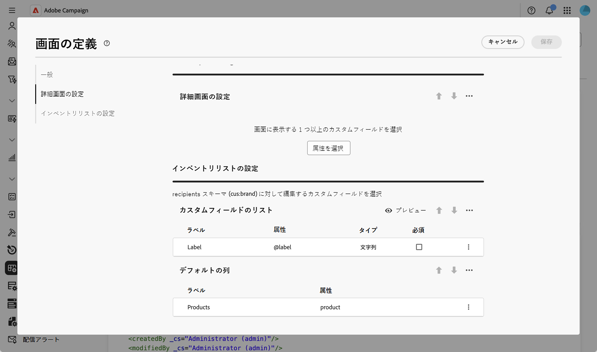
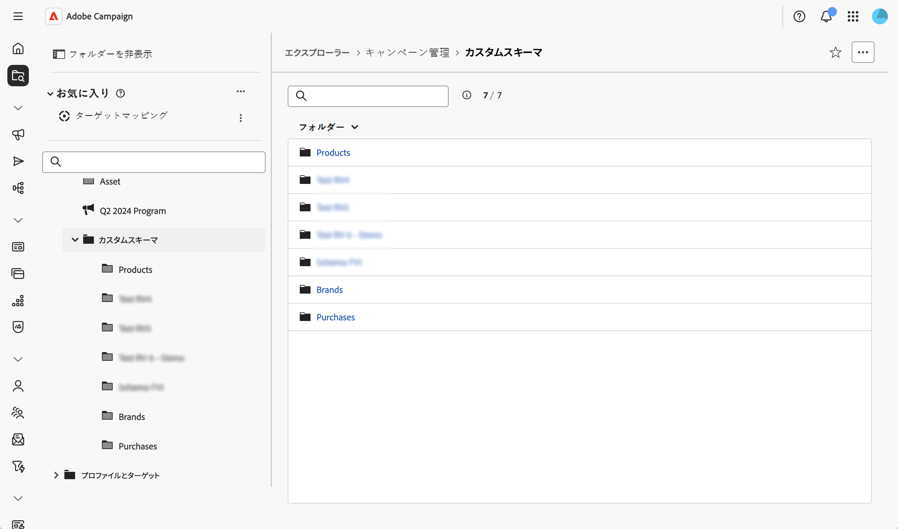
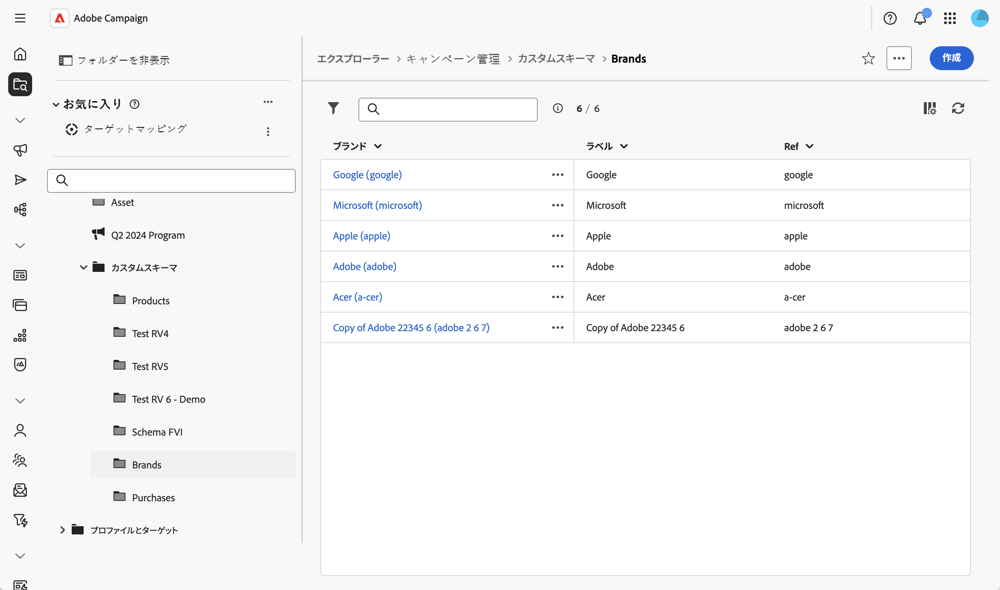

# カスタムフォームの操作 {#custom-forms}

カスタムフォームは、カスタムスキーマ内のレコードを Web ユーザーインターフェイスから直接管理できるデータ入力インターフェイスです。各カスタムフォームは、特定のカスタムスキーマに対応し、レコードを参照するためのリストビューと、レコードを作成、編集、削除するための詳細ビューを提供します。

カスタムフォームは、スキーマのフォーム定義（画面定義）に基づいています。この定義では、表示されるフィールドとその整理方法を設定します。

>[!NOTE]
>
>カスタムフォームは、フォーム定義が設定されているスキーマでのみ使用できます。

## カスタムスキーマの作成と公開 {#form-schema}

まず、カスタムスキーマを作成して公開する必要があります。配信の作成方法について詳しくは、この[節](schemas-create-publish.md)を参照してください。

次に、この例で使用するデータモデルを示します。

* 1 人の受信者が複数の購入を行う
* 1 件の購入は 1 つの製品にリンクされている
* 1 つの製品は 1 つのブランドにリンクされている

このユースケースでは、3 つのスキーマ（「購入」、「製品」、「ブランド」の各スキーマ）が作成されます。次に例を示します。

## 画面定義の設定 {#form-screen-schema}

表示するフィールドと、それらの整理方法を定義します。配信の作成方法について詳しくは、この[節](schemas-browse-access.md#screen-def)を参照してください。

「製品」カスタムリストを追加する、「ブランド」スキーマの例を次に示します。すると、ブランドにリンクされている製品のリストがフォームに表示されます。

「製品」スキーマの場合は、「購入」カスタムリストを追加します。「購入」スキーマの場合は、「製品」フィールドと「受信者」フィールドを追加します。

## ナビゲーションエントリを作成 {#form-screen-entries}

エクスプローラーでフォルダーを作成して、カスタムフォームにアクセスします。詳細な手順について詳しくは、この[節](schemas-create-publish.md#navigation)を参照してください。

リスト表示には、そのスキーマのすべてのレコードが表示されます。スキーマにフォーム定義が設定されている場合、リストは編集可能であり、レコードを作成、編集、削除できます。

その後、次のことが可能になります。

* **レコードの表示と編集**：リスト表示でレコードをクリックすると、詳細表示が開き、フィールドを直接編集できます。
* **新しいレコードを作成**：「**[!UICONTROL 作成]**」ボタンをクリックし、必須フィールドに入力します。リンクされたフィールドの場合は、検索アイコンを使用して、使用可能な関連レコードから選択します。
* **レコードを削除**：レコードを選択し、レコードの詳細またはリスト表示で使用可能な削除アクションを使用します。
* **関連データをタブで表示**：詳細表示の専用タブを使用して、関連レコードにアクセスします（例えば、ブランドにリンクされているすべての製品、製品にリンクされているすべての購入を表示します）。
* **フィルターを適用**：フィルターパネルを使用してリスト表示を調整し、スキーマ内の任意のフィールドに基づいて特定のレコードを検索します。
* **リスト列をカスタマイズ**：画面定義を使用して、デフォルトでリスト表示に含める列を設定します。
