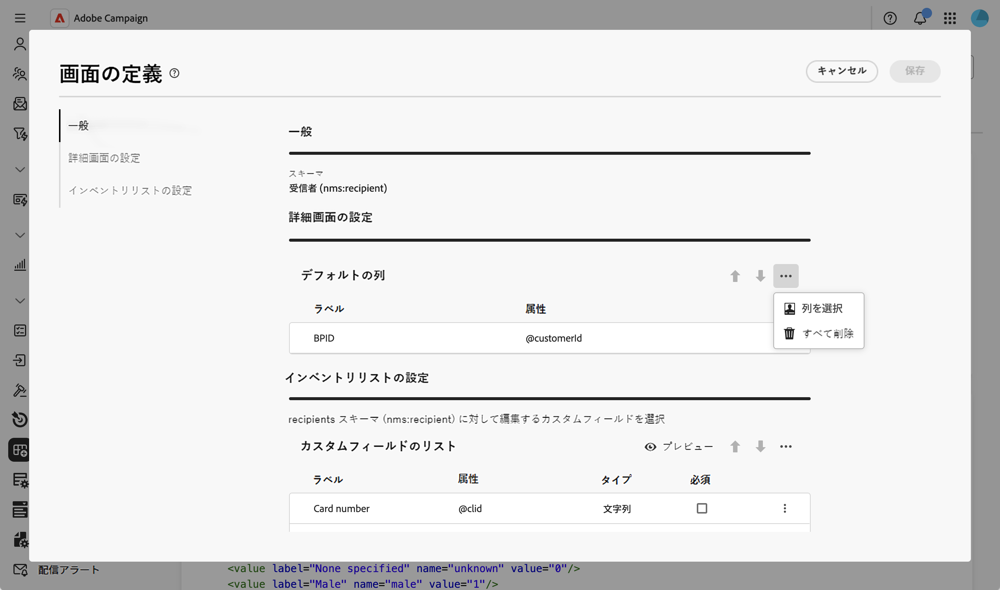
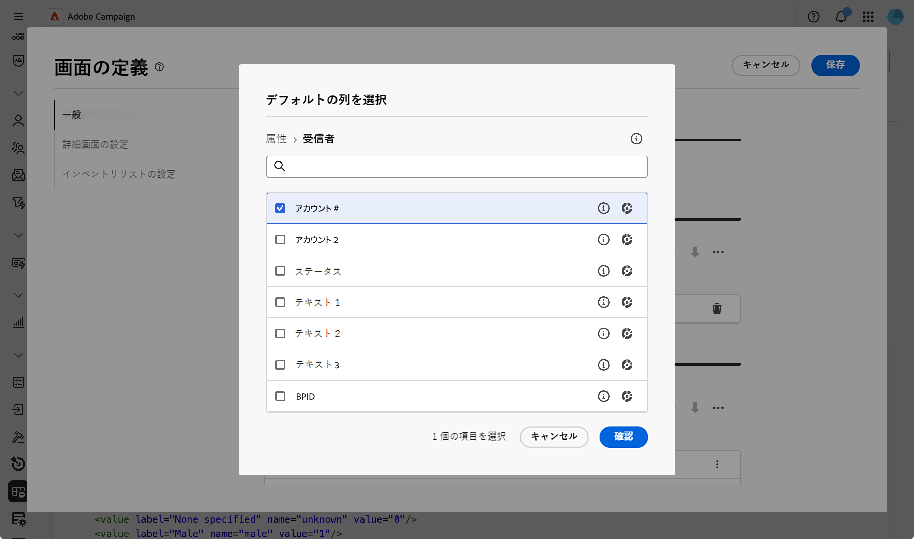
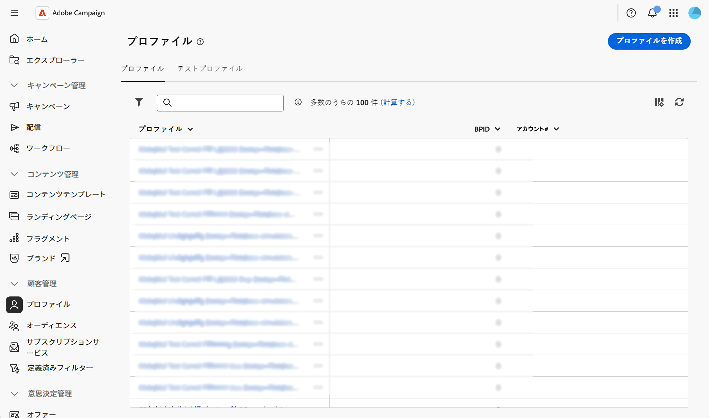

# リストの列の設定 {#list-columns}

>[!CONTEXTUALHELP]
>id="acw_schema_inventory_list_configuration"
>title="在庫リストの設定"
>abstract="リスト表示にデフォルトで表示される列を設定します。 各列には、ラベルと対応する属性が表示されます。 カスタムフィルターを追加して、リストビューのフィルターペインにクイックアクセスフィルターフィールドを表示します。"
>additional-url="https://experienceleague.adobe.com/docs/campaign-web/v8/conf/schemas/schemas-custom-filters.html" text="カスタムフィルターを追加"

「**[!UICONTROL インベントリリストの設定]**」セクションでは、リストビューにデフォルトで表示される列を設定できます。 各列には、ラベルと対応する属性が表示されます。

画面の定義画面とそのアクセス方法について詳しくは、[画面の定義へのアクセス](schemas-browse-access.md#screen-def)のセクションを参照してください。

デフォルトのリストに新しい列を追加するには：

1. **[!UICONTROL スキーマ]**&#x200B;メニューを参照し、フィルターを使用して編集可能なスキーマを見つけます。

1. リストでスキーマ名を選択して開き、スキーマ詳細ビューの「**[!UICONTROL 画面の編集]**」ボタンをクリックして、画面に定義にアクセスします。

1. 省略記号アイコン（3つのドット）をクリックします。
1. 「**[!UICONTROL 列を選択]**」をクリックします。
   

1. リストビューに表示する属性を選択し、確定します。

   

1. **プロファイル**&#x200B;メニューを参照し、プロファイルリストビューにアクセスします。 新しいタブが表示されます。 必要に応じて、列をさらに追加できます。

   

>[!NOTE]
>
>また、リストビューのフィルターパネルにクイックアクセスフィルターフィールドを追加することもできます。 詳しくは、[&#x200B; カスタムフィルターの追加](schemas-custom-filters.md)を参照してください。
