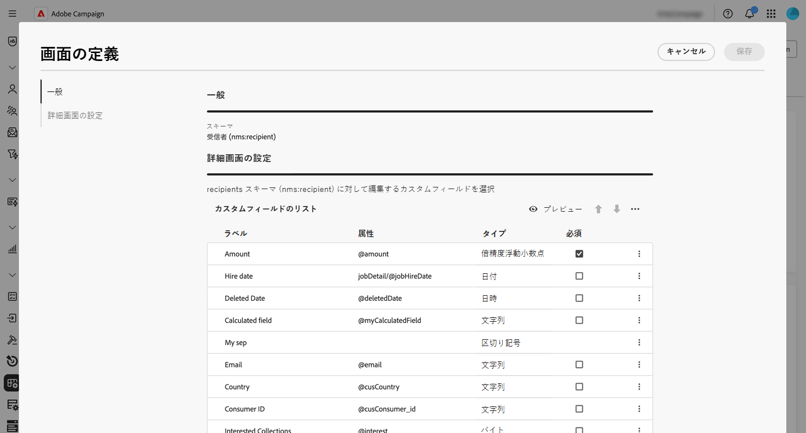

# スキーマの操作 {#schemas}

>[!CONTEXTUALHELP]
>id="acw_schema"
>title="スキーマ"
>abstract="**[!DNL Adobe Campaign]** は、XML ベースのスキーマを使用して、アプリケーション内のデータの物理的および論理的構造を定義します。この画面から、既存のすべてのスキーマを表示し、リストで名前を選択して、スキーマの詳細にアクセスできます。編集可能なスキーマのみを表示するなど、リストを絞り込むのに役立つフィルターが使用できます。"

## スキーマについて {#about}

**[!DNL Adobe Campaign]** は、XML ベースのスキーマを使用して、アプリケーション内のデータの物理的および論理的構造を定義します。スキーマは、次を定義するデータベーステーブルにリンクされた XML ドキュメントです。

* SQL テーブル構造（テーブル名、フィールド、関係を含む）。
* 要素、属性、階層、タイプ、デフォルト値、ラベルを含む XML データ構造。

スキーマは、次の点で重要な役割を果たします。

* データベーステーブルへのアプリケーションデータのマッピング。
* データオブジェクト間の関係の定義。
* 各フィールドの構造とプロパティの指定。

Adobe Campaign の各エンティティには専用のスキーマがあり、データの一貫性と整理を確保します。

スキーマについて詳しくは、[Campaign コンソールドキュメント ](https://experienceleague.adobe.com/ja/docs/campaign/campaign-v8/developer/shemas-forms/schemas){target="_blank"} を参照してください。

## Web ユーザーインターフェイスのスキーマへのアクセス {#access}

スキーマは、**[!UICONTROL 管理]**／**[!UICONTROL スキーマ]**&#x200B;メニューからアクセスできます。

この画面から、既存のすべてのスキーマを表示できます。編集可能なスキーマのみを表示するなど、リストを絞り込むのに役立つフィルターが使用できます。

スキーマを開くには、その名前を選択します。詳細なスキーマビューが表示されます。

### スキーマの概要 {#overview}

「**[!UICONTROL 概要]**」タブには、スキーマの一般的なビューが表示されます。

* 「**[!UICONTROL プロパティ]**」セクションには、スキーマ名、名前空間、関連付けられたテーブル名などの主要な情報が表示されます。

* 「**[!UICONTROL スキーマ定義]**」セクションには、データの紐付けに使用するプライマリキーや他のテーブルとのリンクなど、スキーマ定義に関する詳細が表示されます。

  「**[!UICONTROL スキーマプレビュー]**」ボタンをクリックして、スキーマを構成する様々なフィールドおよびリンクを表示します。 これにより、スキーマの完全な構造を確認できます。スキーマをカスタムフィールドで拡張すると、そのすべての拡張を視覚化できます。

* 「**[!UICONTROL コンテンツ]**」セクションには、スキーマの XML コンテンツが表示され、ソースと生成された構文を切り替えることができます。

### スキーマのデータ {#data}

「**[!UICONTROL データ]**」タブには、スキーマのデータに関する情報が表示されます。

## カスタムフィールドの編集 {#fields}

カスタムフィールドは、Adobe Campaign コンソールから標準スキーマに追加されている属性です。組織のニーズに合わせて新しい属性を含めることで、スキーマをカスタマイズできます。

カスタムフィールドは、Campaign web インターフェイスのプロファイル詳細など、様々な画面に表示できます。 表示するフィールドと、インターフェイスでその表示方法を制御できます。これを行うには、**[!UICONTROL スキーマ]** メニューの「**[!UICONTROL 画面編集]**」ボタンをクリックします。

**[!UICONTROL プレビュー]** をクリックして、カスタムフィールドをサンプル画面に表示します。

スキーマでカスタムフィールドを編集する方法について詳しくは、この節 [ カスタムフィールドの設定 ](../administration/custom-fields.md) を参照してください。