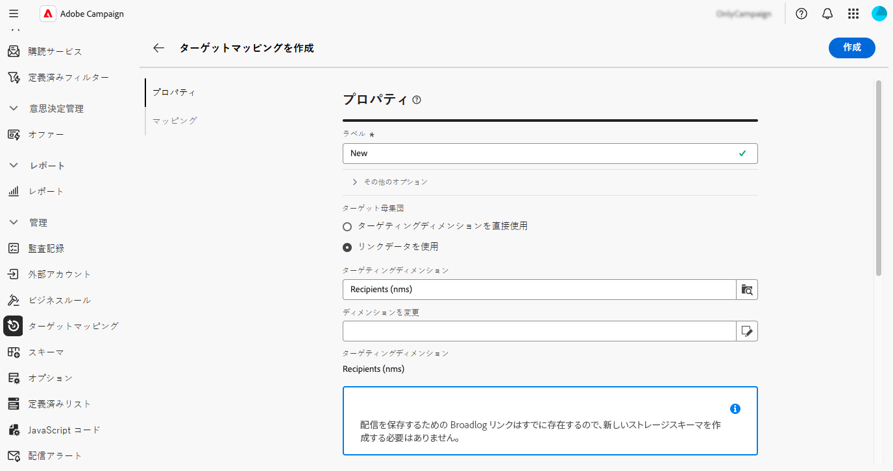
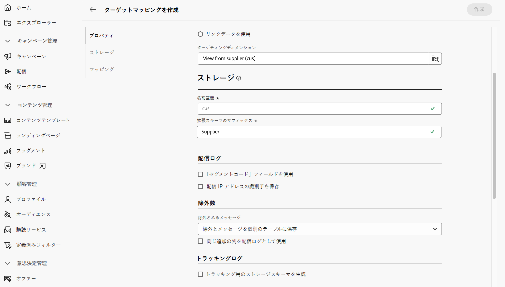
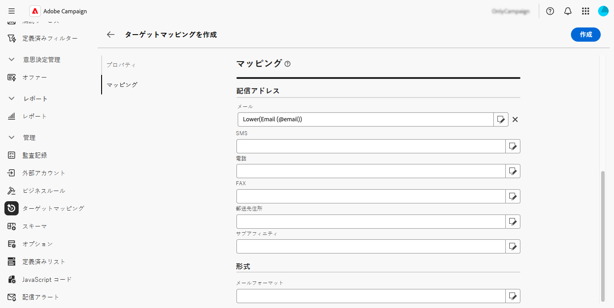
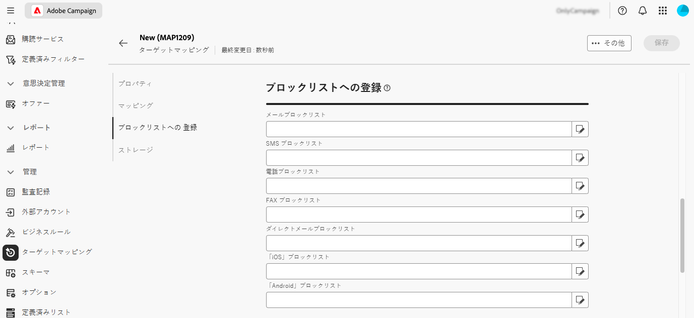
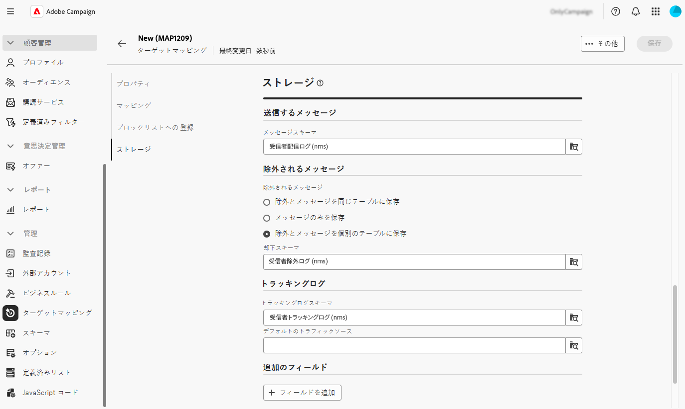
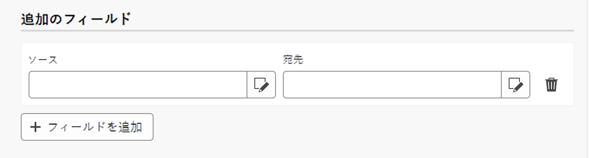

# ターゲットマッピングの管理 {#target-mappings}

>[!CONTEXTUALHELP]
>id="acw_homepage_welcome_rn5"
>title="ターゲットマッピング"
>abstract="Campaign web ユーザーインターフェイスでターゲットマッピングを作成できるようになりました。ターゲットマッピングは、様々な配信チャネル（メール、SMS、プッシュ通知）からスキーマのデータフィールドへのリンク方法を定義します。"
>additional-url="https://experienceleague.adobe.com/docs/campaign-web/v8/release-notes/release-notes.html?lang=ja" text="リリースノートを参照してください"

>[!CONTEXTUALHELP]
>id="acw_targetmapping_list"
>title="ターゲットマッピング "
>abstract="ターゲットマッピング"

## ターゲットマッピングについて {#about}

各通信チャネルは、デフォルトのターゲットマッピングを使用して受信者をターゲットにします。例えば、メールと SMS 配信のデフォルトのターゲットは「**[!UICONTROL 受信者]**」です。したがって、ターゲットマッピングには **nms:recipient** テーブルのフィールドが使用されます。プッシュ通知の場合、デフォルトのターゲットマッピングは「**購読者のアプリケーション（nms:appSubscriptionRcp）**」で、受信者のテーブルにリンクされています。

ターゲットマッピングには、**[!UICONTROL 管理]**／**[!UICONTROL ターゲットマッピング]**&#x200B;メニューからアクセスできます。この画面から、各ターゲットマッピングの詳細にアクセスしたり、必要に応じて新しいターゲットマッピングを作成したりできます。

Adobe Campaignに組み込まれているターゲットマッピングについて詳しくは、[Campaign v8 クライアントコンソールのドキュメント ](https://experienceleague.adobe.com/docs/campaign/campaign-v8/audience/add-profiles/target-mappings.html?lang=ja){target="_blank"} を参照してください。

## ターゲットマッピングの作成 {#create-mapping}

>[!CONTEXTUALHELP]
>id="acw_targetmapping_properties"
>title="ターゲットマッピングプロパティ"
>abstract="「**[!UICONTROL プロパティ]**」セクションでは、ターゲットマッピングとターゲット母集団の一般的な設定を定義できます。"

>[!CONTEXTUALHELP]
>id="acw_targetmapping_mapping"
>title="ターゲットマッピングのマッピング"
>abstract="「**[!UICONTROL マッピング]**」セクションでは、様々な配信アドレスフィールドに使用するターゲットマッピングのスキーマの属性を識別できます。"

>[!CONTEXTUALHELP]
>id="acw_targetmapping_denylist"
>title="ターゲットマッピングブロックリスト"
>abstract="ターゲットマッピングブロックリスト"

>[!CONTEXTUALHELP]
>id="acw_targetmapping_storage"
>title="ターゲットマッピングストレージ"
>abstract="「**[!UICONTROL ストレージ]**」セクションでは、ログを保存する必要がある場所を識別できます。"

新しいターゲットマッピングを作成するには、**[!UICONTROL 管理]**／**[!UICONTROL ターゲットマッピング]**&#x200B;メニューにアクセスします。「**[!UICONTROL マッピングを作成]**」ボタンをクリックして、以下の節で説明する手順に従います。

1. 「**[!UICONTROL プロパティ]**」セクションで、ターゲットマッピングの&#x200B;**[!UICONTROL ラベル]**&#x200B;を入力します。

1. 「**[!UICONTROL その他のオプション]**」セクションを展開して、ターゲットマッピングの内部名、ストレージフォルダー、説明などの詳細設定を定義します。

1. ターゲット母集団を選択します。次のいずれかが可能です。

   * **[!UICONTROL ターゲティングディメンションを直接使用]**：使用可能なディメンションのリストからターゲットにするディメンションを直接選択します。
   * **[!UICONTROL リンクデータの使用]**：ターゲティングディメンション（購読など）から開始し、ターゲットにするターゲティングディメンションに切り替えます（受信者など）。

   

1. 選択したディメンションが既存のターゲットマッピングでまだ使用されていない場合は、ログを保存するスキーマを作成する必要があります。 その他のオプションは、「**[!UICONTROL ストレージ]**」セクションで入手できます。 詳しくは、以下の節を展開してください。

   +++新しいターゲティングディメンションのストレージオプション

   1. **[!UICONTROL 名前空間]**：ログの作成に使用する名前空間を識別します。
   1. **[!UICONTROL 拡張スキーマのサフィックス]**：新しいスキーマのサフィックスを指定します。

      以下の例では、broadlog 名は「cusbroadlogSupplier」になります。

      

   1. **[!UICONTROL 配信ログ]**：このセクションのオプションを有効にすると、セグメントコードフィールドまたは配信 IP アドレスを含むフィールドで送信ログがエンリッチメントされます。 例えば、ワークフロー中に計算されたセグメントコードを送信ログに保存して、後でターゲットを絞り込みます。 これにより、この特定のセグメントコードを持つプロファイルをターゲティングできます。

   1. **[!UICONTROL 除外]**：除外ログの保存方法を指定します。

   1. **[!UICONTROL トラッキングログ]**：トラッキングログのストレージスキーマを生成するには、「**[!UICONTROL トラッキングのスキーマを生成]**」オプションを有効にします。

   +++

1. 「**[!UICONTROL マッピング]**」セクションを使用して、各配信アドレスフィールドに使用する属性をターゲットマッピングのスキーマから特定します。 フィールドごとに、マッピングする目的の属性を選択します。また、フィールドを識別する式を作成することもできます。例えば、address 属性に lower 関数を適用します。

   

1. ターゲットマッピングの準備が整ったら、「**[!UICONTROL 作成]**」ボタンをクリックします。ターゲットマッピングと、ログのすべての関連スキーマが自動的に作成されます。

ターゲットマッピングが作成されると、次の 2 つの追加のセクションが画面に表示されます。

* **[!UICONTROL ブロックリストへの登録]**：このセクションでは、ターゲットマッピングのスキーマから、ブロックリストに使用する属性を識別できます。

  

* **[!UICONTROL ストレージ]**：このセクションでは、ログの保存に使用するテーブルを識別できます。

  

   * **[!UICONTROL メッセージスキーマ]**：送信ログの保存に使用するスキーマを識別します。
   * **[!UICONTROL 除外されたメッセージ]**：配信と除外のログストレージの管理方法を指定します。

      * **[!UICONTROL 除外とメッセージを同じテーブルに保存]**
      * **[!UICONTROL メッセージのみを保存]**：除外を保存しません。
      * **[!UICONTROL 除外とメッセージを個別のテーブルに保存]**：「**[!UICONTROL 却下スキーマ]**」フィールドで、除外ログの保存に使用するスキーマを選択します。

   * **[!UICONTROL トラッキングログ]**：トラッキングログを保存する場所とデフォルトのトラフィックソースを選択します。
   * **[!UICONTROL 追加フィールド]**：配信ログに保存する追加フィールドのリストを指定します。 これらのフィールドには、ターゲットの個々のメンバーに関する情報（`recipient/@firstName` など）を永続的に保存したり、ワークフロー中に計算された追加データ（`[targetData/@offeCode]` など）を保存したりできます。

     これを行うには、「**[!UICONTROL フィールドを追加]**」を選択します。**[!UICONTROL Source]** フィールドに保存する情報と、送信ログでこの情報を **[!UICONTROL Destination]** フィールドに保存するために使用する属性を特定します。

     {width="50%" zoomable="yes"}