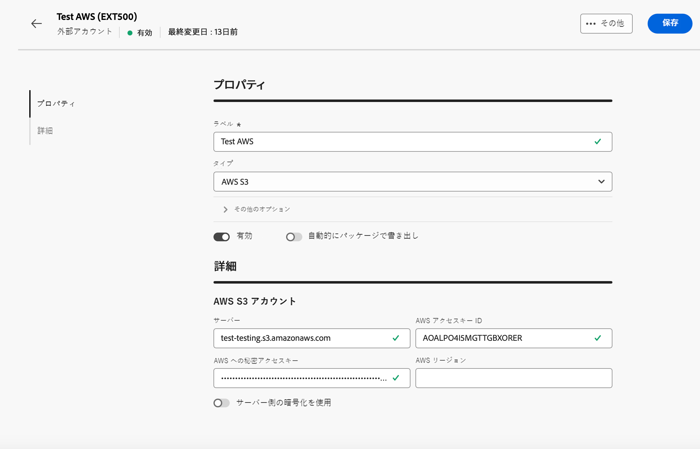

# データ転送外部アカウント {#transfer-external-account}

## Amazon Simple Storage Service（S3） {#amazon-simple-storage-service--s3--external-account}

Amazon Simple Storage Service（S3）コネクタを使用して Adobe Campaign との間でデータのインポートまたはエクスポートをおこなうことができます。コネクタのセットアップはワークフローアクティビティでおこなえます。詳しくは、[このページ](https://experienceleague.adobe.com/ja/docs/campaign-web/v8/wf/design-workflows/transfer-file){target=_blank}を参照してください。

この新規外部アカウントを設定する際には、次の情報を提供する必要があります。

* **[!UICONTROL AWS S3 アカウントサーバー]**

  サーバーの URL。次のように入力する必要があります。

  `  <S3bucket name>.s3.amazonaws.com/<s3object path>`

* **[!UICONTROL AWS アクセスキー ID]**

  AWS アクセスキー ID の見つけ方については、この[ページ](https://docs.aws.amazon.com/ja_jp/general/latest/gr/aws-sec-cred-types.html#access-keys-and-secret-access-keys)を参照してください。

* **[!UICONTROL AWS への秘密アクセスキー]**

  AWS への秘密アクセスキーの見つけ方については、この[ページ](https://aws.amazon.com/jp/blogs/security/wheres-my-secret-access-key/)を参照してください。

* **[!UICONTROL AWS リージョン]**

  AWS リージョンについて詳しくは、この[ページ](https://aws.amazon.com/about-aws/global-infrastructure/regions_az/)を参照してください。

* **[!UICONTROL サーバー側の暗号化を使用]**&#x200B;チェックボックスをオンにすると、ファイルを S3 暗号モードで保存できます。

アクセスキー ID および秘密アクセスキーの見つけ方については、Amazon Web サービス[ドキュメント](https://docs.aws.amazon.com/ja_jp/general/latest/gr/aws-sec-cred-types.html#access-keys-and-secret-access-keys)を参照してください。

## Azure Blob ストレージ {#azure-blob-external-account}

**[!UICONTROL Azure Blob ストレージ]**&#x200B;外部アカウントを使用すると、**[!UICONTROL ファイル転送]**&#x200B;ワークフローアクティビティで Adobe Campaign との間でデータをインポートまたはエクスポートできます。詳しくは、[この節](https://experienceleague.adobe.com/ja/docs/campaign-web/v8/wf/design-workflows/transfer-file){target=_blank}を参照してください。

**[!UICONTROL Azure 外部アカウント]**&#x200B;を Adobe Campaign で使用できるように設定するには、次の情報が必要です。

* **[!UICONTROL サーバー]**

  Azure Blob ストレージサーバーの URL。

* **[!UICONTROL 暗号化]**

  選択した暗号化のタイプ（**[!UICONTROL なし]**&#x200B;または **[!UICONTROL SSL]**）。

* **[!UICONTROL アクセスキー]**

  **[!UICONTROL アクセスキー]**&#x200B;の場所について詳しくは、この[ページ](https://docs.microsoft.com/ja-JP/azure/storage/common/storage-account-keys-manage?tabs=azure-portal)を参照してください。

## SFTP

SFTP 外部アカウントを使用すれば、Adobe Campaign 外でサーバーへのアクセスを設定およびテストできます。

**[!UICONTROL SFTP]** 外部アカウントを設定するには、次のフィールドに入力します。

* **[!UICONTROL サーバー]**

  SFTP サーバーの名前またはアドレスを入力します。

* **[!UICONTROL ポート]**

  SFTP 接続のポート番号を指定します。 デフォルトのポート番号は 22 です。

* **[!UICONTROL アカウント]**

  SFTP サーバーへの接続に使用するユーザー名を入力します。

* **[!UICONTROL パスワード]**

  SFTP アカウントのパスワードを入力します。

* **[!UICONTROL SFTP 認証タイプ]**

  SFTP サーバーで認証する方法を選択します。 次のようなオプションがあります。

   * **[!UICONTROL パスワード]**：アカウントのパスワードを使用して認証します。

   * **[!UICONTROL 公開鍵]**:SSH キーペア（秘密鍵と公開鍵）を使用して認証します。

**[!UICONTROL 公開鍵]** 認証を選択した場合は、次のフィールドに入力する必要があります。

* **[!UICONTROL 秘密鍵ファイル]**

  認証に使用する SSH 秘密鍵ファイルを指定します。

* **[!UICONTROL 公開鍵ファイル]**

  SFTP サーバーに登録されている、対応する SSH 公開鍵を指定します。

* **[!UICONTROL SSH キーのパスフレーズ]**

  秘密鍵が保護されている場合に復号化するためのパスフレーズを入力します。

## HTTP

HTTP 外部アカウントを使用すれば、Adobe Campaign外でサーバーへのアクセスを設定およびテストできます。

**[!UICONTROL HTTP]** 外部アカウントを設定するには、次のフィールドに入力します。

* **[!UICONTROL サーバー]**

  HTTP サーバーの名前またはアドレスを入力します。

* **[!UICONTROL ポート]**

  HTTP 接続ポート番号を指定します。 デフォルトのポート番号は 80 です。

* **[!UICONTROL アカウント]**

  認証用のユーザー名を入力します。

* **[!UICONTROL パスワード]**

  ユーザーアカウントに関連付けられているパスワードを入力します。

* **[!UICONTROL SFTP 認証タイプ]**

  接続の認証タイプを選択します。 次のようなオプションがあります。

   * パスワード
   * 公開鍵

**[!UICONTROL 公開鍵]** 認証を使用している場合は、**[!UICONTROL 公開鍵認証]** メニューから、次に必要な値を入力します。

* **[!UICONTROL パスワード]**：秘密鍵を保護するパスフレーズ（該当する場合）。

* **[!UICONTROL 秘密鍵]**:Snowflake アカウントの認証に使用する秘密鍵。

## FTP

FTP 外部アカウントを使用すれば、Adobe Campaign 外でサーバーへのアクセスを設定およびテストできます。

**[!UICONTROL FTP]** 外部アカウントを設定するには、次のフィールドに入力します。

* **[!UICONTROL サーバー]**

  FTP サーバーの名前またはアドレスを入力します。

* **[!UICONTROL ポート]**

  FTP 接続のポート番号を指定します。 デフォルトのポート番号は 21 です。

* **[!UICONTROL アカウント]**

  認証用のユーザー名を入力します。

* **[!UICONTROL パスワード]**

  ユーザーアカウントに関連付けられているパスワードを入力します。

* **[!UICONTROL 暗号化]**

  接続の暗号化のタイプを選択します。 次のようなオプションがあります。

   * デフォルト
   * POP3 + STARTTLS
   * POP3 非セキュア
   * POP3 セキュア