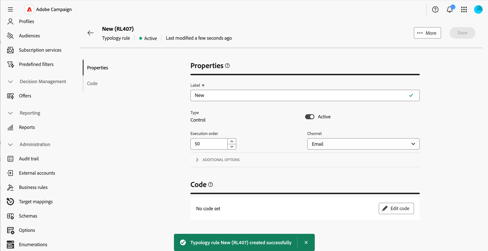

# ビジネスルール（タイポロジ）の操作 {#typologies}

>[!CONTEXTUALHELP]
>id="acw_homepage_welcome_rn4"
>title="ビジネスルール"
>abstract="Adobe Campaign web ユーザーインターフェイスでタイポロジとタイポロジルールを作成できるようになりました。タイポロジでは、配信の送信を制御、フィルタリングおよび優先順位付けできます。"
>additional-url="https://experienceleague.adobe.com/docs/campaign-web/v8/release-notes/release-notes.html?lang=ja" text="リリースノートを参照してください"

>[!CONTEXTUALHELP]
>id="acw_business_rules"
>title="タイポロジとタイポロジルール"
>abstract="タイポロジを使用すると、すべての配信にわたってビジネスプラクティスを標準化できます。タイポロジとは、配信状況を制御、フィルターおよび優先順位付けするタイポロジルールの集まりです。タイポロジルール内の条件に一致するプロファイルは、準備段階中に配信オーディエンスから除外されます。"

>[!CONTEXTUALHELP]
>id="acw_business_rules_typology_rules_type"
>title="フィルタリング"
>abstract=" タイポロジルールには 2 つのタイプがあります。  **コントロール**&#x200B;ルールは、文字表示、SMS の長さ、アドレス形式、URL の短縮など、送信前にメッセージの品質と有効性を確認します。  **フィルタリング**&#x200B;ルールは、特定の条件（年齢、場所、国、電話番号など）に基づいてターゲットオーディエンスのセグメントを除外します。"

## タイポロジについて

タイポロジを使用すると、すべての配信にわたってビジネスプラクティスを標準化できます。**タイポロジ**&#x200B;とは、配信状況を制御、フィルター、優先順位付けする&#x200B;**タイポロジルール**&#x200B;のコレクションです。タイポロジルール内の条件に一致するプロファイルは、準備段階中に配信オーディエンスから除外されます。

タイポロジを使用すると、購読解除リンクや件名などの特定の要素や、購読解除者、競合他社、非ロイヤルティ顧客などの対象とするターゲットからグループを除外するフィルタリングルールが配信に常に含まれていることを確認できます。

タイポロジには、**[!UICONTROL 管理]**／**[!UICONTROL ビジネスルール]**&#x200B;メニューからアクセスできます。この画面から、既存のすべてのタイポロジとタイポロジルールにアクセスしたり、必要に応じて新しいタイポロジを作成したりします。

>[!NOTE]
>
>**[!UICONTROL タイポロジルール]**&#x200B;リストには、web ユーザーインターフェイスまたはクライアントコンソールでこれまでに作成されたすべての既存のルールが表示されます。ただし、web ユーザーインターフェイスで作成できるのは、**コントロール**&#x200B;ルールと&#x200B;**フィルタリング**&#x200B;ルールのみです。頻度ルールや処理能力ルールなど、他のタイプのタイポロジルールを作成するには、Campaign v8 クライアントコンソールを使用します。[詳しくは、クライアントコンソールでタイポロジルールを作成する方法を参照してください](https://experienceleague.adobe.com/ja/docs/campaign/automation/campaign-optimization/campaign-typologies){target="_blank"}。

メッセージにタイポロジを適用する主な手順は次のとおりです。

1. [タイポロジを作成します](#typology)。
1. [タイポロジルールを作成します](#typology-rule)。
1. [タイポロジのタイポロジルールを参照します](#add-rules)。
1. [メッセージにタイポロジを適用します](#message)。

## タイポロジの作成 {#typology}

>[!CONTEXTUALHELP]
>id="acw_business_rules_typology_properties"
>title="タイポロジプロパティ"
>abstract="タイポロジのプロパティを定義し、「**[!UICONTROL その他のオプション]**」セクションを展開して詳細設定にアクセスします。「**[!UICONTROL IP アフィニティ]**」フィールドを使用して、IP アフィニティをタイポロジに関連付けます。これにより、各アフィニティに使用できる特定の IP アドレスを定義して、アウトバウンド SMTP トラフィックの制御を強化できます。"

>[!CONTEXTUALHELP]
>id="acw_business_rules_typology_ip_affinity"
>title="IP アフィニティ"
>abstract="IP アドレスを使用したアフィニティの管理では、配信アクションのタイポロジに応じてトラフィックのタイプごとに異なる IP アドレスを関連付けることで、送信 SMTP トラフィックをよりコントロールすることができます。"

タイポロジを作成するには、次の手順に従います。

1. **[!UICONTROL ビジネスルール]**&#x200B;メニューに移動して、「**[!UICONTROL タイポロジ]**」タブを選択します。

1. 「**[!UICONTROL タイポロジを作成]**」ボタンをクリックして、タイポロジの&#x200B;**[!UICONTROL ラベル]**&#x200B;を入力します。

1. 「**[!UICONTROL その他のオプション]**」セクションを展開して、タイポロジの内部名、ストレージフォルダー、説明などの詳細設定を定義します。

   

   >[!NOTE]
   >
   >「**[!UICONTROL IP アフィニティ]**」フィールドを使用すると、IP アフィニティをタイポロジに関連付けることができます。これにより、各アフィニティに使用できる特定の IP アドレスを定義して、アウトバウンド SMTP トラフィックの制御を強化できます。例えば、1 つの国またはサブドメインにつき 1 つのアフィニティを使用できます。さらに、1 つの国につき 1 つのタイポロジを作成し、各アフィニティを各国の対応するタイポロジに関連付けることができます。

1. 「**[!UICONTROL 作成]**」をクリックして、タイポロジの作成を確認します。

タイポロジの詳細が開きます。この画面から、既存のタイポロジルールを直接参照するか、新しいタイポロジルールを作成して後で参照します。
* [詳しくは、タイポロジルールを作成する方法を参照してください](#add-rules)
* [詳しくは、タイポロジルールを参照する方法を参照してください](#add-rules)

## タイポロジルールの作成 {#typology-rule}

>[!CONTEXTUALHELP]
>id="acw_business_rules_typology_rules_properties"
>title="タイポロジルールプロパティ"
>abstract="タイポロジルールのプロパティを定義します。**コントロール**&#x200B;ルールはメッセージの品質と有効性を送信前に検証し、**フィルタリング**&#x200B;ルールは特定の基準に基づいてターゲットオーディエンスのセグメントを除外します。  また、同じメッセージ処理フェーズ中に同じタイプの複数のルールを実行する際に、ルールの実行順序を変更して、タイポロジルールの実行順序を管理することもできます。"

次の 2 種類のタイポロジルールを使用できます。

* **コントロール**：文字の表示、SMS の長さ、アドレスの形式、URL の短縮など、メッセージの品質と有効性を送信前に確認します。これらのルールは、コンテンツの確認と変更の複雑なロジックを定義するスクリプトインターフェイスを使用して作成されます。

* **フィルタリング**：年齢、場所、国、電話番号など、特定の条件に基づいてターゲットオーディエンスのセグメントを除外します。これらのルールは、ターゲティングディメンションにリンクされます。

>[!NOTE]
>
>現在、web ユーザーインターフェイスから作成できるのは、**コントロール**&#x200B;タイポロジルールと&#x200B;**フィルタリング**&#x200B;タイポロジルールのみです。他のタイプのルールを作成するには、クライアントコンソールを使用します。[詳しくは、クライアントコンソールでタイポロジルールを作成する方法を参照してください](https://experienceleague.adobe.com/ja/docs/campaign/automation/campaign-optimization/campaign-typologies){target="_blank"}。

タイポロジルールを作成するには、次の手順に従います。

1. **[!UICONTROL ビジネスルール]** メニューに移動し、「**[!UICONTROL タイポロジルール]**」タブを選択します。

1. 「**[!UICONTROL タイポロジルールを作成]**」ボタンをクリックし、次に説明する手順に従います。

   

### ルールの主要なプロパティの定義 {#properties}

>[!CONTEXTUALHELP]
>id="acw_business_rules_typology_rules_filtering"
>title="フィルタリング"
>abstract="**フィルタリング**&#x200B;ルールでは、年齢、場所、国、電話番号など、特定の条件に基づいてターゲットオーディエンスのセグメントを除外します。タイポロジルールのターゲティングディメンションを選択し、「**[!UICONTROL ルールを追加]**」ボタンをクリックしてクエリモデラーにアクセスし、ルールを作成します。"

>[!CONTEXTUALHELP]
>id="acw_business_rules_typology_rules_code"
>title="コード"
>abstract="**コントロール**&#x200B;ルールでは、文字の表示、SMS の長さ、アドレスの形式、URL の短縮など、メッセージの品質と有効性を送信前に確認します。これらのルールは、JavaScript コードを使用して作成されます。"

新しいタイポロジルールを作成する際に定義する主なプロパティを次に示します。

>[!BEGINTABS]

>[!TAB コントロールルール]

1. ルールの&#x200B;**[!UICONTROL ラベル]**&#x200B;を入力します。

   

1. 「**[!UICONTROL その他のオプション]**」セクションを使用すると、ルールの内部名、フォルダーストレージ、説明などの詳細設定にアクセスできます。 また、ルールを適用するタイミングやアラートレベルも指定できます。 詳しくは、以下のセクションを展開してください。

   +++フェーズ

   配信ライフサイクルのどの時点でルールを適用するかを指定します。 「**[!UICONTROL フェーズ]**」ドロップダウンリストで値を選択します。

   * **[!UICONTROL ターゲティングの開始時]**：エラーが発生した場合にパーソナライゼーションを実行しないようにします。

   * **[!UICONTROL ターゲティングの終了時]**：コントロールルールを適用するためにターゲットのボリュームを把握するには、このフェーズを選択します。例えば、**[!UICONTROL 本配信前確認のターゲットのサイズを検証]**&#x200B;コントロールルールは、各ターゲティングステージの後に適用します。このルールにより、本配信前確認の受信者数が多い場合は、メッセージのパーソナライゼーションが行われないようにすることができます。

   * **[!UICONTROL パーソナライゼーションの開始時]**：コントロールルールで、メッセージのパーソナライゼーションの承認を検証する場合は、このフェーズを選択します。メッセージのパーソナライゼーションは、分析フェーズで実行されます。

   * **[!UICONTROL 分析の終了時]**：完全なメッセージのパーソナライゼーションが必要なチェックを適用します。

   +++

   +++レベル

   ルールのアラートレベルを指定します。

   * **[!UICONTROL エラー]**: メッセージの準備を停止します

   * **[!UICONTROL 警告]**：準備ログに警告を表示します

   * **[!UICONTROL 情報]**：準備ログに情報を表示します

   * **[!UICONTROL 詳細]**: サーバーログに情報を表示します

   +++

1. ルールのコンテンツを作成するには、「**コードを編集**」ボタンをクリックし、JavaScriptを使用してルールのロジックを入力します。 次の例では、ターゲットが空の場合にログに警告を表示するルールを作成します。

   

1. 「**作成**」をクリックします。

>[!TAB フィルタールール]

1. ルールの&#x200B;**[!UICONTROL ラベル]**&#x200B;を入力します。

   

1. 「**[!UICONTROL その他のオプション]**」セクションを展開して、ルールの内部名、フォルダーストレージ、説明などの詳細設定にアクセスします。

1. ルールのコンテンツを作成するには、ターゲティングディメンションを選択し、「**[!UICONTROL ルールを追加]**」ボタンをクリックし、[ ルールビルダー ](../query/query-modeler-overview.md) を使用してフィルター条件を定義します。

   

1. **作成** をクリックします。

>[!ENDTABS]

### ルールの追加プロパティの定義 {#add-properties}

次に、追加のパラメーターを定義します。 この画面では、以前に定義した主なプロパティを引き続き変更できます。

1. ルールを作成した直後にアクティブにしない場合は、「**[!UICONTROL アクティブ]**」オプションの切替スイッチをオフにします。

1. ルールの&#x200B;**[!UICONTROL 実行順序]**&#x200B;を定義します。

   デフォルトでは、タイポロジルールの順序は 50 に設定されています。この値を調整して、同じメッセージ処理フェーズ中に同じタイプの複数のルールを実行する際に、タイポロジルールの実行順序を管理します。例えば、実行順序が 20 番目のフィルタリングルールは、実行順序が 30 番目のフィルタリングルールより先に実行されます。

1. ルールに関連付ける&#x200B;**[!UICONTROL チャネル]**&#x200B;を選択します。

ルールをタイポロジで参照し、メッセージに適用する準備が整いました。

## タイポロジのタイポロジルールの参照 {#add-rules}

タイポロジで 1 つまたは複数のルールを参照するには、次の手順に従います。

1. 「**[!UICONTROL タイポロジ]**」タブに移動し、ルールを参照するタイポロジを開きます。

1. 「**[!UICONTROL タイポロジルール]**」タブを選択し、「**[!UICONTROL ルールを追加）]** ボタンをクリックします。

   

1. タイポロジに関連付ける 1 つまたは複数のタイポロジルールを選択し、確認します。

   

1. 「**[!UICONTROL 保存]**」をクリックします。

これで、メッセージにタイポロジを適用できます。完了すると、選択したすべてのタイポロジルールが実行され、定義済みのチェックが実行されます。

## メッセージへのタイポロジの適用 {#message}

メッセージまたはメッセージテンプレートにタイポロジを適用するには、メッセージ設定でタイポロジを選択します。[詳しくは、配信設定を指定する方法を参照してください](../advanced-settings/delivery-settings.md#typology)。

適用すると、タイポロジに含まれているタイポロジルールがメッセージの準備中に実行されて、配信の有効性がチェックされます。タイポロジルール内の条件に一致するプロファイルは、配信オーディエンスから除外されます。