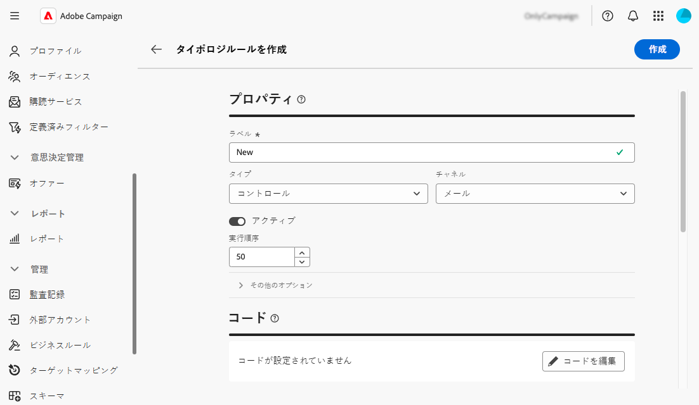

# ビジネスルール（タイポロジ）の操作 {#typologies}

>[!CONTEXTUALHELP]
>id="acw_homepage_welcome_rn4"
>title="ビジネスルール"
>abstract="Adobe Campaign web ユーザーインターフェイスでタイポロジとタイポロジルールを作成できるようになりました。タイポロジでは、配信の送信を制御、フィルタリングおよび優先順位付けできます。"
>additional-url="https://experienceleague.adobe.com/docs/campaign-web/v8/release-notes/release-notes.html?lang=ja" text="リリースノートを参照してください"

>[!CONTEXTUALHELP]
>id="acw_business_rules"
>title="タイポロジとタイポロジルール"
>abstract="タイポロジを使用すると、すべての配信でビジネスプラクティスを標準化できます。 タイポロジとは、配信の送信を制御、フィルタリングおよび優先順位付けできる、タイポロジルールのコレクションです。 タイポロジルールの条件に一致するプロファイルは、準備フェーズでは配信オーディエンスから除外されます。"

>[!CONTEXTUALHELP]
>id="acw_business_rules_typology_rules_type"
>title="フィルタリング"
>abstract=" タイポロジルールには、文字表示、SMS の長さ、アドレス形式、URL の短縮など、メッセージの品質と有効性を事前送信する   **コントロール** ルールの 2 つのタイプがあります。   **フィルタリング** 年齢、場所、国、電話番号などの特定の条件に基づいて、ターゲットオーディエンスのセグメントを除外するルール。"

## タイポロジについて

タイポロジを使用すると、すべての配信でビジネスプラクティスを標準化できます。 **タイポロジ** は、配信の送信を制御、フィルタリングおよび優先順位付けできる **タイポロジルール** のコレクションです。 タイポロジルールの条件に一致するプロファイルは、準備フェーズでは配信オーディエンスから除外されます。

タイポロジを使用すると、購読解除リンクや件名行など特定の要素が配信に常に含まれたり、非購読者、競合他社、非ロイヤルティ顧客などのグループをターゲットターゲットから除外するフィルタリングルールが配信されるようにします。

タイポロジには、**[!UICONTROL 管理]**／**[!UICONTROL ビジネスルール]**&#x200B;メニューからアクセスできます。この画面から、既存のすべてのタイポロジとタイポロジルールにアクセスするか、必要に応じて新しいタイポロジを作成します。

>[!NOTE]
>
>**[!UICONTROL タイポロジルール]**&#x200B;リストには、web ユーザーインターフェイスまたはクライアントコンソールでこれまでに作成されたすべての既存のルールが表示されます。ただし、web ユーザーインターフェイスで作成できるのは、**コントロール**&#x200B;ルールと&#x200B;**フィルタリング**&#x200B;ルールのみです。頻度ルールや処理能力ルールなど、他のタイプのタイポロジルールを作成するには、Campaign v8 クライアントコンソールを使用します。 [ クライアントコンソールでタイポロジルールを作成する方法を説明します ](https://experienceleague.adobe.com/ja/docs/campaign/automation/campaign-optimization/campaign-typologies){target="_blank"}

メッセージにタイポロジを適用する主な手順は次のとおりです。

1. [タイポロジを作成します](#typology)。
1. [タイポロジルールを作成します](#typology-rules)。
1. [タイポロジのタイポロジルールを参照します](#add-rules)。
1. [メッセージにタイポロジを適用します](#message)。

## タイポロジの作成 {#typology}

>[!CONTEXTUALHELP]
>id="acw_business_rules_typology_properties"
>title="タイポロジプロパティ"
>abstract="タイポロジのプロパティを定義し、「**[!UICONTROL その他のオプション]**」セクションを展開して詳細設定にアクセスします。「**[!UICONTROL IP アフィニティ]**」フィールドを使用して、IP アフィニティをタイポロジに関連付けます。これにより、各アフィニティに使用できる特定の IP アドレスを定義することで、送信 SMTP トラフィックをより適切に制御できます。"

>[!CONTEXTUALHELP]
>id="acw_business_rules_typology_ip_affinity"
>title="IP アフィニティ"
>abstract="IP アドレスを使用したアフィニティの管理では、配信アクションのタイポロジに応じてトラフィックのタイプごとに異なる IP アドレスを関連付けることで、送信 SMTP トラフィックをよりコントロールすることができます。"

タイポロジを作成するには、次の手順に従います。

1. **[!UICONTROL ビジネスルール]** メニューに移動し、「**[!UICONTROL タイポロジ]**」タブを選択します。

1. 「**[!UICONTROL タイポロジを作成]**」ボタンをクリックして、タイポロジの&#x200B;**[!UICONTROL ラベル]**&#x200B;を入力します。

1. 「**[!UICONTROL その他のオプション]**」セクションを展開して、タイポロジの内部名、ストレージフォルダー、説明などの詳細設定を定義します。

   

   >[!NOTE]
   >
   >「**[!UICONTROL IP アフィニティ]**」フィールドを使用すると、IP アフィニティをタイポロジに関連付けることができます。これにより、アフィニティごとに使用できる特定の IP アドレスを定義することで、送信 SMTP トラフィックをより詳細に制御できます。 例えば、1 つの国またはサブドメインにつき 1 つのアフィニティを使用できます。さらに、1 つの国につき 1 つのタイポロジを作成し、各アフィニティを各国の対応するタイポロジに関連付けることができます。

1. 「**[!UICONTROL 作成]**」をクリックして、タイポロジの作成を確認します。

タイポロジの詳細が開きます。 この画面から、既存のタイポロジルールを直接参照するか、新しいタイポロジルールを作成して後で参照します。
* [詳しくは、タイポロジルールを作成する方法を参照してください](#add-rules)
* [詳しくは、タイポロジルールを参照する方法を参照してください](#add-rules)

## タイポロジルールの作成 {#typology-rule}

>[!CONTEXTUALHELP]
>id="acw_business_rules_typology_rules_properties"
>title="タイポロジルールプロパティ"
>abstract="タイポロジルールのプロパティを定義します。**コントロール**&#x200B;ルールはメッセージの品質と有効性を送信前に検証し、**フィルタリング**&#x200B;ルールは特定の基準に基づいてターゲットオーディエンスのセグメントを除外します。   ルールの実行順序を変更して、同じタイプの複数のルールが同じメッセージ処理フェーズで実行される場合のタイポロジルールの実行順序を管理することもできます。"

タイポロジルールを作成するには、**[!UICONTROL ビジネスルール]** メニューに移動し、「**[!UICONTROL タイポロジルール]**」タブを選択します。

「**[!UICONTROL タイポロジルールを作成]**」ボタンをクリックし、次に説明する手順に従います。

### タイポロジルールのプロパティの定義 {#properties}

タイポロジルールのプロパティを定義します。

1. ルールの&#x200B;**[!UICONTROL ラベル]**&#x200B;を入力します。

   

1. タイポロジルールの&#x200B;**[!UICONTROL タイプ]**&#x200B;を選択します。

   * **コントロール**：文字表示、SMS の長さ、アドレス形式、URL の短縮など、メッセージの品質と有効性を事前送信します。 これらのルールは、コンテンツのチェックと変更を行う複雑なロジックを定義するスクリプティングインターフェイスを使用して作成されます。

   * **フィルタリング**：年齢、場所、国、電話番号などの特定の条件に基づいて、ターゲットオーディエンスのセグメントを除外します。 これらのルールは、ターゲティングディメンションにリンクされます。

   >[!NOTE]
   >
   >現在、Web ユーザーインターフェイスから作成できるのは、**コントロール** および **フィルタリング** タイポロジルールのみです。 その他のタイプのルールを作成するには、クライアントコンソールを使用します。 [ クライアントコンソールでタイポロジルールを作成する方法を説明します ](https://experienceleague.adobe.com/ja/docs/campaign/automation/campaign-optimization/campaign-typologies){target="_blank"}

1. ルールに関連付ける **[!UICONTROL チャネル]** を選択します。

1. ルールを作成した直後にアクティブにしない場合は、「**[!UICONTROL アクティブ]**」オプションをオフにします。

1. ルールの **[!UICONTROL 実行順序]** を定義します。

   デフォルトでは、タイポロジルールの順序は 50 に設定されています。同じメッセージ処理フェーズで同じタイプの複数のルールが実行される場合に、タイポロジルールの実行順序を管理するには、この値を調整します。 例えば、実行順序が 20 番目のフィルタリングルールは、実行順序が 30 番目のフィルタリングルールより先に実行されます。

1. 「**[!UICONTROL その他のオプション]**」セクションを展開すると、ルールの内部名、フォルダーストレージ、説明などの詳細設定にアクセスできます。

1. コントロールルールの場合、追加のオプションで 2 つの追加フィールドを使用できます。 ルールを適用するタイミングとアラートレベルを指定します。

   * **[!UICONTROL フェーズ]**：配信ライフサイクルのどの時点でルールを適用するかを指定します。 「**[!UICONTROL フェーズ]**」ドロップダウンリストで値を選択します。 可能な値について詳しくは、以下の節を展開してください。

   +++コントロールルールのフェーズ：

   **[!UICONTROL ターゲティングの開始時]**：エラーが発生した場合にパーソナライゼーションステップを実行しないようにします。

   **[!UICONTROL ターゲティング後]**：コントロールルールを適用するためにターゲットの量を把握する必要がある場合は、このフェーズを選択します。 例えば、**[!UICONTROL 配達確認サイズを確認]** コントロールルールは、各ターゲティングステージの後に適用されます。 このルールにより、配達確認の受信者が多すぎる場合に、メッセージをパーソナライズできないようにします。

   **[!UICONTROL パーソナライゼーションの開始時]**：コントロールがメッセージのパーソナライゼーションの承認に関係する場合は、このフェーズを選択します。 メッセージのパーソナライゼーションは、分析フェーズで実行されます。

   **[!UICONTROL 分析の終了時]**：完全なメッセージのパーソナライゼーションが必要なチェックを適用します。

   +++

   * **[!UICONTROL レベル]**：ルールのアラートレベルを指定します。 詳しくは、以下の節を展開してください。

   +++コントロールルールレベル：

   **[!UICONTROL エラー]**：メッセージの準備を停止します。

   **[!UICONTROL 警告]**：準備ログに警告を表示します。

   **[!UICONTROL 情報]**：準備ログの情報を表示します。

   **[!UICONTROL 詳細]**：サーバーログに情報を表示します。

   +++

### ルールコンテンツの作成 {#build}

>[!CONTEXTUALHELP]
>id="acw_business_rules_typology_rules_filtering"
>title="フィルタリング"
>abstract="**フィルタリング** ルールでは、年齢、場所、国、電話番号などの特定の条件に基づいて、ターゲットオーディエンスのセグメントを除外します。 タイポロジルールのターゲティングディメンションを選択し、「**[!UICONTROL ルールを追加]**」ボタンをクリックしてクエリモデラーにアクセスし、ルールを作成します。"

>[!CONTEXTUALHELP]
>id="acw_business_rules_typology_rules_code"
>title="コード"
>abstract="**コントロール** ルールは、文字表示、SMS の長さ、アドレス形式、URL の短縮など、メッセージの品質と有効性を事前送信で検証します。 これらのルールは、JavaScript コードを使用して作成されます。"

タイポロジルールのプロパティを定義したら、ルールのコンテンツを作成します。

* **コントロールルール**&#x200B;の場合は、「**コードを編集**」ボタンをクリックし、JavaScript を使用してルールのロジックを入力します。次の例では、ターゲットが空の場合にログに警告を表示するルールを作成します。

  

* **フィルタリングルール**&#x200B;の場合は、ターゲティングディメンションを選択し、「**[!UICONTROL ルールを追加]**」ボタンをクリックして、[クエリモデラー](../query/query-modeler-overview.md)を使用してフィルタリング条件を定義します。

  

ルールの準備が整ったら、「**[!UICONTROL 作成]**」ボタンをクリックして、タイポロジルールを作成します。タイポロジでルールを参照し、メッセージに適用します。

## タイポロジのタイポロジルールの参照 {#add-rules}

タイポロジで 1 つまたは複数のルールを参照するには、次の手順に従います。

1. 「**[!UICONTROL タイポロジ]**」タブに移動し、ルールを参照するタイポロジを開きます。

1. 「**[!UICONTROL タイポロジルール]**」タブを選択し、「**[!UICONTROL タイポロジルールを追加]**」ボタンをクリックします。

   

1. タイポロジに関連付けて確認するタイポロジルールを 1 つ以上選択します。

   

1. 「**[!UICONTROL 保存]**」をクリックします。

これで、メッセージにタイポロジを適用できます。完了すると、選択したすべてのタイポロジルールが実行され、定義済みのチェックが実行されます。

## メッセージへのタイポロジの適用 {#message}

タイポロジをメッセージまたはメッセージテンプレートに適用するには、メッセージ設定でタイポロジを選択します。 [詳しくは、配信設定を指定する方法を参照してください](../advanced-settings/delivery-settings.md#typology)

適用されると、タイポロジに含まれているタイポロジルールがメッセージ準備中に実行され、配信の有効性が確認されます。 タイポロジルール内の条件に一致するプロファイルは、配信オーディエンスから除外されます。