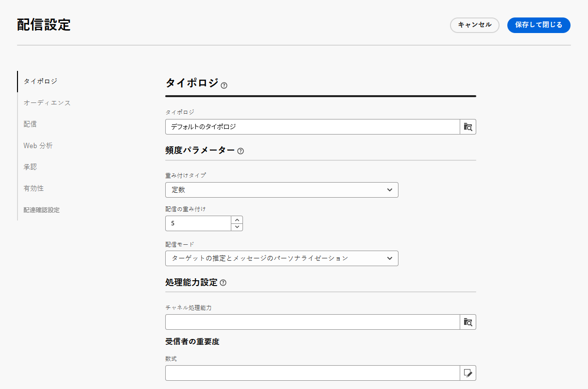
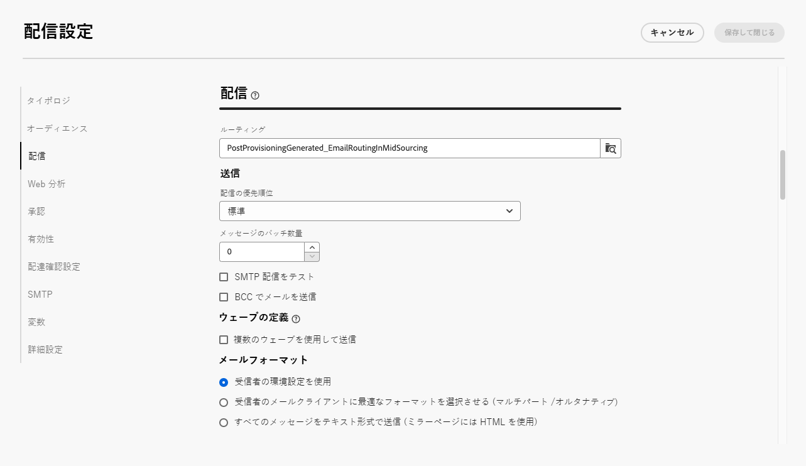
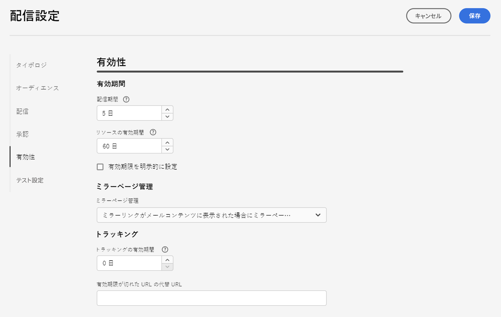

# メール配信設定 {#email-del-settings}

メールの配信設定は、メールテンプレートで定義される&#x200B;**技術的な配信パラメーター**&#x200B;です。配信ごとに過負荷になる可能性があります。

これらの設定は、メール配信またはメール配信テンプレートの編集時に使用できる「**設定**」ボタンから利用できます。

## メール配信設定 {#email-delivery-settings}

>[!CAUTION]
>
>これらの設定については、情報提供のみを目的として説明しています。一部のものは、設定や権限によって異なります。それらは、このバージョンの製品では変更できません。

## タイポロジ設定 {#typology}

>[!CONTEXTUALHELP]
>id="acw_email_settings_typology"
>title="タイポロジ"
>abstract="タイポロジルールを使用すると、マーケターはすべての配信にわたってビジネスプラクティスを標準化できます。 タイポロジとは、配信状況を制御、フィルター、および優先順位付けするタイポロジルールの集まりです。タイポロジルール内の条件に一致するプロファイルは、準備段階で配信オーディエンスから除外されます。タイポロジとタイポロジルールは、Campaign クライアントコンソールで作成されます。"

>[!CONTEXTUALHELP]
>id="acw_delivery_template_settings_typology"
>title="配信のタイポロジ設定"
>abstract="タイポロジルールを使用すると、マーケターはすべての配信にわたってビジネスプラクティスを標準化できます。 タイポロジとは、配信状況を制御、フィルター、および優先順位付けするタイポロジルールの集まりです。タイポロジルール内の条件に一致するプロファイルは、準備段階で配信オーディエンスから除外されます。タイポロジとタイポロジルールは、Campaign クライアントコンソールで作成されます。"

タイポロジとは、複数のフィルタリングルールを配信に対して一度に簡単に適用するために、準備段階中に実行される&#x200B;**タイポロジルール**&#x200B;のセットです。これを使用すると、マーケターは、配信の送信を制御、フィルタリング、優先順位付けできるので、すべての配信でビジネスプラクティスを標準化できます。

タイポロジをメッセージまたはメッセージテンプレートに関連付けると、タイポロジに含まれているタイポロジルールがメッセージの準備中に実行されて、配信の有効性がチェックされます。タイポロジルール内の条件に一致するプロファイルは、配信オーディエンスから除外されます。

タイポロジを使用すると、特定の要素（登録解除リンクや件名行など）や、対象とするターゲット (登録解除者、競合他社、非ロイヤルティ顧客など）からグループを除外するフィルタリングルールがメールに常に含まれていることを確認できます。

{zoomable=&quot;yes&quot;}

>[!NOTE]
>
>タイポロジとタイポロジルールは、Campaign クライアントコンソールで作成されます。頻度ルールと疲労管理の設定方法について詳しくは、[Campaign v8（クライアントコンソール）ドキュメント](https://experienceleague.adobe.com/docs/campaign/automation/campaign-optimization/campaign-typologies.html?lang=ja){target="_blank"}を参照してください。

### 頻度パラメーター {#pressure-parameters}

>[!CONTEXTUALHELP]
>id="acw_email_settings_pressure_parameters"
>title="配信の頻度パラメーター"
>abstract="配信の重み付けは、疲労管理のフレームワーク内で最も優先順位の高い配信を指定できます。最も大きな重みを付けられたメッセージが、最優先されます。"

>[!CONTEXTUALHELP]
>id="acw_delivery_template_settings_delivery_weight"
>title="配信の重み付け"
>abstract="配信の重み付けは、頻度管理のフレームワーク内で最も優先順位の高い配信を指定できます。最も大きな重みを付けられたメッセージが、最優先されます。"

このセクションでは、頻度パラメーターを使用して&#x200B;**しきい値**&#x200B;を定義し、疲労管理ルールを設定できます。これは、特定の期間に 1 つのプロファイルに送信できるメッセージの最大数です。

しきい値に達すると、その後は指定された期間が完了するまで、配信は実施できなくなります。このプロセスにより、メッセージの数がしきい値を超過したプロファイルは配信から自動的に除外されるので、過剰な配信が回避できます。

しきい値は、定数または変数のいずれかです。したがって、ある期間、しきい値はプロファイルによって異なる場合も、同じプロファイルで異なる場合もあります。

「**[!UICONTROL 重み付けタイプ]**」フィールドでは、次の 3 つのオプションを使用できます。

* **[!UICONTROL 定数]**
* **[!UICONTROL 受信者に依存]**
* **[!UICONTROL 各ルールで定義]**

「**[!UICONTROL 配信の重み付け]**」フィールドでは、配信の優先順位を定義できます。各配信には、優先度を表す重みが付けられます。
デフォルトでは、配信の重みは 5 に設定されています。頻度ルールでは、適用先となる配信の重み付けを定義できます。重みの値は、定数を指定するか、受信者ごとに数式で算出します。例えば、受信者の興味に基づいて配信の重みを定義することができます。

「**[!UICONTROL 配信モード]**」フィールドでは、ターゲットの評価モードを選択できます。次の 3 つのモードを選択できます。

* **[!UICONTROL ターゲットの推定とメッセージのパーソナライゼーション]**
* **[!UICONTROL 暫定ターゲットの推定と承認]**
* **[!UICONTROL ターゲットの評価]**

>[!NOTE]
>
>疲労管理は、Campaign クライアントコンソールで設定されます。詳しくは、[Campaign v8（クライアントコンソール）ドキュメント](https://experienceleague.adobe.com/docs/campaign/automation/campaign-optimization/pressure-rules.html?lang=ja){target="_blank"}を参照してください。

### 処理能力設定 {#capacity-settings}

>[!CONTEXTUALHELP]
>id="acw_email_settings_capacity_settings"
>title="配信用の処理能力設定"
>abstract="メッセージを配信する前に、処理能力ルールを使用して、組織が配信や、その配信によって生成される可能性があるインバウンドメッセージと、購読者に連絡するための通話数などを処理できることを確認します。処理能力ルールは、Adobe Campaign v8 コンソールで定義されます。この画面で、メールチャネルに関連付けられたルールを選択します。"

>[!CONTEXTUALHELP]
>id="acw_delivery_template_settings_recipient_importance"
>title="受信者の重要度"
>abstract="受信者の重要度は、処理能力タイポロジルールを超過した場合に維持する受信者を決定するために使用される式です。"

このセクションでは、Adobe Campaign v8 コンソールで定義した処理能力ルールを選択できます。このルールは、メールチャネルに関連付けられています。

「**[!UICONTROL 受信者の重要度]**」フィールドは、処理能力タイポロジルールを超過した場合に維持する受信者を決定するために使用される式です。

>[!NOTE]
>
>タイポロジルールは、Campaign クライアントコンソールで設定されます。詳しくは、[Campaign v8（クライアントコンソール）ドキュメント](https://experienceleague.adobe.com/docs/campaign/automation/campaign-optimization/consistency-rules.html?lang=ja){target="_blank"}を参照してください。

## オーディエンス設定 {#audience}

>[!CONTEXTUALHELP]
>id="acw_email_settings_audience"
>title="配信用のオーディエンス設定"
>abstract="利用可能な&#x200B;**ターゲットマッピング**&#x200B;を選択します。ターゲットマッピングは、Adobe Campaign v8 コンソールで定義されます。また、配信用の除外パラメーターを設定することもできます。 "

このセクションでは、利用可能な&#x200B;**ターゲットマッピング**&#x200B;を選択できます。ターゲットマッピングは、Adobe Campaign v8 コンソールで定義されます。ターゲットマッピングは、操作で処理されるデータのタイプです。ターゲット母集団（受信者、契約の受取人、オペレーター、サブスクライバーなど）を定義できます。

ターゲットマッピングについて詳しくは、[この節](../audience/targeting-dimensions.md)を参照してください。

「**[!UICONTROL 除外]**」フィールドでは、今後連絡を希望しない受信者や強制隔離されている受信者を除外することを選択できます。[詳細情報](https://experienceleague.adobe.com/docs/campaign/campaign-v8/send/failures/quarantines.html?lang=ja){target="_blank"}

## 配信 {#delivery}

>[!CONTEXTUALHELP]
>id="acw_email_settings_delivery"
>title="配信用の配信設定"
>abstract="配信パラメーターは、配信に適用する技術的な設定です。配信およびルーチンモードの変更、E メールの BCC の有効化、ウェーブを使用した送信、および送信される E メールメッセージの形式の選択をおこなうことができます。 これらのオプションは、エキスパートユーザーのみに制限されます。"

**[!UICONTROL 配信]**&#x200B;パラメーターは、配信に適用する技術的な設定です。

{zoomable=&quot;yes&quot;}

統合されたメール&#x200B;**[!UICONTROL ルーティング]**&#x200B;用外部アカウントがデフォルトで提供されます。アプリケーションからメールを送信するための技術的なパラメーターが含まれています。

次の項目を定義できます。 **[!UICONTROL 送信中]** 設定を参照してください。

* **[!UICONTROL 配信の優先順位]**：配信の優先順位レベル（標準、高、低）を設定して、配信の送信順序を変更するには、このオプションを使用します。

* **[!UICONTROL メッセージのバッチ数量]**：このオプションを使用して、1 つの XML 配信パッケージ内でグループ化するメッセージの数を定義します。 このパラメーターが 0 に設定されている場合、メッセージは自動的にグループ化されます。パッケージサイズは、`<delivery size>/1024` という計算に基づいて決定されます（ただし、パッケージあたりのメッセージ件数は最小 8、最大 256）。

  >[!IMPORTANT]
  >
  >既存の配信を複製して配信を作成すると、このパラメーターはリセットされます。

* **[!UICONTROL SMTP 配信をテスト]**：このオプションを使用して、SMTP 経由での送信をテストします。配信は、SMTP サーバーに接続するまで処理されますが、送信されません。配信の受信者ごとに、SMTP プロバイダーサーバーに接続し、SMTP RCPT TO コマンドを実行して、SMTP DATA コマンドの前に接続を閉じます。

* **[!UICONTROL BCC でメールを送信]**：BCC アドレスをメッセージのターゲットに追加するだけで、BCC 経由でメールを外部システムに保存します。詳しくは、[Campaign v8（クライアントコンソール）ドキュメント](https://experienceleague.adobe.com/docs/campaign/campaign-v8/send/emails/email-bcc.html){target="_blank"}を参照してください。

Adobe Analytics の **[!UICONTROL ウェーブ定義]** セクションで、 **[!UICONTROL 複数のウェーブを使用して送信]** ウェーブを使用して、送信されるボリュームを徐々に増やすオプション。 これにより、メッセージがスパムとしてマークされず、また 1 日あたりのメッセージ数を制限できます。ウェーブを使用すると、一度に大量のメッセージを送信するのではなく、配信をいくつかのバッチに分割できます。[詳細情報](send-using-waves.md)

また、 **[!UICONTROL メールフォーマット]** 送信される電子メールメッセージの数を次に示します。

* **[!UICONTROL 受信者の環境設定を使用]**（デフォルトのモード）

  メッセージ形式は、受信者プロファイルに保存されているデータに従って定義されます。受信者が特定の形式でメッセージを受信することを希望していれば、メッセージはその形式で送信されます。このフィールドに何も入力されていない場合は、マルチパート／オルタナティブメッセージが送信されます（以下を参照）。

* **[!UICONTROL 受信者のメールクライアントに最適なフォーマットを選択させる]**

  テキスト形式と HTML 形式の両方を含んだメッセージが送信されます。受信時に表示されるメッセージ形式は、受信者のメールソフトウェアの設定に応じて切り替わります（マルチパート／オルタナティブ）。

  >[!IMPORTANT]
  >
  >このオプションを指定すると、両方のバージョンのドキュメントがメッセージに含められます。したがって、メッセージサイズが大きくなり、配信の順位に影響があります。

* **[!UICONTROL すべてのメッセージをテキストフォーマットで送信]**

  メッセージはテキスト形式で送信されます。HTML 形式は送信されませんが、受信者がメッセージをクリックした場合にのみミラーページに使用されます。

## Web 分析 {#web-analytics}

>[!CONTEXTUALHELP]
>id="acw_email_settings_webanalytics"
>title="配信用の web 分析設定"
>abstract="Web 分析アカウントを選択します。このアカウントは、Campaign クライアントコンソールで設定されます。使用している分析ツールと共有するタグを定義することもできます。"

このセクションでは、web 分析アカウントを選択できます。このアカウントは、Campaign クライアントコンソールで設定されます。

使用している分析ツールと共有するタグを定義することもできます。

>[!NOTE]
>
>Web 分析機能は、Campaign クライアントコンソールで設定されます。詳しくは、[Campaign v8（クライアントコンソール）ドキュメント](https://experienceleague.adobe.com/docs/campaign/campaign-v8/connect/ac-aa.html?lang=ja#external-account-ac){target="_blank"}を参照してください。

## 再試行 {#retries}

>[!CONTEXTUALHELP]
>id="acw_delivery_template_settings_retries"
>title="再試行の最大数"
>abstract="一時的なエラーが原因でメッセージ送信が失敗した場合は、配信期間が終了するまで再試行されます。"

<!--Currently not visible in UI > ??-->

ソフトまたは無視のエラーによって一時的に配信できなかったメッセージは、自動再試行の対象となります。デフォルトでは、配信の初日に最低 1 時間の間隔をおいて 24 時間に 5 回の再試行がスケジュールされます。

## 承認 {#approval}

>[!CONTEXTUALHELP]
>id="acw_email_settings_approval"
>title="配信の承認モード"
>abstract="承認モードを選択します。配信の準備中に警告が発生した場合、配信を設定して、配信を実行するかどうかを定義できます。"

>[!CONTEXTUALHELP]
>id="acw_delivery_template_settings_approval"
>title="配信の承認モード"
>abstract="このテンプレートに基づく配信の承認モードを選択します。配信の準備中に警告が発生した場合、配信を設定して、配信を実行するかどうかを定義できます。"

配信の準備中に警告が発生した場合、配信を設定して、配信を実行するかどうかを定義できます。デフォルトでは、分析フェーズの最後に、メッセージの送信をユーザーが確認する必要があります（**手動**&#x200B;検証）。

別の承認モードは、該当するフィールドで選択できます。使用可能なモードは次のとおりです。

* ****[!UICONTROL 手動]****：分析フェーズの最後に、配信の送信開始をユーザーが確認する必要があります。

* **[!UICONTROL 半自動]**：分析フェーズで警告メッセージが送信されなかった場合には送信が自動的に開始されます。

* **[!UICONTROL 自動]**：分析が終了した時点で、その結果にかかわらず送信が自動的に開始されます。

## 有効性 {#validity}

>[!CONTEXTUALHELP]
>id="acw_email_settings_validity"
>title="設定の有効性"
>abstract="「**配信期間**」フィールドには、グローバルでおこなう配信再試行の期限を入力できます。Adobe Campaign は、開始日にメッセージの送信を開始した後、エラーのみを返すメッセージについて、設定された定期的な再試行を、有効期限日に達するまで実行します。 「**リソースの有効期間**」フィールドは、ミラーページや画像などのアップロードされたリソースに使用されます。制限に達すると、リソースは使用できなくなります。"

>[!CONTEXTUALHELP]
>id="acw_delivery_template_settings_resources_validity"
>title="リソースの有効期間"
>abstract="「**リソースの有効期間**」フィールドは、ミラーページや画像などのアップロードされたリソースに使用されます。これらのリソースは限られた時間のみ有効です。制限に達すると、リソースは使用できなくなります。"

>[!CONTEXTUALHELP]
>id="acw_delivery_template_settings_delivery_duration"
>title="配信期間"
>abstract="「**配信期間**」フィールドには、グローバルでおこなう配信再試行の期限を入力できます。Adobe Campaign は、開始日にメッセージの送信を開始した後、エラーのみを返すメッセージについて、設定された定期的な再試行を、有効期限日に達するまで実行します。"

<!--
>[!CONTEXTUALHELP]
>id="acw_email_settings_resources_validity"
>title="Resources validity limit"
>abstract="The Validity limit field is used for uploaded resources, such as the mirror page or images. These resources are valid for a limited time: once the limit is reached, resources are no longer available."
-->

### 有効期間 {#validity-period}

「**[!UICONTROL 配信期間]**」フィールドには、グローバルでおこなう配信再試行の期限を入力できます。Adobe Campaign は、開始日にメッセージの送信を開始した後、エラーのみを返すメッセージについて、設定された定期的な再試行を、有効期限日に達するまで実行します。

日付を指定することもできます。そのためには、「**[!UICONTROL 有効期限を明示的に設定]**」を選択します。この場合、配信および有効期限日に時刻を指定することもできます。デフォルト値は現在時刻ですが、入力フィールドを使用して直接変更できます。

「**[!UICONTROL リソースの有効期限]**」フィールドは、主にミラーページや画像のアップロードされたリソースに使用されます。ディスク容量を節約するために、このページ上のリソースは限られた時間のみ有効です。この制限を超えると、これらのリソースは使用できなくなります。

{zoomable=&quot;yes&quot;}

<!--Change screenshot to be consistent with prod > not sure which version is correct-->

配信の有効期間について詳しくは、[Campaign v8（クライアントコンソール）ドキュメント](https://experienceleague.adobe.com/docs/campaign/campaign-v8/campaigns/send/failures/delivery-failures.html?lang=ja#validity-period){target="_blank"}を参照してください。

### ミラーページ管理 {#mirror}

ミラーページは、web ブラウザーでオンラインアクセス可能な HTML ページです。そのコンテンツはメールと同一です。デフォルトでは、メールのコンテンツにリンクが挿入されている場合にミラーページが生成されます。

デフォルトモードのほかに、次のオプションも選択できます。

* **[!UICONTROL ミラーページを強制的に生成]**：このモードを使用すると、配信にミラーページへのリンクが挿入されていなくても、ミラーページを生成します。
* **[!UICONTROL ミラーページを生成しない]**：このモードを使用すると、配信にリンクが存在する場合でも、ミラーページを生成しないようにすることができます。
* **[!UICONTROL メッセージ識別子のみを使用してアクセス可能なミラーページを生成]**：メールコンテンツにミラーページのリンクが存在しない場合、このオプションを使用して、クライアントコンソールから配信ログウィンドウでミラーページのコンテンツにアクセスできるようにします。

### トラッキング {#tracking}

<!--
>[!CONTEXTUALHELP]
>id="acw_email_settings_tracking_validity"
>title="Validity period"
>abstract="This option defines the duration for which the tracking is activated on the URLs."
-->

>[!CONTEXTUALHELP]
>id="acw_delivery_template_settings_tracking_validity"
>title="有効期間"
>abstract="有効期間には、メッセージ URL に対してトラッキングがアクティブになっている期間を設定します。"

**[!UICONTROL トラッキング]**&#x200B;パラメーターは、関連するセクションで定義されています。選択できるオプションは次のとおりです。

**[!UICONTROL トラッキングの有効期限]**：URL に対してトラッキングがアクティブになっている期間を変更するのに使用できます。

**[!UICONTROL 期限切れ URL の代替 URL]**：フォールバック Web ページへの URL を入力します。トラッキングの有効期限が切れると表示されます。

## 配達確認設定 {#test-setttings}

>[!CONTEXTUALHELP]
>id="acw_email_settings_testsettings"
>title="配信用の配達確認設定の定義"
>abstract="除外パラメーターを選択し、配達確認のラベルをカスタマイズします。"

<!--Test to be replaced with Proof everywhere - currently not consistent within UI > changed to Proof to reflect UI here but not consistent in documentation either-->

このセクションでは、除外パラメーターを設定できます。次のオプションを使用できます。

* ****[!UICONTROL 重複を保持]****：複数のターゲティング条件を満たす受信者に対して複数の配信を許可できます。

* **[!UICONTROL ブロックリスト登録済みアドレスを保持]**：購読解除（オプトアウト）後など、配信のターゲットでなくなったプロファイルをターゲットから除外できます。

* **[!UICONTROL 強制隔離されたアドレスを保持]**：プロファイルで指定されているアドレスからの応答がないターゲットを除外できます。

また、配達確認のラベルをカスタマイズすることもできます。

* **[!UICONTROL 配達確認の配信コードを保持]**&#x200B;を使用すると、関連する配信用に定義されたのと同じ配信コードを、配達確認に関連付けることができます。

* デフォルトでは、配達確認の件名の先頭にプレフィックス「PROOF #」が付きます（「#」は配達確認の番号）。このプレフィックスは「**[!UICONTROL ラベルのプレフィックス]**」フィールドで変更できます。