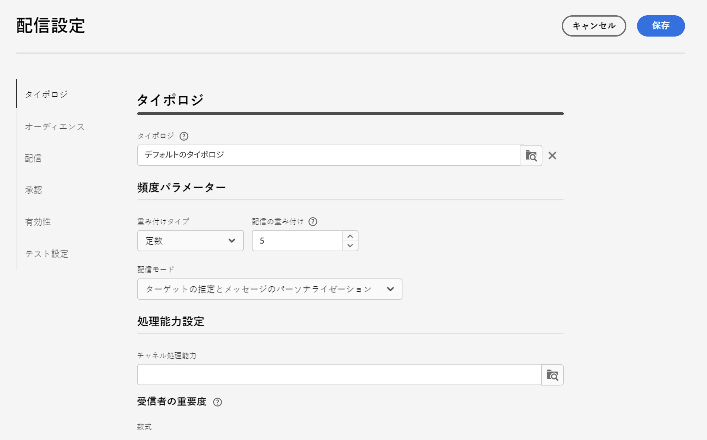
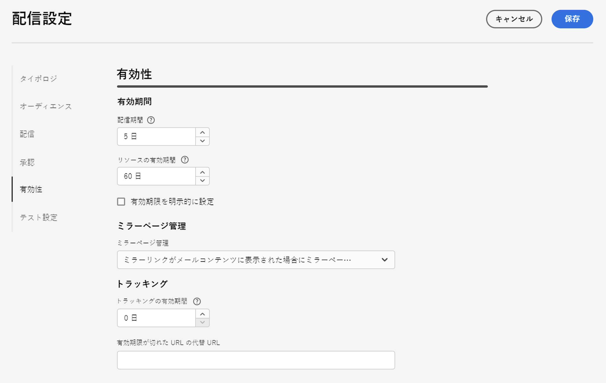

# メール配信設定 {#email-del-settings}

これらの設定は、 **技術的な配信パラメーター** 電子メールテンプレートで定義される。 これらは、 **配信設定の指定** e メール配信を編集する際に使用できるアイコン。

## メール配信設定 {#email-delivery-settings}

>[!CAUTION]
>
> これらの設定は、お客様の情報に対してのみ説明します。 設定や権限によって異なるものもあります。 このバージョンの製品では変更できません。

## タイポロジ {#typology}

>[!CONTEXTUALHELP]
>id="acw_email_settings_typology"
>title="タイポロジ"
>abstract="タイポロジでは、配信の送信を制御、フィルタリングおよび監視できます。"

タイポロジとは、メッセージの分析段階で実行される一連の&#x200B;**タイポロジルール**&#x200B;です。電子メールに常に必要な特定の要素（購読解除リンクや件名行など）が含まれていることを確かめたり、ターゲットグループから特定グループ（非購読者、競合他社、非顧客など）を除外するフィルタールールを設定したりできます。

タイポロジをメッセージまたはメッセージテンプレートに関連付けると、タイポロジに含まれるタイポロジルールが実行され、メッセージの準備中にメッセージの有効性がチェックされます。

### 頻度パラメーター {#pressure-parameters}

>[!CONTEXTUALHELP]
>id="acw_email_settings_delivery_weight"
>title="配信の重み付け"
>abstract="配信に重みを付けることで、頻度管理のフレームワーク内で最も優先順位の高い配信を指定できます。最も大きな重みを付けられたメッセージが、最優先されます。"

このセクションでは、頻度パラメータを使用して、 **しきい値**. これは、特定の期間に 1 つのプロファイルに送信できるメッセージの最大数です。しきい値に達すると、その後は指定された期間が完了するまで、配信は実施できなくなります。このプロセスにより、メッセージの数がしきい値を超過したプロファイルは配信から自動的に除外されるので、過剰な配信が回避できます。

しきい値は、定数または変数のいずれかです。したがって、ある期間、しきい値はプロファイルによって異なる場合も、同じプロファイルで異なる場合もあります。

「**重み付けタイプ**」フィールドでは、次の 3 つのオプションを使用できます。

* **定数**
* **受信者に依存**
* **各ルールで定義**

以下を使用： **配信の重み付け** フィールドを使用して配信の優先順位を定義します。 各配信には、優先度を表す重みが付けられます。
デフォルトでは、配信の重みは 5 に設定されています。頻度ルールでは、配信に適用する重みを定義できます。重みの設定や、受信者に合った数式での計算が可能です。 例えば、受信者の興味に基づいて配信の重みを定義することができます。

以下を使用： **配信モード** 「 」フィールドで、ターゲット評価モードを選択します。 次の 3 つのモードを選択できます。

* **ターゲットの推定とメッセージのパーソナライゼーション**
* **暫定ターゲットの推定と承認**
* **ターゲットの評価**

疲労管理には、 **キャンペーンの最適化** アドオン。 頻度ルールと、疲労管理の設定方法について詳しくは、 [Campaign v8 ドキュメント](https://experienceleague.adobe.com/docs/campaign/automation/campaign-optimization/pressure-rules.html?lang=ja){target="_blank"}.

### 処理能力設定 {#capacity-settings}

>[!CONTEXTUALHELP]
>id="acw_email_settings_recipient_importance"
>title="受信者の重要度"
>abstract="受信者の重要度は、処理能力タイポロジルールを超過した場合に維持する受信者を決定するために使用される式です。"

このセクションでは、Adobe Campaign v8 コンソールで定義した処理能力ルールを選択できます。このルールは、メールチャネルに関連付けられています。

「**受信者の重要度**」フィールドは、処理能力タイポロジルールを超過した場合に維持する受信者を決定するために使用される式です。

一貫性と容量のルール、およびでの設定方法の詳細 [Campaign v8 ドキュメント](https://experienceleague.adobe.com/docs/campaign/automation/campaign-optimization/consistency-rules.html){target="_blank"}.

## オーディエンス {#audience}

このセクションでは、 **ターゲットマッピング** 手に入るものの中に ターゲットマッピングは、Adobe Campaign v8 コンソールで定義されます。

ターゲットマッピングの詳細については、 [Campaign v8 ドキュメント](https://experienceleague.adobe.com/docs/campaign/campaign-v8/audience/add-profiles/target-mappings.html){target="_blank"}.

## 配信 {#delivery}

配信パラメーターは、配信に適用される技術的な設定です。

* **ルーティング**:統合 e メールルーティング外部アカウントは、デフォルトで提供されます。 アプリケーションから E メールを送信するための技術的なパラメーターが含まれます。

* **SMTP 配信をテスト**:このオプションは、SMTP を介した送信をテストするために使用します。 配信は SMTP サーバーへの接続まで処理されますが、送信はされません。配信の受信者ごとに、Campaign は SMTP プロバイダーサーバーに接続し、「SMTP RCPT TO」コマンドを実行して、「SMTP DATA」コマンドの前に接続を閉じます。

* **BCC で E メールを送信**:このオプションは、BCC 電子メールアドレスをメッセージのターゲットに追加するだけで、BCC 経由で e メールを外部システムに保存するために使用します。 「BCC で E メールを送信」の詳細を説明します [Campaign v8 ドキュメント](https://experienceleague.adobe.com/docs/campaign/campaign-v8/config/configuration/email-settings.html){target="_blank"}.

### 再試行 {#retries}

>[!CONTEXTUALHELP]
>id="acw_email_settings_retries"
>title="再試行の最大数"
>abstract="一時的エラーが原因でメッセージ送信が失敗した場合は、配信期間中に再試行が行われます。"

<!--Temporarily undelivered messages due to a Soft or Ignored error are subject to an automatic retry. By default, five retries are scheduled for the first day of the delivery with a minimum interval of one hour spread out over the 24 hours of the day. -->

での再試行管理の詳細を説明します [Campaign v8 ドキュメント](https://experienceleague.adobe.com/docs/campaign/campaign-v8/config/configuration/email-settings.html){target="_blank"}.

## 承認 {#approval}

>[!CONTEXTUALHELP]
>id="acw_email_settings_approval"
>title="承認モード"
>abstract="様々なプロセスを完全に監視および制御するために、配信の各手順は承認の対象となることがあります。"

配信の準備中に警告が生成された場合は、配信を設定して、配信を実行する必要があるかどうかを定義できます。 デフォルトでは、分析フェーズの最後に、メッセージの送信をユーザーが確認する必要があります（**手動**&#x200B;検証）。

別の承認モードは、該当するフィールドで選択できます。 使用可能なモードは次のとおりです。

* **手動**：分析の終了時に、配信の送信開始をユーザーが確認する必要があります。

* **半自動**:分析フェーズで警告メッセージが生成されなかった場合は、送信が自動的に開始されます。

* **自動**:分析が終了した時点で、結果に関係なく送信が自動的に開始されます。

## 有効性 {#validity}

>[!CONTEXTUALHELP]
>id="acw_email_settings_delivery_duration"
>title="配信期間"
>abstract="「配信期間」フィールドには、グローバルで行う配信再試行の期限を入力できます。Adobe Campaign は、開始日にメッセージの送信を開始した後、エラーのみを返すメッセージについて、設定された定期的な再試行を、有効期限日に達するまで実行します。"

>[!CONTEXTUALHELP]
>id="acw_email_settings_resources_validity"
>title="リソースの有効期間"
>abstract="「有効期限」フィールドは、アップロードされたリソース（主にミラーページと画像）に関して使用されます。このページのリソースは、期間限定で有効です。"

「**配信期間**」フィールドには、グローバルでおこなう配信再試行の期限を入力できます。Adobe Campaign は、開始日にメッセージの送信を開始した後、エラーのみを返すメッセージについて、設定された定期的な再試行を、有効期限日に達するまで実行します。

日付を指定することもできます。そのためには、「**有効期限を明示的に設定**」を選択します。この場合、配信および有効期限日に時刻を指定することもできます。デフォルト値は現在時刻ですが、入力フィールドを使用して直接変更できます。

**リソースの有効制限** は、アップロードされたリソース（主にミラーページと画像）に対して使用されます。 ディスクスペースを節約するために、このページ上のリソースが有効な期間は限られています。

配信の有効期間について詳しくは、 [Campaign v8 ドキュメント](https://experienceleague.adobe.com/docs/campaign/campaign-v8/campaigns/send/failures/delivery-failures.html#validity-period){target="_blank"}.

### ミラーページ管理 {#mirror}

ミラーページは、web ブラウザーからオンラインアクセス可能な HTML ページです。コンテンツは E メールと変わりません。デフォルトでは、メールコンテンツ内にリンクが挿入されているとミラーページが生成されます。

デフォルトモードのほかに、次のオプションも選択できます。

* **[!UICONTROL ミラーページを強制的に生成]**：配信コンテンツ内にミラーページへのリンクが挿入されていなくても、ミラーページを生成します。
* **[!UICONTROL ミラーページを生成しない]**：配信コンテンツ内にリンクが挿入されていても、ミラーページを生成しません。
* **[!UICONTROL メッセージ識別子のみを使用してアクセス可能なミラーページを生成]**：配信ログウィンドウで、パーソナライゼーション情報を含むミラーページのコンテンツにアクセスできるようにします。これを使用するには、配信が完了した後に「**[!UICONTROL 配信]**」タブをクリックし、メッセージを受け取った受信者の行を選択してから、「**[!UICONTROL このメッセージのミラーページを表示]**」リンクをクリックします。

### トラッキング {#tracking}

>[!CONTEXTUALHELP]
>id="acw_email_settings_tracking_validity"
>title="有効期間"
>abstract="このオプションは、トラッキングが URL でアクティブ化される期間を定義します。"

トラッキングパラメーターは、関連する節で定義されています。 選択できるオプションは次のとおりです。

**トラッキングの有効制限**:URL でトラッキングが有効化される期間を変更するには、このオプションを使用します。

**期限切れ URL の代替 URL**:フォールバック web ページの URL を入力するには、このオプションを使用します。トラッキングの有効期限が切れると表示されます。

## テスト設定 {#test-setttings}

このセクションでは、除外パラメーターを設定できます。 次のオプションを使用できます。

* **重複を保持** を使用すると、複数のターゲット条件を満たす受信者に対して複数の配信を許可できます。

* **されブロックリストに加えるたアドレス** を使用すると、購読解除（オプトアウト）後など、配信のターゲットにならなくなったプロファイルをターゲットから除外できます。

* **強制隔離されたアドレスを保持** では、応答しないアドレスを持つプロファイルをターゲットから除外できます。

また、配達確認の名前をカスタマイズすることもできます。

以下を使用： **配達確認の配信コードを保持** 配達確認に関連付けるには、対象の配信に定義された配信コードと同じ配信コードを使用します。

デフォルトでは、配達確認の件名の前には「PROOF #」が付きます。ここで、「#」は配達確認の番号です。 このプレフィックスは「**ラベルのプレフィックス**」フィールドで変更できます。